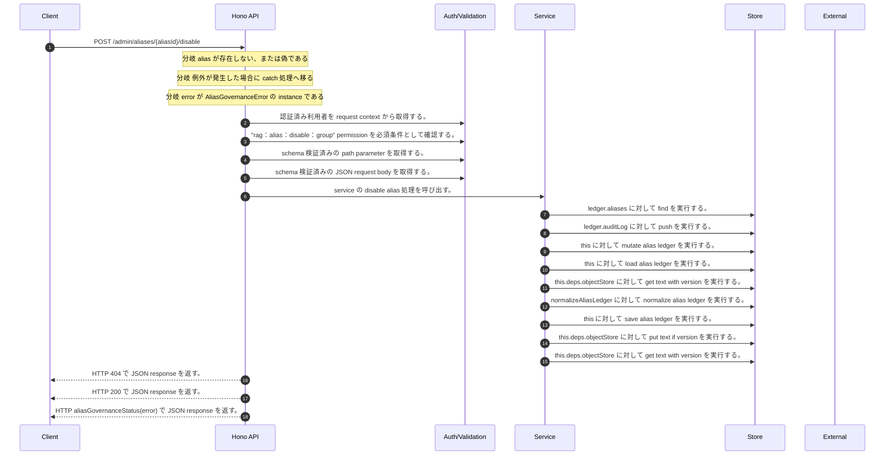

<!-- This file is generated by npm run docs:api-code. Do not edit manually. -->

# POST /admin/aliases/{aliasId}/disable シーケンス

## シーケンス図

## 処理順とコード対応

| # | Caller | 境界 | 処理 | コード | 実装位置 |
| ---: | --- | --- | --- | --- | --- |
| 1 | `POST /admin/aliases/{aliasId}/disable handler` | Auth | 認証済み利用者を request context から取得する。 | `c.get("user")` | `apps/api/src/routes/admin-routes.ts:531 (POST /admin/aliases/{aliasId}/disable handler)` |
| 2 | `POST /admin/aliases/{aliasId}/disable handler` | Auth | "rag:alias:disable:group" permission を必須条件として確認する。 | `requirePermission(user, "rag:alias:disable:group")` | `apps/api/src/routes/admin-routes.ts:532 (POST /admin/aliases/{aliasId}/disable handler)` |
| 3 | `POST /admin/aliases/{aliasId}/disable handler` | Validation | schema 検証済みの path parameter を取得する。 | `validParam<{ aliasId: string }>(c)` | `apps/api/src/routes/admin-routes.ts:533 (POST /admin/aliases/{aliasId}/disable handler)` |
| 4 | `POST /admin/aliases/{aliasId}/disable handler` | Validation | schema 検証済みの JSON request body を取得する。 | `validJson<z.infer<typeof DisableAliasRequestSchema>>(c)` | `apps/api/src/routes/admin-routes.ts:534 (POST /admin/aliases/{aliasId}/disable handler)` |
| 5 | `POST /admin/aliases/{aliasId}/disable handler` | Service | service の disable alias 処理を呼び出す。 | `service.disableAlias(user, aliasId, body)` | `apps/api/src/routes/admin-routes.ts:536 (POST /admin/aliases/{aliasId}/disable handler)` |
| 6 | `findTenantAlias` | Store | `ledger.aliases` に対して find を実行する。 | `ledger.aliases.find((alias) => alias.aliasId === aliasId && aliasTenantId(alias) === tenantId)` | `apps/api/src/rag/memorag-service.ts:5421 (findTenantAlias)` |
| 7 | `appendAliasAudit` | Store | `ledger.auditLog` に対して push を実行する。 | `ledger.auditLog.push({ auditId: \`audit_${randomUUID().slice(0, 12)}\`, aliasId: input.alias?.aliasId, tenantId: input.tenantId, action: input.action, actorUserId: input.actor.userId, result: input.result, reason: input.r…` | `apps/api/src/rag/memorag-service.ts:5507 (appendAliasAudit)` |
| 8 | `MemoRagService.disableAlias` | Store | `this` に対して mutate alias ledger を実行する。 | `this.mutateAliasLedger((ledger) => { const alias = findTenantAlias(ledger, aliasId, tenantId) if (!alias) return { commit: false } const invalid = validateAliasMutationVersion(alias, input.expectedVersion) ?? (alias.sta…` | `apps/api/src/rag/memorag-service.ts:1652 (MemoRagService.disableAlias)` |
| 9 | `MemoRagService.mutateAliasLedger` | Store | `this` に対して load alias ledger を実行する。 | `this.loadAliasLedger()` | `apps/api/src/rag/memorag-service.ts:3701 (MemoRagService.mutateAliasLedger)` |
| 10 | `MemoRagService.loadAliasLedger` | Store | `this.deps.objectStore` に対して get text with version を実行する。 | `this.deps.objectStore.getTextWithVersion(aliasLedgerKey)` | `apps/api/src/rag/memorag-service.ts:3671 (MemoRagService.loadAliasLedger)` |
| 11 | `MemoRagService.loadAliasLedger` | Store | `normalizeAliasLedger` に対して normalize alias ledger を実行する。 | `normalizeAliasLedger(raw)` | `apps/api/src/rag/memorag-service.ts:3675 (MemoRagService.loadAliasLedger)` |
| 12 | `MemoRagService.mutateAliasLedger` | Store | `this` に対して save alias ledger を実行する。 | `this.saveAliasLedger(state.ledger, state.storeVersion)` | `apps/api/src/rag/memorag-service.ts:3705 (MemoRagService.mutateAliasLedger)` |
| 13 | `MemoRagService.saveAliasLedger` | Store | `this.deps.objectStore` に対して put text if version を実行する。 | `this.deps.objectStore.putTextIfVersion( aliasLedgerKey, JSON.stringify(ledger, null, 2), expectedVersion, "application/json" )` | `apps/api/src/rag/memorag-service.ts:3684 (MemoRagService.saveAliasLedger)` |
| 14 | `MemoRagService.saveAliasLedger` | Store | `this.deps.objectStore` に対して get text with version を実行する。 | `this.deps.objectStore.getTextWithVersion(aliasLedgerKey)` | `apps/api/src/rag/memorag-service.ts:3690 (MemoRagService.saveAliasLedger)` |
| 15 | `POST /admin/aliases/{aliasId}/disable handler` | HTTP/SSE | HTTP 404 で JSON response を返す。 | `c.json({ error: "Alias not found" }, 404)` | `apps/api/src/routes/admin-routes.ts:537 (POST /admin/aliases/{aliasId}/disable handler)` |
| 16 | `POST /admin/aliases/{aliasId}/disable handler` | HTTP/SSE | HTTP 200 で JSON response を返す。 | `c.json(alias, 200)` | `apps/api/src/routes/admin-routes.ts:538 (POST /admin/aliases/{aliasId}/disable handler)` |
| 17 | `POST /admin/aliases/{aliasId}/disable handler` | HTTP/SSE | HTTP aliasGovernanceStatus(error) で JSON response を返す。 | `c.json({ error: error.message }, aliasGovernanceStatus(error))` | `apps/api/src/routes/admin-routes.ts:540 (POST /admin/aliases/{aliasId}/disable handler)` |

## 分岐

| ID | Function | 条件 | 実装位置 |
| --- | --- | --- | --- |
| B001 | `POST /admin/aliases/{aliasId}/disable handler` | `alias` が存在しない、または偽である | `apps/api/src/routes/admin-routes.ts:537 (POST /admin/aliases/{aliasId}/disable handler)` |
| B002 | `POST /admin/aliases/{aliasId}/disable handler` | 例外が発生した場合に catch 処理へ移る | `apps/api/src/routes/admin-routes.ts:539 (POST /admin/aliases/{aliasId}/disable handler)` |
| B003 | `POST /admin/aliases/{aliasId}/disable handler` | `error` が `AliasGovernanceError` の instance である | `apps/api/src/routes/admin-routes.ts:540 (POST /admin/aliases/{aliasId}/disable handler)` |
| B004 | `requirePermission` | 利用者が 指定された permission を持たない | `apps/api/src/authorization.ts:184 (requirePermission)` |
| B005 | `MemoRagService.disableAlias` | `alias` が存在しない、または偽である | `apps/api/src/rag/memorag-service.ts:1654 (MemoRagService.disableAlias)` |
| B006 | `MemoRagService.disableAlias` | `alias.status` が `"disabled"` と等しい | `apps/api/src/rag/memorag-service.ts:1656 (MemoRagService.disableAlias)` |
| B007 | `MemoRagService.disableAlias` | `invalid` が存在し、真である | `apps/api/src/rag/memorag-service.ts:1657 (MemoRagService.disableAlias)` |
| B008 | `aliasGovernanceStatus` | `error.result` が `"conflict"` と等しい | `apps/api/src/routes/admin-routes.ts:733 (aliasGovernanceStatus)` |
| B009 | `aliasGovernanceStatus` | `error.result` が `"denied"` と等しい | `apps/api/src/routes/admin-routes.ts:734 (aliasGovernanceStatus)` |
