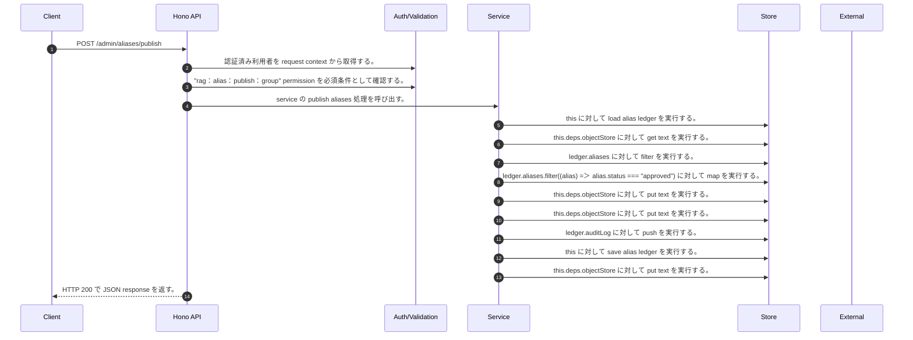

<!-- This file is generated by npm run docs:api-code. Do not edit manually. -->

# POST /admin/aliases/publish シーケンス

## シーケンス図

## 処理順とコード対応

| # | Caller | 境界 | 処理 | コード | 実装位置 |
| ---: | --- | --- | --- | --- | --- |
| 1 | `POST /admin/aliases/publish handler` | Auth | 認証済み利用者を request context から取得する。 | `c.get("user")` | `apps/api/src/routes/admin-routes.ts:448 (POST /admin/aliases/publish handler)` |
| 2 | `POST /admin/aliases/publish handler` | Auth | "rag:alias:publish:group" permission を必須条件として確認する。 | `requirePermission(user, "rag:alias:publish:group")` | `apps/api/src/routes/admin-routes.ts:449 (POST /admin/aliases/publish handler)` |
| 3 | `POST /admin/aliases/publish handler` | Service | service の publish aliases 処理を呼び出す。 | `service.publishAliases(user)` | `apps/api/src/routes/admin-routes.ts:450 (POST /admin/aliases/publish handler)` |
| 4 | `MemoRagService.publishAliases` | Store | `this` に対して load alias ledger を実行する。 | `this.loadAliasLedger()` | `apps/api/src/rag/memorag-service.ts:1290 (MemoRagService.publishAliases)` |
| 5 | `MemoRagService.loadAliasLedger` | Store | `this.deps.objectStore` に対して get text を実行する。 | `this.deps.objectStore.getText(aliasLedgerKey)` | `apps/api/src/rag/memorag-service.ts:2979 (MemoRagService.loadAliasLedger)` |
| 6 | `MemoRagService.publishAliases` | Store | `ledger.aliases` に対して filter を実行する。 | `ledger.aliases.filter((alias) => alias.status === "approved")` | `apps/api/src/rag/memorag-service.ts:1293 (MemoRagService.publishAliases)` |
| 7 | `MemoRagService.publishAliases` | Store | `ledger.aliases.filter((alias) => alias.status === "approved")` に対して map を実行する。 | `ledger.aliases.filter((alias) => alias.status === "approved").map((alias) => ({ ...alias, publishedVersion: version }))` | `apps/api/src/rag/memorag-service.ts:1293 (MemoRagService.publishAliases)` |
| 8 | `MemoRagService.publishAliases` | Store | `this.deps.objectStore` に対して put text を実行する。 | `this.deps.objectStore.putText(objectKey, JSON.stringify(artifact, null, 2), "application/json")` | `apps/api/src/rag/memorag-service.ts:1308 (MemoRagService.publishAliases)` |
| 9 | `MemoRagService.publishAliases` | Store | `this.deps.objectStore` に対して put text を実行する。 | `this.deps.objectStore.putText(aliasArtifactLatestKey, JSON.stringify({ version, objectKey, publishedAt, aliasCount: aliases.length }, null, 2), "application/json")` | `apps/api/src/rag/memorag-service.ts:1309 (MemoRagService.publishAliases)` |
| 10 | `appendAliasAudit` | Store | `ledger.auditLog` に対して push を実行する。 | `ledger.auditLog.push({ auditId: \`audit_${randomUUID().slice(0, 12)}\`, aliasId, action, actorUserId: actor.userId, createdAt: new Date().toISOString(), detail })` | `apps/api/src/rag/memorag-service.ts:5060 (appendAliasAudit)` |
| 11 | `MemoRagService.publishAliases` | Store | `this` に対して save alias ledger を実行する。 | `this.saveAliasLedger(ledger)` | `apps/api/src/rag/memorag-service.ts:1311 (MemoRagService.publishAliases)` |
| 12 | `MemoRagService.saveAliasLedger` | Store | `this.deps.objectStore` に対して put text を実行する。 | `this.deps.objectStore.putText(aliasLedgerKey, JSON.stringify(ledger, null, 2), "application/json")` | `apps/api/src/rag/memorag-service.ts:2992 (MemoRagService.saveAliasLedger)` |
| 13 | `POST /admin/aliases/publish handler` | HTTP/SSE | HTTP 200 で JSON response を返す。 | `c.json(await service.publishAliases(user), 200)` | `apps/api/src/routes/admin-routes.ts:450 (POST /admin/aliases/publish handler)` |

## 分岐

| ID | Function | 条件 | 実装位置 |
| --- | --- | --- | --- |
| B001 | `requirePermission` | 利用者が 指定された permission を持たない | `apps/api/src/authorization.ts:184 (requirePermission)` |
| B002 | `MemoRagService.publishAliases` | `ledger.aliases` が存在し、真である | `apps/api/src/rag/memorag-service.ts:1294 (MemoRagService.publishAliases)` |
| B003 | `MemoRagService.publishAliases` | `alias.status` が `"approved"` と等しい | `apps/api/src/rag/memorag-service.ts:1295 (MemoRagService.publishAliases)` |
| B004 | `MemoRagService.publishAliases` | `alias.searchImprovement` が存在し、真である | `apps/api/src/rag/memorag-service.ts:1297 (MemoRagService.publishAliases)` |
