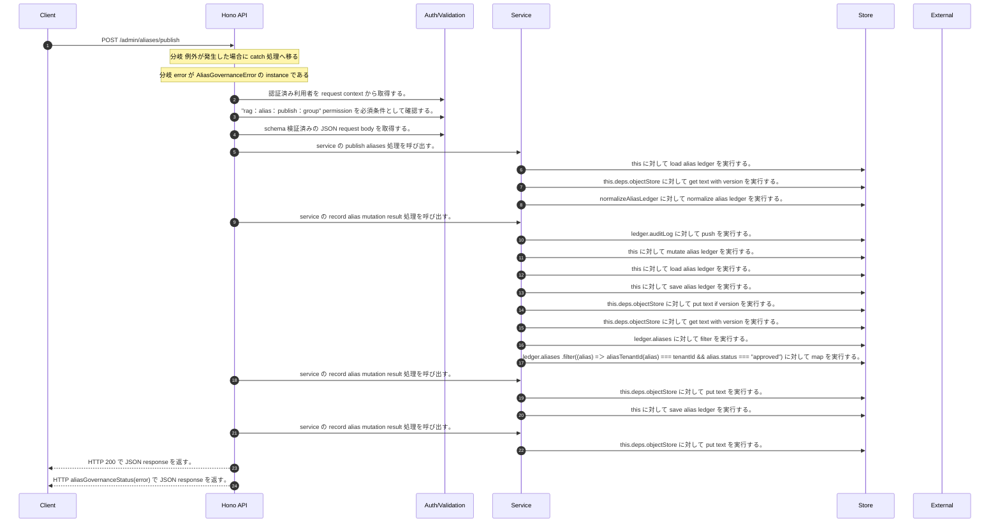

<!-- This file is generated by npm run docs:api-code. Do not edit manually. -->

# POST /admin/aliases/publish シーケンス

## シーケンス図

## 処理順とコード対応

| # | Caller | 境界 | 処理 | コード | 実装位置 |
| ---: | --- | --- | --- | --- | --- |
| 1 | `POST /admin/aliases/publish handler` | Auth | 認証済み利用者を request context から取得する。 | `c.get("user")` | `apps/api/src/routes/admin-routes.ts:560 (POST /admin/aliases/publish handler)` |
| 2 | `POST /admin/aliases/publish handler` | Auth | "rag:alias:publish:group" permission を必須条件として確認する。 | `requirePermission(user, "rag:alias:publish:group")` | `apps/api/src/routes/admin-routes.ts:561 (POST /admin/aliases/publish handler)` |
| 3 | `POST /admin/aliases/publish handler` | Validation | schema 検証済みの JSON request body を取得する。 | `validJson<z.infer<typeof PublishAliasesRequestSchema>>(c)` | `apps/api/src/routes/admin-routes.ts:562 (POST /admin/aliases/publish handler)` |
| 4 | `POST /admin/aliases/publish handler` | Service | service の publish aliases 処理を呼び出す。 | `service.publishAliases(user, body)` | `apps/api/src/routes/admin-routes.ts:564 (POST /admin/aliases/publish handler)` |
| 5 | `MemoRagService.publishAliases` | Store | `this` に対して load alias ledger を実行する。 | `this.loadAliasLedger()` | `apps/api/src/rag/memorag-service.ts:1585 (MemoRagService.publishAliases)` |
| 6 | `MemoRagService.loadAliasLedger` | Store | `this.deps.objectStore` に対して get text with version を実行する。 | `this.deps.objectStore.getTextWithVersion(aliasLedgerKey)` | `apps/api/src/rag/memorag-service.ts:3590 (MemoRagService.loadAliasLedger)` |
| 7 | `MemoRagService.loadAliasLedger` | Store | `normalizeAliasLedger` に対して normalize alias ledger を実行する。 | `normalizeAliasLedger(raw)` | `apps/api/src/rag/memorag-service.ts:3594 (MemoRagService.loadAliasLedger)` |
| 8 | `MemoRagService.publishAliases` | Service | service の record alias mutation result 処理を呼び出す。 | `this.recordAliasMutationResult(actor, tenantId, "publish", reason, new AliasGovernanceError("Alias ledger version conflict", "conflict"))` | `apps/api/src/rag/memorag-service.ts:1587 (MemoRagService.publishAliases)` |
| 9 | `appendAliasAudit` | Store | `ledger.auditLog` に対して push を実行する。 | `ledger.auditLog.push({ auditId: \`audit_${randomUUID().slice(0, 12)}\`, aliasId: input.alias?.aliasId, tenantId: input.tenantId, action: input.action, actorUserId: input.actor.userId, result: input.result, reason: input.r…` | `apps/api/src/rag/memorag-service.ts:5850 (appendAliasAudit)` |
| 10 | `MemoRagService.recordAliasMutationResult` | Store | `this` に対して mutate alias ledger を実行する。 | `this.mutateAliasLedger((ledger) => { appendAliasAudit(ledger, { actor, tenantId, action, result: error.result, reason, detail: error.message }) return { commit: true, value: undefined } })` | `apps/api/src/rag/memorag-service.ts:3642 (MemoRagService.recordAliasMutationResult)` |
| 11 | `MemoRagService.mutateAliasLedger` | Store | `this` に対して load alias ledger を実行する。 | `this.loadAliasLedger()` | `apps/api/src/rag/memorag-service.ts:3620 (MemoRagService.mutateAliasLedger)` |
| 12 | `MemoRagService.mutateAliasLedger` | Store | `this` に対して save alias ledger を実行する。 | `this.saveAliasLedger(state.ledger, state.storeVersion)` | `apps/api/src/rag/memorag-service.ts:3624 (MemoRagService.mutateAliasLedger)` |
| 13 | `MemoRagService.saveAliasLedger` | Store | `this.deps.objectStore` に対して put text if version を実行する。 | `this.deps.objectStore.putTextIfVersion( aliasLedgerKey, JSON.stringify(ledger, null, 2), expectedVersion, "application/json" )` | `apps/api/src/rag/memorag-service.ts:3603 (MemoRagService.saveAliasLedger)` |
| 14 | `MemoRagService.saveAliasLedger` | Store | `this.deps.objectStore` に対して get text with version を実行する。 | `this.deps.objectStore.getTextWithVersion(aliasLedgerKey)` | `apps/api/src/rag/memorag-service.ts:3609 (MemoRagService.saveAliasLedger)` |
| 15 | `MemoRagService.publishAliases` | Store | `ledger.aliases       ` に対して filter を実行する。 | `ledger.aliases .filter((alias) => aliasTenantId(alias) === tenantId && alias.status === "approved")` | `apps/api/src/rag/memorag-service.ts:1593 (MemoRagService.publishAliases)` |
| 16 | `MemoRagService.publishAliases` | Store | `ledger.aliases       .filter((alias) => aliasTenantId(alias) === tenantId && alias.status === "approved")       ` に対して map を実行する。 | `ledger.aliases .filter((alias) => aliasTenantId(alias) === tenantId && alias.status === "approved") .map((alias) => ({ ...alias, publishedVersion: version, updatedAt: publishedAt, version: createAliasRecordVersion(publi…` | `apps/api/src/rag/memorag-service.ts:1593 (MemoRagService.publishAliases)` |
| 17 | `MemoRagService.publishAliases` | Service | service の record alias mutation result 処理を呼び出す。 | `this.recordAliasMutationResult(actor, tenantId, "publish", reason, error)` | `apps/api/src/rag/memorag-service.ts:1603 (MemoRagService.publishAliases)` |
| 18 | `MemoRagService.publishAliases` | Store | `this.deps.objectStore` に対して put text を実行する。 | `this.deps.objectStore.putText(objectKey, JSON.stringify(artifact, null, 2), "application/json")` | `apps/api/src/rag/memorag-service.ts:1622 (MemoRagService.publishAliases)` |
| 19 | `MemoRagService.publishAliases` | Store | `this` に対して save alias ledger を実行する。 | `this.saveAliasLedger(ledger, state.storeVersion)` | `apps/api/src/rag/memorag-service.ts:1632 (MemoRagService.publishAliases)` |
| 20 | `MemoRagService.publishAliases` | Service | service の record alias mutation result 処理を呼び出す。 | `this.recordAliasMutationResult(actor, tenantId, "publish", reason, new AliasGovernanceError("Alias ledger version conflict", "conflict"))` | `apps/api/src/rag/memorag-service.ts:1635 (MemoRagService.publishAliases)` |
| 21 | `MemoRagService.publishAliases` | Store | `this.deps.objectStore` に対して put text を実行する。 | `this.deps.objectStore.putText( aliasArtifactLatestKeyForTenant(tenantId), JSON.stringify({ version, objectKey, publishedAt, aliasCount: aliases.length }, null, 2), "application/json" )` | `apps/api/src/rag/memorag-service.ts:1640 (MemoRagService.publishAliases)` |
| 22 | `POST /admin/aliases/publish handler` | HTTP/SSE | HTTP 200 で JSON response を返す。 | `c.json(await service.publishAliases(user, body), 200)` | `apps/api/src/routes/admin-routes.ts:564 (POST /admin/aliases/publish handler)` |
| 23 | `POST /admin/aliases/publish handler` | HTTP/SSE | HTTP aliasGovernanceStatus(error) で JSON response を返す。 | `c.json({ error: error.message }, aliasGovernanceStatus(error))` | `apps/api/src/routes/admin-routes.ts:566 (POST /admin/aliases/publish handler)` |

## 分岐

| ID | Function | 条件 | 実装位置 |
| --- | --- | --- | --- |
| B001 | `POST /admin/aliases/publish handler` | 例外が発生した場合に catch 処理へ移る | `apps/api/src/routes/admin-routes.ts:565 (POST /admin/aliases/publish handler)` |
| B002 | `POST /admin/aliases/publish handler` | `error` が `AliasGovernanceError` の instance である | `apps/api/src/routes/admin-routes.ts:566 (POST /admin/aliases/publish handler)` |
| B003 | `requirePermission` | 利用者が 指定された permission を持たない | `apps/api/src/authorization.ts:184 (requirePermission)` |
| B004 | `MemoRagService.publishAliases` | `(state.storeVersion ?? "absent")` が `input.expectedVersion` と異なる | `apps/api/src/rag/memorag-service.ts:1586 (MemoRagService.publishAliases)` |
| B005 | `MemoRagService.publishAliases` | `aliases.length` が `0` と等しい | `apps/api/src/rag/memorag-service.ts:1601 (MemoRagService.publishAliases)` |
| B006 | `MemoRagService.publishAliases` | `ledger.aliases` が存在し、真である | `apps/api/src/rag/memorag-service.ts:1607 (MemoRagService.publishAliases)` |
| B007 | `MemoRagService.publishAliases` | `published` が存在し、真である | `apps/api/src/rag/memorag-service.ts:1609 (MemoRagService.publishAliases)` |
| B008 | `MemoRagService.publishAliases` | `alias.searchImprovement` が存在し、真である | `apps/api/src/rag/memorag-service.ts:1611 (MemoRagService.publishAliases)` |
| B009 | `MemoRagService.publishAliases` | 例外が発生した場合に catch 処理へ移る | `apps/api/src/rag/memorag-service.ts:1633 (MemoRagService.publishAliases)` |
| B010 | `MemoRagService.publishAliases` | is conditional object write error の判定結果が真である | `apps/api/src/rag/memorag-service.ts:1634 (MemoRagService.publishAliases)` |
| B011 | `aliasGovernanceStatus` | `error.result` が `"conflict"` と等しい | `apps/api/src/routes/admin-routes.ts:733 (aliasGovernanceStatus)` |
| B012 | `aliasGovernanceStatus` | `error.result` が `"denied"` と等しい | `apps/api/src/routes/admin-routes.ts:734 (aliasGovernanceStatus)` |
