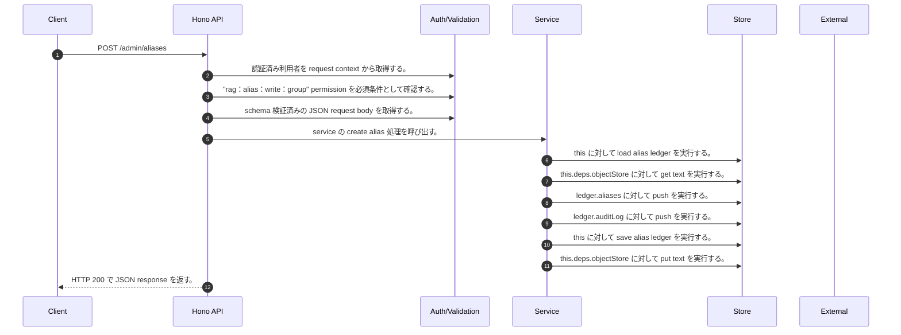

<!-- This file is generated by npm run docs:api-code. Do not edit manually. -->

# POST /admin/aliases シーケンス

## シーケンス図

## 処理順とコード対応

| # | Caller | 境界 | 処理 | コード | 実装位置 |
| ---: | --- | --- | --- | --- | --- |
| 1 | `POST /admin/aliases handler` | Auth | 認証済み利用者を request context から取得する。 | `c.get("user")` | `apps/api/src/routes/admin-routes.ts:262 (POST /admin/aliases handler)` |
| 2 | `POST /admin/aliases handler` | Auth | "rag:alias:write:group" permission を必須条件として確認する。 | `requirePermission(user, "rag:alias:write:group")` | `apps/api/src/routes/admin-routes.ts:263 (POST /admin/aliases handler)` |
| 3 | `POST /admin/aliases handler` | Validation | schema 検証済みの JSON request body を取得する。 | `validJson<z.infer<typeof CreateAliasRequestSchema>>(c)` | `apps/api/src/routes/admin-routes.ts:264 (POST /admin/aliases handler)` |
| 4 | `POST /admin/aliases handler` | Service | service の create alias 処理を呼び出す。 | `service.createAlias(user, body)` | `apps/api/src/routes/admin-routes.ts:265 (POST /admin/aliases handler)` |
| 5 | `MemoRagService.createAlias` | Store | `this` に対して load alias ledger を実行する。 | `this.loadAliasLedger()` | `apps/api/src/rag/memorag-service.ts:726 (MemoRagService.createAlias)` |
| 6 | `MemoRagService.loadAliasLedger` | Store | `this.deps.objectStore` に対して get text を実行する。 | `this.deps.objectStore.getText(aliasLedgerKey)` | `apps/api/src/rag/memorag-service.ts:1603 (MemoRagService.loadAliasLedger)` |
| 7 | `MemoRagService.createAlias` | Store | `ledger.aliases` に対して push を実行する。 | `ledger.aliases.push(alias)` | `apps/api/src/rag/memorag-service.ts:738 (MemoRagService.createAlias)` |
| 8 | `appendAliasAudit` | Store | `ledger.auditLog` に対して push を実行する。 | `ledger.auditLog.push({ auditId: \`audit_${randomUUID().slice(0, 12)}\`, aliasId, action, actorUserId: actor.userId, createdAt: new Date().toISOString(), detail })` | `apps/api/src/rag/memorag-service.ts:2815 (appendAliasAudit)` |
| 9 | `MemoRagService.createAlias` | Store | `this` に対して save alias ledger を実行する。 | `this.saveAliasLedger(ledger)` | `apps/api/src/rag/memorag-service.ts:740 (MemoRagService.createAlias)` |
| 10 | `MemoRagService.saveAliasLedger` | Store | `this.deps.objectStore` に対して put text を実行する。 | `this.deps.objectStore.putText(aliasLedgerKey, JSON.stringify(ledger, null, 2), "application/json")` | `apps/api/src/rag/memorag-service.ts:1616 (MemoRagService.saveAliasLedger)` |
| 11 | `POST /admin/aliases handler` | HTTP/SSE | HTTP 200 で JSON response を返す。 | `c.json(await service.createAlias(user, body), 200)` | `apps/api/src/routes/admin-routes.ts:265 (POST /admin/aliases handler)` |

## 分岐

| ID | Function | 条件 | 実装位置 |
| --- | --- | --- | --- |
| B001 | `requirePermission` | 利用者が 指定された permission を持たない | `apps/api/src/authorization.ts:267 (requirePermission)` |
