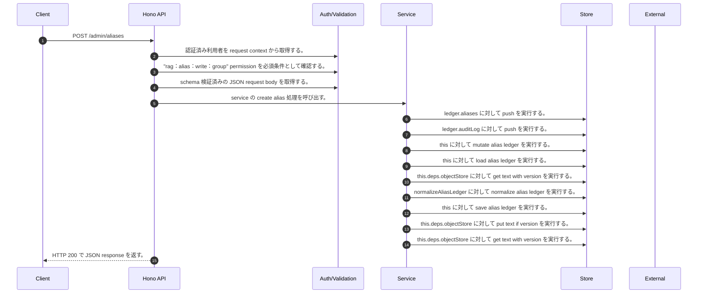

<!-- This file is generated by npm run docs:api-code. Do not edit manually. -->

# POST /admin/aliases シーケンス

## シーケンス図

## 処理順とコード対応

| # | Caller | 境界 | 処理 | コード | 実装位置 |
| ---: | --- | --- | --- | --- | --- |
| 1 | `POST /admin/aliases handler` | Auth | 認証済み利用者を request context から取得する。 | `c.get("user")` | `apps/api/src/routes/admin-routes.ts:468 (POST /admin/aliases handler)` |
| 2 | `POST /admin/aliases handler` | Auth | "rag:alias:write:group" permission を必須条件として確認する。 | `requirePermission(user, "rag:alias:write:group")` | `apps/api/src/routes/admin-routes.ts:469 (POST /admin/aliases handler)` |
| 3 | `POST /admin/aliases handler` | Validation | schema 検証済みの JSON request body を取得する。 | `validJson<z.infer<typeof CreateAliasRequestSchema>>(c)` | `apps/api/src/routes/admin-routes.ts:470 (POST /admin/aliases handler)` |
| 4 | `POST /admin/aliases handler` | Service | service の create alias 処理を呼び出す。 | `service.createAlias(user, body)` | `apps/api/src/routes/admin-routes.ts:471 (POST /admin/aliases handler)` |
| 5 | `MemoRagService.createAlias` | Store | `ledger.aliases` に対して push を実行する。 | `ledger.aliases.push(alias)` | `apps/api/src/rag/memorag-service.ts:1393 (MemoRagService.createAlias)` |
| 6 | `appendAliasAudit` | Store | `ledger.auditLog` に対して push を実行する。 | `ledger.auditLog.push({ auditId: \`audit_${randomUUID().slice(0, 12)}\`, aliasId: input.alias?.aliasId, tenantId: input.tenantId, action: input.action, actorUserId: input.actor.userId, result: input.result, reason: input.r…` | `apps/api/src/rag/memorag-service.ts:5855 (appendAliasAudit)` |
| 7 | `MemoRagService.createAlias` | Store | `this` に対して mutate alias ledger を実行する。 | `this.mutateAliasLedger((ledger) => { const now = new Date().toISOString() const alias: AliasDefinition = { aliasId: \`alias_${randomUUID().slice(0, 12)}\`, version: createAliasRecordVersion(now), term: normalizeAliasTerm(…` | `apps/api/src/rag/memorag-service.ts:1380 (MemoRagService.createAlias)` |
| 8 | `MemoRagService.mutateAliasLedger` | Store | `this` に対して load alias ledger を実行する。 | `this.loadAliasLedger()` | `apps/api/src/rag/memorag-service.ts:3638 (MemoRagService.mutateAliasLedger)` |
| 9 | `MemoRagService.loadAliasLedger` | Store | `this.deps.objectStore` に対して get text with version を実行する。 | `this.deps.objectStore.getTextWithVersion(aliasLedgerKey)` | `apps/api/src/rag/memorag-service.ts:3608 (MemoRagService.loadAliasLedger)` |
| 10 | `MemoRagService.loadAliasLedger` | Store | `normalizeAliasLedger` に対して normalize alias ledger を実行する。 | `normalizeAliasLedger(raw)` | `apps/api/src/rag/memorag-service.ts:3612 (MemoRagService.loadAliasLedger)` |
| 11 | `MemoRagService.mutateAliasLedger` | Store | `this` に対して save alias ledger を実行する。 | `this.saveAliasLedger(state.ledger, state.storeVersion)` | `apps/api/src/rag/memorag-service.ts:3642 (MemoRagService.mutateAliasLedger)` |
| 12 | `MemoRagService.saveAliasLedger` | Store | `this.deps.objectStore` に対して put text if version を実行する。 | `this.deps.objectStore.putTextIfVersion( aliasLedgerKey, JSON.stringify(ledger, null, 2), expectedVersion, "application/json" )` | `apps/api/src/rag/memorag-service.ts:3621 (MemoRagService.saveAliasLedger)` |
| 13 | `MemoRagService.saveAliasLedger` | Store | `this.deps.objectStore` に対して get text with version を実行する。 | `this.deps.objectStore.getTextWithVersion(aliasLedgerKey)` | `apps/api/src/rag/memorag-service.ts:3627 (MemoRagService.saveAliasLedger)` |
| 14 | `POST /admin/aliases handler` | HTTP/SSE | HTTP 200 で JSON response を返す。 | `c.json(await service.createAlias(user, body), 200)` | `apps/api/src/routes/admin-routes.ts:471 (POST /admin/aliases handler)` |

## 分岐

| ID | Function | 条件 | 実装位置 |
| --- | --- | --- | --- |
| B001 | `requirePermission` | 利用者が 指定された permission を持たない | `apps/api/src/authorization.ts:185 (requirePermission)` |
| B002 | `MemoRagService.createAlias` | `result` が存在しない、または偽である | `apps/api/src/rag/memorag-service.ts:1406 (MemoRagService.createAlias)` |
