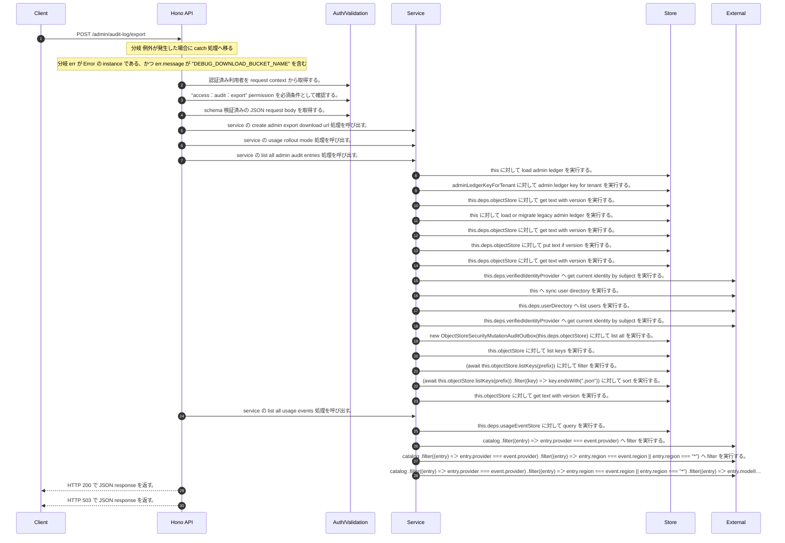

<!-- This file is generated by npm run docs:api-code. Do not edit manually. -->

# POST /admin/audit-log/export シーケンス

## シーケンス図

## 処理順とコード対応

| # | Caller | 境界 | 処理 | コード | 実装位置 |
| ---: | --- | --- | --- | --- | --- |
| 1 | `POST /admin/audit-log/export handler` | Auth | 認証済み利用者を request context から取得する。 | `c.get("user")` | `apps/api/src/routes/admin-routes.ts:224 (POST /admin/audit-log/export handler)` |
| 2 | `POST /admin/audit-log/export handler` | Auth | "access:audit:export" permission を必須条件として確認する。 | `requirePermission(user, "access:audit:export")` | `apps/api/src/routes/admin-routes.ts:225 (POST /admin/audit-log/export handler)` |
| 3 | `POST /admin/audit-log/export handler` | Validation | schema 検証済みの JSON request body を取得する。 | `validJson<z.infer<typeof AdminAuditExportRequestSchema>>(c)` | `apps/api/src/routes/admin-routes.ts:226 (POST /admin/audit-log/export handler)` |
| 4 | `POST /admin/audit-log/export handler` | Service | service の create admin export download url 処理を呼び出す。 | `service.createAdminExportDownloadUrl(user, "audit_log", body)` | `apps/api/src/routes/admin-routes.ts:228 (POST /admin/audit-log/export handler)` |
| 5 | `MemoRagService.createAdminExportDownloadUrl` | Service | service の usage rollout mode 処理を呼び出す。 | `this.usageRolloutMode()` | `apps/api/src/rag/memorag-service.ts:2321 (MemoRagService.createAdminExportDownloadUrl)` |
| 6 | `MemoRagService.createAdminExportDownloadUrl` | Service | service の list all admin audit entries 処理を呼び出す。 | `this.listAllAdminAuditEntries(actor, input.query)` | `apps/api/src/rag/memorag-service.ts:2352 (MemoRagService.createAdminExportDownloadUrl)` |
| 7 | `MemoRagService.listAdminAuditLog` | Store | `this` に対して load admin ledger を実行する。 | `this.loadAdminLedger(actor)` | `apps/api/src/rag/memorag-service.ts:2148 (MemoRagService.listAdminAuditLog)` |
| 8 | `MemoRagService.loadAdminLedger` | Store | `adminLedgerKeyForTenant` に対して admin ledger key for tenant を実行する。 | `adminLedgerKeyForTenant(tenantId)` | `apps/api/src/rag/memorag-service.ts:3503 (MemoRagService.loadAdminLedger)` |
| 9 | `MemoRagService.loadAdminLedger` | Store | `this.deps.objectStore` に対して get text with version を実行する。 | `this.deps.objectStore.getTextWithVersion(storageKey)` | `apps/api/src/rag/memorag-service.ts:3505 (MemoRagService.loadAdminLedger)` |
| 10 | `MemoRagService.loadAdminLedger` | Store | `this` に対して load or migrate legacy admin ledger を実行する。 | `this.loadOrMigrateLegacyAdminLedger(tenantId, storageKey)` | `apps/api/src/rag/memorag-service.ts:3510 (MemoRagService.loadAdminLedger)` |
| 11 | `MemoRagService.loadOrMigrateLegacyAdminLedger` | Store | `this.deps.objectStore` に対して get text with version を実行する。 | `this.deps.objectStore.getTextWithVersion(legacyAdminLedgerKey)` | `apps/api/src/rag/memorag-service.ts:3572 (MemoRagService.loadOrMigrateLegacyAdminLedger)` |
| 12 | `MemoRagService.loadOrMigrateLegacyAdminLedger` | Store | `this.deps.objectStore` に対して put text if version を実行する。 | `this.deps.objectStore.putTextIfVersion(storageKey, serialized, undefined, "application/json")` | `apps/api/src/rag/memorag-service.ts:3586 (MemoRagService.loadOrMigrateLegacyAdminLedger)` |
| 13 | `MemoRagService.loadOrMigrateLegacyAdminLedger` | Store | `this.deps.objectStore` に対して get text with version を実行する。 | `this.deps.objectStore.getTextWithVersion(storageKey)` | `apps/api/src/rag/memorag-service.ts:3590 (MemoRagService.loadOrMigrateLegacyAdminLedger)` |
| 14 | `MemoRagService.loadAdminLedger` | External | `this.deps.verifiedIdentityProvider` へ get current identity by subject を実行する。 | `this.deps.verifiedIdentityProvider.getCurrentIdentityBySubject(actor.userId)` | `apps/api/src/rag/memorag-service.ts:3517 (MemoRagService.loadAdminLedger)` |
| 15 | `MemoRagService.loadAdminLedger` | External | `this` へ sync user directory を実行する。 | `this.syncUserDirectory(db, authoritativeActorTenantId(actor))` | `apps/api/src/rag/memorag-service.ts:3559 (MemoRagService.loadAdminLedger)` |
| 16 | `MemoRagService.syncUserDirectory` | External | `this.deps.userDirectory` へ list users を実行する。 | `this.deps.userDirectory.listUsers()` | `apps/api/src/rag/memorag-service.ts:3597 (MemoRagService.syncUserDirectory)` |
| 17 | `MemoRagService.syncUserDirectory` | External | `this.deps.verifiedIdentityProvider` へ get current identity by subject を実行する。 | `this.deps.verifiedIdentityProvider.getCurrentIdentityBySubject(directoryUser.userId)` | `apps/api/src/rag/memorag-service.ts:3602 (MemoRagService.syncUserDirectory)` |
| 18 | `MemoRagService.listAdminAuditLog` | Store | `new ObjectStoreSecurityMutationAuditOutbox(this.deps.objectStore)` に対して list all を実行する。 | `new ObjectStoreSecurityMutationAuditOutbox(this.deps.objectStore).listAll(tenantId)` | `apps/api/src/rag/memorag-service.ts:2151 (MemoRagService.listAdminAuditLog)` |
| 19 | `ObjectStoreSecurityMutationAuditOutbox.listAll` | Store | `this.objectStore` に対して list keys を実行する。 | `this.objectStore.listKeys(prefix)` | `apps/api/src/security/security-mutation-audit-outbox.ts:188 (ObjectStoreSecurityMutationAuditOutbox.listAll)` |
| 20 | `ObjectStoreSecurityMutationAuditOutbox.listAll` | Store | `(await this.objectStore.listKeys(prefix))       ` に対して filter を実行する。 | `(await this.objectStore.listKeys(prefix)) .filter((key) => key.endsWith(".json"))` | `apps/api/src/security/security-mutation-audit-outbox.ts:188 (ObjectStoreSecurityMutationAuditOutbox.listAll)` |
| 21 | `ObjectStoreSecurityMutationAuditOutbox.listAll` | Store | `(await this.objectStore.listKeys(prefix))       .filter((key) => key.endsWith(".json"))       ` に対して sort を実行する。 | `(await this.objectStore.listKeys(prefix)) .filter((key) => key.endsWith(".json")) .sort()` | `apps/api/src/security/security-mutation-audit-outbox.ts:188 (ObjectStoreSecurityMutationAuditOutbox.listAll)` |
| 22 | `ObjectStoreSecurityMutationAuditOutbox.listAll` | Store | `this.objectStore` に対して get text with version を実行する。 | `this.objectStore.getTextWithVersion(key)` | `apps/api/src/security/security-mutation-audit-outbox.ts:192 (ObjectStoreSecurityMutationAuditOutbox.listAll)` |
| 23 | `MemoRagService.createAdminExportDownloadUrl` | Service | service の list all usage events 処理を呼び出す。 | `this.listAllUsageEvents(actor, input.query)` | `apps/api/src/rag/memorag-service.ts:2355 (MemoRagService.createAdminExportDownloadUrl)` |
| 24 | `MemoRagService.listUsageSummaries` | Store | `this.deps.usageEventStore` に対して query を実行する。 | `this.deps.usageEventStore.query(tenantId, normalized)` | `apps/api/src/rag/memorag-service.ts:2277 (MemoRagService.listUsageSummaries)` |
| 25 | `findPrice` | External | `catalog     .filter((entry) => entry.provider === event.provider)     ` へ filter を実行する。 | `catalog .filter((entry) => entry.provider === event.provider) .filter((entry) => entry.region === event.region \|\| entry.region === "*")` | `apps/api/src/rag/_shared/usage/usage-pricing-catalog.ts:69 (findPrice)` |
| 26 | `findPrice` | External | `catalog     .filter((entry) => entry.provider === event.provider)     .filter((entry) => entry.region === event.region \|\| entry.region === "*")     ` へ filter を実行する。 | `catalog .filter((entry) => entry.provider === event.provider) .filter((entry) => entry.region === event.region \|\| entry.region === "*") .filter((entry) => entry.modelId === event.modelId \|\| entry.modelId === "*")` | `apps/api/src/rag/_shared/usage/usage-pricing-catalog.ts:69 (findPrice)` |
| 27 | `findPrice` | External | `catalog     .filter((entry) => entry.provider === event.provider)     .filter((entry) => entry.region === event.region \|\| entry.region === "*")     .filter((entry) => entry.modelId === event.modelId \|\| entry.modelId === "*")     ` へ filter を実行する。 | `catalog .filter((entry) => entry.provider === event.provider) .filter((entry) => entry.region === event.region \|\| entry.region === "*") .filter((entry) => entry.modelId === event.modelId \|\| entry.modelId === "*") .filte…` | `apps/api/src/rag/_shared/usage/usage-pricing-catalog.ts:69 (findPrice)` |
| 28 | `POST /admin/audit-log/export handler` | HTTP/SSE | HTTP 200 で JSON response を返す。 | `c.json(await service.createAdminExportDownloadUrl(user, "audit_log", body), 200)` | `apps/api/src/routes/admin-routes.ts:228 (POST /admin/audit-log/export handler)` |
| 29 | `POST /admin/audit-log/export handler` | HTTP/SSE | HTTP 503 で JSON response を返す。 | `c.json({ error: "Export storage is not configured" }, 503)` | `apps/api/src/routes/admin-routes.ts:230 (POST /admin/audit-log/export handler)` |

## 分岐

| ID | Function | 条件 | 実装位置 |
| --- | --- | --- | --- |
| B001 | `POST /admin/audit-log/export handler` | 例外が発生した場合に catch 処理へ移る | `apps/api/src/routes/admin-routes.ts:229 (POST /admin/audit-log/export handler)` |
| B002 | `POST /admin/audit-log/export handler` | `err` が `Error` の instance である、かつ `err.message` が "DEBUG_DOWNLOAD_BUCKET_NAME" を含む | `apps/api/src/routes/admin-routes.ts:230 (POST /admin/audit-log/export handler)` |
| B003 | `requirePermission` | 利用者が 指定された permission を持たない | `apps/api/src/authorization.ts:184 (requirePermission)` |
| B004 | `MemoRagService.createAdminExportDownloadUrl` | `exportInput` が存在しない、または偽である、または `exportInput.reason` が存在しない、または偽である、または `exportInput.reason.trim()` が `exportInput.reason` と異なる | `apps/api/src/rag/memorag-service.ts:2318 (MemoRagService.createAdminExportDownloadUrl)` |
| B005 | `MemoRagService.createAdminExportDownloadUrl` | `exportType` が `"audit_log"` と異なる、かつ `this.usageRolloutMode()` が `"active"` と異なる | `apps/api/src/rag/memorag-service.ts:2321 (MemoRagService.createAdminExportDownloadUrl)` |
| B006 | `MemoRagService.createAdminExportDownloadUrl` | `exportType` が `"audit_log"` と等しい | `apps/api/src/rag/memorag-service.ts:2331 (MemoRagService.createAdminExportDownloadUrl)` |
| B007 | `MemoRagService.createAdminExportDownloadUrl` | `exportType` が `"usage_summary"` と等しい | `apps/api/src/rag/memorag-service.ts:2331 (MemoRagService.createAdminExportDownloadUrl)` |
| B008 | `MemoRagService.createAdminExportDownloadUrl` | `exportType` が `"audit_log"` と等しい | `apps/api/src/rag/memorag-service.ts:2341 (MemoRagService.createAdminExportDownloadUrl)` |
| B009 | `MemoRagService.createAdminExportDownloadUrl` | `exportType` が `"usage_summary"` と等しい | `apps/api/src/rag/memorag-service.ts:2343 (MemoRagService.createAdminExportDownloadUrl)` |
| B010 | `MemoRagService.createAdminExportDownloadUrl` | `config.debugDownloadBucketName` が存在しない、または偽である | `apps/api/src/rag/memorag-service.ts:2349 (MemoRagService.createAdminExportDownloadUrl)` |
| B011 | `MemoRagService.createAdminExportDownloadUrl` | `exportType` が `"audit_log"` と等しい | `apps/api/src/rag/memorag-service.ts:2350 (MemoRagService.createAdminExportDownloadUrl)` |
| B012 | `MemoRagService.createAdminExportDownloadUrl` | `exportType` が `"usage_summary"` と等しい | `apps/api/src/rag/memorag-service.ts:2357 (MemoRagService.createAdminExportDownloadUrl)` |
| B013 | `MemoRagService.createAdminExportDownloadUrl` | 例外が発生した場合に catch 処理へ移る | `apps/api/src/rag/memorag-service.ts:2374 (MemoRagService.createAdminExportDownloadUrl)` |
| B014 | `MemoRagService.createAdminExportDownloadUrl` | `exportIntent` が存在し、真である | `apps/api/src/rag/memorag-service.ts:2375 (MemoRagService.createAdminExportDownloadUrl)` |
| B015 | `MemoRagService.createAdminExportDownloadUrl` | `exportIntent` が存在し、真である | `apps/api/src/rag/memorag-service.ts:2399 (MemoRagService.createAdminExportDownloadUrl)` |
| B016 | `MemoRagService.createAdminExportDownloadUrl` | 例外が発生した場合に catch 処理へ移る | `apps/api/src/rag/memorag-service.ts:2406 (MemoRagService.createAdminExportDownloadUrl)` |
| B017 | `MemoRagService.createAdminExportDownloadUrl` | `exportIntent` が存在し、真である | `apps/api/src/rag/memorag-service.ts:2407 (MemoRagService.createAdminExportDownloadUrl)` |
