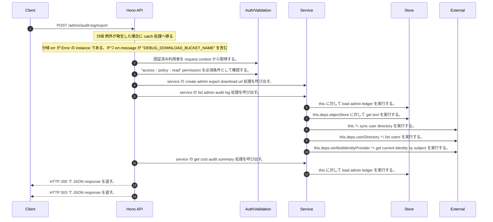

<!-- This file is generated by npm run docs:api-code. Do not edit manually. -->

# POST /admin/audit-log/export シーケンス

## シーケンス図

## 処理順とコード対応

| # | Caller | 境界 | 処理 | コード | 実装位置 |
| ---: | --- | --- | --- | --- | --- |
| 1 | `POST /admin/audit-log/export handler` | Auth | 認証済み利用者を request context から取得する。 | `c.get("user")` | `apps/api/src/routes/admin-routes.ts:209 (POST /admin/audit-log/export handler)` |
| 2 | `POST /admin/audit-log/export handler` | Auth | "access:policy:read" permission を必須条件として確認する。 | `requirePermission(user, "access:policy:read")` | `apps/api/src/routes/admin-routes.ts:210 (POST /admin/audit-log/export handler)` |
| 3 | `POST /admin/audit-log/export handler` | Service | service の create admin export download url 処理を呼び出す。 | `service.createAdminExportDownloadUrl(user, "audit_log")` | `apps/api/src/routes/admin-routes.ts:212 (POST /admin/audit-log/export handler)` |
| 4 | `MemoRagService.createAdminExportDownloadUrl` | Service | service の list admin audit log 処理を呼び出す。 | `this.listAdminAuditLog(actor, { limit: Number.MAX_SAFE_INTEGER })` | `apps/api/src/rag/memorag-service.ts:2044 (MemoRagService.createAdminExportDownloadUrl)` |
| 5 | `MemoRagService.listAdminAuditLog` | Store | `this` に対して load admin ledger を実行する。 | `this.loadAdminLedger(actor)` | `apps/api/src/rag/memorag-service.ts:1884 (MemoRagService.listAdminAuditLog)` |
| 6 | `MemoRagService.loadAdminLedger` | Store | `this.deps.objectStore` に対して get text を実行する。 | `this.deps.objectStore.getText(adminLedgerKey)` | `apps/api/src/rag/memorag-service.ts:3144 (MemoRagService.loadAdminLedger)` |
| 7 | `MemoRagService.loadAdminLedger` | External | `this` へ sync user directory を実行する。 | `this.syncUserDirectory(db)` | `apps/api/src/rag/memorag-service.ts:3185 (MemoRagService.loadAdminLedger)` |
| 8 | `MemoRagService.syncUserDirectory` | External | `this.deps.userDirectory` へ list users を実行する。 | `this.deps.userDirectory.listUsers()` | `apps/api/src/rag/memorag-service.ts:3192 (MemoRagService.syncUserDirectory)` |
| 9 | `MemoRagService.syncUserDirectory` | External | `this.deps.verifiedIdentityProvider` へ get current identity by subject を実行する。 | `this.deps.verifiedIdentityProvider.getCurrentIdentityBySubject(directoryUser.userId)` | `apps/api/src/rag/memorag-service.ts:3197 (MemoRagService.syncUserDirectory)` |
| 10 | `MemoRagService.createAdminExportDownloadUrl` | Service | service の get cost audit summary 処理を呼び出す。 | `this.getCostAuditSummary(actor)` | `apps/api/src/rag/memorag-service.ts:2050 (MemoRagService.createAdminExportDownloadUrl)` |
| 11 | `MemoRagService.getCostAuditSummary` | Store | `this` に対して load admin ledger を実行する。 | `this.loadAdminLedger(actor, { syncUserDirectory: false })` | `apps/api/src/rag/memorag-service.ts:2009 (MemoRagService.getCostAuditSummary)` |
| 12 | `POST /admin/audit-log/export handler` | HTTP/SSE | HTTP 200 で JSON response を返す。 | `c.json(await service.createAdminExportDownloadUrl(user, "audit_log"), 200)` | `apps/api/src/routes/admin-routes.ts:212 (POST /admin/audit-log/export handler)` |
| 13 | `POST /admin/audit-log/export handler` | HTTP/SSE | HTTP 503 で JSON response を返す。 | `c.json({ error: "Export storage is not configured" }, 503)` | `apps/api/src/routes/admin-routes.ts:214 (POST /admin/audit-log/export handler)` |

## 分岐

| ID | Function | 条件 | 実装位置 |
| --- | --- | --- | --- |
| B001 | `POST /admin/audit-log/export handler` | 例外が発生した場合に catch 処理へ移る | `apps/api/src/routes/admin-routes.ts:213 (POST /admin/audit-log/export handler)` |
| B002 | `POST /admin/audit-log/export handler` | `err` が `Error` の instance である、かつ `err.message` が "DEBUG_DOWNLOAD_BUCKET_NAME" を含む | `apps/api/src/routes/admin-routes.ts:214 (POST /admin/audit-log/export handler)` |
| B003 | `requirePermission` | 利用者が 指定された permission を持たない | `apps/api/src/authorization.ts:184 (requirePermission)` |
| B004 | `MemoRagService.createAdminExportDownloadUrl` | `config.debugDownloadBucketName` が存在しない、または偽である | `apps/api/src/rag/memorag-service.ts:2032 (MemoRagService.createAdminExportDownloadUrl)` |
| B005 | `MemoRagService.createAdminExportDownloadUrl` | `exportType` が `"audit_log"` と等しい | `apps/api/src/rag/memorag-service.ts:2039 (MemoRagService.createAdminExportDownloadUrl)` |
