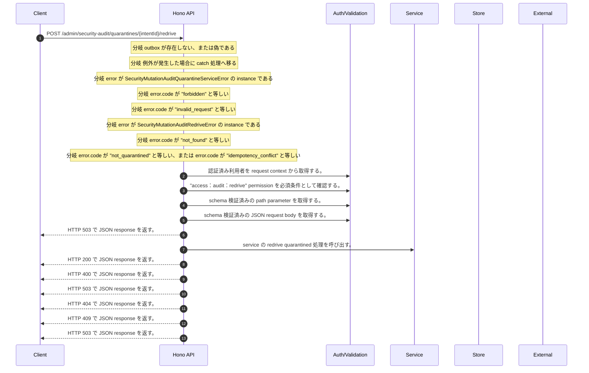

<!-- This file is generated by npm run docs:api-code. Do not edit manually. -->

# POST /admin/security-audit/quarantines/{intentId}/redrive シーケンス

## シーケンス図

## 処理順とコード対応

| # | Caller | 境界 | 処理 | コード | 実装位置 |
| ---: | --- | --- | --- | --- | --- |
| 1 | `POST /admin/security-audit/quarantines/{intentId}/redrive handler` | Auth | 認証済み利用者を request context から取得する。 | `c.get("user")` | `apps/api/src/routes/admin-routes.ts:118 (POST /admin/security-audit/quarantines/{intentId}/redrive handler)` |
| 2 | `POST /admin/security-audit/quarantines/{intentId}/redrive handler` | Auth | "access:audit:redrive" permission を必須条件として確認する。 | `requirePermission(actor, "access:audit:redrive")` | `apps/api/src/routes/admin-routes.ts:119 (POST /admin/security-audit/quarantines/{intentId}/redrive handler)` |
| 3 | `POST /admin/security-audit/quarantines/{intentId}/redrive handler` | Validation | schema 検証済みの path parameter を取得する。 | `validParam<{ intentId: string }>(c)` | `apps/api/src/routes/admin-routes.ts:120 (POST /admin/security-audit/quarantines/{intentId}/redrive handler)` |
| 4 | `POST /admin/security-audit/quarantines/{intentId}/redrive handler` | Validation | schema 検証済みの JSON request body を取得する。 | `validJson<z.infer<typeof SecurityAuditQuarantineRedriveRequestSchema>>(c)` | `apps/api/src/routes/admin-routes.ts:121 (POST /admin/security-audit/quarantines/{intentId}/redrive handler)` |
| 5 | `POST /admin/security-audit/quarantines/{intentId}/redrive handler` | HTTP/SSE | HTTP 503 で JSON response を返す。 | `c.json({ error: "Security audit redrive unavailable" }, 503)` | `apps/api/src/routes/admin-routes.ts:123 (POST /admin/security-audit/quarantines/{intentId}/redrive handler)` |
| 6 | `SecurityMutationAuditQuarantineService.redrive` | Service | service の redrive quarantined 処理を呼び出す。 | `this.outbox.redriveQuarantined(tenantId, intentId, { actorId: actor.userId, idempotencyKey: input.idempotencyKey, reason: input.reason, policyVersion: SECURITY_MUTATION_AUDIT_REDRIVE_POLICY_VERSION })` | `apps/api/src/security/security-mutation-audit-quarantine-service.ts:46 (SecurityMutationAuditQuarantineService.redrive)` |
| 7 | `POST /admin/security-audit/quarantines/{intentId}/redrive handler` | HTTP/SSE | HTTP 200 で JSON response を返す。 | `c.json(await new SecurityMutationAuditQuarantineService(outbox).redrive(actor, intentId, body), 200)` | `apps/api/src/routes/admin-routes.ts:125 (POST /admin/security-audit/quarantines/{intentId}/redrive handler)` |
| 8 | `POST /admin/security-audit/quarantines/{intentId}/redrive handler` | HTTP/SSE | HTTP 400 で JSON response を返す。 | `c.json({ error: "Invalid redrive request" }, 400)` | `apps/api/src/routes/admin-routes.ts:129 (POST /admin/security-audit/quarantines/{intentId}/redrive handler)` |
| 9 | `POST /admin/security-audit/quarantines/{intentId}/redrive handler` | HTTP/SSE | HTTP 503 で JSON response を返す。 | `c.json({ error: "Security audit redrive unavailable" }, 503)` | `apps/api/src/routes/admin-routes.ts:130 (POST /admin/security-audit/quarantines/{intentId}/redrive handler)` |
| 10 | `POST /admin/security-audit/quarantines/{intentId}/redrive handler` | HTTP/SSE | HTTP 404 で JSON response を返す。 | `c.json({ error: "Quarantined audit intent not found" }, 404)` | `apps/api/src/routes/admin-routes.ts:133 (POST /admin/security-audit/quarantines/{intentId}/redrive handler)` |
| 11 | `POST /admin/security-audit/quarantines/{intentId}/redrive handler` | HTTP/SSE | HTTP 409 で JSON response を返す。 | `c.json({ error: "Security audit redrive conflict" }, 409)` | `apps/api/src/routes/admin-routes.ts:135 (POST /admin/security-audit/quarantines/{intentId}/redrive handler)` |
| 12 | `POST /admin/security-audit/quarantines/{intentId}/redrive handler` | HTTP/SSE | HTTP 503 で JSON response を返す。 | `c.json({ error: "Security audit redrive unavailable" }, 503)` | `apps/api/src/routes/admin-routes.ts:137 (POST /admin/security-audit/quarantines/{intentId}/redrive handler)` |

## 分岐

| ID | Function | 条件 | 実装位置 |
| --- | --- | --- | --- |
| B001 | `POST /admin/security-audit/quarantines/{intentId}/redrive handler` | `outbox` が存在しない、または偽である | `apps/api/src/routes/admin-routes.ts:123 (POST /admin/security-audit/quarantines/{intentId}/redrive handler)` |
| B002 | `POST /admin/security-audit/quarantines/{intentId}/redrive handler` | 例外が発生した場合に catch 処理へ移る | `apps/api/src/routes/admin-routes.ts:126 (POST /admin/security-audit/quarantines/{intentId}/redrive handler)` |
| B003 | `POST /admin/security-audit/quarantines/{intentId}/redrive handler` | `error` が `SecurityMutationAuditQuarantineServiceError` の instance である | `apps/api/src/routes/admin-routes.ts:127 (POST /admin/security-audit/quarantines/{intentId}/redrive handler)` |
| B004 | `POST /admin/security-audit/quarantines/{intentId}/redrive handler` | `error.code` が `"forbidden"` と等しい | `apps/api/src/routes/admin-routes.ts:128 (POST /admin/security-audit/quarantines/{intentId}/redrive handler)` |
| B005 | `POST /admin/security-audit/quarantines/{intentId}/redrive handler` | `error.code` が `"invalid_request"` と等しい | `apps/api/src/routes/admin-routes.ts:129 (POST /admin/security-audit/quarantines/{intentId}/redrive handler)` |
| B006 | `POST /admin/security-audit/quarantines/{intentId}/redrive handler` | `error` が `SecurityMutationAuditRedriveError` の instance である | `apps/api/src/routes/admin-routes.ts:132 (POST /admin/security-audit/quarantines/{intentId}/redrive handler)` |
| B007 | `POST /admin/security-audit/quarantines/{intentId}/redrive handler` | `error.code` が `"not_found"` と等しい | `apps/api/src/routes/admin-routes.ts:133 (POST /admin/security-audit/quarantines/{intentId}/redrive handler)` |
| B008 | `POST /admin/security-audit/quarantines/{intentId}/redrive handler` | `error.code` が `"not_quarantined"` と等しい、または `error.code` が `"idempotency_conflict"` と等しい | `apps/api/src/routes/admin-routes.ts:134 (POST /admin/security-audit/quarantines/{intentId}/redrive handler)` |
| B009 | `requirePermission` | 利用者が 指定された permission を持たない | `apps/api/src/authorization.ts:185 (requirePermission)` |
| B010 | `SecurityMutationAuditQuarantineService.redrive` | 利用者が "access:audit:redrive" permission を持たない | `apps/api/src/security/security-mutation-audit-quarantine-service.ts:32 (SecurityMutationAuditQuarantineService.redrive)` |
| B011 | `SecurityMutationAuditQuarantineService.redrive` | is canonical bounded text の判定結果が真ではない | `apps/api/src/security/security-mutation-audit-quarantine-service.ts:36 (SecurityMutationAuditQuarantineService.redrive)` |
| B012 | `SecurityMutationAuditQuarantineService.redrive` | is canonical bounded text の判定結果が真ではない、または test の判定結果が真ではない、または test の判定結果が真ではない、または is canonical bounded text の判定結果が真ではない | `apps/api/src/security/security-mutation-audit-quarantine-service.ts:40 (SecurityMutationAuditQuarantineService.redrive)` |
