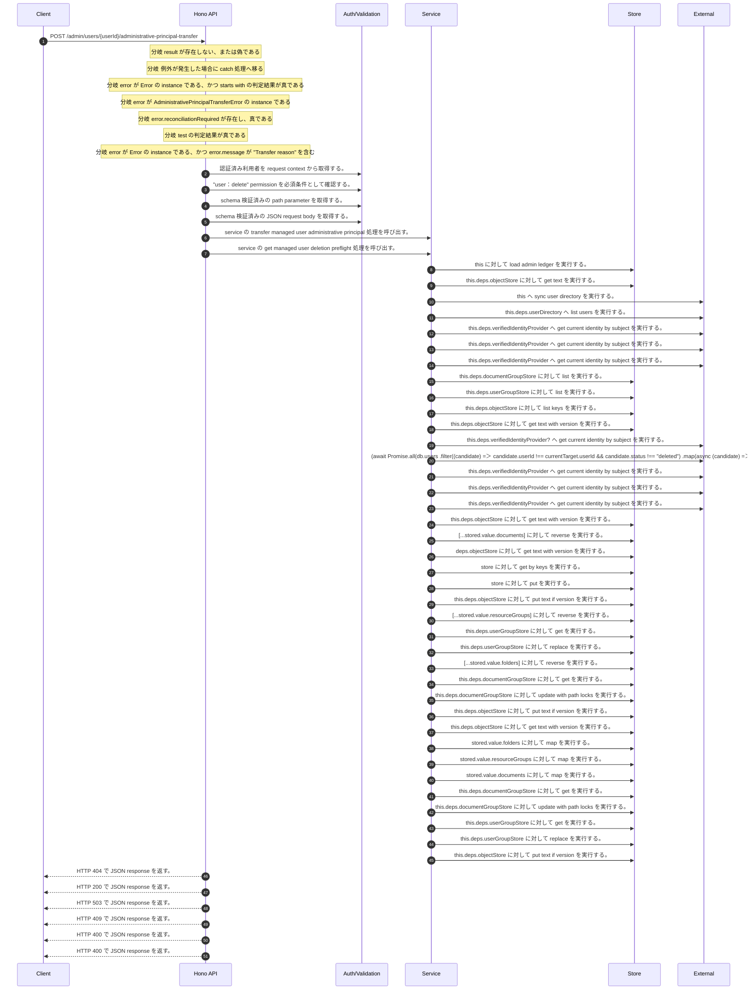

<!-- This file is generated by npm run docs:api-code. Do not edit manually. -->

# POST /admin/users/{userId}/administrative-principal-transfer シーケンス

## シーケンス図

## 処理順とコード対応

| # | Caller | 境界 | 処理 | コード | 実装位置 |
| ---: | --- | --- | --- | --- | --- |
| 1 | `POST /admin/users/{userId}/administrative-principal-transfer handler` | Auth | 認証済み利用者を request context から取得する。 | `c.get("user")` | `apps/api/src/routes/admin-routes.ts:98 (POST /admin/users/{userId}/administrative-principal-transfer handler)` |
| 2 | `POST /admin/users/{userId}/administrative-principal-transfer handler` | Auth | "user:delete" permission を必須条件として確認する。 | `requirePermission(actor, "user:delete")` | `apps/api/src/routes/admin-routes.ts:99 (POST /admin/users/{userId}/administrative-principal-transfer handler)` |
| 3 | `POST /admin/users/{userId}/administrative-principal-transfer handler` | Validation | schema 検証済みの path parameter を取得する。 | `validParam<{ userId: string }>(c)` | `apps/api/src/routes/admin-routes.ts:100 (POST /admin/users/{userId}/administrative-principal-transfer handler)` |
| 4 | `POST /admin/users/{userId}/administrative-principal-transfer handler` | Validation | schema 検証済みの JSON request body を取得する。 | `validJson<z.infer<typeof AdministrativePrincipalTransferRequestSchema>>(c)` | `apps/api/src/routes/admin-routes.ts:101 (POST /admin/users/{userId}/administrative-principal-transfer handler)` |
| 5 | `POST /admin/users/{userId}/administrative-principal-transfer handler` | Service | service の transfer managed user administrative principal 処理を呼び出す。 | `service.transferManagedUserAdministrativePrincipal(actor, userId, body)` | `apps/api/src/routes/admin-routes.ts:103 (POST /admin/users/{userId}/administrative-principal-transfer handler)` |
| 6 | `MemoRagService.transferManagedUserAdministrativePrincipal` | Service | service の get managed user deletion preflight 処理を呼び出す。 | `this.getManagedUserDeletionPreflight(actor, sourceUserId)` | `apps/api/src/rag/memorag-service.ts:1682 (MemoRagService.transferManagedUserAdministrativePrincipal)` |
| 7 | `MemoRagService.getManagedUserDeletionPreflight` | Store | `this` に対して load admin ledger を実行する。 | `this.loadAdminLedger(actor, { syncUserDirectory: true })` | `apps/api/src/rag/memorag-service.ts:1586 (MemoRagService.getManagedUserDeletionPreflight)` |
| 8 | `MemoRagService.loadAdminLedger` | Store | `this.deps.objectStore` に対して get text を実行する。 | `this.deps.objectStore.getText(adminLedgerKey)` | `apps/api/src/rag/memorag-service.ts:3144 (MemoRagService.loadAdminLedger)` |
| 9 | `MemoRagService.loadAdminLedger` | External | `this` へ sync user directory を実行する。 | `this.syncUserDirectory(db)` | `apps/api/src/rag/memorag-service.ts:3185 (MemoRagService.loadAdminLedger)` |
| 10 | `MemoRagService.syncUserDirectory` | External | `this.deps.userDirectory` へ list users を実行する。 | `this.deps.userDirectory.listUsers()` | `apps/api/src/rag/memorag-service.ts:3192 (MemoRagService.syncUserDirectory)` |
| 11 | `MemoRagService.syncUserDirectory` | External | `this.deps.verifiedIdentityProvider` へ get current identity by subject を実行する。 | `this.deps.verifiedIdentityProvider.getCurrentIdentityBySubject(directoryUser.userId)` | `apps/api/src/rag/memorag-service.ts:3197 (MemoRagService.syncUserDirectory)` |
| 12 | `MemoRagService.getManagedUserDeletionPreflight` | External | `this.deps.verifiedIdentityProvider` へ get current identity by subject を実行する。 | `this.deps.verifiedIdentityProvider.getCurrentIdentityBySubject(actor.userId)` | `apps/api/src/rag/memorag-service.ts:1593 (MemoRagService.getManagedUserDeletionPreflight)` |
| 13 | `MemoRagService.getManagedUserDeletionPreflight` | External | `this.deps.verifiedIdentityProvider` へ get current identity by subject を実行する。 | `this.deps.verifiedIdentityProvider.getCurrentIdentityBySubject(userId)` | `apps/api/src/rag/memorag-service.ts:1594 (MemoRagService.getManagedUserDeletionPreflight)` |
| 14 | `AdministrativePrincipalTransferService.inventory` | Store | `this.deps.documentGroupStore` に対して list を実行する。 | `this.deps.documentGroupStore.list(tenantId)` | `apps/api/src/security/administrative-principal-transfer-service.ts:529 (AdministrativePrincipalTransferService.inventory)` |
| 15 | `AdministrativePrincipalTransferService.inventory` | Store | `this.deps.userGroupStore` に対して list を実行する。 | `this.deps.userGroupStore.list(tenantId)` | `apps/api/src/security/administrative-principal-transfer-service.ts:530 (AdministrativePrincipalTransferService.inventory)` |
| 16 | `AdministrativePrincipalTransferService.inventory` | Store | `this.deps.objectStore` に対して list keys を実行する。 | `this.deps.objectStore.listKeys(tenantManifestPrefix(this.deps, tenantId))` | `apps/api/src/security/administrative-principal-transfer-service.ts:531 (AdministrativePrincipalTransferService.inventory)` |
| 17 | `AdministrativePrincipalTransferService.inventory` | Store | `this.deps.objectStore` に対して get text with version を実行する。 | `this.deps.objectStore.getTextWithVersion(key)` | `apps/api/src/security/administrative-principal-transfer-service.ts:537 (AdministrativePrincipalTransferService.inventory)` |
| 18 | `MemoRagService.getManagedUserDeletionPreflight` | External | `this.deps.verifiedIdentityProvider?` へ get current identity by subject を実行する。 | `this.deps.verifiedIdentityProvider?.getCurrentIdentityBySubject(candidate.userId)` | `apps/api/src/rag/memorag-service.ts:1624 (MemoRagService.getManagedUserDeletionPreflight)` |
| 19 | `MemoRagService.getManagedUserDeletionPreflight` | External | `(await Promise.all(db.users           .filter((candidate) => candidate.userId !== currentTarget.userId && candidate.status !== "deleted")           .map(async (candidate) => ({             candidate,             identity: await this.deps.verifiedIdentityProvider?.getCurrentIdentityBySubject(candidate.userId)           }))))           ` へ filter を実行する。 | `(await Promise.all(db.users .filter((candidate) => candidate.userId !== currentTarget.userId && candidate.status !== "deleted") .map(async (candidate) => ({ candidate, identity: await this.deps.verifiedIdentityProvider?…` | `apps/api/src/rag/memorag-service.ts:1620 (MemoRagService.getManagedUserDeletionPreflight)` |
| 20 | `MemoRagService.transferManagedUserAdministrativePrincipal` | External | `this.deps.verifiedIdentityProvider` へ get current identity by subject を実行する。 | `this.deps.verifiedIdentityProvider.getCurrentIdentityBySubject(actor.userId)` | `apps/api/src/rag/memorag-service.ts:1695 (MemoRagService.transferManagedUserAdministrativePrincipal)` |
| 21 | `MemoRagService.transferManagedUserAdministrativePrincipal` | External | `this.deps.verifiedIdentityProvider` へ get current identity by subject を実行する。 | `this.deps.verifiedIdentityProvider.getCurrentIdentityBySubject(sourceUserId)` | `apps/api/src/rag/memorag-service.ts:1696 (MemoRagService.transferManagedUserAdministrativePrincipal)` |
| 22 | `MemoRagService.transferManagedUserAdministrativePrincipal` | External | `this.deps.verifiedIdentityProvider` へ get current identity by subject を実行する。 | `this.deps.verifiedIdentityProvider.getCurrentIdentityBySubject(input.successorUserId)` | `apps/api/src/rag/memorag-service.ts:1697 (MemoRagService.transferManagedUserAdministrativePrincipal)` |
| 23 | `AdministrativePrincipalTransferService.readState` | Store | `this.deps.objectStore` に対して get text with version を実行する。 | `this.deps.objectStore.getTextWithVersion(key)` | `apps/api/src/security/administrative-principal-transfer-service.ts:702 (AdministrativePrincipalTransferService.readState)` |
| 24 | `AdministrativePrincipalTransferService.rollback` | Store | `[...stored.value.documents]` に対して reverse を実行する。 | `[...stored.value.documents].reverse()` | `apps/api/src/security/administrative-principal-transfer-service.ts:610 (AdministrativePrincipalTransferService.rollback)` |
| 25 | `readManifest` | Store | `deps.objectStore` に対して get text with version を実行する。 | `deps.objectStore.getTextWithVersion(key)` | `apps/api/src/security/administrative-principal-transfer-service.ts:796 (readManifest)` |
| 26 | `rewriteVectorOwners` | Store | `store` に対して get by keys を実行する。 | `store.getByKeys(keys)` | `apps/api/src/security/administrative-principal-transfer-service.ts:779 (rewriteVectorOwners)` |
| 27 | `rewriteVectorOwners` | Store | `store` に対して put を実行する。 | `store.put(records.map((record): VectorRecord => ({ ...record, metadata: transferVectorOwner(record.metadata, ownerUserId, manifest) })))` | `apps/api/src/security/administrative-principal-transfer-service.ts:782 (rewriteVectorOwners)` |
| 28 | `AdministrativePrincipalTransferService.rollbackDocument` | Store | `this.deps.objectStore` に対して put text if version を実行する。 | `this.deps.objectStore.putTextIfVersion( transfer.source.manifestObjectKey, JSON.stringify(transfer.source, null, 2), current.version, "application/json" )` | `apps/api/src/security/administrative-principal-transfer-service.ts:662 (AdministrativePrincipalTransferService.rollbackDocument)` |
| 29 | `AdministrativePrincipalTransferService.rollback` | Store | `[...stored.value.resourceGroups]` に対して reverse を実行する。 | `[...stored.value.resourceGroups].reverse()` | `apps/api/src/security/administrative-principal-transfer-service.ts:613 (AdministrativePrincipalTransferService.rollback)` |
| 30 | `AdministrativePrincipalTransferService.rollbackResourceGroup` | Store | `this.deps.userGroupStore` に対して get を実行する。 | `this.deps.userGroupStore.get(requiredUserGroupTenantId(transfer.source), transfer.source.groupId)` | `apps/api/src/security/administrative-principal-transfer-service.ts:643 (AdministrativePrincipalTransferService.rollbackResourceGroup)` |
| 31 | `AdministrativePrincipalTransferService.rollbackResourceGroup` | Store | `this.deps.userGroupStore` に対して replace を実行する。 | `this.deps.userGroupStore.replace(transfer.source, transfer.target.updatedAt)` | `apps/api/src/security/administrative-principal-transfer-service.ts:648 (AdministrativePrincipalTransferService.rollbackResourceGroup)` |
| 32 | `AdministrativePrincipalTransferService.rollback` | Store | `[...stored.value.folders]` に対して reverse を実行する。 | `[...stored.value.folders].reverse()` | `apps/api/src/security/administrative-principal-transfer-service.ts:616 (AdministrativePrincipalTransferService.rollback)` |
| 33 | `AdministrativePrincipalTransferService.rollbackFolder` | Store | `this.deps.documentGroupStore` に対して get を実行する。 | `this.deps.documentGroupStore.get(transfer.source.tenantId, transfer.source.groupId)` | `apps/api/src/security/administrative-principal-transfer-service.ts:636 (AdministrativePrincipalTransferService.rollbackFolder)` |
| 34 | `AdministrativePrincipalTransferService.rollbackFolder` | Store | `this.deps.documentGroupStore` に対して update with path locks を実行する。 | `this.deps.documentGroupStore.updateWithPathLocks(transfer.source.tenantId, [{ current, next: transfer.source }])` | `apps/api/src/security/administrative-principal-transfer-service.ts:639 (AdministrativePrincipalTransferService.rollbackFolder)` |
| 35 | `AdministrativePrincipalTransferService.writeState` | Store | `this.deps.objectStore` に対して put text if version を実行する。 | `this.deps.objectStore.putTextIfVersion(key, JSON.stringify(value, null, 2), expectedVersion, "application/json")` | `apps/api/src/security/administrative-principal-transfer-service.ts:711 (AdministrativePrincipalTransferService.writeState)` |
| 36 | `AdministrativePrincipalTransferService.writeState` | Store | `this.deps.objectStore` に対して get text with version を実行する。 | `this.deps.objectStore.getTextWithVersion(key)` | `apps/api/src/security/administrative-principal-transfer-service.ts:712 (AdministrativePrincipalTransferService.writeState)` |
| 37 | `AdministrativePrincipalTransferService.mergeInventory` | Store | `stored.value.folders` に対して map を実行する。 | `stored.value.folders.map((entry) => entry.source.groupId)` | `apps/api/src/security/administrative-principal-transfer-service.ts:473 (AdministrativePrincipalTransferService.mergeInventory)` |
| 38 | `AdministrativePrincipalTransferService.mergeInventory` | Store | `stored.value.resourceGroups` に対して map を実行する。 | `stored.value.resourceGroups.map((entry) => entry.source.groupId)` | `apps/api/src/security/administrative-principal-transfer-service.ts:474 (AdministrativePrincipalTransferService.mergeInventory)` |
| 39 | `AdministrativePrincipalTransferService.mergeInventory` | Store | `stored.value.documents` に対して map を実行する。 | `stored.value.documents.map((entry) => entry.source.manifestObjectKey)` | `apps/api/src/security/administrative-principal-transfer-service.ts:475 (AdministrativePrincipalTransferService.mergeInventory)` |
| 40 | `AdministrativePrincipalTransferService.applyFolder` | Store | `this.deps.documentGroupStore` に対して get を実行する。 | `this.deps.documentGroupStore.get(transfer.source.tenantId, transfer.source.groupId)` | `apps/api/src/security/administrative-principal-transfer-service.ts:561 (AdministrativePrincipalTransferService.applyFolder)` |
| 41 | `AdministrativePrincipalTransferService.applyFolder` | Store | `this.deps.documentGroupStore` に対して update with path locks を実行する。 | `this.deps.documentGroupStore.updateWithPathLocks(transfer.source.tenantId, [{ current, next: transfer.target }])` | `apps/api/src/security/administrative-principal-transfer-service.ts:567 (AdministrativePrincipalTransferService.applyFolder)` |
| 42 | `AdministrativePrincipalTransferService.applyResourceGroup` | Store | `this.deps.userGroupStore` に対して get を実行する。 | `this.deps.userGroupStore.get(requiredUserGroupTenantId(transfer.source), transfer.source.groupId)` | `apps/api/src/security/administrative-principal-transfer-service.ts:571 (AdministrativePrincipalTransferService.applyResourceGroup)` |
| 43 | `AdministrativePrincipalTransferService.applyResourceGroup` | Store | `this.deps.userGroupStore` に対して replace を実行する。 | `this.deps.userGroupStore.replace(transfer.target, transfer.source.updatedAt)` | `apps/api/src/security/administrative-principal-transfer-service.ts:577 (AdministrativePrincipalTransferService.applyResourceGroup)` |
| 44 | `AdministrativePrincipalTransferService.applyDocument` | Store | `this.deps.objectStore` に対して put text if version を実行する。 | `this.deps.objectStore.putTextIfVersion( transfer.target.manifestObjectKey, JSON.stringify(transfer.target, null, 2), transfer.sourceVersion, "application/json" )` | `apps/api/src/security/administrative-principal-transfer-service.ts:591 (AdministrativePrincipalTransferService.applyDocument)` |
| 45 | `POST /admin/users/{userId}/administrative-principal-transfer handler` | HTTP/SSE | HTTP 404 で JSON response を返す。 | `c.json({ error: "User not found" }, 404)` | `apps/api/src/routes/admin-routes.ts:104 (POST /admin/users/{userId}/administrative-principal-transfer handler)` |
| 46 | `POST /admin/users/{userId}/administrative-principal-transfer handler` | HTTP/SSE | HTTP 200 で JSON response を返す。 | `c.json(result, 200)` | `apps/api/src/routes/admin-routes.ts:105 (POST /admin/users/{userId}/administrative-principal-transfer handler)` |
| 47 | `POST /admin/users/{userId}/administrative-principal-transfer handler` | HTTP/SSE | HTTP 503 で JSON response を返す。 | `c.json({ error: "Administrative principal transfer unavailable" }, 503)` | `apps/api/src/routes/admin-routes.ts:111 (POST /admin/users/{userId}/administrative-principal-transfer handler)` |
| 48 | `POST /admin/users/{userId}/administrative-principal-transfer handler` | HTTP/SSE | HTTP 409 で JSON response を返す。 | `c.json({ error: "Administrative principal transfer conflict" }, 409)` | `apps/api/src/routes/admin-routes.ts:113 (POST /admin/users/{userId}/administrative-principal-transfer handler)` |
| 49 | `POST /admin/users/{userId}/administrative-principal-transfer handler` | HTTP/SSE | HTTP 400 で JSON response を返す。 | `c.json({ error: error.message }, 400)` | `apps/api/src/routes/admin-routes.ts:115 (POST /admin/users/{userId}/administrative-principal-transfer handler)` |
| 50 | `POST /admin/users/{userId}/administrative-principal-transfer handler` | HTTP/SSE | HTTP 400 で JSON response を返す。 | `c.json({ error: error.message }, 400)` | `apps/api/src/routes/admin-routes.ts:117 (POST /admin/users/{userId}/administrative-principal-transfer handler)` |

## 分岐

| ID | Function | 条件 | 実装位置 |
| --- | --- | --- | --- |
| B001 | `POST /admin/users/{userId}/administrative-principal-transfer handler` | `result` が存在しない、または偽である | `apps/api/src/routes/admin-routes.ts:104 (POST /admin/users/{userId}/administrative-principal-transfer handler)` |
| B002 | `POST /admin/users/{userId}/administrative-principal-transfer handler` | 例外が発生した場合に catch 処理へ移る | `apps/api/src/routes/admin-routes.ts:106 (POST /admin/users/{userId}/administrative-principal-transfer handler)` |
| B003 | `POST /admin/users/{userId}/administrative-principal-transfer handler` | `error` が `Error` の instance である、かつ starts with の判定結果が真である | `apps/api/src/routes/admin-routes.ts:107 (POST /admin/users/{userId}/administrative-principal-transfer handler)` |
| B004 | `POST /admin/users/{userId}/administrative-principal-transfer handler` | `error` が `AdministrativePrincipalTransferError` の instance である | `apps/api/src/routes/admin-routes.ts:110 (POST /admin/users/{userId}/administrative-principal-transfer handler)` |
| B005 | `POST /admin/users/{userId}/administrative-principal-transfer handler` | `error.reconciliationRequired` が存在し、真である | `apps/api/src/routes/admin-routes.ts:111 (POST /admin/users/{userId}/administrative-principal-transfer handler)` |
| B006 | `POST /admin/users/{userId}/administrative-principal-transfer handler` | test の判定結果が真である | `apps/api/src/routes/admin-routes.ts:112 (POST /admin/users/{userId}/administrative-principal-transfer handler)` |
| B007 | `POST /admin/users/{userId}/administrative-principal-transfer handler` | `error` が `Error` の instance である、かつ `error.message` が "Transfer reason" を含む | `apps/api/src/routes/admin-routes.ts:117 (POST /admin/users/{userId}/administrative-principal-transfer handler)` |
| B008 | `requirePermission` | 利用者が 指定された permission を持たない | `apps/api/src/authorization.ts:184 (requirePermission)` |
| B009 | `MemoRagService.transferManagedUserAdministrativePrincipal` | trim の判定結果が真ではない、または `input.reason.trim()` が `input.reason` と異なる | `apps/api/src/rag/memorag-service.ts:1679 (MemoRagService.transferManagedUserAdministrativePrincipal)` |
| B010 | `MemoRagService.transferManagedUserAdministrativePrincipal` | `preflight` が存在しない、または偽である | `apps/api/src/rag/memorag-service.ts:1683 (MemoRagService.transferManagedUserAdministrativePrincipal)` |
| B011 | `MemoRagService.transferManagedUserAdministrativePrincipal` | `candidate` が存在し、真である | `apps/api/src/rag/memorag-service.ts:1690 (MemoRagService.transferManagedUserAdministrativePrincipal)` |
| B012 | `MemoRagService.transferManagedUserAdministrativePrincipal` | `this.deps.verifiedIdentityProvider` が存在し、真である | `apps/api/src/rag/memorag-service.ts:1693 (MemoRagService.transferManagedUserAdministrativePrincipal)` |
| B013 | `MemoRagService.transferManagedUserAdministrativePrincipal` | `actorIdentity` が存在しない、または偽である、または `sourceIdentity` が存在しない、または偽である、または `actorIdentity.accountStatus` が `"active"` と異なる、または `actorIdentity.tenantId` が `sourceIdentity.tenantId` と異なる、または `actor.tenantId` が `actorIdentity.tenantId` と異なる | `apps/api/src/rag/memorag-service.ts:1700 (MemoRagService.transferManagedUserAdministrativePrincipal)` |
| B014 | `MemoRagService.transferManagedUserAdministrativePrincipal` | `candidate` が存在し、真である、かつ `successorIdentity?.userId` が `input.successorUserId` と等しい、かつ `successorIdentity.accountStatus` が `"active"` と等しい、かつ `successorIdentity.tenantId` が `tenantId` と等しい | `apps/api/src/rag/memorag-service.ts:1717 (MemoRagService.transferManagedUserAdministrativePrincipal)` |
| B015 | `MemoRagService.transferManagedUserAdministrativePrincipal` | `successor.status` が `"active"` と異なる | `apps/api/src/rag/memorag-service.ts:1734 (MemoRagService.transferManagedUserAdministrativePrincipal)` |
| B016 | `MemoRagService.transferManagedUserAdministrativePrincipal` | 例外が発生した場合に catch 処理へ移る | `apps/api/src/rag/memorag-service.ts:1737 (MemoRagService.transferManagedUserAdministrativePrincipal)` |
| B017 | `MemoRagService.transferManagedUserAdministrativePrincipal` | `error` が `AdministrativePrincipalTransferError` の instance であるではない | `apps/api/src/rag/memorag-service.ts:1738 (MemoRagService.transferManagedUserAdministrativePrincipal)` |
