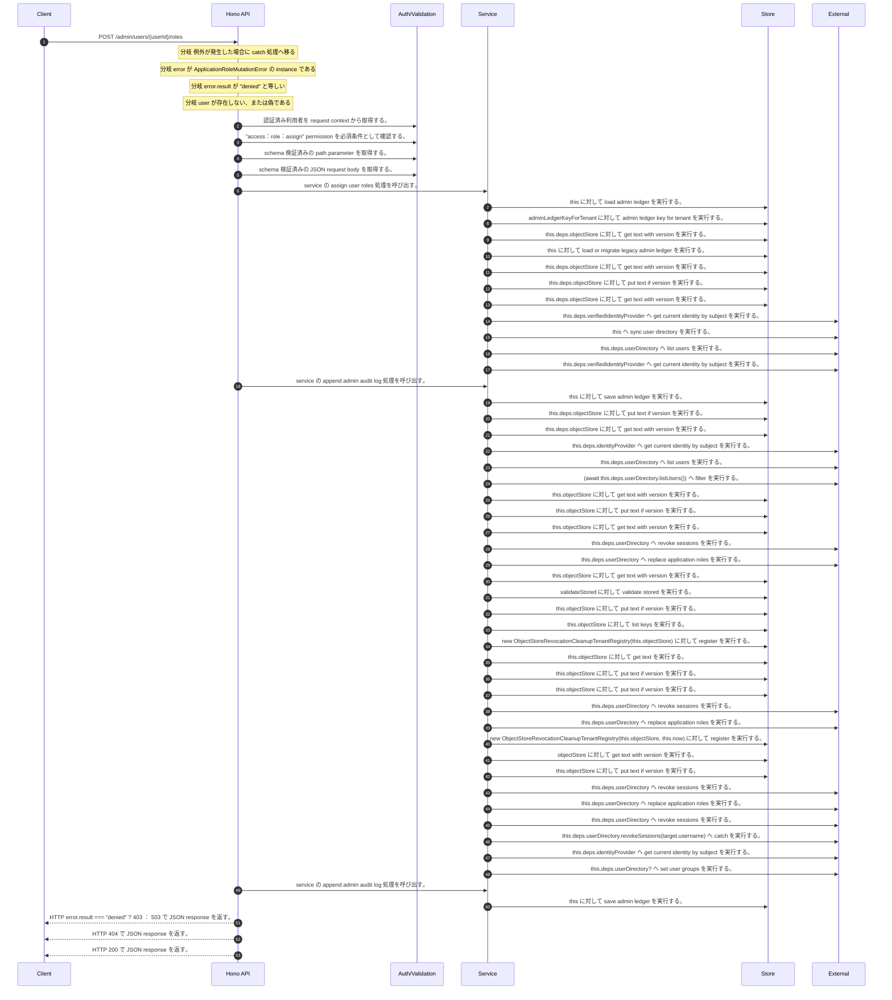

<!-- This file is generated by npm run docs:api-code. Do not edit manually. -->

# POST /admin/users/{userId}/roles シーケンス

## シーケンス図

## 処理順とコード対応

| # | Caller | 境界 | 処理 | コード | 実装位置 |
| ---: | --- | --- | --- | --- | --- |
| 1 | `POST /admin/users/{userId}/roles handler` | Auth | 認証済み利用者を request context から取得する。 | `c.get("user")` | `apps/api/src/routes/admin-routes.ts:256 (POST /admin/users/{userId}/roles handler)` |
| 2 | `POST /admin/users/{userId}/roles handler` | Auth | "access:role:assign" permission を必須条件として確認する。 | `requirePermission(actor, "access:role:assign")` | `apps/api/src/routes/admin-routes.ts:257 (POST /admin/users/{userId}/roles handler)` |
| 3 | `POST /admin/users/{userId}/roles handler` | Validation | schema 検証済みの path parameter を取得する。 | `validParam<{ userId: string }>(c)` | `apps/api/src/routes/admin-routes.ts:258 (POST /admin/users/{userId}/roles handler)` |
| 4 | `POST /admin/users/{userId}/roles handler` | Validation | schema 検証済みの JSON request body を取得する。 | `validJson<z.infer<typeof AssignUserRolesRequestSchema>>(c)` | `apps/api/src/routes/admin-routes.ts:259 (POST /admin/users/{userId}/roles handler)` |
| 5 | `POST /admin/users/{userId}/roles handler` | Service | service の assign user roles 処理を呼び出す。 | `service.assignUserRoles(actor, userId, body.groups, body.reason)` | `apps/api/src/routes/admin-routes.ts:262 (POST /admin/users/{userId}/roles handler)` |
| 6 | `MemoRagService.assignUserRoles` | Store | `this` に対して load admin ledger を実行する。 | `this.loadAdminLedger(actor, { syncUserDirectory: true })` | `apps/api/src/rag/memorag-service.ts:2169 (MemoRagService.assignUserRoles)` |
| 7 | `MemoRagService.loadAdminLedger` | Store | `adminLedgerKeyForTenant` に対して admin ledger key for tenant を実行する。 | `adminLedgerKeyForTenant(tenantId)` | `apps/api/src/rag/memorag-service.ts:3468 (MemoRagService.loadAdminLedger)` |
| 8 | `MemoRagService.loadAdminLedger` | Store | `this.deps.objectStore` に対して get text with version を実行する。 | `this.deps.objectStore.getTextWithVersion(storageKey)` | `apps/api/src/rag/memorag-service.ts:3470 (MemoRagService.loadAdminLedger)` |
| 9 | `MemoRagService.loadAdminLedger` | Store | `this` に対して load or migrate legacy admin ledger を実行する。 | `this.loadOrMigrateLegacyAdminLedger(tenantId, storageKey)` | `apps/api/src/rag/memorag-service.ts:3475 (MemoRagService.loadAdminLedger)` |
| 10 | `MemoRagService.loadOrMigrateLegacyAdminLedger` | Store | `this.deps.objectStore` に対して get text with version を実行する。 | `this.deps.objectStore.getTextWithVersion(legacyAdminLedgerKey)` | `apps/api/src/rag/memorag-service.ts:3537 (MemoRagService.loadOrMigrateLegacyAdminLedger)` |
| 11 | `MemoRagService.loadOrMigrateLegacyAdminLedger` | Store | `this.deps.objectStore` に対して put text if version を実行する。 | `this.deps.objectStore.putTextIfVersion(storageKey, serialized, undefined, "application/json")` | `apps/api/src/rag/memorag-service.ts:3551 (MemoRagService.loadOrMigrateLegacyAdminLedger)` |
| 12 | `MemoRagService.loadOrMigrateLegacyAdminLedger` | Store | `this.deps.objectStore` に対して get text with version を実行する。 | `this.deps.objectStore.getTextWithVersion(storageKey)` | `apps/api/src/rag/memorag-service.ts:3555 (MemoRagService.loadOrMigrateLegacyAdminLedger)` |
| 13 | `MemoRagService.loadAdminLedger` | External | `this.deps.verifiedIdentityProvider` へ get current identity by subject を実行する。 | `this.deps.verifiedIdentityProvider.getCurrentIdentityBySubject(actor.userId)` | `apps/api/src/rag/memorag-service.ts:3482 (MemoRagService.loadAdminLedger)` |
| 14 | `MemoRagService.loadAdminLedger` | External | `this` へ sync user directory を実行する。 | `this.syncUserDirectory(db, authoritativeActorTenantId(actor))` | `apps/api/src/rag/memorag-service.ts:3524 (MemoRagService.loadAdminLedger)` |
| 15 | `MemoRagService.syncUserDirectory` | External | `this.deps.userDirectory` へ list users を実行する。 | `this.deps.userDirectory.listUsers()` | `apps/api/src/rag/memorag-service.ts:3562 (MemoRagService.syncUserDirectory)` |
| 16 | `MemoRagService.syncUserDirectory` | External | `this.deps.verifiedIdentityProvider` へ get current identity by subject を実行する。 | `this.deps.verifiedIdentityProvider.getCurrentIdentityBySubject(directoryUser.userId)` | `apps/api/src/rag/memorag-service.ts:3567 (MemoRagService.syncUserDirectory)` |
| 17 | `MemoRagService.assignUserRoles` | Service | service の append admin audit log 処理を呼び出す。 | `this.appendAdminAuditLog(db, actor, user, "role:assign", user.status, user.status, beforeGroups, user.groups, user.updatedAt)` | `apps/api/src/rag/memorag-service.ts:2192 (MemoRagService.assignUserRoles)` |
| 18 | `MemoRagService.assignUserRoles` | Store | `this` に対して save admin ledger を実行する。 | `this.saveAdminLedger(db)` | `apps/api/src/rag/memorag-service.ts:2193 (MemoRagService.assignUserRoles)` |
| 19 | `MemoRagService.saveAdminLedger` | Store | `this.deps.objectStore` に対して put text if version を実行する。 | `this.deps.objectStore.putTextIfVersion( _storageKey, serialized, _storeVersion, "application/json" )` | `apps/api/src/rag/memorag-service.ts:3615 (MemoRagService.saveAdminLedger)` |
| 20 | `MemoRagService.saveAdminLedger` | Store | `this.deps.objectStore` に対して get text with version を実行する。 | `this.deps.objectStore.getTextWithVersion(_storageKey)` | `apps/api/src/rag/memorag-service.ts:3627 (MemoRagService.saveAdminLedger)` |
| 21 | `ApplicationRoleMutationService.resolveIdentity` | External | `this.deps.identityProvider` へ get current identity by subject を実行する。 | `this.deps.identityProvider.getCurrentIdentityBySubject(subject)` | `apps/api/src/security/application-role-mutation-service.ts:335 (ApplicationRoleMutationService.resolveIdentity)` |
| 22 | `ApplicationRoleMutationService.validate` | External | `this.deps.userDirectory` へ list users を実行する。 | `this.deps.userDirectory.listUsers()` | `apps/api/src/security/application-role-mutation-service.ts:310 (ApplicationRoleMutationService.validate)` |
| 23 | `ApplicationRoleMutationService.validate` | External | `(await this.deps.userDirectory.listUsers())` へ filter を実行する。 | `(await this.deps.userDirectory.listUsers()).filter((candidate) => ( candidate.userId !== target.userId && candidate.status === "active" && candidate.groups.includes("SYSTEM_ADMIN") ))` | `apps/api/src/security/application-role-mutation-service.ts:310 (ApplicationRoleMutationService.validate)` |
| 24 | `ObjectStoreApplicationRoleMutationLock.read` | Store | `this.objectStore` に対して get text with version を実行する。 | `this.objectStore.getTextWithVersion(key)` | `apps/api/src/security/application-role-mutation-lock.ts:248 (ObjectStoreApplicationRoleMutationLock.read)` |
| 25 | `ObjectStoreApplicationRoleMutationLock.write` | Store | `this.objectStore` に対して put text if version を実行する。 | `this.objectStore.putTextIfVersion(key, JSON.stringify(record, null, 2), expectedVersion, "application/json")` | `apps/api/src/security/application-role-mutation-lock.ts:264 (ObjectStoreApplicationRoleMutationLock.write)` |
| 26 | `ObjectStoreApplicationRoleMutationLock.write` | Store | `this.objectStore` に対して get text with version を実行する。 | `this.objectStore.getTextWithVersion(key)` | `apps/api/src/security/application-role-mutation-lock.ts:265 (ObjectStoreApplicationRoleMutationLock.write)` |
| 27 | `ApplicationRoleMutationService.recoverExpiredMutation` | External | `this.deps.userDirectory` へ revoke sessions を実行する。 | `this.deps.userDirectory.revokeSessions(record.targetUsername)` | `apps/api/src/security/application-role-mutation-service.ts:406 (ApplicationRoleMutationService.recoverExpiredMutation)` |
| 28 | `ApplicationRoleMutationService.recoverExpiredMutation` | External | `this.deps.userDirectory` へ replace application roles を実行する。 | `this.deps.userDirectory.replaceApplicationRoles(record.targetUsername, { expectedRoles: currentRoles, desiredRoles: record.expectedRoles, operationId: record.operationId, fencingToken: recoveryLease.record.fencingToken,…` | `apps/api/src/security/application-role-mutation-service.ts:407 (ApplicationRoleMutationService.recoverExpiredMutation)` |
| 29 | `ObjectStoreRevocationCleanupRepairOutbox.read` | Store | `this.objectStore` に対して get text with version を実行する。 | `this.objectStore.getTextWithVersion(key)` | `apps/api/src/rag/_shared/security/revocation-cleanup-repair-outbox.ts:163 (ObjectStoreRevocationCleanupRepairOutbox.read)` |
| 30 | `ObjectStoreRevocationCleanupRepairOutbox.read` | Store | `validateStored` に対して validate stored を実行する。 | `validateStored(value)` | `apps/api/src/rag/_shared/security/revocation-cleanup-repair-outbox.ts:165 (ObjectStoreRevocationCleanupRepairOutbox.read)` |
| 31 | `ObjectStoreRevocationCleanupRepairOutbox.transition` | Store | `this.objectStore` に対して put text if version を実行する。 | `this.objectStore.putTextIfVersion(key, JSON.stringify(next, null, 2), stored.version, "application/json")` | `apps/api/src/rag/_shared/security/revocation-cleanup-repair-outbox.ts:152 (ObjectStoreRevocationCleanupRepairOutbox.transition)` |
| 32 | `ObjectStoreRevocationCleanupRepairOutbox.assertResourceFenceReleased` | Store | `this.objectStore` に対して list keys を実行する。 | `this.objectStore.listKeys(prefix)` | `apps/api/src/rag/_shared/security/revocation-cleanup-repair-outbox.ts:109 (ObjectStoreRevocationCleanupRepairOutbox.assertResourceFenceReleased)` |
| 33 | `ObjectStoreRevocationCleanupRepairOutbox.prepare` | Store | `new ObjectStoreRevocationCleanupTenantRegistry(this.objectStore)` に対して register を実行する。 | `new ObjectStoreRevocationCleanupTenantRegistry(this.objectStore).register(registration.tenantId)` | `apps/api/src/rag/_shared/security/revocation-cleanup-repair-outbox.ts:54 (ObjectStoreRevocationCleanupRepairOutbox.prepare)` |
| 34 | `ObjectStoreRevocationCleanupTenantRegistry.read` | Store | `this.objectStore` に対して get text を実行する。 | `this.objectStore.getText(key)` | `apps/api/src/rag/_shared/security/revocation-cleanup-tenant-registry.ts:116 (ObjectStoreRevocationCleanupTenantRegistry.read)` |
| 35 | `ObjectStoreRevocationCleanupTenantRegistry.register` | Store | `this.objectStore` に対して put text if version を実行する。 | `this.objectStore.putTextIfVersion(key, JSON.stringify(record, null, 2), undefined, "application/json")` | `apps/api/src/rag/_shared/security/revocation-cleanup-tenant-registry.ts:41 (ObjectStoreRevocationCleanupTenantRegistry.register)` |
| 36 | `ObjectStoreRevocationCleanupRepairOutbox.prepare` | Store | `this.objectStore` に対して put text if version を実行する。 | `this.objectStore.putTextIfVersion(key, JSON.stringify(intent, null, 2), undefined, "application/json")` | `apps/api/src/rag/_shared/security/revocation-cleanup-repair-outbox.ts:74 (ObjectStoreRevocationCleanupRepairOutbox.prepare)` |
| 37 | `ApplicationRoleMutationService.replaceRoles` | External | `this.deps.userDirectory` へ revoke sessions を実行する。 | `this.deps.userDirectory.revokeSessions(target.username)` | `apps/api/src/security/application-role-mutation-service.ts:215 (ApplicationRoleMutationService.replaceRoles)` |
| 38 | `ApplicationRoleMutationService.replaceRoles` | External | `this.deps.userDirectory` へ replace application roles を実行する。 | `this.deps.userDirectory.replaceApplicationRoles(target.username, { expectedRoles: beforeRoles, desiredRoles: afterRoles, operationId: lease.record.operationId, fencingToken: lease.record.fencingToken, assertFence })` | `apps/api/src/security/application-role-mutation-service.ts:216 (ApplicationRoleMutationService.replaceRoles)` |
| 39 | `ObjectStoreRevocationCleanupCoordinator.register` | Store | `new ObjectStoreRevocationCleanupTenantRegistry(this.objectStore, this.now)` に対して register を実行する。 | `new ObjectStoreRevocationCleanupTenantRegistry(this.objectStore, this.now).register(normalized.tenantId)` | `apps/api/src/rag/_shared/security/revocation-cleanup-coordinator.ts:137 (ObjectStoreRevocationCleanupCoordinator.register)` |
| 40 | `readManifest` | Store | `objectStore` に対して get text with version を実行する。 | `objectStore.getTextWithVersion(key)` | `apps/api/src/rag/_shared/security/revocation-cleanup-coordinator.ts:636 (readManifest)` |
| 41 | `ObjectStoreRevocationCleanupCoordinator.register` | Store | `this.objectStore` に対して put text if version を実行する。 | `this.objectStore.putTextIfVersion(key, JSON.stringify(manifest, null, 2), undefined, "application/json")` | `apps/api/src/rag/_shared/security/revocation-cleanup-coordinator.ts:169 (ObjectStoreRevocationCleanupCoordinator.register)` |
| 42 | `ApplicationRoleMutationService.rollbackUnderFence` | External | `this.deps.userDirectory` へ revoke sessions を実行する。 | `this.deps.userDirectory.revokeSessions(target.username)` | `apps/api/src/security/application-role-mutation-service.ts:461 (ApplicationRoleMutationService.rollbackUnderFence)` |
| 43 | `ApplicationRoleMutationService.rollbackUnderFence` | External | `this.deps.userDirectory` へ replace application roles を実行する。 | `this.deps.userDirectory.replaceApplicationRoles(target.username, { expectedRoles: currentRoles, desiredRoles: beforeRoles, operationId: lease.record.operationId, fencingToken: lease.record.fencingToken, assertFence })` | `apps/api/src/security/application-role-mutation-service.ts:462 (ApplicationRoleMutationService.rollbackUnderFence)` |
| 44 | `ApplicationRoleMutationService.rollbackUnderFence` | External | `this.deps.userDirectory` へ revoke sessions を実行する。 | `this.deps.userDirectory.revokeSessions(target.username)` | `apps/api/src/security/application-role-mutation-service.ts:478 (ApplicationRoleMutationService.rollbackUnderFence)` |
| 45 | `ApplicationRoleMutationService.rollbackUnderFence` | External | `this.deps.userDirectory.revokeSessions(target.username)` へ catch を実行する。 | `this.deps.userDirectory.revokeSessions(target.username).catch(() => undefined)` | `apps/api/src/security/application-role-mutation-service.ts:478 (ApplicationRoleMutationService.rollbackUnderFence)` |
| 46 | `ApplicationRoleMutationService.resolveIdentityBestEffort` | External | `this.deps.identityProvider` へ get current identity by subject を実行する。 | `this.deps.identityProvider.getCurrentIdentityBySubject(subject)` | `apps/api/src/security/application-role-mutation-service.ts:343 (ApplicationRoleMutationService.resolveIdentityBestEffort)` |
| 47 | `MemoRagService.assignUserRoles` | External | `this.deps.userDirectory?` へ set user groups を実行する。 | `this.deps.userDirectory?.setUserGroups?.(user.email, user.groups)` | `apps/api/src/rag/memorag-service.ts:2219 (MemoRagService.assignUserRoles)` |
| 48 | `MemoRagService.assignUserRoles` | Service | service の append admin audit log 処理を呼び出す。 | `this.appendAdminAuditLog(db, actor, user, "role:assign", user.status, user.status, beforeGroups, user.groups, user.updatedAt)` | `apps/api/src/rag/memorag-service.ts:2220 (MemoRagService.assignUserRoles)` |
| 49 | `MemoRagService.assignUserRoles` | Store | `this` に対して save admin ledger を実行する。 | `this.saveAdminLedger(db)` | `apps/api/src/rag/memorag-service.ts:2221 (MemoRagService.assignUserRoles)` |
| 50 | `POST /admin/users/{userId}/roles handler` | HTTP/SSE | HTTP error.result === "denied" ? 403 : 503 で JSON response を返す。 | `c.json({ error: error.result === "denied" ? "Forbidden role assignment" : "Role mutation unavailable" }, error.result === "denied" ? 403 : 503)` | `apps/api/src/routes/admin-routes.ts:265 (POST /admin/users/{userId}/roles handler)` |
| 51 | `POST /admin/users/{userId}/roles handler` | HTTP/SSE | HTTP 404 で JSON response を返す。 | `c.json({ error: "User not found" }, 404)` | `apps/api/src/routes/admin-routes.ts:269 (POST /admin/users/{userId}/roles handler)` |
| 52 | `POST /admin/users/{userId}/roles handler` | HTTP/SSE | HTTP 200 で JSON response を返す。 | `c.json(user, 200)` | `apps/api/src/routes/admin-routes.ts:270 (POST /admin/users/{userId}/roles handler)` |

## 分岐

| ID | Function | 条件 | 実装位置 |
| --- | --- | --- | --- |
| B001 | `POST /admin/users/{userId}/roles handler` | 例外が発生した場合に catch 処理へ移る | `apps/api/src/routes/admin-routes.ts:263 (POST /admin/users/{userId}/roles handler)` |
| B002 | `POST /admin/users/{userId}/roles handler` | `error` が `ApplicationRoleMutationError` の instance である | `apps/api/src/routes/admin-routes.ts:264 (POST /admin/users/{userId}/roles handler)` |
| B003 | `POST /admin/users/{userId}/roles handler` | `error.result` が `"denied"` と等しい | `apps/api/src/routes/admin-routes.ts:265 (POST /admin/users/{userId}/roles handler)` |
| B004 | `POST /admin/users/{userId}/roles handler` | `user` が存在しない、または偽である | `apps/api/src/routes/admin-routes.ts:269 (POST /admin/users/{userId}/roles handler)` |
| B005 | `requirePermission` | 利用者が 指定された permission を持たない | `apps/api/src/authorization.ts:184 (requirePermission)` |
| B006 | `MemoRagService.assignUserRoles` | `user` が存在しない、または偽である | `apps/api/src/rag/memorag-service.ts:2171 (MemoRagService.assignUserRoles)` |
| B007 | `MemoRagService.assignUserRoles` | `this.deps.verifiedIdentityProvider` が存在し、真である、かつ `this.deps.userDirectory` が存在し、真である | `apps/api/src/rag/memorag-service.ts:2174 (MemoRagService.assignUserRoles)` |
| B008 | `MemoRagService.assignUserRoles` | `committed` が存在し、真である | `apps/api/src/rag/memorag-service.ts:2197 (MemoRagService.assignUserRoles)` |
| B009 | `MemoRagService.assignUserRoles` | `config.authEnabled` が存在し、真である | `apps/api/src/rag/memorag-service.ts:2208 (MemoRagService.assignUserRoles)` |
| B010 | `MemoRagService.assignUserRoles` | `actor.userId` が `userId` と等しい | `apps/api/src/rag/memorag-service.ts:2209 (MemoRagService.assignUserRoles)` |
| B011 | `MemoRagService.assignUserRoles` | `normalizedGroups` が "SYSTEM_ADMIN" を含む、かつ `actor.cognitoGroups` が "SYSTEM_ADMIN" を含まない | `apps/api/src/rag/memorag-service.ts:2210 (MemoRagService.assignUserRoles)` |
| B012 | `MemoRagService.assignUserRoles` | `beforeGroups` が "SYSTEM_ADMIN" を含む、かつ `normalizedGroups` が "SYSTEM_ADMIN" を含まない、かつ some の判定結果が真ではない | `apps/api/src/rag/memorag-service.ts:2212 (MemoRagService.assignUserRoles)` |
| B013 | `MemoRagService.assignUserRoles` | `user.groups.length` が `0` と等しい | `apps/api/src/rag/memorag-service.ts:2217 (MemoRagService.assignUserRoles)` |
