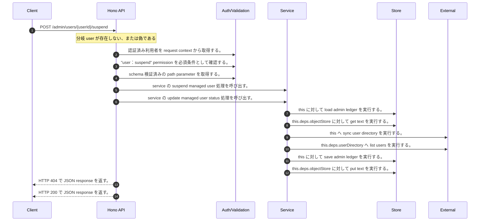

<!-- This file is generated by npm run docs:api-code. Do not edit manually. -->

# POST /admin/users/{userId}/suspend シーケンス

## シーケンス図

## 処理順とコード対応

| # | Caller | 境界 | 処理 | コード | 実装位置 |
| ---: | --- | --- | --- | --- | --- |
| 1 | `POST /admin/users/{userId}/suspend handler` | Auth | 認証済み利用者を request context から取得する。 | `c.get("user")` | `apps/api/src/routes/admin-routes.ts:165 (POST /admin/users/{userId}/suspend handler)` |
| 2 | `POST /admin/users/{userId}/suspend handler` | Auth | "user:suspend" permission を必須条件として確認する。 | `requirePermission(actor, "user:suspend")` | `apps/api/src/routes/admin-routes.ts:166 (POST /admin/users/{userId}/suspend handler)` |
| 3 | `POST /admin/users/{userId}/suspend handler` | Validation | schema 検証済みの path parameter を取得する。 | `validParam<{ userId: string }>(c)` | `apps/api/src/routes/admin-routes.ts:167 (POST /admin/users/{userId}/suspend handler)` |
| 4 | `POST /admin/users/{userId}/suspend handler` | Service | service の suspend managed user 処理を呼び出す。 | `service.suspendManagedUser(actor, userId)` | `apps/api/src/routes/admin-routes.ts:168 (POST /admin/users/{userId}/suspend handler)` |
| 5 | `MemoRagService.suspendManagedUser` | Service | service の update managed user status 処理を呼び出す。 | `this.updateManagedUserStatus(actor, userId, "suspended")` | `apps/api/src/rag/memorag-service.ts:905 (MemoRagService.suspendManagedUser)` |
| 6 | `MemoRagService.updateManagedUserStatus` | Store | `this` に対して load admin ledger を実行する。 | `this.loadAdminLedger(actor, { syncUserDirectory: true })` | `apps/api/src/rag/memorag-service.ts:1499 (MemoRagService.updateManagedUserStatus)` |
| 7 | `MemoRagService.loadAdminLedger` | Store | `this.deps.objectStore` に対して get text を実行する。 | `this.deps.objectStore.getText(adminLedgerKey)` | `apps/api/src/rag/memorag-service.ts:1515 (MemoRagService.loadAdminLedger)` |
| 8 | `MemoRagService.loadAdminLedger` | External | `this` へ sync user directory を実行する。 | `this.syncUserDirectory(db)` | `apps/api/src/rag/memorag-service.ts:1556 (MemoRagService.loadAdminLedger)` |
| 9 | `MemoRagService.syncUserDirectory` | External | `this.deps.userDirectory` へ list users を実行する。 | `this.deps.userDirectory.listUsers()` | `apps/api/src/rag/memorag-service.ts:1563 (MemoRagService.syncUserDirectory)` |
| 10 | `MemoRagService.updateManagedUserStatus` | Store | `this` に対して save admin ledger を実行する。 | `this.saveAdminLedger(db)` | `apps/api/src/rag/memorag-service.ts:1508 (MemoRagService.updateManagedUserStatus)` |
| 11 | `MemoRagService.saveAdminLedger` | Store | `this.deps.objectStore` に対して put text を実行する。 | `this.deps.objectStore.putText(adminLedgerKey, JSON.stringify(db, null, 2), "application/json")` | `apps/api/src/rag/memorag-service.ts:1598 (MemoRagService.saveAdminLedger)` |
| 12 | `POST /admin/users/{userId}/suspend handler` | HTTP/SSE | HTTP 404 で JSON response を返す。 | `c.json({ error: "User not found" }, 404)` | `apps/api/src/routes/admin-routes.ts:169 (POST /admin/users/{userId}/suspend handler)` |
| 13 | `POST /admin/users/{userId}/suspend handler` | HTTP/SSE | HTTP 200 で JSON response を返す。 | `c.json(user, 200)` | `apps/api/src/routes/admin-routes.ts:170 (POST /admin/users/{userId}/suspend handler)` |

## 分岐

| ID | Function | 条件 | 実装位置 |
| --- | --- | --- | --- |
| B001 | `POST /admin/users/{userId}/suspend handler` | `user` が存在しない、または偽である | `apps/api/src/routes/admin-routes.ts:169 (POST /admin/users/{userId}/suspend handler)` |
| B002 | `requirePermission` | 利用者が 指定された permission を持たない | `apps/api/src/authorization.ts:267 (requirePermission)` |
