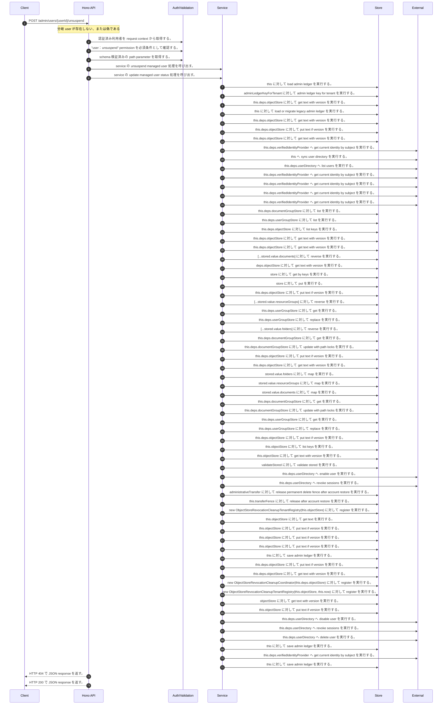

<!-- This file is generated by npm run docs:api-code. Do not edit manually. -->

# POST /admin/users/{userId}/unsuspend シーケンス

## シーケンス図

## 処理順とコード対応

| # | Caller | 境界 | 処理 | コード | 実装位置 |
| ---: | --- | --- | --- | --- | --- |
| 1 | `POST /admin/users/{userId}/unsuspend handler` | Auth | 認証済み利用者を request context から取得する。 | `c.get("user")` | `apps/api/src/routes/admin-routes.ts:307 (POST /admin/users/{userId}/unsuspend handler)` |
| 2 | `POST /admin/users/{userId}/unsuspend handler` | Auth | "user:unsuspend" permission を必須条件として確認する。 | `requirePermission(actor, "user:unsuspend")` | `apps/api/src/routes/admin-routes.ts:308 (POST /admin/users/{userId}/unsuspend handler)` |
| 3 | `POST /admin/users/{userId}/unsuspend handler` | Validation | schema 検証済みの path parameter を取得する。 | `validParam<{ userId: string }>(c)` | `apps/api/src/routes/admin-routes.ts:309 (POST /admin/users/{userId}/unsuspend handler)` |
| 4 | `POST /admin/users/{userId}/unsuspend handler` | Service | service の unsuspend managed user 処理を呼び出す。 | `service.unsuspendManagedUser(actor, userId)` | `apps/api/src/routes/admin-routes.ts:310 (POST /admin/users/{userId}/unsuspend handler)` |
| 5 | `MemoRagService.unsuspendManagedUser` | Service | service の update managed user status 処理を呼び出す。 | `this.updateManagedUserStatus(actor, userId, "active")` | `apps/api/src/rag/memorag-service.ts:2253 (MemoRagService.unsuspendManagedUser)` |
| 6 | `MemoRagService.updateManagedUserStatus` | Store | `this` に対して load admin ledger を実行する。 | `this.loadAdminLedger(actor, { syncUserDirectory: true })` | `apps/api/src/rag/memorag-service.ts:3241 (MemoRagService.updateManagedUserStatus)` |
| 7 | `MemoRagService.loadAdminLedger` | Store | `adminLedgerKeyForTenant` に対して admin ledger key for tenant を実行する。 | `adminLedgerKeyForTenant(tenantId)` | `apps/api/src/rag/memorag-service.ts:3491 (MemoRagService.loadAdminLedger)` |
| 8 | `MemoRagService.loadAdminLedger` | Store | `this.deps.objectStore` に対して get text with version を実行する。 | `this.deps.objectStore.getTextWithVersion(storageKey)` | `apps/api/src/rag/memorag-service.ts:3493 (MemoRagService.loadAdminLedger)` |
| 9 | `MemoRagService.loadAdminLedger` | Store | `this` に対して load or migrate legacy admin ledger を実行する。 | `this.loadOrMigrateLegacyAdminLedger(tenantId, storageKey)` | `apps/api/src/rag/memorag-service.ts:3498 (MemoRagService.loadAdminLedger)` |
| 10 | `MemoRagService.loadOrMigrateLegacyAdminLedger` | Store | `this.deps.objectStore` に対して get text with version を実行する。 | `this.deps.objectStore.getTextWithVersion(legacyAdminLedgerKey)` | `apps/api/src/rag/memorag-service.ts:3560 (MemoRagService.loadOrMigrateLegacyAdminLedger)` |
| 11 | `MemoRagService.loadOrMigrateLegacyAdminLedger` | Store | `this.deps.objectStore` に対して put text if version を実行する。 | `this.deps.objectStore.putTextIfVersion(storageKey, serialized, undefined, "application/json")` | `apps/api/src/rag/memorag-service.ts:3574 (MemoRagService.loadOrMigrateLegacyAdminLedger)` |
| 12 | `MemoRagService.loadOrMigrateLegacyAdminLedger` | Store | `this.deps.objectStore` に対して get text with version を実行する。 | `this.deps.objectStore.getTextWithVersion(storageKey)` | `apps/api/src/rag/memorag-service.ts:3578 (MemoRagService.loadOrMigrateLegacyAdminLedger)` |
| 13 | `MemoRagService.loadAdminLedger` | External | `this.deps.verifiedIdentityProvider` へ get current identity by subject を実行する。 | `this.deps.verifiedIdentityProvider.getCurrentIdentityBySubject(actor.userId)` | `apps/api/src/rag/memorag-service.ts:3505 (MemoRagService.loadAdminLedger)` |
| 14 | `MemoRagService.loadAdminLedger` | External | `this` へ sync user directory を実行する。 | `this.syncUserDirectory(db, authoritativeActorTenantId(actor))` | `apps/api/src/rag/memorag-service.ts:3547 (MemoRagService.loadAdminLedger)` |
| 15 | `MemoRagService.syncUserDirectory` | External | `this.deps.userDirectory` へ list users を実行する。 | `this.deps.userDirectory.listUsers()` | `apps/api/src/rag/memorag-service.ts:3585 (MemoRagService.syncUserDirectory)` |
| 16 | `MemoRagService.syncUserDirectory` | External | `this.deps.verifiedIdentityProvider` へ get current identity by subject を実行する。 | `this.deps.verifiedIdentityProvider.getCurrentIdentityBySubject(directoryUser.userId)` | `apps/api/src/rag/memorag-service.ts:3590 (MemoRagService.syncUserDirectory)` |
| 17 | `MemoRagService.updateManagedUserStatus` | External | `this.deps.verifiedIdentityProvider` へ get current identity by subject を実行する。 | `this.deps.verifiedIdentityProvider.getCurrentIdentityBySubject(actor.userId)` | `apps/api/src/rag/memorag-service.ts:3249 (MemoRagService.updateManagedUserStatus)` |
| 18 | `MemoRagService.updateManagedUserStatus` | External | `this.deps.verifiedIdentityProvider` へ get current identity by subject を実行する。 | `this.deps.verifiedIdentityProvider.getCurrentIdentityBySubject(userId)` | `apps/api/src/rag/memorag-service.ts:3250 (MemoRagService.updateManagedUserStatus)` |
| 19 | `MemoRagService.updateManagedUserStatus` | External | `this.deps.verifiedIdentityProvider` へ get current identity by subject を実行する。 | `this.deps.verifiedIdentityProvider.getCurrentIdentityBySubject(input.successorUserId)` | `apps/api/src/rag/memorag-service.ts:3288 (MemoRagService.updateManagedUserStatus)` |
| 20 | `AdministrativePrincipalTransferService.inventory` | Store | `this.deps.documentGroupStore` に対して list を実行する。 | `this.deps.documentGroupStore.list(tenantId)` | `apps/api/src/security/administrative-principal-transfer-service.ts:529 (AdministrativePrincipalTransferService.inventory)` |
| 21 | `AdministrativePrincipalTransferService.inventory` | Store | `this.deps.userGroupStore` に対して list を実行する。 | `this.deps.userGroupStore.list(tenantId)` | `apps/api/src/security/administrative-principal-transfer-service.ts:530 (AdministrativePrincipalTransferService.inventory)` |
| 22 | `AdministrativePrincipalTransferService.inventory` | Store | `this.deps.objectStore` に対して list keys を実行する。 | `this.deps.objectStore.listKeys(tenantManifestPrefix(this.deps, tenantId))` | `apps/api/src/security/administrative-principal-transfer-service.ts:531 (AdministrativePrincipalTransferService.inventory)` |
| 23 | `AdministrativePrincipalTransferService.inventory` | Store | `this.deps.objectStore` に対して get text with version を実行する。 | `this.deps.objectStore.getTextWithVersion(key)` | `apps/api/src/security/administrative-principal-transfer-service.ts:537 (AdministrativePrincipalTransferService.inventory)` |
| 24 | `AdministrativePrincipalTransferService.readState` | Store | `this.deps.objectStore` に対して get text with version を実行する。 | `this.deps.objectStore.getTextWithVersion(key)` | `apps/api/src/security/administrative-principal-transfer-service.ts:702 (AdministrativePrincipalTransferService.readState)` |
| 25 | `AdministrativePrincipalTransferService.rollback` | Store | `[...stored.value.documents]` に対して reverse を実行する。 | `[...stored.value.documents].reverse()` | `apps/api/src/security/administrative-principal-transfer-service.ts:610 (AdministrativePrincipalTransferService.rollback)` |
| 26 | `readManifest` | Store | `deps.objectStore` に対して get text with version を実行する。 | `deps.objectStore.getTextWithVersion(key)` | `apps/api/src/security/administrative-principal-transfer-service.ts:796 (readManifest)` |
| 27 | `rewriteVectorOwners` | Store | `store` に対して get by keys を実行する。 | `store.getByKeys(keys)` | `apps/api/src/security/administrative-principal-transfer-service.ts:779 (rewriteVectorOwners)` |
| 28 | `rewriteVectorOwners` | Store | `store` に対して put を実行する。 | `store.put(records.map((record): VectorRecord => ({ ...record, metadata: transferVectorOwner(record.metadata, ownerUserId, manifest) })))` | `apps/api/src/security/administrative-principal-transfer-service.ts:782 (rewriteVectorOwners)` |
| 29 | `AdministrativePrincipalTransferService.rollbackDocument` | Store | `this.deps.objectStore` に対して put text if version を実行する。 | `this.deps.objectStore.putTextIfVersion( transfer.source.manifestObjectKey, JSON.stringify(transfer.source, null, 2), current.version, "application/json" )` | `apps/api/src/security/administrative-principal-transfer-service.ts:662 (AdministrativePrincipalTransferService.rollbackDocument)` |
| 30 | `AdministrativePrincipalTransferService.rollback` | Store | `[...stored.value.resourceGroups]` に対して reverse を実行する。 | `[...stored.value.resourceGroups].reverse()` | `apps/api/src/security/administrative-principal-transfer-service.ts:613 (AdministrativePrincipalTransferService.rollback)` |
| 31 | `AdministrativePrincipalTransferService.rollbackResourceGroup` | Store | `this.deps.userGroupStore` に対して get を実行する。 | `this.deps.userGroupStore.get(requiredUserGroupTenantId(transfer.source), transfer.source.groupId)` | `apps/api/src/security/administrative-principal-transfer-service.ts:643 (AdministrativePrincipalTransferService.rollbackResourceGroup)` |
| 32 | `AdministrativePrincipalTransferService.rollbackResourceGroup` | Store | `this.deps.userGroupStore` に対して replace を実行する。 | `this.deps.userGroupStore.replace(transfer.source, transfer.target.updatedAt)` | `apps/api/src/security/administrative-principal-transfer-service.ts:648 (AdministrativePrincipalTransferService.rollbackResourceGroup)` |
| 33 | `AdministrativePrincipalTransferService.rollback` | Store | `[...stored.value.folders]` に対して reverse を実行する。 | `[...stored.value.folders].reverse()` | `apps/api/src/security/administrative-principal-transfer-service.ts:616 (AdministrativePrincipalTransferService.rollback)` |
| 34 | `AdministrativePrincipalTransferService.rollbackFolder` | Store | `this.deps.documentGroupStore` に対して get を実行する。 | `this.deps.documentGroupStore.get(transfer.source.tenantId, transfer.source.groupId)` | `apps/api/src/security/administrative-principal-transfer-service.ts:636 (AdministrativePrincipalTransferService.rollbackFolder)` |
| 35 | `AdministrativePrincipalTransferService.rollbackFolder` | Store | `this.deps.documentGroupStore` に対して update with path locks を実行する。 | `this.deps.documentGroupStore.updateWithPathLocks(transfer.source.tenantId, [{ current, next: transfer.source }])` | `apps/api/src/security/administrative-principal-transfer-service.ts:639 (AdministrativePrincipalTransferService.rollbackFolder)` |
| 36 | `AdministrativePrincipalTransferService.writeState` | Store | `this.deps.objectStore` に対して put text if version を実行する。 | `this.deps.objectStore.putTextIfVersion(key, JSON.stringify(value, null, 2), expectedVersion, "application/json")` | `apps/api/src/security/administrative-principal-transfer-service.ts:711 (AdministrativePrincipalTransferService.writeState)` |
| 37 | `AdministrativePrincipalTransferService.writeState` | Store | `this.deps.objectStore` に対して get text with version を実行する。 | `this.deps.objectStore.getTextWithVersion(key)` | `apps/api/src/security/administrative-principal-transfer-service.ts:712 (AdministrativePrincipalTransferService.writeState)` |
| 38 | `AdministrativePrincipalTransferService.mergeInventory` | Store | `stored.value.folders` に対して map を実行する。 | `stored.value.folders.map((entry) => entry.source.groupId)` | `apps/api/src/security/administrative-principal-transfer-service.ts:473 (AdministrativePrincipalTransferService.mergeInventory)` |
| 39 | `AdministrativePrincipalTransferService.mergeInventory` | Store | `stored.value.resourceGroups` に対して map を実行する。 | `stored.value.resourceGroups.map((entry) => entry.source.groupId)` | `apps/api/src/security/administrative-principal-transfer-service.ts:474 (AdministrativePrincipalTransferService.mergeInventory)` |
| 40 | `AdministrativePrincipalTransferService.mergeInventory` | Store | `stored.value.documents` に対して map を実行する。 | `stored.value.documents.map((entry) => entry.source.manifestObjectKey)` | `apps/api/src/security/administrative-principal-transfer-service.ts:475 (AdministrativePrincipalTransferService.mergeInventory)` |
| 41 | `AdministrativePrincipalTransferService.applyFolder` | Store | `this.deps.documentGroupStore` に対して get を実行する。 | `this.deps.documentGroupStore.get(transfer.source.tenantId, transfer.source.groupId)` | `apps/api/src/security/administrative-principal-transfer-service.ts:561 (AdministrativePrincipalTransferService.applyFolder)` |
| 42 | `AdministrativePrincipalTransferService.applyFolder` | Store | `this.deps.documentGroupStore` に対して update with path locks を実行する。 | `this.deps.documentGroupStore.updateWithPathLocks(transfer.source.tenantId, [{ current, next: transfer.target }])` | `apps/api/src/security/administrative-principal-transfer-service.ts:567 (AdministrativePrincipalTransferService.applyFolder)` |
| 43 | `AdministrativePrincipalTransferService.applyResourceGroup` | Store | `this.deps.userGroupStore` に対して get を実行する。 | `this.deps.userGroupStore.get(requiredUserGroupTenantId(transfer.source), transfer.source.groupId)` | `apps/api/src/security/administrative-principal-transfer-service.ts:571 (AdministrativePrincipalTransferService.applyResourceGroup)` |
| 44 | `AdministrativePrincipalTransferService.applyResourceGroup` | Store | `this.deps.userGroupStore` に対して replace を実行する。 | `this.deps.userGroupStore.replace(transfer.target, transfer.source.updatedAt)` | `apps/api/src/security/administrative-principal-transfer-service.ts:577 (AdministrativePrincipalTransferService.applyResourceGroup)` |
| 45 | `AdministrativePrincipalTransferService.applyDocument` | Store | `this.deps.objectStore` に対して put text if version を実行する。 | `this.deps.objectStore.putTextIfVersion( transfer.target.manifestObjectKey, JSON.stringify(transfer.target, null, 2), transfer.sourceVersion, "application/json" )` | `apps/api/src/security/administrative-principal-transfer-service.ts:591 (AdministrativePrincipalTransferService.applyDocument)` |
| 46 | `ObjectStoreRevocationCleanupRepairOutbox.assertResourceFenceReleased` | Store | `this.objectStore` に対して list keys を実行する。 | `this.objectStore.listKeys(prefix)` | `apps/api/src/rag/_shared/security/revocation-cleanup-repair-outbox.ts:109 (ObjectStoreRevocationCleanupRepairOutbox.assertResourceFenceReleased)` |
| 47 | `ObjectStoreRevocationCleanupRepairOutbox.read` | Store | `this.objectStore` に対して get text with version を実行する。 | `this.objectStore.getTextWithVersion(key)` | `apps/api/src/rag/_shared/security/revocation-cleanup-repair-outbox.ts:163 (ObjectStoreRevocationCleanupRepairOutbox.read)` |
| 48 | `ObjectStoreRevocationCleanupRepairOutbox.read` | Store | `validateStored` に対して validate stored を実行する。 | `validateStored(value)` | `apps/api/src/rag/_shared/security/revocation-cleanup-repair-outbox.ts:165 (ObjectStoreRevocationCleanupRepairOutbox.read)` |
| 49 | `MemoRagService.updateManagedUserStatus` | External | `this.deps.userDirectory` へ enable user を実行する。 | `this.deps.userDirectory.enableUser(currentTarget.username)` | `apps/api/src/rag/memorag-service.ts:3329 (MemoRagService.updateManagedUserStatus)` |
| 50 | `MemoRagService.updateManagedUserStatus` | External | `this.deps.userDirectory` へ revoke sessions を実行する。 | `this.deps.userDirectory.revokeSessions(currentTarget.username)` | `apps/api/src/rag/memorag-service.ts:3330 (MemoRagService.updateManagedUserStatus)` |
| 51 | `MemoRagService.updateManagedUserStatus` | Store | `administrativeTransfer` に対して release permanent delete fence after account restore を実行する。 | `administrativeTransfer.releasePermanentDeleteFenceAfterAccountRestore({ tenantId: currentTarget.tenantId, sourceUserId: currentTarget.userId })` | `apps/api/src/rag/memorag-service.ts:3338 (MemoRagService.updateManagedUserStatus)` |
| 52 | `AdministrativePrincipalTransferService.releasePermanentDeleteFenceAfterAccountRestore` | Store | `this.transferFence` に対して release after account restore を実行する。 | `this.transferFence.releaseAfterAccountRestore(input)` | `apps/api/src/security/administrative-principal-transfer-service.ts:147 (AdministrativePrincipalTransferService.releasePermanentDeleteFenceAfterAccountRestore)` |
| 53 | `ObjectStoreRevocationCleanupRepairOutbox.prepare` | Store | `new ObjectStoreRevocationCleanupTenantRegistry(this.objectStore)` に対して register を実行する。 | `new ObjectStoreRevocationCleanupTenantRegistry(this.objectStore).register(registration.tenantId)` | `apps/api/src/rag/_shared/security/revocation-cleanup-repair-outbox.ts:54 (ObjectStoreRevocationCleanupRepairOutbox.prepare)` |
| 54 | `ObjectStoreRevocationCleanupTenantRegistry.read` | Store | `this.objectStore` に対して get text を実行する。 | `this.objectStore.getText(key)` | `apps/api/src/rag/_shared/security/revocation-cleanup-tenant-registry.ts:116 (ObjectStoreRevocationCleanupTenantRegistry.read)` |
| 55 | `ObjectStoreRevocationCleanupTenantRegistry.register` | Store | `this.objectStore` に対して put text if version を実行する。 | `this.objectStore.putTextIfVersion(key, JSON.stringify(record, null, 2), undefined, "application/json")` | `apps/api/src/rag/_shared/security/revocation-cleanup-tenant-registry.ts:41 (ObjectStoreRevocationCleanupTenantRegistry.register)` |
| 56 | `ObjectStoreRevocationCleanupRepairOutbox.prepare` | Store | `this.objectStore` に対して put text if version を実行する。 | `this.objectStore.putTextIfVersion(key, JSON.stringify(intent, null, 2), undefined, "application/json")` | `apps/api/src/rag/_shared/security/revocation-cleanup-repair-outbox.ts:74 (ObjectStoreRevocationCleanupRepairOutbox.prepare)` |
| 57 | `ObjectStoreRevocationCleanupRepairOutbox.transition` | Store | `this.objectStore` に対して put text if version を実行する。 | `this.objectStore.putTextIfVersion(key, JSON.stringify(next, null, 2), stored.version, "application/json")` | `apps/api/src/rag/_shared/security/revocation-cleanup-repair-outbox.ts:152 (ObjectStoreRevocationCleanupRepairOutbox.transition)` |
| 58 | `MemoRagService.updateManagedUserStatus` | Store | `this` に対して save admin ledger を実行する。 | `this.saveAdminLedger(db)` | `apps/api/src/rag/memorag-service.ts:3407 (MemoRagService.updateManagedUserStatus)` |
| 59 | `MemoRagService.saveAdminLedger` | Store | `this.deps.objectStore` に対して put text if version を実行する。 | `this.deps.objectStore.putTextIfVersion( _storageKey, serialized, _storeVersion, "application/json" )` | `apps/api/src/rag/memorag-service.ts:3638 (MemoRagService.saveAdminLedger)` |
| 60 | `MemoRagService.saveAdminLedger` | Store | `this.deps.objectStore` に対して get text with version を実行する。 | `this.deps.objectStore.getTextWithVersion(_storageKey)` | `apps/api/src/rag/memorag-service.ts:3650 (MemoRagService.saveAdminLedger)` |
| 61 | `MemoRagService.updateManagedUserStatus` | Store | `new ObjectStoreRevocationCleanupCoordinator(this.deps.objectStore)` に対して register を実行する。 | `new ObjectStoreRevocationCleanupCoordinator(this.deps.objectStore).register(committedRepair.cleanupRegistration)` | `apps/api/src/rag/memorag-service.ts:3408 (MemoRagService.updateManagedUserStatus)` |
| 62 | `ObjectStoreRevocationCleanupCoordinator.register` | Store | `new ObjectStoreRevocationCleanupTenantRegistry(this.objectStore, this.now)` に対して register を実行する。 | `new ObjectStoreRevocationCleanupTenantRegistry(this.objectStore, this.now).register(normalized.tenantId)` | `apps/api/src/rag/_shared/security/revocation-cleanup-coordinator.ts:137 (ObjectStoreRevocationCleanupCoordinator.register)` |
| 63 | `readManifest` | Store | `objectStore` に対して get text with version を実行する。 | `objectStore.getTextWithVersion(key)` | `apps/api/src/rag/_shared/security/revocation-cleanup-coordinator.ts:636 (readManifest)` |
| 64 | `ObjectStoreRevocationCleanupCoordinator.register` | Store | `this.objectStore` に対して put text if version を実行する。 | `this.objectStore.putTextIfVersion(key, JSON.stringify(manifest, null, 2), undefined, "application/json")` | `apps/api/src/rag/_shared/security/revocation-cleanup-coordinator.ts:169 (ObjectStoreRevocationCleanupCoordinator.register)` |
| 65 | `MemoRagService.updateManagedUserStatus` | External | `this.deps.userDirectory` へ disable user を実行する。 | `this.deps.userDirectory.disableUser(currentTarget.username)` | `apps/api/src/rag/memorag-service.ts:3413 (MemoRagService.updateManagedUserStatus)` |
| 66 | `MemoRagService.updateManagedUserStatus` | External | `this.deps.userDirectory` へ revoke sessions を実行する。 | `this.deps.userDirectory.revokeSessions(currentTarget.username)` | `apps/api/src/rag/memorag-service.ts:3414 (MemoRagService.updateManagedUserStatus)` |
| 67 | `MemoRagService.updateManagedUserStatus` | External | `this.deps.userDirectory` へ delete user を実行する。 | `this.deps.userDirectory.deleteUser(currentTarget.username)` | `apps/api/src/rag/memorag-service.ts:3417 (MemoRagService.updateManagedUserStatus)` |
| 68 | `MemoRagService.updateManagedUserStatus` | Store | `this` に対して save admin ledger を実行する。 | `this.saveAdminLedger(db)` | `apps/api/src/rag/memorag-service.ts:3424 (MemoRagService.updateManagedUserStatus)` |
| 69 | `MemoRagService.updateManagedUserStatus` | External | `this.deps.verifiedIdentityProvider` へ get current identity by subject を実行する。 | `this.deps.verifiedIdentityProvider.getCurrentIdentityBySubject(userId)` | `apps/api/src/rag/memorag-service.ts:3441 (MemoRagService.updateManagedUserStatus)` |
| 70 | `MemoRagService.updateManagedUserStatus` | Store | `this` に対して save admin ledger を実行する。 | `this.saveAdminLedger(db)` | `apps/api/src/rag/memorag-service.ts:3477 (MemoRagService.updateManagedUserStatus)` |
| 71 | `POST /admin/users/{userId}/unsuspend handler` | HTTP/SSE | HTTP 404 で JSON response を返す。 | `c.json({ error: "User not found" }, 404)` | `apps/api/src/routes/admin-routes.ts:311 (POST /admin/users/{userId}/unsuspend handler)` |
| 72 | `POST /admin/users/{userId}/unsuspend handler` | HTTP/SSE | HTTP 200 で JSON response を返す。 | `c.json(user, 200)` | `apps/api/src/routes/admin-routes.ts:312 (POST /admin/users/{userId}/unsuspend handler)` |

## 分岐

| ID | Function | 条件 | 実装位置 |
| --- | --- | --- | --- |
| B001 | `POST /admin/users/{userId}/unsuspend handler` | `user` が存在しない、または偽である | `apps/api/src/routes/admin-routes.ts:311 (POST /admin/users/{userId}/unsuspend handler)` |
| B002 | `requirePermission` | 利用者が 指定された permission を持たない | `apps/api/src/authorization.ts:184 (requirePermission)` |
