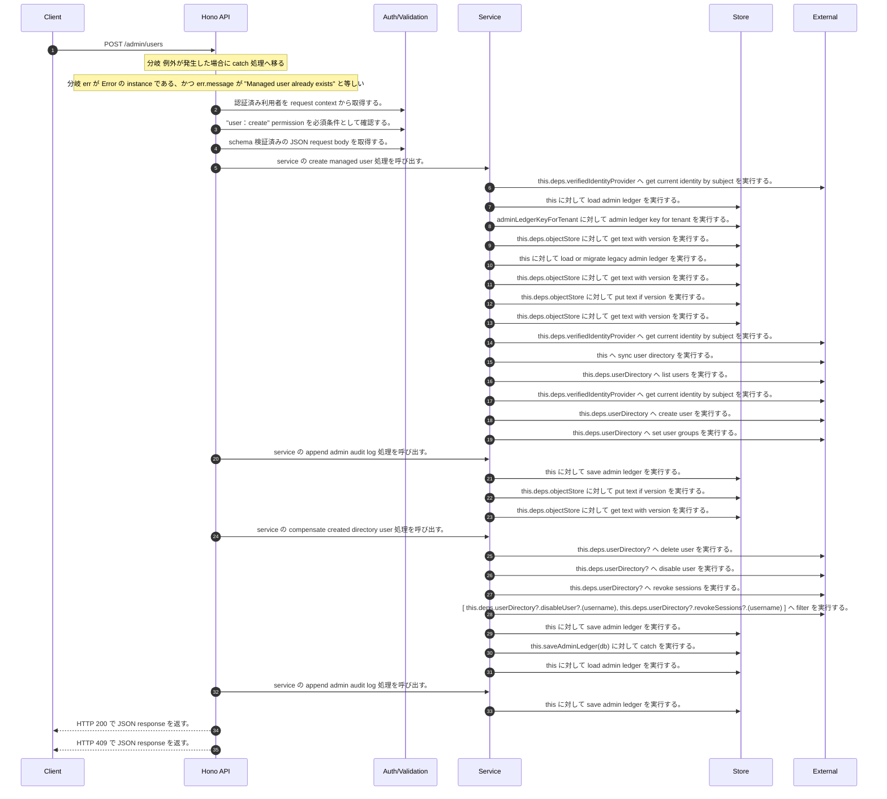

<!-- This file is generated by npm run docs:api-code. Do not edit manually. -->

# POST /admin/users シーケンス

## シーケンス図

## 処理順とコード対応

| # | Caller | 境界 | 処理 | コード | 実装位置 |
| ---: | --- | --- | --- | --- | --- |
| 1 | `POST /admin/users handler` | Auth | 認証済み利用者を request context から取得する。 | `c.get("user")` | `apps/api/src/routes/admin-routes.ts:63 (POST /admin/users handler)` |
| 2 | `POST /admin/users handler` | Auth | "user:create" permission を必須条件として確認する。 | `requirePermission(actor, "user:create")` | `apps/api/src/routes/admin-routes.ts:64 (POST /admin/users handler)` |
| 3 | `POST /admin/users handler` | Validation | schema 検証済みの JSON request body を取得する。 | `validJson<z.infer<typeof CreateManagedUserRequestSchema>>(c)` | `apps/api/src/routes/admin-routes.ts:65 (POST /admin/users handler)` |
| 4 | `POST /admin/users handler` | Service | service の create managed user 処理を呼び出す。 | `service.createManagedUser(actor, body)` | `apps/api/src/routes/admin-routes.ts:67 (POST /admin/users handler)` |
| 5 | `MemoRagService.createManagedUser` | External | `this.deps.verifiedIdentityProvider` へ get current identity by subject を実行する。 | `this.deps.verifiedIdentityProvider.getCurrentIdentityBySubject(actor.userId)` | `apps/api/src/rag/memorag-service.ts:1915 (MemoRagService.createManagedUser)` |
| 6 | `MemoRagService.createManagedUser` | Store | `this` に対して load admin ledger を実行する。 | `this.loadAdminLedger(currentActorUser, { syncUserDirectory: true })` | `apps/api/src/rag/memorag-service.ts:1967 (MemoRagService.createManagedUser)` |
| 7 | `MemoRagService.loadAdminLedger` | Store | `adminLedgerKeyForTenant` に対して admin ledger key for tenant を実行する。 | `adminLedgerKeyForTenant(tenantId)` | `apps/api/src/rag/memorag-service.ts:3421 (MemoRagService.loadAdminLedger)` |
| 8 | `MemoRagService.loadAdminLedger` | Store | `this.deps.objectStore` に対して get text with version を実行する。 | `this.deps.objectStore.getTextWithVersion(storageKey)` | `apps/api/src/rag/memorag-service.ts:3423 (MemoRagService.loadAdminLedger)` |
| 9 | `MemoRagService.loadAdminLedger` | Store | `this` に対して load or migrate legacy admin ledger を実行する。 | `this.loadOrMigrateLegacyAdminLedger(tenantId, storageKey)` | `apps/api/src/rag/memorag-service.ts:3428 (MemoRagService.loadAdminLedger)` |
| 10 | `MemoRagService.loadOrMigrateLegacyAdminLedger` | Store | `this.deps.objectStore` に対して get text with version を実行する。 | `this.deps.objectStore.getTextWithVersion(legacyAdminLedgerKey)` | `apps/api/src/rag/memorag-service.ts:3490 (MemoRagService.loadOrMigrateLegacyAdminLedger)` |
| 11 | `MemoRagService.loadOrMigrateLegacyAdminLedger` | Store | `this.deps.objectStore` に対して put text if version を実行する。 | `this.deps.objectStore.putTextIfVersion(storageKey, serialized, undefined, "application/json")` | `apps/api/src/rag/memorag-service.ts:3504 (MemoRagService.loadOrMigrateLegacyAdminLedger)` |
| 12 | `MemoRagService.loadOrMigrateLegacyAdminLedger` | Store | `this.deps.objectStore` に対して get text with version を実行する。 | `this.deps.objectStore.getTextWithVersion(storageKey)` | `apps/api/src/rag/memorag-service.ts:3508 (MemoRagService.loadOrMigrateLegacyAdminLedger)` |
| 13 | `MemoRagService.loadAdminLedger` | External | `this.deps.verifiedIdentityProvider` へ get current identity by subject を実行する。 | `this.deps.verifiedIdentityProvider.getCurrentIdentityBySubject(actor.userId)` | `apps/api/src/rag/memorag-service.ts:3435 (MemoRagService.loadAdminLedger)` |
| 14 | `MemoRagService.loadAdminLedger` | External | `this` へ sync user directory を実行する。 | `this.syncUserDirectory(db, authoritativeActorTenantId(actor))` | `apps/api/src/rag/memorag-service.ts:3477 (MemoRagService.loadAdminLedger)` |
| 15 | `MemoRagService.syncUserDirectory` | External | `this.deps.userDirectory` へ list users を実行する。 | `this.deps.userDirectory.listUsers()` | `apps/api/src/rag/memorag-service.ts:3515 (MemoRagService.syncUserDirectory)` |
| 16 | `MemoRagService.syncUserDirectory` | External | `this.deps.verifiedIdentityProvider` へ get current identity by subject を実行する。 | `this.deps.verifiedIdentityProvider.getCurrentIdentityBySubject(directoryUser.userId)` | `apps/api/src/rag/memorag-service.ts:3520 (MemoRagService.syncUserDirectory)` |
| 17 | `MemoRagService.createManagedUser` | External | `this.deps.userDirectory` へ create user を実行する。 | `this.deps.userDirectory.createUser({ username, email, displayName })` | `apps/api/src/rag/memorag-service.ts:1971 (MemoRagService.createManagedUser)` |
| 18 | `MemoRagService.createManagedUser` | External | `this.deps.userDirectory` へ set user groups を実行する。 | `this.deps.userDirectory.setUserGroups(created.username, groups)` | `apps/api/src/rag/memorag-service.ts:1973 (MemoRagService.createManagedUser)` |
| 19 | `MemoRagService.createManagedUser` | Service | service の append admin audit log 処理を呼び出す。 | `this.appendAdminAuditLog(db, currentActorUser, user, "user:create", undefined, user.status, [], user.groups, now)` | `apps/api/src/rag/memorag-service.ts:1991 (MemoRagService.createManagedUser)` |
| 20 | `MemoRagService.createManagedUser` | Store | `this` に対して save admin ledger を実行する。 | `this.saveAdminLedger(db)` | `apps/api/src/rag/memorag-service.ts:1992 (MemoRagService.createManagedUser)` |
| 21 | `MemoRagService.saveAdminLedger` | Store | `this.deps.objectStore` に対して put text if version を実行する。 | `this.deps.objectStore.putTextIfVersion( _storageKey, serialized, _storeVersion, "application/json" )` | `apps/api/src/rag/memorag-service.ts:3568 (MemoRagService.saveAdminLedger)` |
| 22 | `MemoRagService.saveAdminLedger` | Store | `this.deps.objectStore` に対して get text with version を実行する。 | `this.deps.objectStore.getTextWithVersion(_storageKey)` | `apps/api/src/rag/memorag-service.ts:3580 (MemoRagService.saveAdminLedger)` |
| 23 | `MemoRagService.createManagedUser` | Service | service の compensate created directory user 処理を呼び出す。 | `this.compensateCreatedDirectoryUser(created.username)` | `apps/api/src/rag/memorag-service.ts:2002 (MemoRagService.createManagedUser)` |
| 24 | `MemoRagService.compensateCreatedDirectoryUser` | External | `this.deps.userDirectory?` へ delete user を実行する。 | `this.deps.userDirectory?.deleteUser?.(username)` | `apps/api/src/rag/memorag-service.ts:3587 (MemoRagService.compensateCreatedDirectoryUser)` |
| 25 | `MemoRagService.compensateCreatedDirectoryUser` | External | `this.deps.userDirectory?` へ disable user を実行する。 | `this.deps.userDirectory?.disableUser?.(username)` | `apps/api/src/rag/memorag-service.ts:3594 (MemoRagService.compensateCreatedDirectoryUser)` |
| 26 | `MemoRagService.compensateCreatedDirectoryUser` | External | `this.deps.userDirectory?` へ revoke sessions を実行する。 | `this.deps.userDirectory?.revokeSessions?.(username)` | `apps/api/src/rag/memorag-service.ts:3595 (MemoRagService.compensateCreatedDirectoryUser)` |
| 27 | `MemoRagService.compensateCreatedDirectoryUser` | External | `[       this.deps.userDirectory?.disableUser?.(username),       this.deps.userDirectory?.revokeSessions?.(username)     ]` へ filter を実行する。 | `[ this.deps.userDirectory?.disableUser?.(username), this.deps.userDirectory?.revokeSessions?.(username) ].filter((operation): operation is Promise<void> => operation !== undefined)` | `apps/api/src/rag/memorag-service.ts:3593 (MemoRagService.compensateCreatedDirectoryUser)` |
| 28 | `MemoRagService.createManagedUser` | Store | `this` に対して save admin ledger を実行する。 | `this.saveAdminLedger(db)` | `apps/api/src/rag/memorag-service.ts:2006 (MemoRagService.createManagedUser)` |
| 29 | `MemoRagService.createManagedUser` | Store | `this.saveAdminLedger(db)` に対して catch を実行する。 | `this.saveAdminLedger(db).catch(() => undefined)` | `apps/api/src/rag/memorag-service.ts:2006 (MemoRagService.createManagedUser)` |
| 30 | `MemoRagService.createManagedUser` | Store | `this` に対して load admin ledger を実行する。 | `this.loadAdminLedger(actor, { syncUserDirectory: true })` | `apps/api/src/rag/memorag-service.ts:2023 (MemoRagService.createManagedUser)` |
| 31 | `MemoRagService.createManagedUser` | Service | service の append admin audit log 処理を呼び出す。 | `this.appendAdminAuditLog(db, actor, user, "user:create", undefined, user.status, [], user.groups, now)` | `apps/api/src/rag/memorag-service.ts:2036 (MemoRagService.createManagedUser)` |
| 32 | `MemoRagService.createManagedUser` | Store | `this` に対して save admin ledger を実行する。 | `this.saveAdminLedger(db)` | `apps/api/src/rag/memorag-service.ts:2037 (MemoRagService.createManagedUser)` |
| 33 | `POST /admin/users handler` | HTTP/SSE | HTTP 200 で JSON response を返す。 | `c.json(await service.createManagedUser(actor, body), 200)` | `apps/api/src/routes/admin-routes.ts:67 (POST /admin/users handler)` |
| 34 | `POST /admin/users handler` | HTTP/SSE | HTTP 409 で JSON response を返す。 | `c.json({ error: "Managed user already exists" }, 409)` | `apps/api/src/routes/admin-routes.ts:70 (POST /admin/users handler)` |

## 分岐

| ID | Function | 条件 | 実装位置 |
| --- | --- | --- | --- |
| B001 | `POST /admin/users handler` | 例外が発生した場合に catch 処理へ移る | `apps/api/src/routes/admin-routes.ts:68 (POST /admin/users handler)` |
| B002 | `POST /admin/users handler` | `err` が `Error` の instance である、かつ `err.message` が `"Managed user already exists"` と等しい | `apps/api/src/routes/admin-routes.ts:69 (POST /admin/users handler)` |
| B003 | `requirePermission` | 利用者が 指定された permission を持たない | `apps/api/src/authorization.ts:184 (requirePermission)` |
| B004 | `MemoRagService.createManagedUser` | `groups.length` が `0` と等しい | `apps/api/src/rag/memorag-service.ts:1909 (MemoRagService.createManagedUser)` |
| B005 | `MemoRagService.createManagedUser` | `this.deps.verifiedIdentityProvider` が存在し、真である、かつ `this.deps.userDirectory` が存在し、真である | `apps/api/src/rag/memorag-service.ts:1911 (MemoRagService.createManagedUser)` |
| B006 | `MemoRagService.createManagedUser` | 例外が発生した場合に catch 処理へ移る | `apps/api/src/rag/memorag-service.ts:1916 (MemoRagService.createManagedUser)` |
| B007 | `MemoRagService.createManagedUser` | `tenantId` が存在しない、または偽である | `apps/api/src/rag/memorag-service.ts:1918 (MemoRagService.createManagedUser)` |
| B008 | `MemoRagService.createManagedUser` | `tenantId` が存在しない、または偽である | `apps/api/src/rag/memorag-service.ts:1934 (MemoRagService.createManagedUser)` |
| B009 | `MemoRagService.createManagedUser` | `currentActorUser` が存在しない、または偽である、または `currentActorUser.accountStatus` が `"active"` と異なる、または `currentActorUser.tenantId` が `actor.tenantId` と異なる、または 利用者が "user:create" permission を持たない | `apps/api/src/rag/memorag-service.ts:1959 (MemoRagService.createManagedUser)` |
| B010 | `MemoRagService.createManagedUser` | `this.deps.userDirectory.createUser` が存在しない、または偽である、または `this.deps.userDirectory.setUserGroups` が存在しない、または偽である、または `this.deps.userDirectory.deleteUser` が存在しない、または偽である | `apps/api/src/rag/memorag-service.ts:1964 (MemoRagService.createManagedUser)` |
| B011 | `MemoRagService.createManagedUser` | some の判定結果が真である | `apps/api/src/rag/memorag-service.ts:1968 (MemoRagService.createManagedUser)` |
| B012 | `MemoRagService.createManagedUser` | `created.status` が `"active"` と異なる | `apps/api/src/rag/memorag-service.ts:1972 (MemoRagService.createManagedUser)` |
| B013 | `MemoRagService.createManagedUser` | 例外が発生した場合に catch 処理へ移る | `apps/api/src/rag/memorag-service.ts:2000 (MemoRagService.createManagedUser)` |
| B014 | `MemoRagService.createManagedUser` | `created` が存在し、真である | `apps/api/src/rag/memorag-service.ts:2001 (MemoRagService.createManagedUser)` |
| B015 | `MemoRagService.createManagedUser` | `ledgerCommitted` が存在し、真である、かつ `db` が存在し、真である | `apps/api/src/rag/memorag-service.ts:2003 (MemoRagService.createManagedUser)` |
| B016 | `MemoRagService.createManagedUser` | `(error as Error & { status?: number }).status` が `403` と等しい | `apps/api/src/rag/memorag-service.ts:2009 (MemoRagService.createManagedUser)` |
| B017 | `MemoRagService.createManagedUser` | `error` が `Error` の instance である、かつ `error.message` が "already exists" を含む、または `error.name` が `"UsernameExistsException"` と等しい | `apps/api/src/rag/memorag-service.ts:2011 (MemoRagService.createManagedUser)` |
| B018 | `MemoRagService.createManagedUser` | `config.authEnabled` が存在し、真である | `apps/api/src/rag/memorag-service.ts:2022 (MemoRagService.createManagedUser)` |
| B019 | `MemoRagService.createManagedUser` | `existing` が存在し、真である | `apps/api/src/rag/memorag-service.ts:2025 (MemoRagService.createManagedUser)` |
