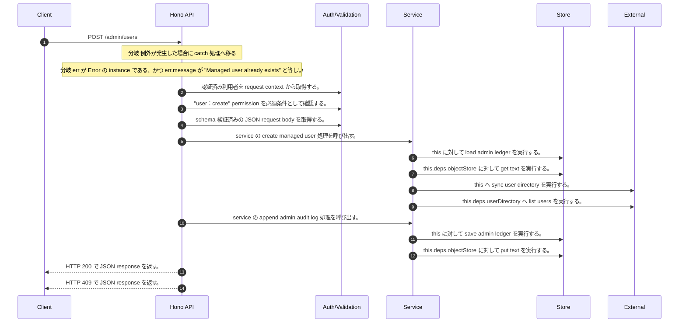

<!-- This file is generated by npm run docs:api-code. Do not edit manually. -->

# POST /admin/users シーケンス

## シーケンス図

## 処理順とコード対応

| # | Caller | 境界 | 処理 | コード | 実装位置 |
| ---: | --- | --- | --- | --- | --- |
| 1 | `POST /admin/users handler` | Auth | 認証済み利用者を request context から取得する。 | `c.get("user")` | `apps/api/src/routes/admin-routes.ts:44 (POST /admin/users handler)` |
| 2 | `POST /admin/users handler` | Auth | "user:create" permission を必須条件として確認する。 | `requirePermission(actor, "user:create")` | `apps/api/src/routes/admin-routes.ts:45 (POST /admin/users handler)` |
| 3 | `POST /admin/users handler` | Validation | schema 検証済みの JSON request body を取得する。 | `validJson<z.infer<typeof CreateManagedUserRequestSchema>>(c)` | `apps/api/src/routes/admin-routes.ts:46 (POST /admin/users handler)` |
| 4 | `POST /admin/users handler` | Service | service の create managed user 処理を呼び出す。 | `service.createManagedUser(actor, body)` | `apps/api/src/routes/admin-routes.ts:48 (POST /admin/users handler)` |
| 5 | `MemoRagService.createManagedUser` | Store | `this` に対して load admin ledger を実行する。 | `this.loadAdminLedger(actor, { syncUserDirectory: true })` | `apps/api/src/rag/memorag-service.ts:863 (MemoRagService.createManagedUser)` |
| 6 | `MemoRagService.loadAdminLedger` | Store | `this.deps.objectStore` に対して get text を実行する。 | `this.deps.objectStore.getText(adminLedgerKey)` | `apps/api/src/rag/memorag-service.ts:1515 (MemoRagService.loadAdminLedger)` |
| 7 | `MemoRagService.loadAdminLedger` | External | `this` へ sync user directory を実行する。 | `this.syncUserDirectory(db)` | `apps/api/src/rag/memorag-service.ts:1556 (MemoRagService.loadAdminLedger)` |
| 8 | `MemoRagService.syncUserDirectory` | External | `this.deps.userDirectory` へ list users を実行する。 | `this.deps.userDirectory.listUsers()` | `apps/api/src/rag/memorag-service.ts:1563 (MemoRagService.syncUserDirectory)` |
| 9 | `MemoRagService.createManagedUser` | Service | service の append admin audit log 処理を呼び出す。 | `this.appendAdminAuditLog(db, actor, user, "user:create", undefined, user.status, [], user.groups, now)` | `apps/api/src/rag/memorag-service.ts:879 (MemoRagService.createManagedUser)` |
| 10 | `MemoRagService.createManagedUser` | Store | `this` に対して save admin ledger を実行する。 | `this.saveAdminLedger(db)` | `apps/api/src/rag/memorag-service.ts:880 (MemoRagService.createManagedUser)` |
| 11 | `MemoRagService.saveAdminLedger` | Store | `this.deps.objectStore` に対して put text を実行する。 | `this.deps.objectStore.putText(adminLedgerKey, JSON.stringify(db, null, 2), "application/json")` | `apps/api/src/rag/memorag-service.ts:1598 (MemoRagService.saveAdminLedger)` |
| 12 | `POST /admin/users handler` | HTTP/SSE | HTTP 200 で JSON response を返す。 | `c.json(await service.createManagedUser(actor, body), 200)` | `apps/api/src/routes/admin-routes.ts:48 (POST /admin/users handler)` |
| 13 | `POST /admin/users handler` | HTTP/SSE | HTTP 409 で JSON response を返す。 | `c.json({ error: "Managed user already exists" }, 409)` | `apps/api/src/routes/admin-routes.ts:51 (POST /admin/users handler)` |

## 分岐

| ID | Function | 条件 | 実装位置 |
| --- | --- | --- | --- |
| B001 | `POST /admin/users handler` | 例外が発生した場合に catch 処理へ移る | `apps/api/src/routes/admin-routes.ts:49 (POST /admin/users handler)` |
| B002 | `POST /admin/users handler` | `err` が `Error` の instance である、かつ `err.message` が `"Managed user already exists"` と等しい | `apps/api/src/routes/admin-routes.ts:50 (POST /admin/users handler)` |
| B003 | `requirePermission` | 利用者が 指定された permission を持たない | `apps/api/src/authorization.ts:267 (requirePermission)` |
| B004 | `MemoRagService.createManagedUser` | `existing` が存在し、真である | `apps/api/src/rag/memorag-service.ts:866 (MemoRagService.createManagedUser)` |
| B005 | `MemoRagService.createManagedUser` | `user.groups.length` が `0` と等しい | `apps/api/src/rag/memorag-service.ts:877 (MemoRagService.createManagedUser)` |
