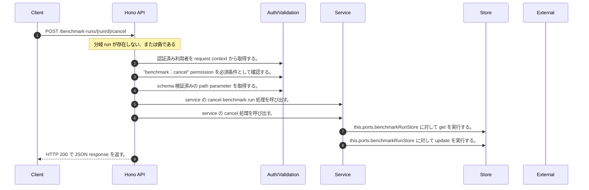

<!-- This file is generated by npm run docs:api-code. Do not edit manually. -->

# POST /benchmark-runs/{runId}/cancel シーケンス

## シーケンス図

## 処理順とコード対応

| # | Caller | 境界 | 処理 | コード | 実装位置 |
| ---: | --- | --- | --- | --- | --- |
| 1 | `POST /benchmark-runs/{runId}/cancel handler` | Auth | 認証済み利用者を request context から取得する。 | `c.get("user")` | `apps/api/src/routes/benchmark-routes.ts:188 (POST /benchmark-runs/{runId}/cancel handler)` |
| 2 | `POST /benchmark-runs/{runId}/cancel handler` | Auth | "benchmark:cancel" permission を必須条件として確認する。 | `requirePermission(actor, "benchmark:cancel")` | `apps/api/src/routes/benchmark-routes.ts:189 (POST /benchmark-runs/{runId}/cancel handler)` |
| 3 | `POST /benchmark-runs/{runId}/cancel handler` | Validation | schema 検証済みの path parameter を取得する。 | `validParam<{ runId: string }>(c)` | `apps/api/src/routes/benchmark-routes.ts:190 (POST /benchmark-runs/{runId}/cancel handler)` |
| 4 | `POST /benchmark-runs/{runId}/cancel handler` | Service | service の cancel benchmark run 処理を呼び出す。 | `service.cancelBenchmarkRun(actor, runId)` | `apps/api/src/routes/benchmark-routes.ts:191 (POST /benchmark-runs/{runId}/cancel handler)` |
| 5 | `MemoRagService.cancelBenchmarkRun` | Service | service の cancel 処理を呼び出す。 | `this.benchmarkRunCancellationService.cancel(actor, runId)` | `apps/api/src/rag/memorag-service.ts:4542 (MemoRagService.cancelBenchmarkRun)` |
| 6 | `BenchmarkRunCancellationService.cancel` | Store | `this.ports.benchmarkRunStore` に対して get を実行する。 | `this.ports.benchmarkRunStore.get(tenantId, runId)` | `apps/api/src/benchmark/benchmark-run-cancellation-service.ts:24 (BenchmarkRunCancellationService.cancel)` |
| 7 | `BenchmarkRunCancellationService.cancel` | Store | `this.ports.benchmarkRunStore` に対して update を実行する。 | `this.ports.benchmarkRunStore.update(tenantId, runId, { status: "cancelled", completedAt: this.ports.now() })` | `apps/api/src/benchmark/benchmark-run-cancellation-service.ts:34 (BenchmarkRunCancellationService.cancel)` |
| 8 | `POST /benchmark-runs/{runId}/cancel handler` | HTTP/SSE | HTTP 200 で JSON response を返す。 | `c.json(run, 200)` | `apps/api/src/routes/benchmark-routes.ts:193 (POST /benchmark-runs/{runId}/cancel handler)` |

## 分岐

| ID | Function | 条件 | 実装位置 |
| --- | --- | --- | --- |
| B001 | `POST /benchmark-runs/{runId}/cancel handler` | `run` が存在しない、または偽である | `apps/api/src/routes/benchmark-routes.ts:192 (POST /benchmark-runs/{runId}/cancel handler)` |
| B002 | `requirePermission` | 利用者が 指定された permission を持たない | `apps/api/src/authorization.ts:184 (requirePermission)` |
