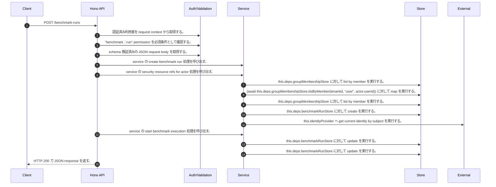

<!-- This file is generated by npm run docs:api-code. Do not edit manually. -->

# POST /benchmark-runs シーケンス

## シーケンス図

## 処理順とコード対応

| # | Caller | 境界 | 処理 | コード | 実装位置 |
| ---: | --- | --- | --- | --- | --- |
| 1 | `POST /benchmark-runs handler` | Auth | 認証済み利用者を request context から取得する。 | `c.get("user")` | `apps/api/src/routes/benchmark-routes.ts:126 (POST /benchmark-runs handler)` |
| 2 | `POST /benchmark-runs handler` | Auth | "benchmark:run" permission を必須条件として確認する。 | `requirePermission(user, "benchmark:run")` | `apps/api/src/routes/benchmark-routes.ts:127 (POST /benchmark-runs handler)` |
| 3 | `POST /benchmark-runs handler` | Validation | schema 検証済みの JSON request body を取得する。 | `validJson<z.infer<typeof CreateBenchmarkRunRequestSchema>>(c)` | `apps/api/src/routes/benchmark-routes.ts:128 (POST /benchmark-runs handler)` |
| 4 | `POST /benchmark-runs handler` | Service | service の create benchmark run 処理を呼び出す。 | `service.createBenchmarkRun(user, body)` | `apps/api/src/routes/benchmark-routes.ts:129 (POST /benchmark-runs handler)` |
| 5 | `MemoRagService.createBenchmarkRun` | Service | service の security resource refs for actor 処理を呼び出す。 | `this.securityResourceRefsForActor(user)` | `apps/api/src/rag/memorag-service.ts:4601 (MemoRagService.createBenchmarkRun)` |
| 6 | `MemoRagService.securityResourceRefsForActor` | Store | `this.deps.groupMembershipStore` に対して list by member を実行する。 | `this.deps.groupMembershipStore.listByMember(tenantId, "user", actor.userId)` | `apps/api/src/rag/memorag-service.ts:1277 (MemoRagService.securityResourceRefsForActor)` |
| 7 | `MemoRagService.securityResourceRefsForActor` | Store | `(await this.deps.groupMembershipStore.listByMember(tenantId, "user", actor.userId))       ` に対して map を実行する。 | `(await this.deps.groupMembershipStore.listByMember(tenantId, "user", actor.userId)) .map((membership) => membership.groupId)` | `apps/api/src/rag/memorag-service.ts:1277 (MemoRagService.securityResourceRefsForActor)` |
| 8 | `MemoRagService.securityResourceRefsForActor` | Store | `this.deps.groupMembershipStore` に対して list by member を実行する。 | `this.deps.groupMembershipStore.listByMember(tenantId, "group", groupId)` | `apps/api/src/rag/memorag-service.ts:1285 (MemoRagService.securityResourceRefsForActor)` |
| 9 | `MemoRagService.createBenchmarkRun` | Store | `this.deps.benchmarkRunStore` に対して create を実行する。 | `this.deps.benchmarkRunStore.create(run)` | `apps/api/src/rag/memorag-service.ts:4622 (MemoRagService.createBenchmarkRun)` |
| 10 | `CurrentWorkerAuthorization.assertAuthorized` | External | `this.identityProvider` へ get current identity by subject を実行する。 | `this.identityProvider.getCurrentIdentityBySubject(request.subject)` | `apps/api/src/security/current-worker-authorization.ts:51 (CurrentWorkerAuthorization.assertAuthorized)` |
| 11 | `MemoRagService.createBenchmarkRun` | Service | service の start benchmark execution 処理を呼び出す。 | `this.startBenchmarkExecution(run, outputPrefix)` | `apps/api/src/rag/memorag-service.ts:4629 (MemoRagService.createBenchmarkRun)` |
| 12 | `MemoRagService.createBenchmarkRun` | Store | `this.deps.benchmarkRunStore` に対して update を実行する。 | `this.deps.benchmarkRunStore.update(run.tenantId, run.runId, { executionArn })` | `apps/api/src/rag/memorag-service.ts:4631 (MemoRagService.createBenchmarkRun)` |
| 13 | `MemoRagService.createBenchmarkRun` | Store | `this.deps.benchmarkRunStore` に対して update を実行する。 | `this.deps.benchmarkRunStore.update(run.tenantId, run.runId, { status: "failed", completedAt: new Date().toISOString(), error: permissionRevoked ? "permission_revoked" : err instanceof Error ? err.message : String(err), …` | `apps/api/src/rag/memorag-service.ts:4634 (MemoRagService.createBenchmarkRun)` |
| 14 | `POST /benchmark-runs handler` | HTTP/SSE | HTTP 200 で JSON response を返す。 | `c.json(await service.createBenchmarkRun(user, body), 200)` | `apps/api/src/routes/benchmark-routes.ts:129 (POST /benchmark-runs handler)` |

## 分岐

| ID | Function | 条件 | 実装位置 |
| --- | --- | --- | --- |
| B001 | `requirePermission` | 利用者が 指定された permission を持たない | `apps/api/src/authorization.ts:185 (requirePermission)` |
| B002 | `MemoRagService.createBenchmarkRun` | `suite` が存在しない、または偽である | `apps/api/src/rag/memorag-service.ts:4584 (MemoRagService.createBenchmarkRun)` |
| B003 | `MemoRagService.createBenchmarkRun` | `(input.mode ?? suite.mode)` が `suite.mode` と異なる | `apps/api/src/rag/memorag-service.ts:4585 (MemoRagService.createBenchmarkRun)` |
| B004 | `MemoRagService.createBenchmarkRun` | `(input.runner ?? "codebuild")` が `"codebuild"` と異なる | `apps/api/src/rag/memorag-service.ts:4586 (MemoRagService.createBenchmarkRun)` |
| B005 | `MemoRagService.createBenchmarkRun` | `input.topK` が `undefined` と等しい | `apps/api/src/rag/memorag-service.ts:4606 (MemoRagService.createBenchmarkRun)` |
| B006 | `MemoRagService.createBenchmarkRun` | `suite.mode` が `"search"` と等しい | `apps/api/src/rag/memorag-service.ts:4607 (MemoRagService.createBenchmarkRun)` |
| B007 | `MemoRagService.createBenchmarkRun` | `suite.mode` が `"search"` と等しい | `apps/api/src/rag/memorag-service.ts:4610 (MemoRagService.createBenchmarkRun)` |
| B008 | `MemoRagService.createBenchmarkRun` | `config.benchmarkStateMachineArn` が存在しない、または偽である | `apps/api/src/rag/memorag-service.ts:4623 (MemoRagService.createBenchmarkRun)` |
| B009 | `MemoRagService.createBenchmarkRun` | 例外が発生した場合に catch 処理へ移る | `apps/api/src/rag/memorag-service.ts:4632 (MemoRagService.createBenchmarkRun)` |
| B010 | `MemoRagService.createBenchmarkRun` | `permissionRevoked` が存在し、真である | `apps/api/src/rag/memorag-service.ts:4637 (MemoRagService.createBenchmarkRun)` |
| B011 | `MemoRagService.createBenchmarkRun` | `err` が `Error` の instance である | `apps/api/src/rag/memorag-service.ts:4637 (MemoRagService.createBenchmarkRun)` |
| B012 | `MemoRagService.createBenchmarkRun` | `permissionRevoked` が存在し、真である | `apps/api/src/rag/memorag-service.ts:4638 (MemoRagService.createBenchmarkRun)` |
| B013 | `MemoRagService.createBenchmarkRun` | `permissionRevoked` が存在し、真である | `apps/api/src/rag/memorag-service.ts:4640 (MemoRagService.createBenchmarkRun)` |
