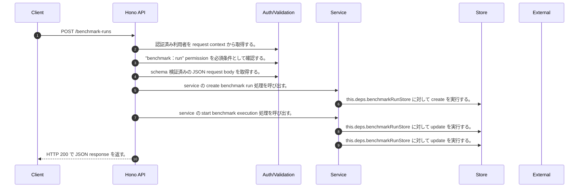

<!-- This file is generated by npm run docs:api-code. Do not edit manually. -->

# POST /benchmark-runs シーケンス

## シーケンス図

## 処理順とコード対応

| # | Caller | 境界 | 処理 | コード | 実装位置 |
| ---: | --- | --- | --- | --- | --- |
| 1 | `POST /benchmark-runs handler` | Auth | 認証済み利用者を request context から取得する。 | `c.get("user")` | `apps/api/src/routes/benchmark-routes.ts:124 (POST /benchmark-runs handler)` |
| 2 | `POST /benchmark-runs handler` | Auth | "benchmark:run" permission を必須条件として確認する。 | `requirePermission(user, "benchmark:run")` | `apps/api/src/routes/benchmark-routes.ts:125 (POST /benchmark-runs handler)` |
| 3 | `POST /benchmark-runs handler` | Validation | schema 検証済みの JSON request body を取得する。 | `validJson<z.infer<typeof CreateBenchmarkRunRequestSchema>>(c)` | `apps/api/src/routes/benchmark-routes.ts:126 (POST /benchmark-runs handler)` |
| 4 | `POST /benchmark-runs handler` | Service | service の create benchmark run 処理を呼び出す。 | `service.createBenchmarkRun(user, body)` | `apps/api/src/routes/benchmark-routes.ts:127 (POST /benchmark-runs handler)` |
| 5 | `MemoRagService.createBenchmarkRun` | Store | `this.deps.benchmarkRunStore` に対して create を実行する。 | `this.deps.benchmarkRunStore.create(run)` | `apps/api/src/rag/memorag-service.ts:2232 (MemoRagService.createBenchmarkRun)` |
| 6 | `MemoRagService.createBenchmarkRun` | Service | service の start benchmark execution 処理を呼び出す。 | `this.startBenchmarkExecution(run, outputPrefix)` | `apps/api/src/rag/memorag-service.ts:2236 (MemoRagService.createBenchmarkRun)` |
| 7 | `MemoRagService.createBenchmarkRun` | Store | `this.deps.benchmarkRunStore` に対して update を実行する。 | `this.deps.benchmarkRunStore.update(run.runId, { executionArn })` | `apps/api/src/rag/memorag-service.ts:2237 (MemoRagService.createBenchmarkRun)` |
| 8 | `MemoRagService.createBenchmarkRun` | Store | `this.deps.benchmarkRunStore` に対して update を実行する。 | `this.deps.benchmarkRunStore.update(run.runId, { status: "failed", completedAt: new Date().toISOString(), error: err instanceof Error ? err.message : String(err) })` | `apps/api/src/rag/memorag-service.ts:2239 (MemoRagService.createBenchmarkRun)` |
| 9 | `POST /benchmark-runs handler` | HTTP/SSE | HTTP 200 で JSON response を返す。 | `c.json(await service.createBenchmarkRun(user, body), 200)` | `apps/api/src/routes/benchmark-routes.ts:127 (POST /benchmark-runs handler)` |

## 分岐

| ID | Function | 条件 | 実装位置 |
| --- | --- | --- | --- |
| B001 | `requirePermission` | 利用者が 指定された permission を持たない | `apps/api/src/authorization.ts:267 (requirePermission)` |
| B002 | `MemoRagService.createBenchmarkRun` | `suite` が存在しない、または偽である | `apps/api/src/rag/memorag-service.ts:2197 (MemoRagService.createBenchmarkRun)` |
| B003 | `MemoRagService.createBenchmarkRun` | `(input.mode ?? suite.mode)` が `suite.mode` と異なる | `apps/api/src/rag/memorag-service.ts:2198 (MemoRagService.createBenchmarkRun)` |
| B004 | `MemoRagService.createBenchmarkRun` | `(input.runner ?? "codebuild")` が `"codebuild"` と異なる | `apps/api/src/rag/memorag-service.ts:2199 (MemoRagService.createBenchmarkRun)` |
| B005 | `MemoRagService.createBenchmarkRun` | `input.topK` が `undefined` と等しい | `apps/api/src/rag/memorag-service.ts:2216 (MemoRagService.createBenchmarkRun)` |
| B006 | `MemoRagService.createBenchmarkRun` | `suite.mode` が `"search"` と等しい | `apps/api/src/rag/memorag-service.ts:2217 (MemoRagService.createBenchmarkRun)` |
| B007 | `MemoRagService.createBenchmarkRun` | `suite.mode` が `"search"` と等しい | `apps/api/src/rag/memorag-service.ts:2220 (MemoRagService.createBenchmarkRun)` |
| B008 | `MemoRagService.createBenchmarkRun` | `config.benchmarkStateMachineArn` が存在しない、または偽である | `apps/api/src/rag/memorag-service.ts:2233 (MemoRagService.createBenchmarkRun)` |
| B009 | `MemoRagService.createBenchmarkRun` | 例外が発生した場合に catch 処理へ移る | `apps/api/src/rag/memorag-service.ts:2238 (MemoRagService.createBenchmarkRun)` |
| B010 | `MemoRagService.createBenchmarkRun` | `err` が `Error` の instance である | `apps/api/src/rag/memorag-service.ts:2242 (MemoRagService.createBenchmarkRun)` |
