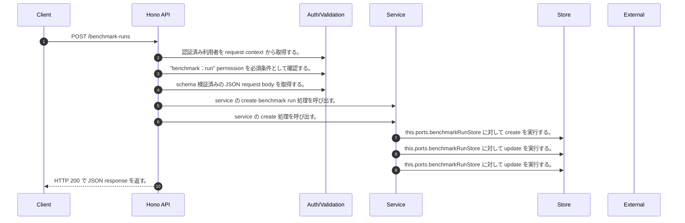

<!-- This file is generated by npm run docs:api-code. Do not edit manually. -->

# POST /benchmark-runs シーケンス

## シーケンス図

## 処理順とコード対応

| # | Caller | 境界 | 処理 | コード | 実装位置 |
| ---: | --- | --- | --- | --- | --- |
| 1 | `POST /benchmark-runs handler` | Auth | 認証済み利用者を request context から取得する。 | `c.get("user")` | `apps/api/src/routes/benchmark-routes.ts:126 (POST /benchmark-runs handler)` |
| 2 | `POST /benchmark-runs handler` | Auth | "benchmark:run" permission を必須条件として確認する。 | `requirePermission(user, "benchmark:run")` | `apps/api/src/routes/benchmark-routes.ts:127 (POST /benchmark-runs handler)` |
| 3 | `POST /benchmark-runs handler` | Validation | schema 検証済みの JSON request body を取得する。 | `validJson<z.infer<typeof CreateBenchmarkRunRequestSchema>>(c)` | `apps/api/src/routes/benchmark-routes.ts:128 (POST /benchmark-runs handler)` |
| 4 | `POST /benchmark-runs handler` | Service | service の create benchmark run 処理を呼び出す。 | `service.createBenchmarkRun(user, body)` | `apps/api/src/routes/benchmark-routes.ts:129 (POST /benchmark-runs handler)` |
| 5 | `MemoRagService.createBenchmarkRun` | Service | service の create 処理を呼び出す。 | `this.benchmarkRunCreationService.create(user, input)` | `apps/api/src/rag/memorag-service.ts:4557 (MemoRagService.createBenchmarkRun)` |
| 6 | `BenchmarkRunCreationService.create` | Store | `this.ports.benchmarkRunStore` に対して create を実行する。 | `this.ports.benchmarkRunStore.create(run)` | `apps/api/src/benchmark/benchmark-run-creation-service.ts:95 (BenchmarkRunCreationService.create)` |
| 7 | `BenchmarkRunCreationService.create` | Store | `this.ports.benchmarkRunStore` に対して update を実行する。 | `this.ports.benchmarkRunStore.update(run.tenantId, run.runId, { executionArn })` | `apps/api/src/benchmark/benchmark-run-creation-service.ts:104 (BenchmarkRunCreationService.create)` |
| 8 | `BenchmarkRunCreationService.create` | Store | `this.ports.benchmarkRunStore` に対して update を実行する。 | `this.ports.benchmarkRunStore.update(run.tenantId, run.runId, { status: "failed", completedAt: this.ports.now(), error: permissionRevoked ? "permission_revoked" : error instanceof Error ? error.message : String(error), e…` | `apps/api/src/benchmark/benchmark-run-creation-service.ts:107 (BenchmarkRunCreationService.create)` |
| 9 | `POST /benchmark-runs handler` | HTTP/SSE | HTTP 200 で JSON response を返す。 | `c.json(await service.createBenchmarkRun(user, body), 200)` | `apps/api/src/routes/benchmark-routes.ts:129 (POST /benchmark-runs handler)` |

## 分岐

| ID | Function | 条件 | 実装位置 |
| --- | --- | --- | --- |
| B001 | `requirePermission` | 利用者が 指定された permission を持たない | `apps/api/src/authorization.ts:184 (requirePermission)` |
