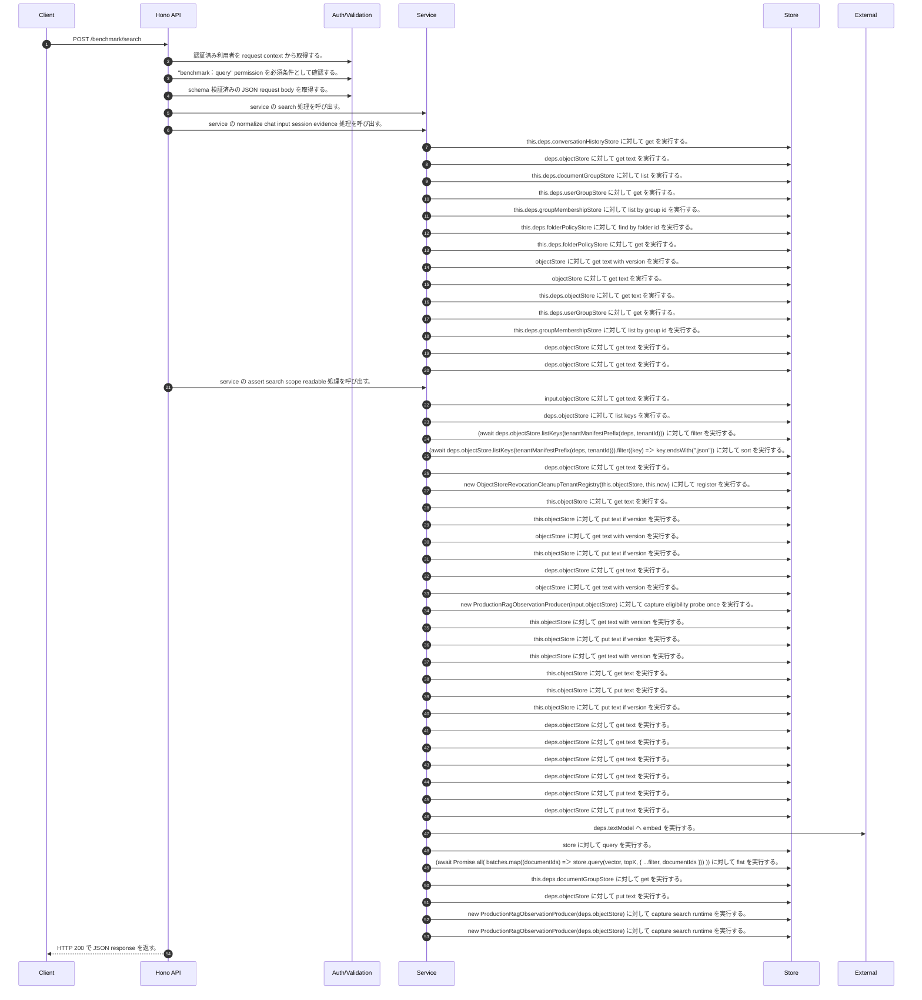

<!-- This file is generated by npm run docs:api-code. Do not edit manually. -->

# POST /benchmark/search シーケンス

## シーケンス図

## 処理順とコード対応

| # | Caller | 境界 | 処理 | コード | 実装位置 |
| ---: | --- | --- | --- | --- | --- |
| 1 | `POST /benchmark/search handler` | Auth | 認証済み利用者を request context から取得する。 | `c.get("user")` | `apps/api/src/routes/benchmark-routes.ts:86 (POST /benchmark/search handler)` |
| 2 | `POST /benchmark/search handler` | Auth | "benchmark:query" permission を必須条件として確認する。 | `requirePermission(user, "benchmark:query")` | `apps/api/src/routes/benchmark-routes.ts:87 (POST /benchmark/search handler)` |
| 3 | `POST /benchmark/search handler` | Validation | schema 検証済みの JSON request body を取得する。 | `validJson<z.infer<typeof BenchmarkSearchRequestSchema>>(c)` | `apps/api/src/routes/benchmark-routes.ts:88 (POST /benchmark/search handler)` |
| 4 | `POST /benchmark/search handler` | Service | service の search 処理を呼び出す。 | `service.search(invocation.serviceInput, invocation.subject)` | `apps/api/src/routes/benchmark-routes.ts:90 (POST /benchmark/search handler)` |
| 5 | `MemoRagService.search` | Service | service の normalize chat input session evidence 処理を呼び出す。 | `this.normalizeChatInputSessionEvidence(user, { question: input.query, conversation: input.conversationId ? { conversationId: input.conversationId, turns: [] } : undefined, searchScope: input.scope })` | `apps/api/src/rag/memorag-service.ts:3114 (MemoRagService.search)` |
| 6 | `MemoRagService.normalizeChatInputSessionEvidence` | Store | `this.deps.conversationHistoryStore` に対して get を実行する。 | `this.deps.conversationHistoryStore.get(tenantPartitionedOwnerKey(actor), conversationId)` | `apps/api/src/rag/memorag-service.ts:5206 (MemoRagService.normalizeChatInputSessionEvidence)` |
| 7 | `readTenantManifest` | Store | `deps.objectStore` に対して get text を実行する。 | `deps.objectStore.getText(key)` | `apps/api/src/rag/_shared/storage/tenant-artifacts.ts:83 (readTenantManifest)` |
| 8 | `FolderPermissionService.resolveEffectiveFolderPermissionDetail` | Store | `this.deps.documentGroupStore` に対して list を実行する。 | `this.deps.documentGroupStore.list(actorTenantId)` | `apps/api/src/folders/folder-permission-service.ts:145 (FolderPermissionService.resolveEffectiveFolderPermissionDetail)` |
| 9 | `FolderPermissionService.resolveUserMembershipPermission` | Store | `this.deps.userGroupStore` に対して get を実行する。 | `this.deps.userGroupStore.get(tenantId, groupId)` | `apps/api/src/folders/folder-permission-service.ts:780 (FolderPermissionService.resolveUserMembershipPermission)` |
| 10 | `FolderPermissionService.resolveUserMembershipPermission` | Store | `this.deps.groupMembershipStore` に対して list by group id を実行する。 | `this.deps.groupMembershipStore.listByGroupId(tenantId, groupId)` | `apps/api/src/folders/folder-permission-service.ts:781 (FolderPermissionService.resolveUserMembershipPermission)` |
| 11 | `FolderPermissionService.resolvePolicyContext` | Store | `this.deps.folderPolicyStore` に対して find by folder id を実行する。 | `this.deps.folderPolicyStore.findByFolderId(folder.tenantId, current.groupId)` | `apps/api/src/folders/folder-permission-service.ts:695 (FolderPermissionService.resolvePolicyContext)` |
| 12 | `FolderPermissionService.resolvePolicyContext` | Store | `this.deps.folderPolicyStore` に対して get を実行する。 | `this.deps.folderPolicyStore.get(folder.tenantId, current.policyId)` | `apps/api/src/folders/folder-permission-service.ts:711 (FolderPermissionService.resolvePolicyContext)` |
| 13 | `getTextWithVersion` | Store | `objectStore` に対して get text with version を実行する。 | `objectStore.getTextWithVersion(key)` | `apps/api/src/documents/document-permission-service.ts:946 (getTextWithVersion)` |
| 14 | `getTextWithVersion` | Store | `objectStore` に対して get text を実行する。 | `objectStore.getText(key)` | `apps/api/src/documents/document-permission-service.ts:947 (getTextWithVersion)` |
| 15 | `DocumentPermissionService.loadLegacyDocumentGrants` | Store | `this.deps.objectStore` に対して get text を実行する。 | `this.deps.objectStore.getText(documentShareLegacyLedgerKey)` | `apps/api/src/documents/document-permission-service.ts:537 (DocumentPermissionService.loadLegacyDocumentGrants)` |
| 16 | `DocumentPermissionService.resolveUserMembershipPermission` | Store | `this.deps.userGroupStore` に対して get を実行する。 | `this.deps.userGroupStore.get(tenantId, groupId)` | `apps/api/src/documents/document-permission-service.ts:683 (DocumentPermissionService.resolveUserMembershipPermission)` |
| 17 | `DocumentPermissionService.resolveUserMembershipPermission` | Store | `this.deps.groupMembershipStore` に対して list by group id を実行する。 | `this.deps.groupMembershipStore.listByGroupId(tenantId, groupId)` | `apps/api/src/documents/document-permission-service.ts:684 (DocumentPermissionService.resolveUserMembershipPermission)` |
| 18 | `loadStructuredBlocksForManifest` | Store | `deps.objectStore` に対して get text を実行する。 | `deps.objectStore.getText(manifest.structuredBlocksObjectKey)` | `apps/api/src/rag/_shared/storage/manifest-chunks.ts:35 (loadStructuredBlocksForManifest)` |
| 19 | `loadChunksForManifest` | Store | `deps.objectStore` に対して get text を実行する。 | `deps.objectStore.getText(manifest.sourceObjectKey)` | `apps/api/src/rag/_shared/storage/manifest-chunks.ts:10 (loadChunksForManifest)` |
| 20 | `MemoRagService.search` | Service | service の assert search scope readable 処理を呼び出す。 | `this.assertSearchScopeReadable(user, normalized.searchScope)` | `apps/api/src/rag/memorag-service.ts:3119 (MemoRagService.search)` |
| 21 | `assertRagSafetyInterlock` | Store | `input.objectStore` に対して get text を実行する。 | `input.objectStore.getText(RAG_SAFETY_STATE_KEY)` | `apps/api/src/rag/quality-control/production-rag-monitor.ts:311 (assertRagSafetyInterlock)` |
| 22 | `getLexicalIndex` | Store | `deps.objectStore` に対して list keys を実行する。 | `deps.objectStore.listKeys(tenantManifestPrefix(deps, tenantId))` | `apps/api/src/rag/online/retrieval/hybrid/hybrid-retriever.ts:605 (getLexicalIndex)` |
| 23 | `getLexicalIndex` | Store | `(await deps.objectStore.listKeys(tenantManifestPrefix(deps, tenantId)))` に対して filter を実行する。 | `(await deps.objectStore.listKeys(tenantManifestPrefix(deps, tenantId))).filter((key) => key.endsWith(".json"))` | `apps/api/src/rag/online/retrieval/hybrid/hybrid-retriever.ts:605 (getLexicalIndex)` |
| 24 | `getLexicalIndex` | Store | `(await deps.objectStore.listKeys(tenantManifestPrefix(deps, tenantId))).filter((key) => key.endsWith(".json"))` に対して sort を実行する。 | `(await deps.objectStore.listKeys(tenantManifestPrefix(deps, tenantId))).filter((key) => key.endsWith(".json")).sort()` | `apps/api/src/rag/online/retrieval/hybrid/hybrid-retriever.ts:605 (getLexicalIndex)` |
| 25 | `readTenantManifestByKey` | Store | `deps.objectStore` に対して get text を実行する。 | `deps.objectStore.getText(key)` | `apps/api/src/rag/_shared/storage/tenant-artifacts.ts:93 (readTenantManifestByKey)` |
| 26 | `ObjectStoreRevocationCleanupCoordinator.register` | Store | `new ObjectStoreRevocationCleanupTenantRegistry(this.objectStore, this.now)` に対して register を実行する。 | `new ObjectStoreRevocationCleanupTenantRegistry(this.objectStore, this.now).register(normalized.tenantId)` | `apps/api/src/rag/_shared/security/revocation-cleanup-coordinator.ts:137 (ObjectStoreRevocationCleanupCoordinator.register)` |
| 27 | `ObjectStoreRevocationCleanupTenantRegistry.read` | Store | `this.objectStore` に対して get text を実行する。 | `this.objectStore.getText(key)` | `apps/api/src/rag/_shared/security/revocation-cleanup-tenant-registry.ts:116 (ObjectStoreRevocationCleanupTenantRegistry.read)` |
| 28 | `ObjectStoreRevocationCleanupTenantRegistry.register` | Store | `this.objectStore` に対して put text if version を実行する。 | `this.objectStore.putTextIfVersion(key, JSON.stringify(record, null, 2), undefined, "application/json")` | `apps/api/src/rag/_shared/security/revocation-cleanup-tenant-registry.ts:41 (ObjectStoreRevocationCleanupTenantRegistry.register)` |
| 29 | `readManifest` | Store | `objectStore` に対して get text with version を実行する。 | `objectStore.getTextWithVersion(key)` | `apps/api/src/rag/_shared/security/revocation-cleanup-coordinator.ts:636 (readManifest)` |
| 30 | `ObjectStoreRevocationCleanupCoordinator.register` | Store | `this.objectStore` に対して put text if version を実行する。 | `this.objectStore.putTextIfVersion(key, JSON.stringify(manifest, null, 2), undefined, "application/json")` | `apps/api/src/rag/_shared/security/revocation-cleanup-coordinator.ts:169 (ObjectStoreRevocationCleanupCoordinator.register)` |
| 31 | `loadPublicationPointer` | Store | `deps.objectStore` に対して get text を実行する。 | `deps.objectStore.getText(key)` | `apps/api/src/rag/_shared/publication/staged-publication-coordinator.ts:1809 (loadPublicationPointer)` |
| 32 | `readVersionedRecord` | Store | `objectStore` に対して get text with version を実行する。 | `objectStore.getTextWithVersion(key)` | `apps/api/src/rag/offline/pre-retrieval/admission/source-governance-approval-service.ts:1066 (readVersionedRecord)` |
| 33 | `currentEligibilitySnapshotFromAuthoritativeState` | Store | `new ProductionRagObservationProducer(input.objectStore)         ` に対して capture eligibility probe once を実行する。 | `new ProductionRagObservationProducer(input.objectStore) .captureEligibilityProbeOnce({ probeId: \`source-governance:${record.tenantId}:${record.sourceId}:${record.revision}:${sourcePurpose}\`, detectedAt, propagationMs: M…` | `apps/api/src/rag/_shared/security/current-rag-eligibility.ts:246 (currentEligibilitySnapshotFromAuthoritativeState)` |
| 34 | `ProductionRagObservationProducer.captureEligibilityProbeOnce` | Store | `this.objectStore` に対して get text with version を実行する。 | `this.objectStore.getTextWithVersion(key)` | `apps/api/src/rag/quality-control/production-rag-observation-producer.ts:613 (ProductionRagObservationProducer.captureEligibilityProbeOnce)` |
| 35 | `ProductionRagObservationProducer.captureEligibilityProbeOnce` | Store | `this.objectStore` に対して put text if version を実行する。 | `this.objectStore.putTextIfVersion(key, \`${JSON.stringify(marker, null, 2)}\n\`, undefined, "application/json; charset=utf-8")` | `apps/api/src/rag/quality-control/production-rag-observation-producer.ts:632 (ProductionRagObservationProducer.captureEligibilityProbeOnce)` |
| 36 | `ProductionRagObservationProducer.captureEligibilityProbeOnce` | Store | `this.objectStore` に対して get text with version を実行する。 | `this.objectStore.getTextWithVersion(key)` | `apps/api/src/rag/quality-control/production-rag-observation-producer.ts:636 (ProductionRagObservationProducer.captureEligibilityProbeOnce)` |
| 37 | `ProductionRagObservationProducer.loadActivePolicy` | Store | `this.objectStore` に対して get text を実行する。 | `this.objectStore.getText(ACTIVE_RAG_QUALITY_POLICY_KEY)` | `apps/api/src/rag/quality-control/production-rag-observation-producer.ts:783 (ProductionRagObservationProducer.loadActivePolicy)` |
| 38 | `ProductionRagObservationProducer.persistSample` | Store | `this.objectStore` に対して put text を実行する。 | `this.objectStore.putText(key, \`${JSON.stringify(sample, null, 2)}\n\`, "application/json; charset=utf-8")` | `apps/api/src/rag/quality-control/production-rag-observation-producer.ts:762 (ProductionRagObservationProducer.persistSample)` |
| 39 | `ProductionRagObservationProducer.captureEligibilityProbeOnce` | Store | `this.objectStore` に対して put text if version を実行する。 | `this.objectStore.putTextIfVersion( key, \`${JSON.stringify(recorded, null, 2)}\n\`, stored.version, "application/json; charset=utf-8" )` | `apps/api/src/rag/quality-control/production-rag-observation-producer.ts:656 (ProductionRagObservationProducer.captureEligibilityProbeOnce)` |
| 40 | `loadPublishedAliasArtifact` | Store | `deps.objectStore` に対して get text を実行する。 | `deps.objectStore.getText(latestKey)` | `apps/api/src/search/alias-artifacts.ts:19 (loadPublishedAliasArtifact)` |
| 41 | `loadPublishedAliasArtifact` | Store | `deps.objectStore` に対して get text を実行する。 | `deps.objectStore.getText(latest.objectKey)` | `apps/api/src/search/alias-artifacts.ts:21 (loadPublishedAliasArtifact)` |
| 42 | `loadLexicalIndexArtifact` | Store | `deps.objectStore` に対して get text を実行する。 | `deps.objectStore.getText(\`${prefix}latest.json\`)` | `apps/api/src/rag/online/retrieval/hybrid/hybrid-retriever.ts:1555 (loadLexicalIndexArtifact)` |
| 43 | `loadLexicalIndexArtifact` | Store | `deps.objectStore` に対して get text を実行する。 | `deps.objectStore.getText(latest.objectKey)` | `apps/api/src/rag/online/retrieval/hybrid/hybrid-retriever.ts:1557 (loadLexicalIndexArtifact)` |
| 44 | `publishLexicalIndexArtifact` | Store | `deps.objectStore` に対して put text を実行する。 | `deps.objectStore.putText(objectKey, JSON.stringify(artifact), "application/json")` | `apps/api/src/rag/online/retrieval/hybrid/hybrid-retriever.ts:1597 (publishLexicalIndexArtifact)` |
| 45 | `publishLexicalIndexArtifact` | Store | `deps.objectStore` に対して put text を実行する。 | `deps.objectStore.putText(\`${prefix}latest.json\`, JSON.stringify({ signature, objectKey, indexVersion: index.version, aliasVersion: index.aliasVersion }, null, 2), "application/json")` | `apps/api/src/rag/online/retrieval/hybrid/hybrid-retriever.ts:1598 (publishLexicalIndexArtifact)` |
| 46 | `searchRag` | External | `deps.textModel` へ embed を実行する。 | `deps.textModel.embed(input.query, { modelId: observedEmbeddingModelId, dimensions: observedEmbeddingDimensions })` | `apps/api/src/rag/online/retrieval/hybrid/hybrid-retriever.ts:270 (searchRag)` |
| 47 | `queryAuthorizedSemanticHits` | Store | `store` に対して query を実行する。 | `store.query(vector, topK, { ...filter, documentIds })` | `apps/api/src/rag/online/retrieval/hybrid/hybrid-retriever.ts:1354 (queryAuthorizedSemanticHits)` |
| 48 | `queryAuthorizedSemanticHits` | Store | `(await Promise.all(     batches.map((documentIds) => store.query(vector, topK, { ...filter, documentIds }))   ))` に対して flat を実行する。 | `(await Promise.all( batches.map((documentIds) => store.query(vector, topK, { ...filter, documentIds })) )).flat()` | `apps/api/src/rag/online/retrieval/hybrid/hybrid-retriever.ts:1353 (queryAuthorizedSemanticHits)` |
| 49 | `FolderPermissionService.assertFolderOperation` | Store | `this.deps.documentGroupStore` に対して get を実行する。 | `this.deps.documentGroupStore.get(actorTenantId, folderId)` | `apps/api/src/folders/folder-permission-service.ts:110 (FolderPermissionService.assertFolderOperation)` |
| 50 | `persistSearchDebugTrace` | Store | `deps.objectStore` に対して put text を実行する。 | `deps.objectStore.putText(key, JSON.stringify(trace, null, 2), "application/json")` | `apps/api/src/rag/online/retrieval/hybrid/hybrid-retriever.ts:593 (persistSearchDebugTrace)` |
| 51 | `searchRag` | Store | `new ProductionRagObservationProducer(deps.objectStore)` に対して capture search runtime を実行する。 | `new ProductionRagObservationProducer(deps.objectStore).captureSearchRuntime({ latencyMs: response.diagnostics.latencyMs, indexVersion: response.diagnostics.indexVersion, profileId: response.diagnostics.profileId, profil…` | `apps/api/src/rag/online/retrieval/hybrid/hybrid-retriever.ts:378 (searchRag)` |
| 52 | `searchRag` | Store | `new ProductionRagObservationProducer(deps.objectStore)` に対して capture search runtime を実行する。 | `new ProductionRagObservationProducer(deps.objectStore).captureSearchRuntime({ latencyMs, indexVersion: observedIndexVersion, profileId: ragRuntimePolicy.retrieval.profileId, profileVersion: ragRuntimePolicy.retrieval.pr…` | `apps/api/src/rag/online/retrieval/hybrid/hybrid-retriever.ts:427 (searchRag)` |
| 53 | `POST /benchmark/search handler` | HTTP/SSE | HTTP 200 で JSON response を返す。 | `c.json(await service.search(invocation.serviceInput, invocation.subject), 200)` | `apps/api/src/routes/benchmark-routes.ts:90 (POST /benchmark/search handler)` |

## 分岐

| ID | Function | 条件 | 実装位置 |
| --- | --- | --- | --- |
| B001 | `requirePermission` | 利用者が 指定された permission を持たない | `apps/api/src/authorization.ts:184 (requirePermission)` |
| B002 | `benchmarkHttp` | 例外が発生した場合に catch 処理へ移る | `apps/api/src/routes/benchmark-routes.ts:262 (benchmarkHttp)` |
| B003 | `benchmarkHttp` | `error` が `BenchmarkEvaluationContextError` の instance である | `apps/api/src/routes/benchmark-routes.ts:263 (benchmarkHttp)` |
| B004 | `MemoRagService.search` | `input.conversationId` が存在し、真である | `apps/api/src/rag/memorag-service.ts:3116 (MemoRagService.search)` |
