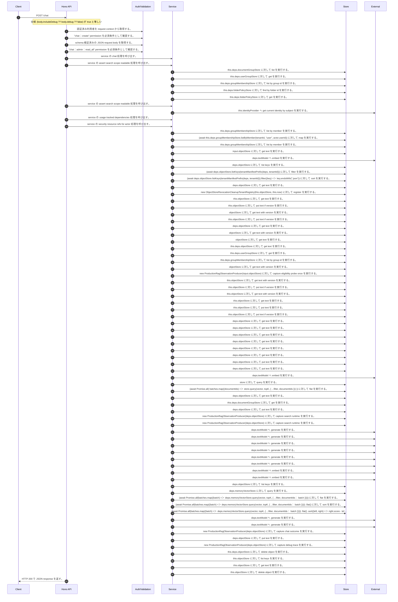

<!-- This file is generated by npm run docs:api-code. Do not edit manually. -->

# POST /chat シーケンス

## シーケンス図

## 処理順とコード対応

| # | Caller | 境界 | 処理 | コード | 実装位置 |
| ---: | --- | --- | --- | --- | --- |
| 1 | `POST /chat handler` | Auth | 認証済み利用者を request context から取得する。 | `c.get("user")` | `apps/api/src/routes/chat-routes.ts:39 (POST /chat handler)` |
| 2 | `POST /chat handler` | Auth | "chat:create" permission を必須条件として確認する。 | `requirePermission(user, "chat:create")` | `apps/api/src/routes/chat-routes.ts:40 (POST /chat handler)` |
| 3 | `POST /chat handler` | Validation | schema 検証済みの JSON request body を取得する。 | `validJson<z.infer<typeof ChatRequestSchema>>(c)` | `apps/api/src/routes/chat-routes.ts:41 (POST /chat handler)` |
| 4 | `POST /chat handler` | Auth | "chat:admin:read_all" permission を必須条件として確認する。 | `requirePermission(user, "chat:admin:read_all")` | `apps/api/src/routes/chat-routes.ts:43 (POST /chat handler)` |
| 5 | `POST /chat handler` | Service | service の chat 処理を呼び出す。 | `service.chat(body, user)` | `apps/api/src/routes/chat-routes.ts:45 (POST /chat handler)` |
| 6 | `MemoRagService.chat` | Service | service の assert search scope readable 処理を呼び出す。 | `this.assertSearchScopeReadable(actor, input.searchScope)` | `apps/api/src/rag/memorag-service.ts:2397 (MemoRagService.chat)` |
| 7 | `FolderPermissionService.resolveEffectiveFolderPermissionDetail` | Store | `this.deps.documentGroupStore` に対して list を実行する。 | `this.deps.documentGroupStore.list(actorTenantId)` | `apps/api/src/folders/folder-permission-service.ts:145 (FolderPermissionService.resolveEffectiveFolderPermissionDetail)` |
| 8 | `FolderPermissionService.resolveUserMembershipPermission` | Store | `this.deps.userGroupStore` に対して get を実行する。 | `this.deps.userGroupStore.get(tenantId, groupId)` | `apps/api/src/folders/folder-permission-service.ts:780 (FolderPermissionService.resolveUserMembershipPermission)` |
| 9 | `FolderPermissionService.resolveUserMembershipPermission` | Store | `this.deps.groupMembershipStore` に対して list by group id を実行する。 | `this.deps.groupMembershipStore.listByGroupId(tenantId, groupId)` | `apps/api/src/folders/folder-permission-service.ts:781 (FolderPermissionService.resolveUserMembershipPermission)` |
| 10 | `FolderPermissionService.resolvePolicyContext` | Store | `this.deps.folderPolicyStore` に対して find by folder id を実行する。 | `this.deps.folderPolicyStore.findByFolderId(folder.tenantId, current.groupId)` | `apps/api/src/folders/folder-permission-service.ts:695 (FolderPermissionService.resolvePolicyContext)` |
| 11 | `FolderPermissionService.resolvePolicyContext` | Store | `this.deps.folderPolicyStore` に対して get を実行する。 | `this.deps.folderPolicyStore.get(folder.tenantId, current.policyId)` | `apps/api/src/folders/folder-permission-service.ts:711 (FolderPermissionService.resolvePolicyContext)` |
| 12 | `MemoRagService.chat` | Service | service の assert search scope readable 処理を呼び出す。 | `this.assertSearchScopeReadable(currentActor, input.searchScope)` | `apps/api/src/rag/memorag-service.ts:2408 (MemoRagService.chat)` |
| 13 | `CurrentWorkerAuthorization.assertAuthorized` | External | `this.identityProvider` へ get current identity by subject を実行する。 | `this.identityProvider.getCurrentIdentityBySubject(request.subject)` | `apps/api/src/security/current-worker-authorization.ts:51 (CurrentWorkerAuthorization.assertAuthorized)` |
| 14 | `MemoRagService.chat` | Service | service の usage tracked dependencies 処理を呼び出す。 | `this.usageTrackedDependencies(currentActor, operationId, "chat")` | `apps/api/src/rag/memorag-service.ts:2418 (MemoRagService.chat)` |
| 15 | `MemoRagService.chat` | Service | service の security resource refs for actor 処理を呼び出す。 | `this.securityResourceRefsForActor(currentActor, input.searchScope)` | `apps/api/src/rag/memorag-service.ts:2429 (MemoRagService.chat)` |
| 16 | `MemoRagService.securityResourceRefsForActor` | Store | `this.deps.groupMembershipStore` に対して list by member を実行する。 | `this.deps.groupMembershipStore.listByMember(tenantId, "user", actor.userId)` | `apps/api/src/rag/memorag-service.ts:1277 (MemoRagService.securityResourceRefsForActor)` |
| 17 | `MemoRagService.securityResourceRefsForActor` | Store | `(await this.deps.groupMembershipStore.listByMember(tenantId, "user", actor.userId))       ` に対して map を実行する。 | `(await this.deps.groupMembershipStore.listByMember(tenantId, "user", actor.userId)) .map((membership) => membership.groupId)` | `apps/api/src/rag/memorag-service.ts:1277 (MemoRagService.securityResourceRefsForActor)` |
| 18 | `MemoRagService.securityResourceRefsForActor` | Store | `this.deps.groupMembershipStore` に対して list by member を実行する。 | `this.deps.groupMembershipStore.listByMember(tenantId, "group", groupId)` | `apps/api/src/rag/memorag-service.ts:1285 (MemoRagService.securityResourceRefsForActor)` |
| 19 | `assertRagSafetyInterlock` | Store | `input.objectStore` に対して get text を実行する。 | `input.objectStore.getText(RAG_SAFETY_STATE_KEY)` | `apps/api/src/rag/quality-control/production-rag-monitor.ts:311 (assertRagSafetyInterlock)` |
| 20 | `createEmbedQueriesNode` | External | `deps.textModel` へ embed を実行する。 | `deps.textModel.embed(query, { modelId: state.embeddingModelId, dimensions: config.embeddingDimensions })` | `apps/api/src/chat-orchestration/nodes/embed-queries.ts:13 (createEmbedQueriesNode)` |
| 21 | `getLexicalIndex` | Store | `deps.objectStore` に対して list keys を実行する。 | `deps.objectStore.listKeys(tenantManifestPrefix(deps, tenantId))` | `apps/api/src/rag/online/retrieval/hybrid/hybrid-retriever.ts:603 (getLexicalIndex)` |
| 22 | `getLexicalIndex` | Store | `(await deps.objectStore.listKeys(tenantManifestPrefix(deps, tenantId)))` に対して filter を実行する。 | `(await deps.objectStore.listKeys(tenantManifestPrefix(deps, tenantId))).filter((key) => key.endsWith(".json"))` | `apps/api/src/rag/online/retrieval/hybrid/hybrid-retriever.ts:603 (getLexicalIndex)` |
| 23 | `getLexicalIndex` | Store | `(await deps.objectStore.listKeys(tenantManifestPrefix(deps, tenantId))).filter((key) => key.endsWith(".json"))` に対して sort を実行する。 | `(await deps.objectStore.listKeys(tenantManifestPrefix(deps, tenantId))).filter((key) => key.endsWith(".json")).sort()` | `apps/api/src/rag/online/retrieval/hybrid/hybrid-retriever.ts:603 (getLexicalIndex)` |
| 24 | `readTenantManifestByKey` | Store | `deps.objectStore` に対して get text を実行する。 | `deps.objectStore.getText(key)` | `apps/api/src/rag/_shared/storage/tenant-artifacts.ts:93 (readTenantManifestByKey)` |
| 25 | `ObjectStoreRevocationCleanupCoordinator.register` | Store | `new ObjectStoreRevocationCleanupTenantRegistry(this.objectStore, this.now)` に対して register を実行する。 | `new ObjectStoreRevocationCleanupTenantRegistry(this.objectStore, this.now).register(normalized.tenantId)` | `apps/api/src/rag/_shared/security/revocation-cleanup-coordinator.ts:137 (ObjectStoreRevocationCleanupCoordinator.register)` |
| 26 | `ObjectStoreRevocationCleanupTenantRegistry.read` | Store | `this.objectStore` に対して get text を実行する。 | `this.objectStore.getText(key)` | `apps/api/src/rag/_shared/security/revocation-cleanup-tenant-registry.ts:116 (ObjectStoreRevocationCleanupTenantRegistry.read)` |
| 27 | `ObjectStoreRevocationCleanupTenantRegistry.register` | Store | `this.objectStore` に対して put text if version を実行する。 | `this.objectStore.putTextIfVersion(key, JSON.stringify(record, null, 2), undefined, "application/json")` | `apps/api/src/rag/_shared/security/revocation-cleanup-tenant-registry.ts:41 (ObjectStoreRevocationCleanupTenantRegistry.register)` |
| 28 | `readManifest` | Store | `objectStore` に対して get text with version を実行する。 | `objectStore.getTextWithVersion(key)` | `apps/api/src/rag/_shared/security/revocation-cleanup-coordinator.ts:636 (readManifest)` |
| 29 | `ObjectStoreRevocationCleanupCoordinator.register` | Store | `this.objectStore` に対して put text if version を実行する。 | `this.objectStore.putTextIfVersion(key, JSON.stringify(manifest, null, 2), undefined, "application/json")` | `apps/api/src/rag/_shared/security/revocation-cleanup-coordinator.ts:169 (ObjectStoreRevocationCleanupCoordinator.register)` |
| 30 | `loadPublicationPointer` | Store | `deps.objectStore` に対して get text を実行する。 | `deps.objectStore.getText(key)` | `apps/api/src/rag/_shared/publication/staged-publication-coordinator.ts:1809 (loadPublicationPointer)` |
| 31 | `getTextWithVersion` | Store | `objectStore` に対して get text with version を実行する。 | `objectStore.getTextWithVersion(key)` | `apps/api/src/documents/document-permission-service.ts:946 (getTextWithVersion)` |
| 32 | `getTextWithVersion` | Store | `objectStore` に対して get text を実行する。 | `objectStore.getText(key)` | `apps/api/src/documents/document-permission-service.ts:947 (getTextWithVersion)` |
| 33 | `DocumentPermissionService.loadLegacyDocumentGrants` | Store | `this.deps.objectStore` に対して get text を実行する。 | `this.deps.objectStore.getText(documentShareLegacyLedgerKey)` | `apps/api/src/documents/document-permission-service.ts:537 (DocumentPermissionService.loadLegacyDocumentGrants)` |
| 34 | `DocumentPermissionService.resolveUserMembershipPermission` | Store | `this.deps.userGroupStore` に対して get を実行する。 | `this.deps.userGroupStore.get(tenantId, groupId)` | `apps/api/src/documents/document-permission-service.ts:683 (DocumentPermissionService.resolveUserMembershipPermission)` |
| 35 | `DocumentPermissionService.resolveUserMembershipPermission` | Store | `this.deps.groupMembershipStore` に対して list by group id を実行する。 | `this.deps.groupMembershipStore.listByGroupId(tenantId, groupId)` | `apps/api/src/documents/document-permission-service.ts:684 (DocumentPermissionService.resolveUserMembershipPermission)` |
| 36 | `readVersionedRecord` | Store | `objectStore` に対して get text with version を実行する。 | `objectStore.getTextWithVersion(key)` | `apps/api/src/rag/offline/pre-retrieval/admission/source-governance-approval-service.ts:1066 (readVersionedRecord)` |
| 37 | `currentEligibilitySnapshotFromAuthoritativeState` | Store | `new ProductionRagObservationProducer(input.objectStore)         ` に対して capture eligibility probe once を実行する。 | `new ProductionRagObservationProducer(input.objectStore) .captureEligibilityProbeOnce({ probeId: \`source-governance:${record.tenantId}:${record.sourceId}:${record.revision}:${sourcePurpose}\`, detectedAt, propagationMs: M…` | `apps/api/src/rag/_shared/security/current-rag-eligibility.ts:246 (currentEligibilitySnapshotFromAuthoritativeState)` |
| 38 | `ProductionRagObservationProducer.captureEligibilityProbeOnce` | Store | `this.objectStore` に対して get text with version を実行する。 | `this.objectStore.getTextWithVersion(key)` | `apps/api/src/rag/quality-control/production-rag-observation-producer.ts:665 (ProductionRagObservationProducer.captureEligibilityProbeOnce)` |
| 39 | `ProductionRagObservationProducer.captureEligibilityProbeOnce` | Store | `this.objectStore` に対して put text if version を実行する。 | `this.objectStore.putTextIfVersion(key, \`${JSON.stringify(marker, null, 2)}\n\`, undefined, "application/json; charset=utf-8")` | `apps/api/src/rag/quality-control/production-rag-observation-producer.ts:684 (ProductionRagObservationProducer.captureEligibilityProbeOnce)` |
| 40 | `ProductionRagObservationProducer.captureEligibilityProbeOnce` | Store | `this.objectStore` に対して get text with version を実行する。 | `this.objectStore.getTextWithVersion(key)` | `apps/api/src/rag/quality-control/production-rag-observation-producer.ts:688 (ProductionRagObservationProducer.captureEligibilityProbeOnce)` |
| 41 | `ProductionRagObservationProducer.loadActivePolicy` | Store | `this.objectStore` に対して get text を実行する。 | `this.objectStore.getText(ACTIVE_RAG_QUALITY_POLICY_KEY)` | `apps/api/src/rag/quality-control/production-rag-observation-producer.ts:837 (ProductionRagObservationProducer.loadActivePolicy)` |
| 42 | `ProductionRagObservationProducer.persistSample` | Store | `this.objectStore` に対して put text を実行する。 | `this.objectStore.putText(key, \`${JSON.stringify(sample, null, 2)}\n\`, "application/json; charset=utf-8")` | `apps/api/src/rag/quality-control/production-rag-observation-producer.ts:816 (ProductionRagObservationProducer.persistSample)` |
| 43 | `ProductionRagObservationProducer.captureEligibilityProbeOnce` | Store | `this.objectStore` に対して put text if version を実行する。 | `this.objectStore.putTextIfVersion( key, \`${JSON.stringify(recorded, null, 2)}\n\`, stored.version, "application/json; charset=utf-8" )` | `apps/api/src/rag/quality-control/production-rag-observation-producer.ts:708 (ProductionRagObservationProducer.captureEligibilityProbeOnce)` |
| 44 | `loadPublishedAliasArtifact` | Store | `deps.objectStore` に対して get text を実行する。 | `deps.objectStore.getText(latestKey)` | `apps/api/src/search/alias-artifacts.ts:19 (loadPublishedAliasArtifact)` |
| 45 | `loadPublishedAliasArtifact` | Store | `deps.objectStore` に対して get text を実行する。 | `deps.objectStore.getText(latest.objectKey)` | `apps/api/src/search/alias-artifacts.ts:21 (loadPublishedAliasArtifact)` |
| 46 | `loadLexicalIndexArtifact` | Store | `deps.objectStore` に対して get text を実行する。 | `deps.objectStore.getText(\`${prefix}latest.json\`)` | `apps/api/src/rag/online/retrieval/hybrid/hybrid-retriever.ts:1552 (loadLexicalIndexArtifact)` |
| 47 | `loadLexicalIndexArtifact` | Store | `deps.objectStore` に対して get text を実行する。 | `deps.objectStore.getText(latest.objectKey)` | `apps/api/src/rag/online/retrieval/hybrid/hybrid-retriever.ts:1554 (loadLexicalIndexArtifact)` |
| 48 | `loadStructuredBlocksForManifest` | Store | `deps.objectStore` に対して get text を実行する。 | `deps.objectStore.getText(manifest.structuredBlocksObjectKey)` | `apps/api/src/rag/_shared/storage/manifest-chunks.ts:35 (loadStructuredBlocksForManifest)` |
| 49 | `loadChunksForManifest` | Store | `deps.objectStore` に対して get text を実行する。 | `deps.objectStore.getText(manifest.sourceObjectKey)` | `apps/api/src/rag/_shared/storage/manifest-chunks.ts:10 (loadChunksForManifest)` |
| 50 | `publishLexicalIndexArtifact` | Store | `deps.objectStore` に対して put text を実行する。 | `deps.objectStore.putText(objectKey, JSON.stringify(artifact), "application/json")` | `apps/api/src/rag/online/retrieval/hybrid/hybrid-retriever.ts:1594 (publishLexicalIndexArtifact)` |
| 51 | `publishLexicalIndexArtifact` | Store | `deps.objectStore` に対して put text を実行する。 | `deps.objectStore.putText(\`${prefix}latest.json\`, JSON.stringify({ signature, objectKey, indexVersion: index.version, aliasVersion: index.aliasVersion }, null, 2), "application/json")` | `apps/api/src/rag/online/retrieval/hybrid/hybrid-retriever.ts:1595 (publishLexicalIndexArtifact)` |
| 52 | `searchRag` | External | `deps.textModel` へ embed を実行する。 | `deps.textModel.embed(input.query, { modelId: observedEmbeddingModelId, dimensions: observedEmbeddingDimensions })` | `apps/api/src/rag/online/retrieval/hybrid/hybrid-retriever.ts:268 (searchRag)` |
| 53 | `queryAuthorizedSemanticHits` | Store | `store` に対して query を実行する。 | `store.query(vector, topK, { ...filter, documentIds })` | `apps/api/src/rag/online/retrieval/hybrid/hybrid-retriever.ts:1351 (queryAuthorizedSemanticHits)` |
| 54 | `queryAuthorizedSemanticHits` | Store | `(await Promise.all(     batches.map((documentIds) => store.query(vector, topK, { ...filter, documentIds }))   ))` に対して flat を実行する。 | `(await Promise.all( batches.map((documentIds) => store.query(vector, topK, { ...filter, documentIds })) )).flat()` | `apps/api/src/rag/online/retrieval/hybrid/hybrid-retriever.ts:1350 (queryAuthorizedSemanticHits)` |
| 55 | `readTenantManifest` | Store | `deps.objectStore` に対して get text を実行する。 | `deps.objectStore.getText(key)` | `apps/api/src/rag/_shared/storage/tenant-artifacts.ts:83 (readTenantManifest)` |
| 56 | `FolderPermissionService.assertFolderOperation` | Store | `this.deps.documentGroupStore` に対して get を実行する。 | `this.deps.documentGroupStore.get(actorTenantId, folderId)` | `apps/api/src/folders/folder-permission-service.ts:110 (FolderPermissionService.assertFolderOperation)` |
| 57 | `persistSearchDebugTrace` | Store | `deps.objectStore` に対して put text を実行する。 | `deps.objectStore.putText(key, JSON.stringify(trace, null, 2), "application/json")` | `apps/api/src/rag/online/retrieval/hybrid/hybrid-retriever.ts:591 (persistSearchDebugTrace)` |
| 58 | `searchRag` | Store | `new ProductionRagObservationProducer(deps.objectStore)` に対して capture search runtime を実行する。 | `new ProductionRagObservationProducer(deps.objectStore).captureSearchRuntime({ latencyMs: response.diagnostics.latencyMs, indexVersion: response.diagnostics.indexVersion, profileId: response.diagnostics.profileId, profil…` | `apps/api/src/rag/online/retrieval/hybrid/hybrid-retriever.ts:376 (searchRag)` |
| 59 | `searchRag` | Store | `new ProductionRagObservationProducer(deps.objectStore)` に対して capture search runtime を実行する。 | `new ProductionRagObservationProducer(deps.objectStore).captureSearchRuntime({ latencyMs, indexVersion: observedIndexVersion, profileId: ragRuntimePolicy.retrieval.profileId, profileVersion: ragRuntimePolicy.retrieval.pr…` | `apps/api/src/rag/online/retrieval/hybrid/hybrid-retriever.ts:425 (searchRag)` |
| 60 | `createRetrievalEvaluatorNode` | External | `deps.textModel` へ generate を実行する。 | `deps.textModel.generate( buildRetrievalJudgePrompt(state.question, state.searchPlan.requiredFacts, riskSignals, relevantChunks), llmOptions("retrievalJudge", state.modelId) )` | `apps/api/src/chat-orchestration/nodes/retrieval-evaluator.ts:18 (createRetrievalEvaluatorNode)` |
| 61 | `createExtractPolicyComputationsNode` | External | `deps.textModel` へ generate を実行する。 | `deps.textModel.generate(buildPolicyComputationExtractionPrompt(state.question, state.selectedChunks), { modelId: state.modelId, temperature: 0, maxTokens: 1600 })` | `apps/api/src/chat-orchestration/nodes/extract-policy-computations.ts:11 (createExtractPolicyComputationsNode)` |
| 62 | `createSufficientContextGateNode` | External | `deps.textModel` へ generate を実行する。 | `deps.textModel.generate( buildSufficientContextPrompt(state.question, requiredFacts, state.selectedChunks, state.computedFacts), llmOptions("sufficientContext", state.modelId) )` | `apps/api/src/rag/online/post-retrieval/answerability/sufficient-context-gate.ts:12 (createSufficientContextGateNode)` |
| 63 | `createVerifyAnswerSupportNode` | External | `deps.textModel` へ generate を実行する。 | `deps.textModel.generate( buildAnswerSupportPrompt(state.question, state.answer, evidenceChunks, selectedComputedFacts(state)), llmOptions("answerSupport", state.modelId) )` | `apps/api/src/rag/online/generation/verification/answer-support-verifier.ts:19 (createVerifyAnswerSupportNode)` |
| 64 | `repairUnsupportedAnswer` | External | `deps.textModel` へ generate を実行する。 | `deps.textModel.generate( buildSupportedAnswerRepairPrompt(state.question, state.answer ?? "", judgement.unsupportedSentences, evidenceChunks), llmOptions("answerRepair", state.modelId) )` | `apps/api/src/rag/online/generation/verification/answer-support-verifier.ts:59 (repairUnsupportedAnswer)` |
| 65 | `repairUnsupportedAnswer` | External | `deps.textModel` へ generate を実行する。 | `deps.textModel.generate( buildAnswerSupportPrompt(state.question, repaired.answer, repairedChunks, selectedComputedFacts(state)), llmOptions("answerSupport", state.modelId) )` | `apps/api/src/rag/online/generation/verification/answer-support-verifier.ts:67 (repairUnsupportedAnswer)` |
| 66 | `anonymous function` | External | `deps.textModel` へ embed を実行する。 | `deps.textModel.embed(query, { modelId: state.embeddingModelId, dimensions: config.embeddingDimensions })` | `apps/api/src/chat-orchestration/nodes/embed-queries.ts:13 (anonymous function)` |
| 67 | `createRetrieveMemoryNode` | External | `deps.textModel` へ embed を実行する。 | `deps.textModel.embed(state.normalizedQuery ?? state.question, { modelId: state.embeddingModelId, dimensions: config.embeddingDimensions })` | `apps/api/src/chat-orchestration/nodes/retrieve-memory.ts:20 (createRetrieveMemoryNode)` |
| 68 | `loadAuthorizedMemoryDocumentIds` | Store | `deps.objectStore` に対して list keys を実行する。 | `deps.objectStore.listKeys(tenantManifestPrefix(deps, tenantId))` | `apps/api/src/chat-orchestration/nodes/retrieve-memory.ts:193 (loadAuthorizedMemoryDocumentIds)` |
| 69 | `queryAuthorizedMemoryHits` | Store | `deps.memoryVectorStore` に対して query を実行する。 | `deps.memoryVectorStore.query(vector, topK, { ...filter, documentIds: batch })` | `apps/api/src/chat-orchestration/nodes/retrieve-memory.ts:256 (queryAuthorizedMemoryHits)` |
| 70 | `queryAuthorizedMemoryHits` | Store | `(await Promise.all(batches.map((batch) => deps.memoryVectorStore.query(vector, topK, { ...filter, documentIds: batch }))))     ` に対して flat を実行する。 | `(await Promise.all(batches.map((batch) => deps.memoryVectorStore.query(vector, topK, { ...filter, documentIds: batch })))) .flat()` | `apps/api/src/chat-orchestration/nodes/retrieve-memory.ts:256 (queryAuthorizedMemoryHits)` |
| 71 | `queryAuthorizedMemoryHits` | Store | `(await Promise.all(batches.map((batch) => deps.memoryVectorStore.query(vector, topK, { ...filter, documentIds: batch }))))     .flat()     ` に対して sort を実行する。 | `(await Promise.all(batches.map((batch) => deps.memoryVectorStore.query(vector, topK, { ...filter, documentIds: batch })))) .flat() .sort((left, right) => right.score - left.score)` | `apps/api/src/chat-orchestration/nodes/retrieve-memory.ts:256 (queryAuthorizedMemoryHits)` |
| 72 | `queryAuthorizedMemoryHits` | Store | `(await Promise.all(batches.map((batch) => deps.memoryVectorStore.query(vector, topK, { ...filter, documentIds: batch }))))     .flat()     .sort((left, right) => right.score - left.score)     ` に対して slice を実行する。 | `(await Promise.all(batches.map((batch) => deps.memoryVectorStore.query(vector, topK, { ...filter, documentIds: batch })))) .flat() .sort((left, right) => right.score - left.score) .slice(0, topK)` | `apps/api/src/chat-orchestration/nodes/retrieve-memory.ts:256 (queryAuthorizedMemoryHits)` |
| 73 | `createGenerateCluesNode` | External | `deps.textModel` へ generate を実行する。 | `deps.textModel.generate(buildCluePrompt(state.question, memoryContext, historyContext), llmOptions("clue", state.clueModelId))` | `apps/api/src/chat-orchestration/nodes/generate-clues.ts:25 (createGenerateCluesNode)` |
| 74 | `createGenerateAnswerNode` | External | `deps.textModel` へ generate を実行する。 | `deps.textModel.generate( buildFinalAnswerPrompt( state.question, state.selectedChunks, state.computedFacts, state.temporalContext, formatConversationHistory(state.conversationHistory), { style: benchmarkAnswerStyle(stat…` | `apps/api/src/rag/online/generation/answer/answer-generator.ts:9 (createGenerateAnswerNode)` |
| 75 | `runChatOrchestration` | Store | `new ProductionRagObservationProducer(deps.objectStore)` に対して capture chat outcome を実行する。 | `new ProductionRagObservationProducer(deps.objectStore).captureChatOutcome({ runId, observedAt: new Date().toISOString(), latencyMs: Math.max(0, Date.now() - startedMs), firstTokenTiming, tenantId: user.tenantId ?? confi…` | `apps/api/src/rag/orchestration/chat-rag-orchestrator.ts:922 (runChatOrchestration)` |
| 76 | `persistDebugTrace` | Store | `deps.objectStore` に対して put text を実行する。 | `deps.objectStore.putText(debugTraceObjectKey(trace), JSON.stringify(trace, null, 2), "application/json")` | `apps/api/src/rag/orchestration/chat-rag-orchestrator.ts:1173 (persistDebugTrace)` |
| 77 | `persistDebugTrace` | Store | `new ProductionRagObservationProducer(deps.objectStore)` に対して capture debug trace を実行する。 | `new ProductionRagObservationProducer(deps.objectStore).captureDebugTrace(trace, { tenantId: input.requesterTenantId, roles: input.requesterRoles })` | `apps/api/src/rag/orchestration/chat-rag-orchestrator.ts:1174 (persistDebugTrace)` |
| 78 | `MemoRagService.chat` | Store | `this.deps.objectStore` に対して delete object を実行する。 | `this.deps.objectStore.deleteObject(debugTraceObjectKey(persistedTrace))` | `apps/api/src/rag/memorag-service.ts:2437 (MemoRagService.chat)` |
| 79 | `ProductionRagObservationProducer.deleteArtifactSamples` | Store | `this.objectStore` に対して list keys を実行する。 | `this.objectStore.listKeys(\`${sourceSamplePrefix}${safeKeyPart(tenantPartition)}/\`)` | `apps/api/src/rag/quality-control/production-rag-observation-producer.ts:321 (ProductionRagObservationProducer.deleteArtifactSamples)` |
| 80 | `ProductionRagObservationProducer.deleteArtifactSamples` | Store | `this.objectStore` に対して get text を実行する。 | `this.objectStore.getText(key)` | `apps/api/src/rag/quality-control/production-rag-observation-producer.ts:325 (ProductionRagObservationProducer.deleteArtifactSamples)` |
| 81 | `ProductionRagObservationProducer.deleteArtifactSamples` | Store | `this.objectStore` に対して delete object を実行する。 | `this.objectStore.deleteObject(key)` | `apps/api/src/rag/quality-control/production-rag-observation-producer.ts:332 (ProductionRagObservationProducer.deleteArtifactSamples)` |
| 82 | `POST /chat handler` | HTTP/SSE | HTTP 200 で JSON response を返す。 | `c.json(await service.chat(body, user), 200)` | `apps/api/src/routes/chat-routes.ts:45 (POST /chat handler)` |

## 分岐

| ID | Function | 条件 | 実装位置 |
| --- | --- | --- | --- |
| B001 | `POST /chat handler` | `(body.includeDebug ?? body.debug ?? false)` が `true` と等しい | `apps/api/src/routes/chat-routes.ts:42 (POST /chat handler)` |
| B002 | `requirePermission` | 利用者が 指定された permission を持たない | `apps/api/src/authorization.ts:184 (requirePermission)` |
| B003 | `MemoRagService.chat` | `actor` が存在し、真である | `apps/api/src/rag/memorag-service.ts:2397 (MemoRagService.chat)` |
| B004 | `MemoRagService.chat` | `actor` が存在し、真である | `apps/api/src/rag/memorag-service.ts:2399 (MemoRagService.chat)` |
| B005 | `MemoRagService.chat` | `authorize` が存在し、真である | `apps/api/src/rag/memorag-service.ts:2412 (MemoRagService.chat)` |
| B006 | `MemoRagService.chat` | `authorize` が存在し、真である | `apps/api/src/rag/memorag-service.ts:2413 (MemoRagService.chat)` |
| B007 | `MemoRagService.chat` | `authorize` が存在し、真である | `apps/api/src/rag/memorag-service.ts:2421 (MemoRagService.chat)` |
| B008 | `MemoRagService.chat` | `currentActor` が存在し、真である | `apps/api/src/rag/memorag-service.ts:2429 (MemoRagService.chat)` |
| B009 | `MemoRagService.chat` | `authorize` が存在し、真である | `apps/api/src/rag/memorag-service.ts:2431 (MemoRagService.chat)` |
| B010 | `MemoRagService.chat` | 例外が発生した場合に catch 処理へ移る | `apps/api/src/rag/memorag-service.ts:2433 (MemoRagService.chat)` |
| B011 | `MemoRagService.chat` | `persistedTrace` が存在し、真である、または `observationArtifactId` が存在し、真である、かつ `currentActor?.tenantId` が存在し、真である | `apps/api/src/rag/memorag-service.ts:2434 (MemoRagService.chat)` |
| B012 | `MemoRagService.chat` | `persistedTrace` が存在し、真である | `apps/api/src/rag/memorag-service.ts:2437 (MemoRagService.chat)` |
| B013 | `MemoRagService.chat` | `persistedTrace` が存在し、真である | `apps/api/src/rag/memorag-service.ts:2438 (MemoRagService.chat)` |
| B014 | `MemoRagService.chat` | `observationArtifactId` が存在し、真である | `apps/api/src/rag/memorag-service.ts:2439 (MemoRagService.chat)` |
