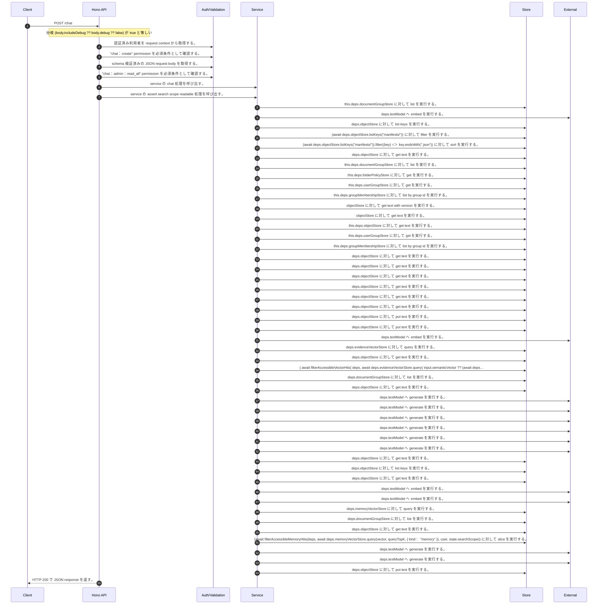

<!-- This file is generated by npm run docs:api-code. Do not edit manually. -->

# POST /chat シーケンス

## シーケンス図

## 処理順とコード対応

| # | Caller | 境界 | 処理 | コード | 実装位置 |
| ---: | --- | --- | --- | --- | --- |
| 1 | `POST /chat handler` | Auth | 認証済み利用者を request context から取得する。 | `c.get("user")` | `apps/api/src/routes/chat-routes.ts:38 (POST /chat handler)` |
| 2 | `POST /chat handler` | Auth | "chat:create" permission を必須条件として確認する。 | `requirePermission(user, "chat:create")` | `apps/api/src/routes/chat-routes.ts:39 (POST /chat handler)` |
| 3 | `POST /chat handler` | Validation | schema 検証済みの JSON request body を取得する。 | `validJson<z.infer<typeof ChatRequestSchema>>(c)` | `apps/api/src/routes/chat-routes.ts:40 (POST /chat handler)` |
| 4 | `POST /chat handler` | Auth | "chat:admin:read_all" permission を必須条件として確認する。 | `requirePermission(user, "chat:admin:read_all")` | `apps/api/src/routes/chat-routes.ts:42 (POST /chat handler)` |
| 5 | `POST /chat handler` | Service | service の chat 処理を呼び出す。 | `service.chat(body, user)` | `apps/api/src/routes/chat-routes.ts:44 (POST /chat handler)` |
| 6 | `MemoRagService.chat` | Service | service の assert search scope readable 処理を呼び出す。 | `this.assertSearchScopeReadable(user, input.searchScope)` | `apps/api/src/rag/memorag-service.ts:1089 (MemoRagService.chat)` |
| 7 | `MemoRagService.assertSearchScopeReadable` | Store | `this.deps.documentGroupStore` に対して list を実行する。 | `this.deps.documentGroupStore.list()` | `apps/api/src/rag/memorag-service.ts:670 (MemoRagService.assertSearchScopeReadable)` |
| 8 | `createEmbedQueriesNode` | External | `deps.textModel` へ embed を実行する。 | `deps.textModel.embed(query, { modelId: state.embeddingModelId, dimensions: config.embeddingDimensions })` | `apps/api/src/chat-orchestration/nodes/embed-queries.ts:13 (createEmbedQueriesNode)` |
| 9 | `getLexicalIndex` | Store | `deps.objectStore` に対して list keys を実行する。 | `deps.objectStore.listKeys("manifests/")` | `apps/api/src/rag/online/retrieval/hybrid/hybrid-retriever.ts:267 (getLexicalIndex)` |
| 10 | `getLexicalIndex` | Store | `(await deps.objectStore.listKeys("manifests/"))` に対して filter を実行する。 | `(await deps.objectStore.listKeys("manifests/")).filter((key) => key.endsWith(".json"))` | `apps/api/src/rag/online/retrieval/hybrid/hybrid-retriever.ts:267 (getLexicalIndex)` |
| 11 | `getLexicalIndex` | Store | `(await deps.objectStore.listKeys("manifests/")).filter((key) => key.endsWith(".json"))` に対して sort を実行する。 | `(await deps.objectStore.listKeys("manifests/")).filter((key) => key.endsWith(".json")).sort()` | `apps/api/src/rag/online/retrieval/hybrid/hybrid-retriever.ts:267 (getLexicalIndex)` |
| 12 | `getLexicalIndex` | Store | `deps.objectStore` に対して get text を実行する。 | `deps.objectStore.getText(key)` | `apps/api/src/rag/online/retrieval/hybrid/hybrid-retriever.ts:268 (getLexicalIndex)` |
| 13 | `FolderPermissionService.resolveEffectiveFolderPermissionDetail` | Store | `this.deps.documentGroupStore` に対して list を実行する。 | `this.deps.documentGroupStore.list()` | `apps/api/src/folders/folder-permission-service.ts:47 (FolderPermissionService.resolveEffectiveFolderPermissionDetail)` |
| 14 | `FolderPermissionService.resolvePolicyContext` | Store | `this.deps.folderPolicyStore` に対して get を実行する。 | `this.deps.folderPolicyStore.get(current.policyId)` | `apps/api/src/folders/folder-permission-service.ts:128 (FolderPermissionService.resolvePolicyContext)` |
| 15 | `FolderPermissionService.resolveUserMembershipPermission` | Store | `this.deps.userGroupStore` に対して get を実行する。 | `this.deps.userGroupStore.get(groupId)` | `apps/api/src/folders/folder-permission-service.ts:166 (FolderPermissionService.resolveUserMembershipPermission)` |
| 16 | `FolderPermissionService.resolveUserMembershipPermission` | Store | `this.deps.groupMembershipStore` に対して list by group id を実行する。 | `this.deps.groupMembershipStore.listByGroupId(groupId)` | `apps/api/src/folders/folder-permission-service.ts:171 (FolderPermissionService.resolveUserMembershipPermission)` |
| 17 | `getTextWithVersion` | Store | `objectStore` に対して get text with version を実行する。 | `objectStore.getTextWithVersion(key)` | `apps/api/src/documents/document-permission-service.ts:418 (getTextWithVersion)` |
| 18 | `getTextWithVersion` | Store | `objectStore` に対して get text を実行する。 | `objectStore.getText(key)` | `apps/api/src/documents/document-permission-service.ts:419 (getTextWithVersion)` |
| 19 | `DocumentPermissionService.loadLegacyDocumentGrants` | Store | `this.deps.objectStore` に対して get text を実行する。 | `this.deps.objectStore.getText(documentShareLegacyLedgerKey)` | `apps/api/src/documents/document-permission-service.ts:193 (DocumentPermissionService.loadLegacyDocumentGrants)` |
| 20 | `DocumentPermissionService.resolveUserMembershipPermission` | Store | `this.deps.userGroupStore` に対して get を実行する。 | `this.deps.userGroupStore.get(groupId)` | `apps/api/src/documents/document-permission-service.ts:287 (DocumentPermissionService.resolveUserMembershipPermission)` |
| 21 | `DocumentPermissionService.resolveUserMembershipPermission` | Store | `this.deps.groupMembershipStore` に対して list by group id を実行する。 | `this.deps.groupMembershipStore.listByGroupId(groupId)` | `apps/api/src/documents/document-permission-service.ts:291 (DocumentPermissionService.resolveUserMembershipPermission)` |
| 22 | `loadPublishedAliasArtifact` | Store | `deps.objectStore` に対して get text を実行する。 | `deps.objectStore.getText(aliasArtifactLatestKey)` | `apps/api/src/search/alias-artifacts.ts:12 (loadPublishedAliasArtifact)` |
| 23 | `loadPublishedAliasArtifact` | Store | `deps.objectStore` に対して get text を実行する。 | `deps.objectStore.getText(latest.objectKey)` | `apps/api/src/search/alias-artifacts.ts:14 (loadPublishedAliasArtifact)` |
| 24 | `loadLexicalIndexArtifact` | Store | `deps.objectStore` に対して get text を実行する。 | `deps.objectStore.getText("lexical-index/latest.json")` | `apps/api/src/rag/online/retrieval/hybrid/hybrid-retriever.ts:944 (loadLexicalIndexArtifact)` |
| 25 | `loadLexicalIndexArtifact` | Store | `deps.objectStore` に対して get text を実行する。 | `deps.objectStore.getText(latest.objectKey)` | `apps/api/src/rag/online/retrieval/hybrid/hybrid-retriever.ts:946 (loadLexicalIndexArtifact)` |
| 26 | `loadStructuredBlocksForManifest` | Store | `deps.objectStore` に対して get text を実行する。 | `deps.objectStore.getText(manifest.structuredBlocksObjectKey)` | `apps/api/src/rag/_shared/storage/manifest-chunks.ts:21 (loadStructuredBlocksForManifest)` |
| 27 | `loadChunksForManifest` | Store | `deps.objectStore` に対して get text を実行する。 | `deps.objectStore.getText(manifest.sourceObjectKey)` | `apps/api/src/rag/_shared/storage/manifest-chunks.ts:11 (loadChunksForManifest)` |
| 28 | `publishLexicalIndexArtifact` | Store | `deps.objectStore` に対して put text を実行する。 | `deps.objectStore.putText(objectKey, JSON.stringify(artifact), "application/json")` | `apps/api/src/rag/online/retrieval/hybrid/hybrid-retriever.ts:963 (publishLexicalIndexArtifact)` |
| 29 | `publishLexicalIndexArtifact` | Store | `deps.objectStore` に対して put text を実行する。 | `deps.objectStore.putText("lexical-index/latest.json", JSON.stringify({ signature, objectKey, indexVersion: index.version, aliasVersion: index.aliasVersion }, null, 2), "application/json")` | `apps/api/src/rag/online/retrieval/hybrid/hybrid-retriever.ts:964 (publishLexicalIndexArtifact)` |
| 30 | `searchRag` | External | `deps.textModel` へ embed を実行する。 | `deps.textModel.embed(input.query, { modelId: input.embeddingModelId ?? config.embeddingModelId, dimensions: config.embeddingDimensions })` | `apps/api/src/rag/online/retrieval/hybrid/hybrid-retriever.ts:193 (searchRag)` |
| 31 | `searchRag` | Store | `deps.evidenceVectorStore` に対して query を実行する。 | `deps.evidenceVectorStore.query( input.semanticVector ?? (await deps.textModel.embed(input.query, { modelId: input.embeddingModelId ?? config.embeddingModelId, dimensions: config.embeddingDimensions })), semanticQueryTop…` | `apps/api/src/rag/online/retrieval/hybrid/hybrid-retriever.ts:191 (searchRag)` |
| 32 | `getCachedManifest` | Store | `deps.objectStore` に対して get text を実行する。 | `deps.objectStore.getText(\`manifests/${documentId}.json\`)` | `apps/api/src/rag/online/retrieval/hybrid/hybrid-retriever.ts:777 (getCachedManifest)` |
| 33 | `searchRag` | Store | `(           await filterAccessibleVectorHits(             deps,             await deps.evidenceVectorStore.query(               input.semanticVector ??                 (await deps.textModel.embed(input.query, {                   modelId: input.embeddingModelId ?? config.embeddingModelId,                   dimensions: config.embeddingDimensions                 })),               semanticQueryTopK,               vectorFilter             ),             user,             input.scope           )         )` に対して slice を実行する。 | `( await filterAccessibleVectorHits( deps, await deps.evidenceVectorStore.query( input.semanticVector ?? (await deps.textModel.embed(input.query, { modelId: input.embeddingModelId ?? config.embeddingModelId, dimensions: …` | `apps/api/src/rag/online/retrieval/hybrid/hybrid-retriever.ts:188 (searchRag)` |
| 34 | `loadDocumentGroups` | Store | `deps.documentGroupStore` に対して list を実行する。 | `deps.documentGroupStore.list()` | `apps/api/src/rag/online/retrieval/request-time/search-evidence.ts:228 (loadDocumentGroups)` |
| 35 | `loadManifest` | Store | `deps.objectStore` に対して get text を実行する。 | `deps.objectStore.getText(\`manifests/${documentId}.json\`)` | `apps/api/src/rag/online/retrieval/request-time/search-evidence.ts:279 (loadManifest)` |
| 36 | `createRetrievalEvaluatorNode` | External | `deps.textModel` へ generate を実行する。 | `deps.textModel.generate( buildRetrievalJudgePrompt(state.question, state.searchPlan.requiredFacts, riskSignals, relevantChunks), llmOptions("retrievalJudge", state.modelId) )` | `apps/api/src/chat-orchestration/nodes/retrieval-evaluator.ts:18 (createRetrievalEvaluatorNode)` |
| 37 | `createExtractPolicyComputationsNode` | External | `deps.textModel` へ generate を実行する。 | `deps.textModel.generate(buildPolicyComputationExtractionPrompt(state.question, state.selectedChunks), { modelId: state.modelId, temperature: 0, maxTokens: 1600 })` | `apps/api/src/chat-orchestration/nodes/extract-policy-computations.ts:11 (createExtractPolicyComputationsNode)` |
| 38 | `createSufficientContextGateNode` | External | `deps.textModel` へ generate を実行する。 | `deps.textModel.generate( buildSufficientContextPrompt(state.question, requiredFacts, state.selectedChunks, state.computedFacts), llmOptions("sufficientContext", state.modelId) )` | `apps/api/src/rag/online/post-retrieval/answerability/sufficient-context-gate.ts:12 (createSufficientContextGateNode)` |
| 39 | `createVerifyAnswerSupportNode` | External | `deps.textModel` へ generate を実行する。 | `deps.textModel.generate( buildAnswerSupportPrompt(state.question, state.answer, evidenceChunks, selectedComputedFacts(state)), llmOptions("answerSupport", state.modelId) )` | `apps/api/src/rag/online/generation/verification/answer-support-verifier.ts:19 (createVerifyAnswerSupportNode)` |
| 40 | `repairUnsupportedAnswer` | External | `deps.textModel` へ generate を実行する。 | `deps.textModel.generate( buildSupportedAnswerRepairPrompt(state.question, state.answer ?? "", judgement.unsupportedSentences, evidenceChunks), llmOptions("answerRepair", state.modelId) )` | `apps/api/src/rag/online/generation/verification/answer-support-verifier.ts:59 (repairUnsupportedAnswer)` |
| 41 | `repairUnsupportedAnswer` | External | `deps.textModel` へ generate を実行する。 | `deps.textModel.generate( buildAnswerSupportPrompt(state.question, repaired.answer, repairedChunks, selectedComputedFacts(state)), llmOptions("answerSupport", state.modelId) )` | `apps/api/src/rag/online/generation/verification/answer-support-verifier.ts:67 (repairUnsupportedAnswer)` |
| 42 | `loadManifest` | Store | `deps.objectStore` に対して get text を実行する。 | `deps.objectStore.getText(\`manifests/${documentId}.json\`)` | `apps/api/src/rag/orchestration/chat-rag-orchestrator.ts:501 (loadManifest)` |
| 43 | `loadManifest` | Store | `deps.objectStore` に対して list keys を実行する。 | `deps.objectStore.listKeys("manifests/")` | `apps/api/src/rag/orchestration/chat-rag-orchestrator.ts:503 (loadManifest)` |
| 44 | `loadManifest` | Store | `deps.objectStore` に対して get text を実行する。 | `deps.objectStore.getText(key)` | `apps/api/src/rag/orchestration/chat-rag-orchestrator.ts:505 (loadManifest)` |
| 45 | `anonymous function` | External | `deps.textModel` へ embed を実行する。 | `deps.textModel.embed(query, { modelId: state.embeddingModelId, dimensions: config.embeddingDimensions })` | `apps/api/src/chat-orchestration/nodes/embed-queries.ts:13 (anonymous function)` |
| 46 | `createRetrieveMemoryNode` | External | `deps.textModel` へ embed を実行する。 | `deps.textModel.embed(state.normalizedQuery ?? state.question, { modelId: state.embeddingModelId, dimensions: config.embeddingDimensions })` | `apps/api/src/chat-orchestration/nodes/retrieve-memory.ts:16 (createRetrieveMemoryNode)` |
| 47 | `createRetrieveMemoryNode` | Store | `deps.memoryVectorStore` に対して query を実行する。 | `deps.memoryVectorStore.query(vector, queryTopK, { kind: "memory" })` | `apps/api/src/chat-orchestration/nodes/retrieve-memory.ts:25 (createRetrieveMemoryNode)` |
| 48 | `loadDocumentGroups` | Store | `deps.documentGroupStore` に対して list を実行する。 | `deps.documentGroupStore.list()` | `apps/api/src/chat-orchestration/nodes/retrieve-memory.ts:137 (loadDocumentGroups)` |
| 49 | `getCachedManifest` | Store | `deps.objectStore` に対して get text を実行する。 | `deps.objectStore.getText(\`manifests/${documentId}.json\`)` | `apps/api/src/chat-orchestration/nodes/retrieve-memory.ts:58 (getCachedManifest)` |
| 50 | `createRetrieveMemoryNode` | Store | `(await filterAccessibleMemoryHits(deps, await deps.memoryVectorStore.query(vector, queryTopK, { kind: "memory" }), user, state.searchScope))       ` に対して slice を実行する。 | `(await filterAccessibleMemoryHits(deps, await deps.memoryVectorStore.query(vector, queryTopK, { kind: "memory" }), user, state.searchScope)) .slice(0, state.memoryTopK)` | `apps/api/src/chat-orchestration/nodes/retrieve-memory.ts:25 (createRetrieveMemoryNode)` |
| 51 | `createGenerateCluesNode` | External | `deps.textModel` へ generate を実行する。 | `deps.textModel.generate(buildCluePrompt(state.question, memoryContext, historyContext), llmOptions("clue", state.clueModelId))` | `apps/api/src/chat-orchestration/nodes/generate-clues.ts:25 (createGenerateCluesNode)` |
| 52 | `createGenerateAnswerNode` | External | `deps.textModel` へ generate を実行する。 | `deps.textModel.generate( buildFinalAnswerPrompt( state.question, state.selectedChunks, state.computedFacts, state.temporalContext, formatConversationHistory(state.conversationHistory), { style: benchmarkAnswerStyle(stat…` | `apps/api/src/rag/online/generation/answer/answer-generator.ts:9 (createGenerateAnswerNode)` |
| 53 | `persistDebugTrace` | Store | `deps.objectStore` に対して put text を実行する。 | `deps.objectStore.putText(debugTraceKey(trace), JSON.stringify(trace, null, 2), "application/json")` | `apps/api/src/rag/orchestration/chat-rag-orchestrator.ts:833 (persistDebugTrace)` |
| 54 | `POST /chat handler` | HTTP/SSE | HTTP 200 で JSON response を返す。 | `c.json(await service.chat(body, user), 200)` | `apps/api/src/routes/chat-routes.ts:44 (POST /chat handler)` |

## 分岐

| ID | Function | 条件 | 実装位置 |
| --- | --- | --- | --- |
| B001 | `POST /chat handler` | `(body.includeDebug ?? body.debug ?? false)` が `true` と等しい | `apps/api/src/routes/chat-routes.ts:41 (POST /chat handler)` |
| B002 | `requirePermission` | 利用者が 指定された permission を持たない | `apps/api/src/authorization.ts:267 (requirePermission)` |
| B003 | `MemoRagService.chat` | `user` が存在し、真である | `apps/api/src/rag/memorag-service.ts:1089 (MemoRagService.chat)` |
