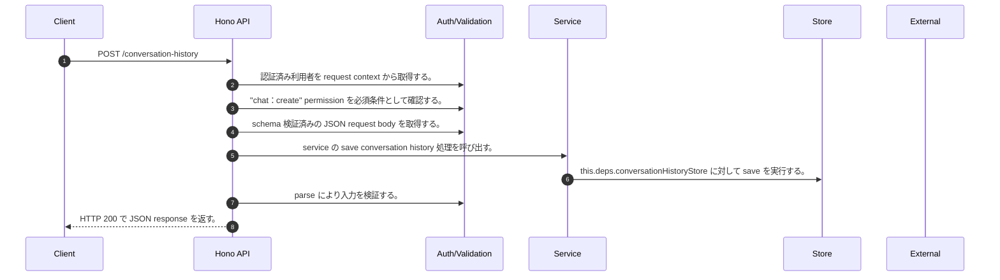

<!-- This file is generated by npm run docs:api-code. Do not edit manually. -->

# POST /conversation-history シーケンス

## シーケンス図

## 処理順とコード対応

| # | Caller | 境界 | 処理 | コード | 実装位置 |
| ---: | --- | --- | --- | --- | --- |
| 1 | `POST /conversation-history handler` | Auth | 認証済み利用者を request context から取得する。 | `c.get("user")` | `apps/api/src/routes/conversation-history-routes.ts:47 (POST /conversation-history handler)` |
| 2 | `POST /conversation-history handler` | Auth | "chat:create" permission を必須条件として確認する。 | `requirePermission(user, "chat:create")` | `apps/api/src/routes/conversation-history-routes.ts:48 (POST /conversation-history handler)` |
| 3 | `POST /conversation-history handler` | Validation | schema 検証済みの JSON request body を取得する。 | `validJson<z.infer<typeof ConversationHistoryItemSchema>>(c)` | `apps/api/src/routes/conversation-history-routes.ts:49 (POST /conversation-history handler)` |
| 4 | `POST /conversation-history handler` | Service | service の save conversation history 処理を呼び出す。 | `service.saveConversationHistory(user, body)` | `apps/api/src/routes/conversation-history-routes.ts:50 (POST /conversation-history handler)` |
| 5 | `MemoRagService.saveConversationHistory` | Store | `this.deps.conversationHistoryStore` に対して save を実行する。 | `this.deps.conversationHistoryStore.save(ownerKey, { ...input, isFavorite: false })` | `apps/api/src/rag/memorag-service.ts:4129 (MemoRagService.saveConversationHistory)` |
| 6 | `POST /conversation-history handler` | Validation | parse により入力を検証する。 | `ConversationHistoryItemSchema.parse(await service.saveConversationHistory(user, body))` | `apps/api/src/routes/conversation-history-routes.ts:50 (POST /conversation-history handler)` |
| 7 | `POST /conversation-history handler` | HTTP/SSE | HTTP 200 で JSON response を返す。 | `c.json(ConversationHistoryItemSchema.parse(await service.saveConversationHistory(user, body)), 200)` | `apps/api/src/routes/conversation-history-routes.ts:50 (POST /conversation-history handler)` |

## 分岐

| ID | Function | 条件 | 実装位置 |
| --- | --- | --- | --- |
| B001 | `requirePermission` | 利用者が 指定された permission を持たない | `apps/api/src/authorization.ts:184 (requirePermission)` |
