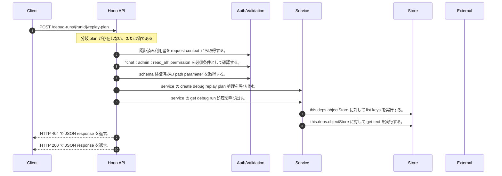

<!-- This file is generated by npm run docs:api-code. Do not edit manually. -->

# POST /debug-runs/{runId}/replay-plan シーケンス

## シーケンス図

## 処理順とコード対応

| # | Caller | 境界 | 処理 | コード | 実装位置 |
| ---: | --- | --- | --- | --- | --- |
| 1 | `POST /debug-runs/{runId}/replay-plan handler` | Auth | 認証済み利用者を request context から取得する。 | `c.get("user")` | `apps/api/src/routes/debug-routes.ts:95 (POST /debug-runs/{runId}/replay-plan handler)` |
| 2 | `POST /debug-runs/{runId}/replay-plan handler` | Auth | "chat:admin:read_all" permission を必須条件として確認する。 | `requirePermission(c.get("user"), "chat:admin:read_all")` | `apps/api/src/routes/debug-routes.ts:95 (POST /debug-runs/{runId}/replay-plan handler)` |
| 3 | `POST /debug-runs/{runId}/replay-plan handler` | Validation | schema 検証済みの path parameter を取得する。 | `validParam<{ runId: string }>(c)` | `apps/api/src/routes/debug-routes.ts:96 (POST /debug-runs/{runId}/replay-plan handler)` |
| 4 | `POST /debug-runs/{runId}/replay-plan handler` | Service | service の create debug replay plan 処理を呼び出す。 | `service.createDebugReplayPlan(runId)` | `apps/api/src/routes/debug-routes.ts:97 (POST /debug-runs/{runId}/replay-plan handler)` |
| 5 | `MemoRagService.createDebugReplayPlan` | Service | service の get debug run 処理を呼び出す。 | `this.getDebugRun(runId)` | `apps/api/src/rag/memorag-service.ts:1060 (MemoRagService.createDebugReplayPlan)` |
| 6 | `MemoRagService.getDebugRun` | Store | `this.deps.objectStore` に対して list keys を実行する。 | `this.deps.objectStore.listKeys("debug-runs/")` | `apps/api/src/rag/memorag-service.ts:1045 (MemoRagService.getDebugRun)` |
| 7 | `MemoRagService.getDebugRun` | Store | `this.deps.objectStore` に対して get text を実行する。 | `this.deps.objectStore.getText(key)` | `apps/api/src/rag/memorag-service.ts:1048 (MemoRagService.getDebugRun)` |
| 8 | `POST /debug-runs/{runId}/replay-plan handler` | HTTP/SSE | HTTP 404 で JSON response を返す。 | `c.json({ error: "Debug run not found" }, 404)` | `apps/api/src/routes/debug-routes.ts:98 (POST /debug-runs/{runId}/replay-plan handler)` |
| 9 | `POST /debug-runs/{runId}/replay-plan handler` | HTTP/SSE | HTTP 200 で JSON response を返す。 | `c.json(plan, 200)` | `apps/api/src/routes/debug-routes.ts:99 (POST /debug-runs/{runId}/replay-plan handler)` |

## 分岐

| ID | Function | 条件 | 実装位置 |
| --- | --- | --- | --- |
| B001 | `POST /debug-runs/{runId}/replay-plan handler` | `plan` が存在しない、または偽である | `apps/api/src/routes/debug-routes.ts:98 (POST /debug-runs/{runId}/replay-plan handler)` |
| B002 | `requirePermission` | 利用者が 指定された permission を持たない | `apps/api/src/authorization.ts:267 (requirePermission)` |
| B003 | `MemoRagService.createDebugReplayPlan` | `trace` が存在しない、または偽である | `apps/api/src/rag/memorag-service.ts:1061 (MemoRagService.createDebugReplayPlan)` |
