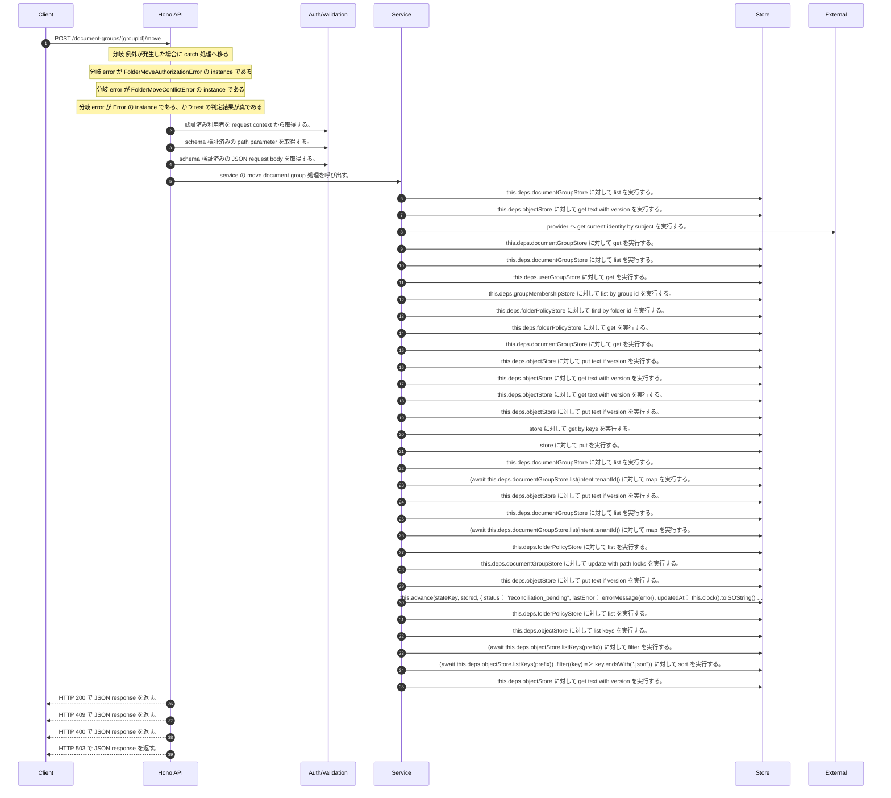

<!-- This file is generated by npm run docs:api-code. Do not edit manually. -->

# POST /document-groups/{groupId}/move シーケンス

## シーケンス図

## 処理順とコード対応

| # | Caller | 境界 | 処理 | コード | 実装位置 |
| ---: | --- | --- | --- | --- | --- |
| 1 | `POST /document-groups/{groupId}/move handler` | Auth | 認証済み利用者を request context から取得する。 | `c.get("user")` | `apps/api/src/routes/document-routes.ts:755 (POST /document-groups/{groupId}/move handler)` |
| 2 | `POST /document-groups/{groupId}/move handler` | Validation | schema 検証済みの path parameter を取得する。 | `validParam<{ groupId: string }>(c)` | `apps/api/src/routes/document-routes.ts:756 (POST /document-groups/{groupId}/move handler)` |
| 3 | `POST /document-groups/{groupId}/move handler` | Validation | schema 検証済みの JSON request body を取得する。 | `validJson<z.infer<typeof FolderMoveRequestSchema>>(c)` | `apps/api/src/routes/document-routes.ts:757 (POST /document-groups/{groupId}/move handler)` |
| 4 | `POST /document-groups/{groupId}/move handler` | Service | service の move document group 処理を呼び出す。 | `service.moveDocumentGroup(user, groupId, body)` | `apps/api/src/routes/document-routes.ts:759 (POST /document-groups/{groupId}/move handler)` |
| 5 | `FolderLifecycleMutationCoordinator.moveFolder` | Store | `this.deps.documentGroupStore` に対して list を実行する。 | `this.deps.documentGroupStore.list(actorTenantId)` | `apps/api/src/folders/folder-lifecycle-mutation-coordinator.ts:178 (FolderLifecycleMutationCoordinator.moveFolder)` |
| 6 | `FolderLifecycleMutationCoordinator.readState` | Store | `this.deps.objectStore` に対して get text with version を実行する。 | `this.deps.objectStore.getTextWithVersion(key)` | `apps/api/src/folders/folder-lifecycle-mutation-coordinator.ts:828 (FolderLifecycleMutationCoordinator.readState)` |
| 7 | `FolderLifecycleMutationCoordinator.resolveCurrentActor` | External | `provider` へ get current identity by subject を実行する。 | `provider.getCurrentIdentityBySubject(actor.userId)` | `apps/api/src/folders/folder-lifecycle-mutation-coordinator.ts:737 (FolderLifecycleMutationCoordinator.resolveCurrentActor)` |
| 8 | `FolderLifecycleMutationCoordinator.authorizeMove` | Store | `this.deps.documentGroupStore` に対して get を実行する。 | `this.deps.documentGroupStore.get(tenantId, sourceFolderId)` | `apps/api/src/folders/folder-lifecycle-mutation-coordinator.ts:682 (FolderLifecycleMutationCoordinator.authorizeMove)` |
| 9 | `FolderPermissionService.resolveEffectiveFolderPermissionDetail` | Store | `this.deps.documentGroupStore` に対して list を実行する。 | `this.deps.documentGroupStore.list(actorTenantId)` | `apps/api/src/folders/folder-permission-service.ts:145 (FolderPermissionService.resolveEffectiveFolderPermissionDetail)` |
| 10 | `FolderPermissionService.resolveUserMembershipPermission` | Store | `this.deps.userGroupStore` に対して get を実行する。 | `this.deps.userGroupStore.get(tenantId, groupId)` | `apps/api/src/folders/folder-permission-service.ts:780 (FolderPermissionService.resolveUserMembershipPermission)` |
| 11 | `FolderPermissionService.resolveUserMembershipPermission` | Store | `this.deps.groupMembershipStore` に対して list by group id を実行する。 | `this.deps.groupMembershipStore.listByGroupId(tenantId, groupId)` | `apps/api/src/folders/folder-permission-service.ts:781 (FolderPermissionService.resolveUserMembershipPermission)` |
| 12 | `FolderPermissionService.resolvePolicyContext` | Store | `this.deps.folderPolicyStore` に対して find by folder id を実行する。 | `this.deps.folderPolicyStore.findByFolderId(folder.tenantId, current.groupId)` | `apps/api/src/folders/folder-permission-service.ts:695 (FolderPermissionService.resolvePolicyContext)` |
| 13 | `FolderPermissionService.resolvePolicyContext` | Store | `this.deps.folderPolicyStore` に対して get を実行する。 | `this.deps.folderPolicyStore.get(folder.tenantId, current.policyId)` | `apps/api/src/folders/folder-permission-service.ts:711 (FolderPermissionService.resolvePolicyContext)` |
| 14 | `FolderLifecycleMutationCoordinator.authorizeMove` | Store | `this.deps.documentGroupStore` に対して get を実行する。 | `this.deps.documentGroupStore.get(tenantId, destinationParentId)` | `apps/api/src/folders/folder-lifecycle-mutation-coordinator.ts:693 (FolderLifecycleMutationCoordinator.authorizeMove)` |
| 15 | `FolderLifecycleMutationCoordinator.writeState` | Store | `this.deps.objectStore` に対して put text if version を実行する。 | `this.deps.objectStore.putTextIfVersion(key, JSON.stringify(value, null, 2), expectedVersion, "application/json")` | `apps/api/src/folders/folder-lifecycle-mutation-coordinator.ts:837 (FolderLifecycleMutationCoordinator.writeState)` |
| 16 | `FolderLifecycleMutationCoordinator.writeState` | Store | `this.deps.objectStore` に対して get text with version を実行する。 | `this.deps.objectStore.getTextWithVersion(key)` | `apps/api/src/folders/folder-lifecycle-mutation-coordinator.ts:838 (FolderLifecycleMutationCoordinator.writeState)` |
| 17 | `FolderLifecycleMutationCoordinator.readManifest` | Store | `this.deps.objectStore` に対して get text with version を実行する。 | `this.deps.objectStore.getTextWithVersion(key)` | `apps/api/src/folders/folder-lifecycle-mutation-coordinator.ts:817 (FolderLifecycleMutationCoordinator.readManifest)` |
| 18 | `FolderLifecycleMutationCoordinator.stageDocuments` | Store | `this.deps.objectStore` に対して put text if version を実行する。 | `this.deps.objectStore.putTextIfVersion( document.manifestKey, JSON.stringify(document.stagedManifest, null, 2), current.version, "application/json" )` | `apps/api/src/folders/folder-lifecycle-mutation-coordinator.ts:506 (FolderLifecycleMutationCoordinator.stageDocuments)` |
| 19 | `FolderLifecycleMutationCoordinator.rewriteVectorProjection` | Store | `store` に対して get by keys を実行する。 | `store.getByKeys(keys)` | `apps/api/src/folders/folder-lifecycle-mutation-coordinator.ts:624 (FolderLifecycleMutationCoordinator.rewriteVectorProjection)` |
| 20 | `FolderLifecycleMutationCoordinator.rewriteVectorProjection` | Store | `store` に対して put を実行する。 | `store.put(records.map((record) => ({ ...record, metadata: vectorProjectionMetadata(record.metadata, projection, lifecycleStatus, operationId) })))` | `apps/api/src/folders/folder-lifecycle-mutation-coordinator.ts:628 (FolderLifecycleMutationCoordinator.rewriteVectorProjection)` |
| 21 | `FolderLifecycleMutationCoordinator.subtreeCommitState` | Store | `this.deps.documentGroupStore` に対して list を実行する。 | `this.deps.documentGroupStore.list(intent.tenantId)` | `apps/api/src/folders/folder-lifecycle-mutation-coordinator.ts:657 (FolderLifecycleMutationCoordinator.subtreeCommitState)` |
| 22 | `FolderLifecycleMutationCoordinator.subtreeCommitState` | Store | `(await this.deps.documentGroupStore.list(intent.tenantId))` に対して map を実行する。 | `(await this.deps.documentGroupStore.list(intent.tenantId)).map((group) => [group.groupId, group])` | `apps/api/src/folders/folder-lifecycle-mutation-coordinator.ts:657 (FolderLifecycleMutationCoordinator.subtreeCommitState)` |
| 23 | `FolderLifecycleMutationCoordinator.finishRollback` | Store | `this.deps.objectStore` に対して put text if version を実行する。 | `this.deps.objectStore.putTextIfVersion( document.manifestKey, JSON.stringify(document.sourceManifest, null, 2), latest.version, "application/json" )` | `apps/api/src/folders/folder-lifecycle-mutation-coordinator.ts:555 (FolderLifecycleMutationCoordinator.finishRollback)` |
| 24 | `FolderLifecycleMutationCoordinator.assertLocalPolicySnapshots` | Store | `this.deps.documentGroupStore` に対して list を実行する。 | `this.deps.documentGroupStore.list(intent.tenantId)` | `apps/api/src/folders/folder-lifecycle-mutation-coordinator.ts:644 (FolderLifecycleMutationCoordinator.assertLocalPolicySnapshots)` |
| 25 | `FolderLifecycleMutationCoordinator.assertLocalPolicySnapshots` | Store | `(await this.deps.documentGroupStore.list(intent.tenantId))` に対して map を実行する。 | `(await this.deps.documentGroupStore.list(intent.tenantId)).map((group) => [group.groupId, group])` | `apps/api/src/folders/folder-lifecycle-mutation-coordinator.ts:644 (FolderLifecycleMutationCoordinator.assertLocalPolicySnapshots)` |
| 26 | `FolderLifecycleMutationCoordinator.assertLocalPolicySnapshots` | Store | `this.deps.folderPolicyStore` に対して list を実行する。 | `this.deps.folderPolicyStore.list(intent.tenantId)` | `apps/api/src/folders/folder-lifecycle-mutation-coordinator.ts:645 (FolderLifecycleMutationCoordinator.assertLocalPolicySnapshots)` |
| 27 | `FolderLifecycleMutationCoordinator.runMoveStateMachine` | Store | `this.deps.documentGroupStore` に対して update with path locks を実行する。 | `this.deps.documentGroupStore.updateWithPathLocks( intent.tenantId, intent.folderSnapshots.map(({ current, next }) => ({ current, next })) )` | `apps/api/src/folders/folder-lifecycle-mutation-coordinator.ts:439 (FolderLifecycleMutationCoordinator.runMoveStateMachine)` |
| 28 | `FolderLifecycleMutationCoordinator.convergeDocumentsToAfter` | Store | `this.deps.objectStore` に対して put text if version を実行する。 | `this.deps.objectStore.putTextIfVersion( document.manifestKey, JSON.stringify(document.targetManifest, null, 2), current.version, "application/json" )` | `apps/api/src/folders/folder-lifecycle-mutation-coordinator.ts:530 (FolderLifecycleMutationCoordinator.convergeDocumentsToAfter)` |
| 29 | `FolderLifecycleMutationCoordinator.runMoveStateMachine` | Store | `this.advance(stateKey, stored, {             status: "reconciliation_pending",             lastError: errorMessage(error),             updatedAt: this.clock().toISOString()           })` に対して catch を実行する。 | `this.advance(stateKey, stored, { status: "reconciliation_pending", lastError: errorMessage(error), updatedAt: this.clock().toISOString() }).catch(() => undefined)` | `apps/api/src/folders/folder-lifecycle-mutation-coordinator.ts:467 (FolderLifecycleMutationCoordinator.runMoveStateMachine)` |
| 30 | `FolderLifecycleMutationCoordinator.prepareIntent` | Store | `this.deps.folderPolicyStore` に対して list を実行する。 | `this.deps.folderPolicyStore.list(input.tenantId)` | `apps/api/src/folders/folder-lifecycle-mutation-coordinator.ts:269 (FolderLifecycleMutationCoordinator.prepareIntent)` |
| 31 | `FolderLifecycleMutationCoordinator.loadAffectedDocuments` | Store | `this.deps.objectStore` に対して list keys を実行する。 | `this.deps.objectStore.listKeys(prefix)` | `apps/api/src/folders/folder-lifecycle-mutation-coordinator.ts:335 (FolderLifecycleMutationCoordinator.loadAffectedDocuments)` |
| 32 | `FolderLifecycleMutationCoordinator.loadAffectedDocuments` | Store | `(await this.deps.objectStore.listKeys(prefix))       ` に対して filter を実行する。 | `(await this.deps.objectStore.listKeys(prefix)) .filter((key) => key.endsWith(".json"))` | `apps/api/src/folders/folder-lifecycle-mutation-coordinator.ts:335 (FolderLifecycleMutationCoordinator.loadAffectedDocuments)` |
| 33 | `FolderLifecycleMutationCoordinator.loadAffectedDocuments` | Store | `(await this.deps.objectStore.listKeys(prefix))       .filter((key) => key.endsWith(".json"))       ` に対して sort を実行する。 | `(await this.deps.objectStore.listKeys(prefix)) .filter((key) => key.endsWith(".json")) .sort()` | `apps/api/src/folders/folder-lifecycle-mutation-coordinator.ts:335 (FolderLifecycleMutationCoordinator.loadAffectedDocuments)` |
| 34 | `FolderLifecycleMutationCoordinator.loadAffectedDocuments` | Store | `this.deps.objectStore` に対して get text with version を実行する。 | `this.deps.objectStore.getTextWithVersion(key)` | `apps/api/src/folders/folder-lifecycle-mutation-coordinator.ts:340 (FolderLifecycleMutationCoordinator.loadAffectedDocuments)` |
| 35 | `POST /document-groups/{groupId}/move handler` | HTTP/SSE | HTTP 200 で JSON response を返す。 | `c.json({ operationId: result.operationId, folder: result.folder, subtree: result.subtree, affectedDocumentCount: result.affectedDocumentIds.length, directDocumentGrantsPreserved: result.directDocumentGrantsPreserved, fo…` | `apps/api/src/routes/document-routes.ts:760 (POST /document-groups/{groupId}/move handler)` |
| 36 | `POST /document-groups/{groupId}/move handler` | HTTP/SSE | HTTP 409 で JSON response を返す。 | `c.json({ error: "Folder move conflict" }, 409)` | `apps/api/src/routes/document-routes.ts:771 (POST /document-groups/{groupId}/move handler)` |
| 37 | `POST /document-groups/{groupId}/move handler` | HTTP/SSE | HTTP 400 で JSON response を返す。 | `c.json({ error: "Invalid folder move request" }, 400)` | `apps/api/src/routes/document-routes.ts:773 (POST /document-groups/{groupId}/move handler)` |
| 38 | `POST /document-groups/{groupId}/move handler` | HTTP/SSE | HTTP 503 で JSON response を返す。 | `c.json({ error: "Folder move reconciliation pending" }, 503)` | `apps/api/src/routes/document-routes.ts:775 (POST /document-groups/{groupId}/move handler)` |

## 分岐

| ID | Function | 条件 | 実装位置 |
| --- | --- | --- | --- |
| B001 | `POST /document-groups/{groupId}/move handler` | 例外が発生した場合に catch 処理へ移る | `apps/api/src/routes/document-routes.ts:769 (POST /document-groups/{groupId}/move handler)` |
| B002 | `POST /document-groups/{groupId}/move handler` | `error` が `FolderMoveAuthorizationError` の instance である | `apps/api/src/routes/document-routes.ts:770 (POST /document-groups/{groupId}/move handler)` |
| B003 | `POST /document-groups/{groupId}/move handler` | `error` が `FolderMoveConflictError` の instance である | `apps/api/src/routes/document-routes.ts:771 (POST /document-groups/{groupId}/move handler)` |
| B004 | `POST /document-groups/{groupId}/move handler` | `error` が `Error` の instance である、かつ test の判定結果が真である | `apps/api/src/routes/document-routes.ts:772 (POST /document-groups/{groupId}/move handler)` |
