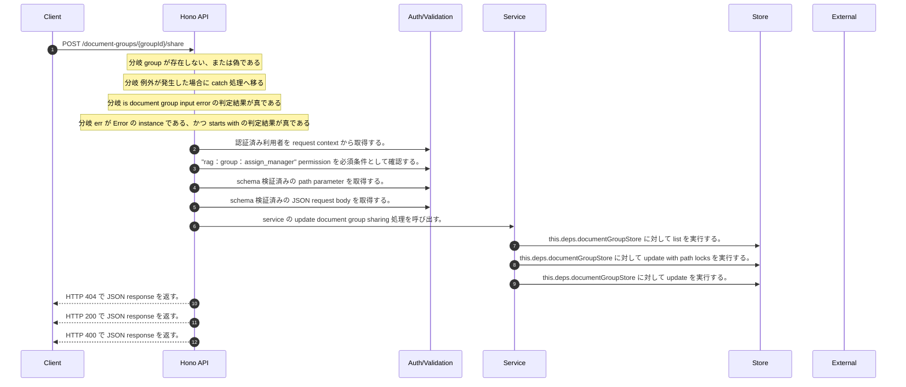

<!-- This file is generated by npm run docs:api-code. Do not edit manually. -->

# POST /document-groups/{groupId}/share シーケンス

## シーケンス図

## 処理順とコード対応

| # | Caller | 境界 | 処理 | コード | 実装位置 |
| ---: | --- | --- | --- | --- | --- |
| 1 | `POST /document-groups/{groupId}/share handler` | Auth | 認証済み利用者を request context から取得する。 | `c.get("user")` | `apps/api/src/routes/document-routes.ts:284 (POST /document-groups/{groupId}/share handler)` |
| 2 | `POST /document-groups/{groupId}/share handler` | Auth | "rag:group:assign_manager" permission を必須条件として確認する。 | `requirePermission(user, "rag:group:assign_manager")` | `apps/api/src/routes/document-routes.ts:285 (POST /document-groups/{groupId}/share handler)` |
| 3 | `POST /document-groups/{groupId}/share handler` | Validation | schema 検証済みの path parameter を取得する。 | `validParam<{ groupId: string }>(c)` | `apps/api/src/routes/document-routes.ts:286 (POST /document-groups/{groupId}/share handler)` |
| 4 | `POST /document-groups/{groupId}/share handler` | Validation | schema 検証済みの JSON request body を取得する。 | `validJson<z.infer<typeof ShareDocumentGroupRequestSchema>>(c)` | `apps/api/src/routes/document-routes.ts:287 (POST /document-groups/{groupId}/share handler)` |
| 5 | `POST /document-groups/{groupId}/share handler` | Service | service の update document group sharing 処理を呼び出す。 | `service.updateDocumentGroupSharing(user, groupId, body)` | `apps/api/src/routes/document-routes.ts:289 (POST /document-groups/{groupId}/share handler)` |
| 6 | `MemoRagService.updateDocumentGroupSharing` | Store | `this.deps.documentGroupStore` に対して list を実行する。 | `this.deps.documentGroupStore.list()` | `apps/api/src/rag/memorag-service.ts:498 (MemoRagService.updateDocumentGroupSharing)` |
| 7 | `MemoRagService.updateDocumentGroupSharing` | Store | `this.deps.documentGroupStore` に対して update with path locks を実行する。 | `this.deps.documentGroupStore.updateWithPathLocks(pathUpdates)` | `apps/api/src/rag/memorag-service.ts:547 (MemoRagService.updateDocumentGroupSharing)` |
| 8 | `MemoRagService.updateDocumentGroupSharing` | Store | `this.deps.documentGroupStore` に対して update を実行する。 | `this.deps.documentGroupStore.update(groupId, { ...update, updatedAt: now })` | `apps/api/src/rag/memorag-service.ts:550 (MemoRagService.updateDocumentGroupSharing)` |
| 9 | `POST /document-groups/{groupId}/share handler` | HTTP/SSE | HTTP 404 で JSON response を返す。 | `c.json({ error: "Document group not found" }, 404)` | `apps/api/src/routes/document-routes.ts:290 (POST /document-groups/{groupId}/share handler)` |
| 10 | `POST /document-groups/{groupId}/share handler` | HTTP/SSE | HTTP 200 で JSON response を返す。 | `c.json(group, 200)` | `apps/api/src/routes/document-routes.ts:291 (POST /document-groups/{groupId}/share handler)` |
| 11 | `POST /document-groups/{groupId}/share handler` | HTTP/SSE | HTTP 400 で JSON response を返す。 | `c.json({ error: (err as Error).message }, 400)` | `apps/api/src/routes/document-routes.ts:293 (POST /document-groups/{groupId}/share handler)` |

## 分岐

| ID | Function | 条件 | 実装位置 |
| --- | --- | --- | --- |
| B001 | `POST /document-groups/{groupId}/share handler` | `group` が存在しない、または偽である | `apps/api/src/routes/document-routes.ts:290 (POST /document-groups/{groupId}/share handler)` |
| B002 | `POST /document-groups/{groupId}/share handler` | 例外が発生した場合に catch 処理へ移る | `apps/api/src/routes/document-routes.ts:292 (POST /document-groups/{groupId}/share handler)` |
| B003 | `POST /document-groups/{groupId}/share handler` | is document group input error の判定結果が真である | `apps/api/src/routes/document-routes.ts:293 (POST /document-groups/{groupId}/share handler)` |
| B004 | `POST /document-groups/{groupId}/share handler` | `err` が `Error` の instance である、かつ starts with の判定結果が真である | `apps/api/src/routes/document-routes.ts:294 (POST /document-groups/{groupId}/share handler)` |
| B005 | `requirePermission` | 利用者が 指定された permission を持たない | `apps/api/src/authorization.ts:267 (requirePermission)` |
| B006 | `MemoRagService.updateDocumentGroupSharing` | `group` が存在しない、または偽である | `apps/api/src/rag/memorag-service.ts:500 (MemoRagService.updateDocumentGroupSharing)` |
| B007 | `MemoRagService.updateDocumentGroupSharing` | can manage document group の判定結果が真ではない | `apps/api/src/rag/memorag-service.ts:501 (MemoRagService.updateDocumentGroupSharing)` |
| B008 | `MemoRagService.updateDocumentGroupSharing` | `input.name` が `undefined` と異なる | `apps/api/src/rag/memorag-service.ts:504 (MemoRagService.updateDocumentGroupSharing)` |
| B009 | `MemoRagService.updateDocumentGroupSharing` | `input.description` が `undefined` と異なる | `apps/api/src/rag/memorag-service.ts:509 (MemoRagService.updateDocumentGroupSharing)` |
| B010 | `MemoRagService.updateDocumentGroupSharing` | `input.visibility` が `undefined` と異なる | `apps/api/src/rag/memorag-service.ts:510 (MemoRagService.updateDocumentGroupSharing)` |
| B011 | `MemoRagService.updateDocumentGroupSharing` | `input.sharedUserIds` が `undefined` と異なる | `apps/api/src/rag/memorag-service.ts:511 (MemoRagService.updateDocumentGroupSharing)` |
| B012 | `MemoRagService.updateDocumentGroupSharing` | `input.sharedGroups` が `undefined` と異なる | `apps/api/src/rag/memorag-service.ts:512 (MemoRagService.updateDocumentGroupSharing)` |
| B013 | `MemoRagService.updateDocumentGroupSharing` | `input.managerUserIds` が `undefined` と異なる | `apps/api/src/rag/memorag-service.ts:513 (MemoRagService.updateDocumentGroupSharing)` |
| B014 | `MemoRagService.updateDocumentGroupSharing` | document group has legacy explicit policy の判定結果が真である | `apps/api/src/rag/memorag-service.ts:514 (MemoRagService.updateDocumentGroupSharing)` |
| B015 | `MemoRagService.updateDocumentGroupSharing` | `group.parentGroupId` が存在し、真である | `apps/api/src/rag/memorag-service.ts:516 (MemoRagService.updateDocumentGroupSharing)` |
| B016 | `MemoRagService.updateDocumentGroupSharing` | `input.parentGroupId` が `undefined` と異なる | `apps/api/src/rag/memorag-service.ts:517 (MemoRagService.updateDocumentGroupSharing)` |
| B017 | `MemoRagService.updateDocumentGroupSharing` | `parentGroupId` が `null` と等しい | `apps/api/src/rag/memorag-service.ts:520 (MemoRagService.updateDocumentGroupSharing)` |
| B018 | `MemoRagService.updateDocumentGroupSharing` | `parentGroupId` が `group.groupId` と等しい | `apps/api/src/rag/memorag-service.ts:525 (MemoRagService.updateDocumentGroupSharing)` |
| B019 | `MemoRagService.updateDocumentGroupSharing` | `parent` が存在しない、または偽である | `apps/api/src/rag/memorag-service.ts:527 (MemoRagService.updateDocumentGroupSharing)` |
| B020 | `MemoRagService.updateDocumentGroupSharing` | `(parent.ancestorGroupIds ?? [])` が group.groupId を含む | `apps/api/src/rag/memorag-service.ts:528 (MemoRagService.updateDocumentGroupSharing)` |
| B021 | `MemoRagService.updateDocumentGroupSharing` | can manage document group の判定結果が真ではない | `apps/api/src/rag/memorag-service.ts:529 (MemoRagService.updateDocumentGroupSharing)` |
| B022 | `MemoRagService.updateDocumentGroupSharing` | `parentChanged` が存在し、真である、または `input.name` が `undefined` と異なる | `apps/api/src/rag/memorag-service.ts:535 (MemoRagService.updateDocumentGroupSharing)` |
| B023 | `MemoRagService.updateDocumentGroupSharing` | `pathUpdates.length` が `maxDocumentGroupPathTransactionItems` より大きい | `apps/api/src/rag/memorag-service.ts:537 (MemoRagService.updateDocumentGroupSharing)` |
| B024 | `MemoRagService.updateDocumentGroupSharing` | map の判定結果が真である | `apps/api/src/rag/memorag-service.ts:538 (MemoRagService.updateDocumentGroupSharing)` |
| B025 | `MemoRagService.updateDocumentGroupSharing` | `conflict` が存在し、真である | `apps/api/src/rag/memorag-service.ts:545 (MemoRagService.updateDocumentGroupSharing)` |
