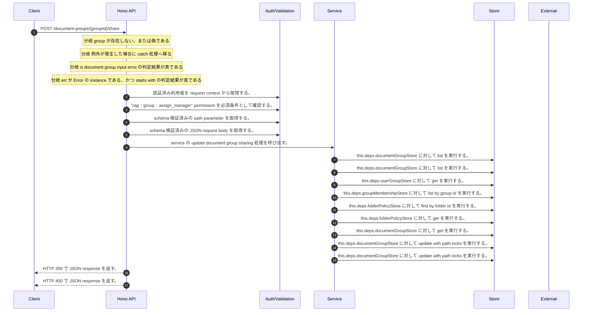

<!-- This file is generated by npm run docs:api-code. Do not edit manually. -->

# POST /document-groups/{groupId}/share シーケンス

## シーケンス図

## 処理順とコード対応

| # | Caller | 境界 | 処理 | コード | 実装位置 |
| ---: | --- | --- | --- | --- | --- |
| 1 | `POST /document-groups/{groupId}/share handler` | Auth | 認証済み利用者を request context から取得する。 | `c.get("user")` | `apps/api/src/routes/document-routes.ts:712 (POST /document-groups/{groupId}/share handler)` |
| 2 | `POST /document-groups/{groupId}/share handler` | Auth | "rag:group:assign_manager" permission を必須条件として確認する。 | `requirePermission(user, "rag:group:assign_manager")` | `apps/api/src/routes/document-routes.ts:713 (POST /document-groups/{groupId}/share handler)` |
| 3 | `POST /document-groups/{groupId}/share handler` | Validation | schema 検証済みの path parameter を取得する。 | `validParam<{ groupId: string }>(c)` | `apps/api/src/routes/document-routes.ts:714 (POST /document-groups/{groupId}/share handler)` |
| 4 | `POST /document-groups/{groupId}/share handler` | Validation | schema 検証済みの JSON request body を取得する。 | `validJson<z.infer<typeof ShareDocumentGroupRequestSchema>>(c)` | `apps/api/src/routes/document-routes.ts:715 (POST /document-groups/{groupId}/share handler)` |
| 5 | `POST /document-groups/{groupId}/share handler` | Service | service の update document group sharing 処理を呼び出す。 | `service.updateDocumentGroupSharing(user, groupId, body)` | `apps/api/src/routes/document-routes.ts:717 (POST /document-groups/{groupId}/share handler)` |
| 6 | `MemoRagService.updateDocumentGroupSharing` | Store | `this.deps.documentGroupStore` に対して list を実行する。 | `this.deps.documentGroupStore.list(authoritativeActorTenantId(actor))` | `apps/api/src/rag/memorag-service.ts:1201 (MemoRagService.updateDocumentGroupSharing)` |
| 7 | `FolderPermissionService.resolveEffectiveFolderPermissionDetail` | Store | `this.deps.documentGroupStore` に対して list を実行する。 | `this.deps.documentGroupStore.list(actorTenantId)` | `apps/api/src/folders/folder-permission-service.ts:145 (FolderPermissionService.resolveEffectiveFolderPermissionDetail)` |
| 8 | `FolderPermissionService.resolveUserMembershipPermission` | Store | `this.deps.userGroupStore` に対して get を実行する。 | `this.deps.userGroupStore.get(tenantId, groupId)` | `apps/api/src/folders/folder-permission-service.ts:780 (FolderPermissionService.resolveUserMembershipPermission)` |
| 9 | `FolderPermissionService.resolveUserMembershipPermission` | Store | `this.deps.groupMembershipStore` に対して list by group id を実行する。 | `this.deps.groupMembershipStore.listByGroupId(tenantId, groupId)` | `apps/api/src/folders/folder-permission-service.ts:781 (FolderPermissionService.resolveUserMembershipPermission)` |
| 10 | `FolderPermissionService.resolvePolicyContext` | Store | `this.deps.folderPolicyStore` に対して find by folder id を実行する。 | `this.deps.folderPolicyStore.findByFolderId(folder.tenantId, current.groupId)` | `apps/api/src/folders/folder-permission-service.ts:695 (FolderPermissionService.resolvePolicyContext)` |
| 11 | `FolderPermissionService.resolvePolicyContext` | Store | `this.deps.folderPolicyStore` に対して get を実行する。 | `this.deps.folderPolicyStore.get(folder.tenantId, current.policyId)` | `apps/api/src/folders/folder-permission-service.ts:711 (FolderPermissionService.resolvePolicyContext)` |
| 12 | `FolderPermissionService.assertFolderOperation` | Store | `this.deps.documentGroupStore` に対して get を実行する。 | `this.deps.documentGroupStore.get(actorTenantId, folderId)` | `apps/api/src/folders/folder-permission-service.ts:110 (FolderPermissionService.assertFolderOperation)` |
| 13 | `MemoRagService.updateDocumentGroupSharing` | Store | `this.deps.documentGroupStore` に対して update with path locks を実行する。 | `this.deps.documentGroupStore.updateWithPathLocks(group.tenantId, pathUpdates)` | `apps/api/src/rag/memorag-service.ts:1231 (MemoRagService.updateDocumentGroupSharing)` |
| 14 | `MemoRagService.updateDocumentGroupSharing` | Store | `this.deps.documentGroupStore` に対して update with path locks を実行する。 | `this.deps.documentGroupStore.updateWithPathLocks(group.tenantId, [{ current: group, next: { ...group, ...update, updatedAt: now } }])` | `apps/api/src/rag/memorag-service.ts:1234 (MemoRagService.updateDocumentGroupSharing)` |
| 15 | `POST /document-groups/{groupId}/share handler` | HTTP/SSE | HTTP 200 で JSON response を返す。 | `c.json(group, 200)` | `apps/api/src/routes/document-routes.ts:719 (POST /document-groups/{groupId}/share handler)` |
| 16 | `POST /document-groups/{groupId}/share handler` | HTTP/SSE | HTTP 400 で JSON response を返す。 | `c.json({ error: (err as Error).message }, 400)` | `apps/api/src/routes/document-routes.ts:721 (POST /document-groups/{groupId}/share handler)` |

## 分岐

| ID | Function | 条件 | 実装位置 |
| --- | --- | --- | --- |
| B001 | `POST /document-groups/{groupId}/share handler` | `group` が存在しない、または偽である | `apps/api/src/routes/document-routes.ts:718 (POST /document-groups/{groupId}/share handler)` |
| B002 | `POST /document-groups/{groupId}/share handler` | 例外が発生した場合に catch 処理へ移る | `apps/api/src/routes/document-routes.ts:720 (POST /document-groups/{groupId}/share handler)` |
| B003 | `POST /document-groups/{groupId}/share handler` | is document group input error の判定結果が真である | `apps/api/src/routes/document-routes.ts:721 (POST /document-groups/{groupId}/share handler)` |
| B004 | `POST /document-groups/{groupId}/share handler` | `err` が `Error` の instance である、かつ starts with の判定結果が真である | `apps/api/src/routes/document-routes.ts:722 (POST /document-groups/{groupId}/share handler)` |
| B005 | `requirePermission` | 利用者が 指定された permission を持たない | `apps/api/src/authorization.ts:184 (requirePermission)` |
| B006 | `MemoRagService.updateDocumentGroupSharing` | `group` が存在しない、または偽である | `apps/api/src/rag/memorag-service.ts:1203 (MemoRagService.updateDocumentGroupSharing)` |
| B007 | `MemoRagService.updateDocumentGroupSharing` | `(await folderPermissions.resolveEffectiveFolderPermission(actor, group.groupId))` が `"full"` と異なる | `apps/api/src/rag/memorag-service.ts:1205 (MemoRagService.updateDocumentGroupSharing)` |
| B008 | `MemoRagService.updateDocumentGroupSharing` | `input.name` が `undefined` と異なる | `apps/api/src/rag/memorag-service.ts:1211 (MemoRagService.updateDocumentGroupSharing)` |
| B009 | `MemoRagService.updateDocumentGroupSharing` | `input.description` が `undefined` と異なる | `apps/api/src/rag/memorag-service.ts:1216 (MemoRagService.updateDocumentGroupSharing)` |
| B010 | `MemoRagService.updateDocumentGroupSharing` | `group.parentGroupId` が存在し、真である | `apps/api/src/rag/memorag-service.ts:1217 (MemoRagService.updateDocumentGroupSharing)` |
| B011 | `MemoRagService.updateDocumentGroupSharing` | `input.name` が `undefined` と異なる | `apps/api/src/rag/memorag-service.ts:1219 (MemoRagService.updateDocumentGroupSharing)` |
| B012 | `MemoRagService.updateDocumentGroupSharing` | `pathUpdates.length` が `maxDocumentGroupPathTransactionItems` より大きい | `apps/api/src/rag/memorag-service.ts:1221 (MemoRagService.updateDocumentGroupSharing)` |
| B013 | `MemoRagService.updateDocumentGroupSharing` | map の判定結果が真である | `apps/api/src/rag/memorag-service.ts:1222 (MemoRagService.updateDocumentGroupSharing)` |
| B014 | `MemoRagService.updateDocumentGroupSharing` | `conflict` が存在し、真である | `apps/api/src/rag/memorag-service.ts:1229 (MemoRagService.updateDocumentGroupSharing)` |
