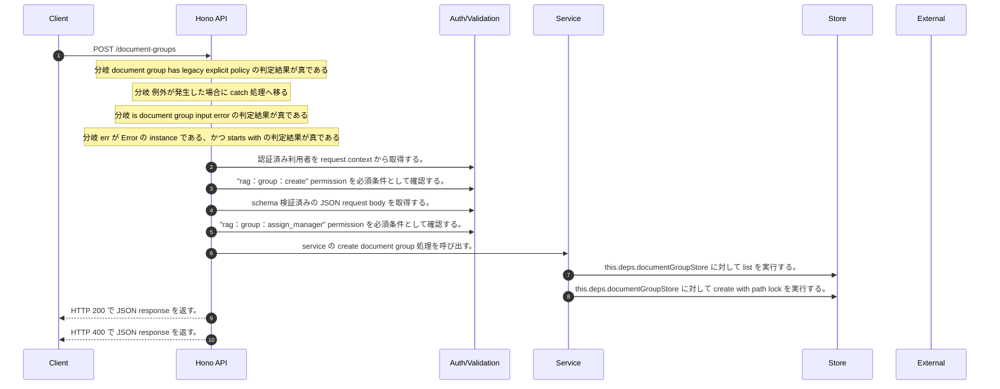

<!-- This file is generated by npm run docs:api-code. Do not edit manually. -->

# POST /document-groups シーケンス

## シーケンス図

## 処理順とコード対応

| # | Caller | 境界 | 処理 | コード | 実装位置 |
| ---: | --- | --- | --- | --- | --- |
| 1 | `POST /document-groups handler` | Auth | 認証済み利用者を request context から取得する。 | `c.get("user")` | `apps/api/src/routes/document-routes.ts:250 (POST /document-groups handler)` |
| 2 | `POST /document-groups handler` | Auth | "rag:group:create" permission を必須条件として確認する。 | `requirePermission(user, "rag:group:create")` | `apps/api/src/routes/document-routes.ts:251 (POST /document-groups handler)` |
| 3 | `POST /document-groups handler` | Validation | schema 検証済みの JSON request body を取得する。 | `validJson<z.infer<typeof CreateDocumentGroupRequestSchema>>(c)` | `apps/api/src/routes/document-routes.ts:252 (POST /document-groups handler)` |
| 4 | `POST /document-groups handler` | Auth | "rag:group:assign_manager" permission を必須条件として確認する。 | `requirePermission(user, "rag:group:assign_manager")` | `apps/api/src/routes/document-routes.ts:253 (POST /document-groups handler)` |
| 5 | `POST /document-groups handler` | Service | service の create document group 処理を呼び出す。 | `service.createDocumentGroup(user, body)` | `apps/api/src/routes/document-routes.ts:255 (POST /document-groups handler)` |
| 6 | `MemoRagService.createDocumentGroup` | Store | `this.deps.documentGroupStore` に対して list を実行する。 | `this.deps.documentGroupStore.list()` | `apps/api/src/rag/memorag-service.ts:447 (MemoRagService.createDocumentGroup)` |
| 7 | `MemoRagService.createDocumentGroup` | Store | `this.deps.documentGroupStore` に対して create with path lock を実行する。 | `this.deps.documentGroupStore.createWithPathLock(group)` | `apps/api/src/rag/memorag-service.ts:486 (MemoRagService.createDocumentGroup)` |
| 8 | `POST /document-groups handler` | HTTP/SSE | HTTP 200 で JSON response を返す。 | `c.json(await service.createDocumentGroup(user, body), 200)` | `apps/api/src/routes/document-routes.ts:255 (POST /document-groups handler)` |
| 9 | `POST /document-groups handler` | HTTP/SSE | HTTP 400 で JSON response を返す。 | `c.json({ error: (err as Error).message }, 400)` | `apps/api/src/routes/document-routes.ts:257 (POST /document-groups handler)` |

## 分岐

| ID | Function | 条件 | 実装位置 |
| --- | --- | --- | --- |
| B001 | `POST /document-groups handler` | document group has legacy explicit policy の判定結果が真である | `apps/api/src/routes/document-routes.ts:253 (POST /document-groups handler)` |
| B002 | `POST /document-groups handler` | 例外が発生した場合に catch 処理へ移る | `apps/api/src/routes/document-routes.ts:256 (POST /document-groups handler)` |
| B003 | `POST /document-groups handler` | is document group input error の判定結果が真である | `apps/api/src/routes/document-routes.ts:257 (POST /document-groups handler)` |
| B004 | `POST /document-groups handler` | `err` が `Error` の instance である、かつ starts with の判定結果が真である | `apps/api/src/routes/document-routes.ts:258 (POST /document-groups handler)` |
| B005 | `requirePermission` | 利用者が 指定された permission を持たない | `apps/api/src/authorization.ts:267 (requirePermission)` |
| B006 | `MemoRagService.createDocumentGroup` | `input.parentGroupId` が存在し、真である | `apps/api/src/rag/memorag-service.ts:448 (MemoRagService.createDocumentGroup)` |
| B007 | `MemoRagService.createDocumentGroup` | `input.parentGroupId` が存在し、真である、かつ `parent` が存在しない、または偽である | `apps/api/src/rag/memorag-service.ts:449 (MemoRagService.createDocumentGroup)` |
| B008 | `MemoRagService.createDocumentGroup` | `parent` が存在し、真である、かつ can manage document group の判定結果が真ではない | `apps/api/src/rag/memorag-service.ts:450 (MemoRagService.createDocumentGroup)` |
| B009 | `MemoRagService.createDocumentGroup` | some の判定結果が真である | `apps/api/src/rag/memorag-service.ts:459 (MemoRagService.createDocumentGroup)` |
| B010 | `MemoRagService.createDocumentGroup` | `parent` が存在し、真である | `apps/api/src/rag/memorag-service.ts:474 (MemoRagService.createDocumentGroup)` |
| B011 | `MemoRagService.createDocumentGroup` | `hasExplicitPolicy` が存在し、真である | `apps/api/src/rag/memorag-service.ts:480 (MemoRagService.createDocumentGroup)` |
