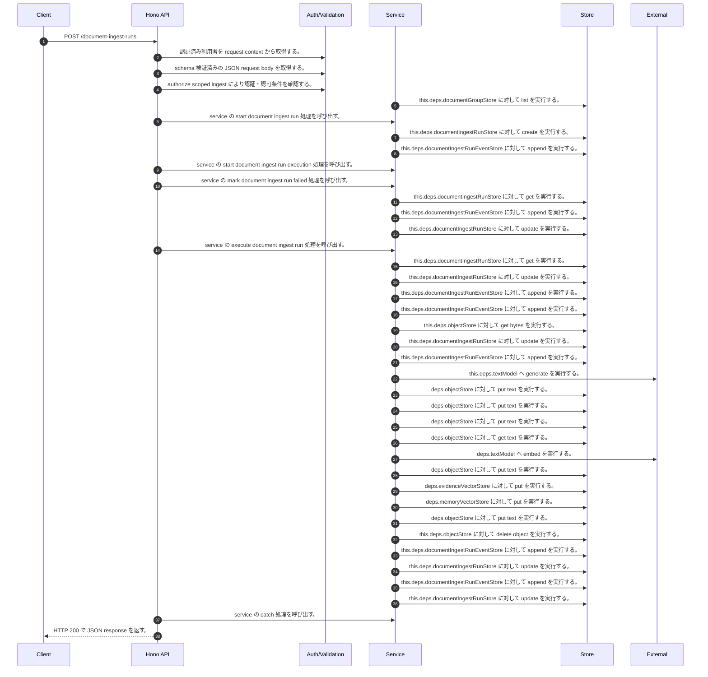

<!-- This file is generated by npm run docs:api-code. Do not edit manually. -->

# POST /document-ingest-runs シーケンス

## シーケンス図

## 処理順とコード対応

| # | Caller | 境界 | 処理 | コード | 実装位置 |
| ---: | --- | --- | --- | --- | --- |
| 1 | `POST /document-ingest-runs handler` | Auth | 認証済み利用者を request context から取得する。 | `c.get("user")` | `apps/api/src/routes/document-routes.ts:590 (POST /document-ingest-runs handler)` |
| 2 | `POST /document-ingest-runs handler` | Validation | schema 検証済みの JSON request body を取得する。 | `validJson<z.infer<typeof StartDocumentIngestRunRequestSchema>>(c)` | `apps/api/src/routes/document-routes.ts:591 (POST /document-ingest-runs handler)` |
| 3 | `POST /document-ingest-runs handler` | Auth | authorize scoped ingest により認証・認可条件を確認する。 | `authorizeScopedIngest(service, user, purpose, body)` | `apps/api/src/routes/document-routes.ts:594 (POST /document-ingest-runs handler)` |
| 4 | `MemoRagService.assertDocumentGroupsWritable` | Store | `this.deps.documentGroupStore` に対して list を実行する。 | `this.deps.documentGroupStore.list()` | `apps/api/src/rag/memorag-service.ts:555 (MemoRagService.assertDocumentGroupsWritable)` |
| 5 | `POST /document-ingest-runs handler` | Service | service の start document ingest run 処理を呼び出す。 | `service.startDocumentIngestRun({ ...body, metadata, objectKey, purpose }, user)` | `apps/api/src/routes/document-routes.ts:596 (POST /document-ingest-runs handler)` |
| 6 | `MemoRagService.startDocumentIngestRun` | Store | `this.deps.documentIngestRunStore` に対して create を実行する。 | `this.deps.documentIngestRunStore.create(run)` | `apps/api/src/rag/memorag-service.ts:1297 (MemoRagService.startDocumentIngestRun)` |
| 7 | `MemoRagService.startDocumentIngestRun` | Store | `this.deps.documentIngestRunEventStore` に対して append を実行する。 | `this.deps.documentIngestRunEventStore.append({ runId, type: "status", stage: "queued", message: "文書取り込みを受け付けました", data: { status: "queued" }, ttl })` | `apps/api/src/rag/memorag-service.ts:1298 (MemoRagService.startDocumentIngestRun)` |
| 8 | `MemoRagService.startDocumentIngestRun` | Service | service の start document ingest run execution 処理を呼び出す。 | `this.startDocumentIngestRunExecution(runId)` | `apps/api/src/rag/memorag-service.ts:1309 (MemoRagService.startDocumentIngestRun)` |
| 9 | `MemoRagService.startDocumentIngestRun` | Service | service の mark document ingest run failed 処理を呼び出す。 | `this.markDocumentIngestRunFailed(runId, \`StartExecution failed: ${message}\`)` | `apps/api/src/rag/memorag-service.ts:1312 (MemoRagService.startDocumentIngestRun)` |
| 10 | `MemoRagService.markDocumentIngestRunFailed` | Store | `this.deps.documentIngestRunStore` に対して get を実行する。 | `this.deps.documentIngestRunStore.get(runId)` | `apps/api/src/rag/memorag-service.ts:1429 (MemoRagService.markDocumentIngestRunFailed)` |
| 11 | `MemoRagService.markDocumentIngestRunFailed` | Store | `this.deps.documentIngestRunEventStore` に対して append を実行する。 | `this.deps.documentIngestRunEventStore.append({ runId, type: "error", stage: "failed", message: reason, data: { message: reason }, ttl: run.ttl })` | `apps/api/src/rag/memorag-service.ts:1434 (MemoRagService.markDocumentIngestRunFailed)` |
| 12 | `MemoRagService.markDocumentIngestRunFailed` | Store | `this.deps.documentIngestRunStore` に対して update を実行する。 | `this.deps.documentIngestRunStore.update(runId, { status: "failed", stage: "failed", error: reason, completedAt, updatedAt: completedAt })` | `apps/api/src/rag/memorag-service.ts:1442 (MemoRagService.markDocumentIngestRunFailed)` |
| 13 | `MemoRagService.startDocumentIngestRun` | Service | service の execute document ingest run 処理を呼び出す。 | `this.executeDocumentIngestRun(runId)` | `apps/api/src/rag/memorag-service.ts:1316 (MemoRagService.startDocumentIngestRun)` |
| 14 | `MemoRagService.executeDocumentIngestRun` | Store | `this.deps.documentIngestRunStore` に対して get を実行する。 | `this.deps.documentIngestRunStore.get(runId)` | `apps/api/src/rag/memorag-service.ts:1323 (MemoRagService.executeDocumentIngestRun)` |
| 15 | `MemoRagService.executeDocumentIngestRun` | Store | `this.deps.documentIngestRunStore` に対して update を実行する。 | `this.deps.documentIngestRunStore.update(runId, { status: "running", stage: "running", startedAt, updatedAt: startedAt })` | `apps/api/src/rag/memorag-service.ts:1327 (MemoRagService.executeDocumentIngestRun)` |
| 16 | `MemoRagService.executeDocumentIngestRun` | Store | `this.deps.documentIngestRunEventStore` に対して append を実行する。 | `this.deps.documentIngestRunEventStore.append({ runId, type: "status", stage: "running", message: "文書取り込みを開始しました", data: { status: "running" }, ttl })` | `apps/api/src/rag/memorag-service.ts:1328 (MemoRagService.executeDocumentIngestRun)` |
| 17 | `MemoRagService.executeDocumentIngestRun` | Store | `this.deps.documentIngestRunEventStore` に対して append を実行する。 | `this.deps.documentIngestRunEventStore.append({ runId, type: "status", stage: "preprocessing", message: "アップロード済みオブジェクトを読み込んでいます", data: { status: "running", stage: "preprocessing" }, ttl })` | `apps/api/src/rag/memorag-service.ts:1339 (MemoRagService.executeDocumentIngestRun)` |
| 18 | `MemoRagService.executeDocumentIngestRun` | Store | `this.deps.objectStore` に対して get bytes を実行する。 | `this.deps.objectStore.getBytes(run.objectKey)` | `apps/api/src/rag/memorag-service.ts:1347 (MemoRagService.executeDocumentIngestRun)` |
| 19 | `MemoRagService.executeDocumentIngestRun` | Store | `this.deps.documentIngestRunStore` に対して update を実行する。 | `this.deps.documentIngestRunStore.update(runId, { stage: "extracting", counters: { fileSizeBytes: contentBytes.length }, updatedAt: new Date().toISOString() })` | `apps/api/src/rag/memorag-service.ts:1353 (MemoRagService.executeDocumentIngestRun)` |
| 20 | `MemoRagService.executeDocumentIngestRun` | Store | `this.deps.documentIngestRunEventStore` に対して append を実行する。 | `this.deps.documentIngestRunEventStore.append({ runId, type: "status", stage: "extracting", message: "文書を解析し、チャンク化とインデックス登録を実行しています", data: { status: "running", stage: "extracting", counters: { fileSizeBytes: contentByte…` | `apps/api/src/rag/memorag-service.ts:1358 (MemoRagService.executeDocumentIngestRun)` |
| 21 | `MemoRagService.createMemoryCards` | External | `this.deps.textModel` へ generate を実行する。 | `this.deps.textModel.generate( buildMemoryCardPrompt(input.fileName, input.text), llmOptions("memoryCard", input.modelId ?? config.defaultMemoryModelId) )` | `apps/api/src/rag/memorag-service.ts:2467 (MemoRagService.createMemoryCards)` |
| 22 | `runIngestPipeline` | Store | `deps.objectStore` に対して put text を実行する。 | `deps.objectStore.putText(sourceObjectKey, text, "text/plain; charset=utf-8")` | `apps/api/src/rag/offline/pre-retrieval/ingestion/ingest-run.service.ts:80 (runIngestPipeline)` |
| 23 | `runIngestPipeline` | Store | `deps.objectStore` に対して put text を実行する。 | `deps.objectStore.putText( structuredBlocksObjectKey, JSON.stringify({ schemaVersion: 2, blocks: extracted.blocks, parsedDocument: extracted.parsedDocument }, null, 2), "application/json" )` | `apps/api/src/rag/offline/pre-retrieval/ingestion/ingest-run.service.ts:82 (runIngestPipeline)` |
| 24 | `runIngestPipeline` | Store | `deps.objectStore` に対して put text を実行する。 | `deps.objectStore.putText(memoryCardsObjectKey, JSON.stringify({ schemaVersion: 1, memoryCards }, null, 2), "application/json")` | `apps/api/src/rag/offline/pre-retrieval/ingestion/ingest-run.service.ts:100 (runIngestPipeline)` |
| 25 | `embedWithCache` | Store | `deps.objectStore` に対して get text を実行する。 | `deps.objectStore.getText(key)` | `apps/api/src/rag/offline/pre-retrieval/embedding/embedding-cache.ts:20 (embedWithCache)` |
| 26 | `embedWithCache` | External | `deps.textModel` へ embed を実行する。 | `deps.textModel.embed(input.text, { modelId: input.modelId, dimensions: input.dimensions })` | `apps/api/src/rag/offline/pre-retrieval/embedding/embedding-cache.ts:28 (embedWithCache)` |
| 27 | `embedWithCache` | Store | `deps.objectStore` に対して put text を実行する。 | `deps.objectStore.putText(key, JSON.stringify(record), "application/json")` | `apps/api/src/rag/offline/pre-retrieval/embedding/embedding-cache.ts:37 (embedWithCache)` |
| 28 | `runIngestPipeline` | Store | `deps.evidenceVectorStore` に対して put を実行する。 | `deps.evidenceVectorStore.put(evidenceRecords)` | `apps/api/src/rag/offline/pre-retrieval/ingestion/ingest-run.service.ts:189 (runIngestPipeline)` |
| 29 | `runIngestPipeline` | Store | `deps.memoryVectorStore` に対して put を実行する。 | `deps.memoryVectorStore.put(memoryRecords)` | `apps/api/src/rag/offline/pre-retrieval/ingestion/ingest-run.service.ts:190 (runIngestPipeline)` |
| 30 | `runIngestPipeline` | Store | `deps.objectStore` に対して put text を実行する。 | `deps.objectStore.putText(manifestObjectKey, JSON.stringify(manifest, null, 2), "application/json")` | `apps/api/src/rag/offline/pre-retrieval/ingestion/ingest-run.service.ts:228 (runIngestPipeline)` |
| 31 | `MemoRagService.executeDocumentIngestRun` | Store | `this.deps.objectStore` に対して delete object を実行する。 | `this.deps.objectStore.deleteObject(run.objectKey)` | `apps/api/src/rag/memorag-service.ts:1376 (MemoRagService.executeDocumentIngestRun)` |
| 32 | `MemoRagService.executeDocumentIngestRun` | Store | `this.deps.documentIngestRunEventStore` に対して append を実行する。 | `this.deps.documentIngestRunEventStore.append({ runId, type: "final", stage: "done", message: "文書取り込みが完了しました", data: { documentId: manifest.documentId, manifest: manifestSummary as unknown as JsonValue, counters, warning…` | `apps/api/src/rag/memorag-service.ts:1384 (MemoRagService.executeDocumentIngestRun)` |
| 33 | `MemoRagService.executeDocumentIngestRun` | Store | `this.deps.documentIngestRunStore` に対して update を実行する。 | `this.deps.documentIngestRunStore.update(runId, { status: "succeeded", stage: "done", manifest: manifestSummary, documentId: manifest.documentId, counters, warnings: manifest.extractionWarnings, completedAt, updatedAt: c…` | `apps/api/src/rag/memorag-service.ts:1397 (MemoRagService.executeDocumentIngestRun)` |
| 34 | `MemoRagService.executeDocumentIngestRun` | Store | `this.deps.documentIngestRunEventStore` に対して append を実行する。 | `this.deps.documentIngestRunEventStore.append({ runId, type: "error", stage: "failed", message, data: { message }, ttl })` | `apps/api/src/rag/memorag-service.ts:1410 (MemoRagService.executeDocumentIngestRun)` |
| 35 | `MemoRagService.executeDocumentIngestRun` | Store | `this.deps.documentIngestRunStore` に対して update を実行する。 | `this.deps.documentIngestRunStore.update(runId, { status: "failed", stage: "failed", error: message, completedAt, updatedAt: completedAt })` | `apps/api/src/rag/memorag-service.ts:1418 (MemoRagService.executeDocumentIngestRun)` |
| 36 | `MemoRagService.startDocumentIngestRun` | Service | service の catch 処理を呼び出す。 | `this.executeDocumentIngestRun(runId).catch(() => undefined)` | `apps/api/src/rag/memorag-service.ts:1316 (MemoRagService.startDocumentIngestRun)` |
| 37 | `POST /document-ingest-runs handler` | HTTP/SSE | HTTP 200 で JSON response を返す。 | `c.json(await service.startDocumentIngestRun({ ...body, metadata, objectKey, purpose }, user), 200)` | `apps/api/src/routes/document-routes.ts:596 (POST /document-ingest-runs handler)` |

## 分岐

| ID | Function | 条件 | 実装位置 |
| --- | --- | --- | --- |
| B001 | `decodeUploadId` | starts with の判定結果が真ではない、または `objectKey` が ".." を含む | `apps/api/src/routes/document-routes.ts:102 (decodeUploadId)` |
| B002 | `decodeUploadId` | 例外が発生した場合に catch 処理へ移る | `apps/api/src/routes/document-routes.ts:104 (decodeUploadId)` |
| B003 | `uploadPurposeForKey` | starts with の判定結果が真である | `apps/api/src/routes/document-routes.ts:89 (uploadPurposeForKey)` |
| B004 | `uploadPurposeForKey` | starts with の判定結果が真である | `apps/api/src/routes/document-routes.ts:90 (uploadPurposeForKey)` |
| B005 | `uploadPurposeForKey` | starts with の判定結果が真である | `apps/api/src/routes/document-routes.ts:91 (uploadPurposeForKey)` |
| B006 | `authorizeScopedIngest` | `purpose` が `"chatAttachment"` と等しい | `apps/api/src/routes/document-routes.ts:205 (authorizeScopedIngest)` |
| B007 | `authorizeScopedIngest` | 利用者が "chat:create" permission を持たない | `apps/api/src/routes/document-routes.ts:206 (authorizeScopedIngest)` |
| B008 | `authorizeScopedIngest` | `body.scope?.scopeType` が存在し、真である、かつ `body.scope.scopeType` が `"chat"` と異なる | `apps/api/src/routes/document-routes.ts:207 (authorizeScopedIngest)` |
| B009 | `authorizeScopedIngest` | `body.scope?.temporaryScopeId` が存在しない、または偽である | `apps/api/src/routes/document-routes.ts:208 (authorizeScopedIngest)` |
| B010 | `MemoRagService.startDocumentIngestRun` | `config.documentIngestRunStateMachineArn` が存在し、真である | `apps/api/src/rag/memorag-service.ts:1307 (MemoRagService.startDocumentIngestRun)` |
| B011 | `MemoRagService.startDocumentIngestRun` | 例外が発生した場合に catch 処理へ移る | `apps/api/src/rag/memorag-service.ts:1310 (MemoRagService.startDocumentIngestRun)` |
| B012 | `MemoRagService.startDocumentIngestRun` | `err` が `Error` の instance である | `apps/api/src/rag/memorag-service.ts:1311 (MemoRagService.startDocumentIngestRun)` |
