<!-- This file is generated by npm run docs:api-code. Do not edit manually. -->

# POST /document-ingest-runs シーケンス

## シーケンス図

```mermaid
sequenceDiagram
  autonumber
  participant Client as Client
  participant API as Hono API
  participant Auth as Auth/Validation
  participant Service as Service
  participant Store as Store
  participant External as External
  Client->>API: POST /document-ingest-runs
  API->>Auth: 認証済み利用者を request context から取得する。
  API->>Auth: schema 検証済みの JSON request body を取得する。
  API->>Auth: authorize scoped ingest により認証・認可条件を確認する。
  Service->>Store: this.deps.documentGroupStore に対して list を実行する。
  Service->>Store: this.deps.userGroupStore に対して get を実行する。
  Service->>Store: this.deps.groupMembershipStore に対して list by group id を実行する。
  Service->>Store: this.deps.folderPolicyStore に対して find by folder id を実行する。
  Service->>Store: this.deps.folderPolicyStore に対して get を実行する。
  API->>Service: service の assert document groups writable 処理を呼び出す。
  API->>Service: service の start document ingest run 処理を呼び出す。
  API->>Service: service の security resource refs for actor 処理を呼び出す。
  Service->>Store: this.deps.groupMembershipStore に対して list by member を実行する。
  Service->>Store: (await this.deps.groupMembershipStore.listByMember(tenantId, "user", actor.userId))        に対して map を実行する。
  Service->>Store: this.deps.groupMembershipStore に対して list by member を実行する。
  Service->>Store: this.deps.documentIngestRunStore に対して create を実行する。
  Service->>Store: this.deps.documentIngestRunEventStore に対して append を実行する。
  API->>Service: service の start document ingest run execution 処理を呼び出す。
  API->>Service: service の mark document ingest run failed 処理を呼び出す。
  Service->>Store: this.deps.documentIngestRunStore に対して get を実行する。
  Service->>Store: this.deps.objectStore に対して put text を実行する。
  Service->>Store: this.deps.documentIngestRunEventStore に対して append を実行する。
  Service->>Store: this.deps.documentIngestRunStore に対して update を実行する。
  Service->>Store: this.deps.documentIngestRunEventStore に対して append を実行する。
  Service->>Store: this.deps.documentIngestRunStore に対して update を実行する。
  API->>Service: service の execute document ingest run 処理を呼び出す。
  Service->>Store: this.deps.documentIngestRunStore に対して get を実行する。
  Service->>External: this.identityProvider へ get current identity by subject を実行する。
  Service->>Store: this.deps.documentIngestRunStore に対して update を実行する。
  Service->>Store: this.deps.documentIngestRunEventStore に対して append を実行する。
  Service->>Store: this.deps.documentIngestRunEventStore に対して append を実行する。
  Service->>Store: this.deps.objectStore に対して get bytes を実行する。
  Service->>Store: this.deps.documentIngestRunStore に対して update を実行する。
  Service->>Store: this.deps.documentIngestRunEventStore に対して append を実行する。
  Service->>External: textModel へ generate を実行する。
  Service->>Store: input.objectStore に対して get text を実行する。
  Service->>Store: (() =＞ {         const structuredText = input.text ?? input.structuredBlocks.map((block) =＞ block.text).join("\n\n")         return limitDocument({           text： structuredText,…
  Service->>Store: deps.objectStore に対して get text を実行する。
  Service->>External: deps.textModel へ embed を実行する。
  Service->>Store: deps.objectStore に対して put text を実行する。
  Service->>Store: deps.objectStore に対して put text を実行する。
  Service->>Store: deps.objectStore に対して put text を実行する。
  Service->>Store: deps.objectStore に対して put text を実行する。
  Service->>Store: deps.evidenceVectorStore に対して put を実行する。
  Service->>Store: deps.memoryVectorStore に対して put を実行する。
  Service->>Store: deps.objectStore に対して put text を実行する。
  Service->>Store: deps.evidenceVectorStore に対して delete を実行する。
  Service->>Store: deps.memoryVectorStore に対して delete を実行する。
  Service->>Store: deps.objectStore に対して delete object を実行する。
  Service->>Store: new ObjectStoreRevocationCleanupCoordinator(deps.objectStore) に対して register を実行する。
  Service->>Store: new ObjectStoreRevocationCleanupTenantRegistry(this.objectStore, this.now) に対して register を実行する。
  Service->>Store: this.objectStore に対して get text を実行する。
  Service->>Store: this.objectStore に対して put text if version を実行する。
  Service->>Store: objectStore に対して get text with version を実行する。
  Service->>Store: this.objectStore に対して put text if version を実行する。
  Service->>Store: new ProductionRagObservationProducer(deps.objectStore) に対して capture ingest manifest を実行する。
  Service->>Store: this.objectStore に対して get text を実行する。
  Service->>Store: this.objectStore に対して put text を実行する。
  Service->>Store: deps.objectStore に対して get text with version を実行する。
  Service->>Store: this.deps.objectStore に対して put text if version を実行する。
  Service->>Store: this.deps.objectStore に対して put text if version を実行する。
  Service->>Store: this.deps.objectStore に対して put text if version を実行する。
  Service->>Store: this.deps.objectStore に対して put text if version を実行する。
  Service->>Store: deps.objectStore に対して get text を実行する。
  Service->>Store: this.deps.objectStore に対して get text を実行する。
  Service->>Store: deps.objectStore に対して get text を実行する。
  Service->>Store: this.deps.objectStore に対して get text を実行する。
  Service->>Store: this.deps.objectStore に対して get text を実行する。
  Service->>Store: this.deps.evidenceVectorStore に対して get by keys を実行する。
  Service->>Store: this.deps.memoryVectorStore に対して get by keys を実行する。
  Service->>Store: this.deps.objectStore に対して put text if version を実行する。
  Service->>Store: this.deps.objectStore に対して get text を実行する。
  Service->>Store: this.deps.objectStore に対して get text を実行する。
  Service->>Store: this.deps.objectStore に対して get text を実行する。
  Service->>Store: this.deps.objectStore に対して put text if version を実行する。
  Service->>Store: this.deps.evidenceVectorStore に対して put を実行する。
  Service->>Store: this.deps.memoryVectorStore に対して put を実行する。
  Service->>Store: this.deps.objectStore に対して put text を実行する。
  Service->>Store: this.loadManifest(stored.value.stagedArtifact.manifestObjectKey) に対して catch を実行する。
  Service->>Store: this.deps.evidenceVectorStore に対して delete を実行する。
  Service->>Store: this.deps.memoryVectorStore に対して delete を実行する。
  Service->>Store: this.deps.objectStore に対して delete object を実行する。
  Service->>Store: this.deps.objectStore に対して put text if version を実行する。
  Service->>Store: this.deps.evidenceVectorStore に対して delete を実行する。
  Service->>Store: this.deps.memoryVectorStore に対して delete を実行する。
  Service->>Store: this.deps.objectStore に対して delete object を実行する。
  Service->>Store: this.deps.objectStore に対して list keys を実行する。
  Service->>Store: this.deps.objectStore に対して delete object を実行する。
  Service->>Store: (await this.deps.objectStore.listKeys(${prepared.namespace}/)) に対して map を実行する。
  Service->>Store: this.deps.objectStore に対して put text if version を実行する。
  Service->>Store: this.deps.objectStore に対して list keys を実行する。
  Service->>Store: this.deps.objectStore.listKeys(${prepared.namespace}/) に対して catch を実行する。
  Service->>Store: this.deps.evidenceVectorStore に対して delete を実行する。
  Service->>Store: this.deps.memoryVectorStore に対して delete を実行する。
  Service->>Store: this.deps.objectStore に対して delete object を実行する。
  Service->>Store: this.deps.objectStore に対して delete object を実行する。
  Service->>Store: this.deps.objectStore に対して put text if version を実行する。
  Service->>Store: this.deps.objectStore に対して get text を実行する。
  Service->>Store: this.deps.objectStore に対して put text を実行する。
  Service->>Store: this.deps.objectStore に対して get text を実行する。
  Service->>Store: this.deps.evidenceVectorStore に対して put を実行する。
  Service->>Store: this.deps.memoryVectorStore に対して put を実行する。
  Service->>Store: this.deps.objectStore に対して put text を実行する。
  Service->>Store: this.deps.objectStore に対して put text if version を実行する。
  Service->>Store: this.deps.evidenceVectorStore に対して delete を実行する。
  Service->>Store: this.deps.memoryVectorStore に対して delete を実行する。
  Service->>Store: this.deps.objectStore に対して delete object を実行する。
  Service->>Store: objectStore に対して get text with version を実行する。
  Service->>Store: this.deps.objectStore に対して put text if version を実行する。
  Service->>Store: this.deps.objectStore に対して delete object を実行する。
  Service->>Store: this.deps.documentIngestRunEventStore に対して append を実行する。
  Service->>Store: this.deps.documentIngestRunStore に対して update を実行する。
  Service->>Store: deps.evidenceVectorStore に対して delete を実行する。
  Service->>Store: deps.memoryVectorStore に対して delete を実行する。
  Service->>Store: deps.objectStore に対して delete object を実行する。
  Service->>Store: deps.objectStore に対して delete object を実行する。
  Service->>Store: deps.objectStore に対して delete object を実行する。
  Service->>Store: deps.objectStore に対して delete object を実行する。
  Service->>Store: objectStore に対して delete object を実行する。
  Service->>Store: this.deps.documentIngestRunEventStore に対して append を実行する。
  Service->>Store: this.deps.documentIngestRunStore に対して update を実行する。
  API->>Service: service の catch 処理を呼び出す。
  API-->>Client: HTTP 200 で JSON response を返す。
```

## 処理順とコード対応

| # | Caller | 境界 | 処理 | コード | 実装位置 |
| ---: | --- | --- | --- | --- | --- |
| 1 | `POST /document-ingest-runs handler` | Auth | 認証済み利用者を request context から取得する。 | `c.get("user")` | `apps/api/src/routes/document-routes.ts:1179 (POST /document-ingest-runs handler)` |
| 2 | `POST /document-ingest-runs handler` | Validation | schema 検証済みの JSON request body を取得する。 | `validJson<z.infer<typeof StartDocumentIngestRunRequestSchema>>(c)` | `apps/api/src/routes/document-routes.ts:1180 (POST /document-ingest-runs handler)` |
| 3 | `POST /document-ingest-runs handler` | Auth | authorize scoped ingest により認証・認可条件を確認する。 | `authorizeScopedIngest(service, user, purpose, body)` | `apps/api/src/routes/document-routes.ts:1183 (POST /document-ingest-runs handler)` |
| 4 | `FolderPermissionService.resolveEffectiveFolderPermissionDetail` | Store | `this.deps.documentGroupStore` に対して list を実行する。 | `this.deps.documentGroupStore.list(actorTenantId)` | `apps/api/src/folders/folder-permission-service.ts:145 (FolderPermissionService.resolveEffectiveFolderPermissionDetail)` |
| 5 | `FolderPermissionService.resolveUserMembershipPermission` | Store | `this.deps.userGroupStore` に対して get を実行する。 | `this.deps.userGroupStore.get(tenantId, groupId)` | `apps/api/src/folders/folder-permission-service.ts:780 (FolderPermissionService.resolveUserMembershipPermission)` |
| 6 | `FolderPermissionService.resolveUserMembershipPermission` | Store | `this.deps.groupMembershipStore` に対して list by group id を実行する。 | `this.deps.groupMembershipStore.listByGroupId(tenantId, groupId)` | `apps/api/src/folders/folder-permission-service.ts:781 (FolderPermissionService.resolveUserMembershipPermission)` |
| 7 | `FolderPermissionService.resolvePolicyContext` | Store | `this.deps.folderPolicyStore` に対して find by folder id を実行する。 | `this.deps.folderPolicyStore.findByFolderId(folder.tenantId, current.groupId)` | `apps/api/src/folders/folder-permission-service.ts:695 (FolderPermissionService.resolvePolicyContext)` |
| 8 | `FolderPermissionService.resolvePolicyContext` | Store | `this.deps.folderPolicyStore` に対して get を実行する。 | `this.deps.folderPolicyStore.get(folder.tenantId, current.policyId)` | `apps/api/src/folders/folder-permission-service.ts:711 (FolderPermissionService.resolvePolicyContext)` |
| 9 | `enforceDocumentCreateOperation` | Service | service の assert document groups writable 処理を呼び出す。 | `service.assertDocumentGroupsWritable(actor, groupIds)` | `apps/api/src/routes/document-routes.ts:482 (enforceDocumentCreateOperation)` |
| 10 | `POST /document-ingest-runs handler` | Service | service の start document ingest run 処理を呼び出す。 | `service.startDocumentIngestRun({ ...body, metadata, admissionContext, objectKey, purpose }, user)` | `apps/api/src/routes/document-routes.ts:1187 (POST /document-ingest-runs handler)` |
| 11 | `MemoRagService.startDocumentIngestRun` | Service | service の security resource refs for actor 処理を呼び出す。 | `this.securityResourceRefsForActor(user)` | `apps/api/src/rag/memorag-service.ts:2771 (MemoRagService.startDocumentIngestRun)` |
| 12 | `MemoRagService.securityResourceRefsForActor` | Store | `this.deps.groupMembershipStore` に対して list by member を実行する。 | `this.deps.groupMembershipStore.listByMember(tenantId, "user", actor.userId)` | `apps/api/src/rag/memorag-service.ts:1330 (MemoRagService.securityResourceRefsForActor)` |
| 13 | `MemoRagService.securityResourceRefsForActor` | Store | `(await this.deps.groupMembershipStore.listByMember(tenantId, "user", actor.userId))       ` に対して map を実行する。 | `(await this.deps.groupMembershipStore.listByMember(tenantId, "user", actor.userId)) .map((membership) => membership.groupId)` | `apps/api/src/rag/memorag-service.ts:1330 (MemoRagService.securityResourceRefsForActor)` |
| 14 | `MemoRagService.securityResourceRefsForActor` | Store | `this.deps.groupMembershipStore` に対して list by member を実行する。 | `this.deps.groupMembershipStore.listByMember(tenantId, "group", groupId)` | `apps/api/src/rag/memorag-service.ts:1338 (MemoRagService.securityResourceRefsForActor)` |
| 15 | `MemoRagService.startDocumentIngestRun` | Store | `this.deps.documentIngestRunStore` に対して create を実行する。 | `this.deps.documentIngestRunStore.create(run)` | `apps/api/src/rag/memorag-service.ts:2790 (MemoRagService.startDocumentIngestRun)` |
| 16 | `MemoRagService.startDocumentIngestRun` | Store | `this.deps.documentIngestRunEventStore` に対して append を実行する。 | `this.deps.documentIngestRunEventStore.append(tenantId, { runId, type: "status", stage: "queued", message: "文書取り込みを受け付けました", data: { status: "queued" }, ttl })` | `apps/api/src/rag/memorag-service.ts:2791 (MemoRagService.startDocumentIngestRun)` |
| 17 | `MemoRagService.startDocumentIngestRun` | Service | service の start document ingest run execution 処理を呼び出す。 | `this.startDocumentIngestRunExecution(tenantId, runId)` | `apps/api/src/rag/memorag-service.ts:2802 (MemoRagService.startDocumentIngestRun)` |
| 18 | `MemoRagService.startDocumentIngestRun` | Service | service の mark document ingest run failed 処理を呼び出す。 | `this.markDocumentIngestRunFailed(tenantId, runId, \`StartExecution failed: ${message}\`)` | `apps/api/src/rag/memorag-service.ts:2805 (MemoRagService.startDocumentIngestRun)` |
| 19 | `MemoRagService.markDocumentIngestRunFailed` | Store | `this.deps.documentIngestRunStore` に対して get を実行する。 | `this.deps.documentIngestRunStore.get(tenantId, runId)` | `apps/api/src/rag/memorag-service.ts:2969 (MemoRagService.markDocumentIngestRunFailed)` |
| 20 | `MemoRagService.persistDocumentIngestRunTerminalTrace` | Store | `this.deps.objectStore` に対して put text を実行する。 | `this.deps.objectStore.putText(debugTraceObjectKey(trace), JSON.stringify(trace, null, 2), "application/json")` | `apps/api/src/rag/memorag-service.ts:3156 (MemoRagService.persistDocumentIngestRunTerminalTrace)` |
| 21 | `MemoRagService.ensureDocumentIngestRunTerminalEvidence` | Store | `this.deps.documentIngestRunEventStore` に対して append を実行する。 | `this.deps.documentIngestRunEventStore.append(run.tenantId, { runId: run.runId, type: eventType, traceId: evidence.traceId, replayVersionManifest: evidence.replayVersionManifest, stage: run.stage ?? run.status, message: …` | `apps/api/src/rag/memorag-service.ts:3045 (MemoRagService.ensureDocumentIngestRunTerminalEvidence)` |
| 22 | `MemoRagService.ensureDocumentIngestRunTerminalEvidence` | Store | `this.deps.documentIngestRunStore` に対して update を実行する。 | `this.deps.documentIngestRunStore.update(run.tenantId, run.runId, { traceId: evidence.traceId, replayVersionManifest: evidence.replayVersionManifest, completedAt, updatedAt: completedAt })` | `apps/api/src/rag/memorag-service.ts:3059 (MemoRagService.ensureDocumentIngestRunTerminalEvidence)` |
| 23 | `MemoRagService.markDocumentIngestRunFailed` | Store | `this.deps.documentIngestRunEventStore` に対して append を実行する。 | `this.deps.documentIngestRunEventStore.append(tenantId, { runId, type: "error", traceId: evidence.traceId, replayVersionManifest: evidence.replayVersionManifest, stage: "failed", message: reason, data: { status: "failed"…` | `apps/api/src/rag/memorag-service.ts:2975 (MemoRagService.markDocumentIngestRunFailed)` |
| 24 | `MemoRagService.markDocumentIngestRunFailed` | Store | `this.deps.documentIngestRunStore` に対して update を実行する。 | `this.deps.documentIngestRunStore.update(tenantId, runId, { status: "failed", stage: "failed", traceId: evidence.traceId, replayVersionManifest: evidence.replayVersionManifest, error: reason, errorCode: "execution_error"…` | `apps/api/src/rag/memorag-service.ts:2990 (MemoRagService.markDocumentIngestRunFailed)` |
| 25 | `MemoRagService.startDocumentIngestRun` | Service | service の execute document ingest run 処理を呼び出す。 | `this.executeDocumentIngestRun(tenantId, runId)` | `apps/api/src/rag/memorag-service.ts:2809 (MemoRagService.startDocumentIngestRun)` |
| 26 | `MemoRagService.executeDocumentIngestRun` | Store | `this.deps.documentIngestRunStore` に対して get を実行する。 | `this.deps.documentIngestRunStore.get(tenantId, runId)` | `apps/api/src/rag/memorag-service.ts:2816 (MemoRagService.executeDocumentIngestRun)` |
| 27 | `CurrentWorkerAuthorization.assertAuthorized` | External | `this.identityProvider` へ get current identity by subject を実行する。 | `this.identityProvider.getCurrentIdentityBySubject(request.subject)` | `apps/api/src/security/current-worker-authorization.ts:51 (CurrentWorkerAuthorization.assertAuthorized)` |
| 28 | `MemoRagService.executeDocumentIngestRun` | Store | `this.deps.documentIngestRunStore` に対して update を実行する。 | `this.deps.documentIngestRunStore.update(tenantId, runId, { status: "running", stage: "running", startedAt, updatedAt: startedAt })` | `apps/api/src/rag/memorag-service.ts:2825 (MemoRagService.executeDocumentIngestRun)` |
| 29 | `MemoRagService.executeDocumentIngestRun` | Store | `this.deps.documentIngestRunEventStore` に対して append を実行する。 | `this.deps.documentIngestRunEventStore.append(tenantId, { runId, type: "status", stage: "running", message: "文書取り込みを開始しました", data: { status: "running" }, ttl })` | `apps/api/src/rag/memorag-service.ts:2826 (MemoRagService.executeDocumentIngestRun)` |
| 30 | `MemoRagService.executeDocumentIngestRun` | Store | `this.deps.documentIngestRunEventStore` に対して append を実行する。 | `this.deps.documentIngestRunEventStore.append(tenantId, { runId, type: "status", stage: "preprocessing", message: "アップロード済みオブジェクトを読み込んでいます", data: { status: "running", stage: "preprocessing" }, ttl })` | `apps/api/src/rag/memorag-service.ts:2835 (MemoRagService.executeDocumentIngestRun)` |
| 31 | `MemoRagService.executeDocumentIngestRun` | Store | `this.deps.objectStore` に対して get bytes を実行する。 | `this.deps.objectStore.getBytes(run.objectKey)` | `apps/api/src/rag/memorag-service.ts:2844 (MemoRagService.executeDocumentIngestRun)` |
| 32 | `MemoRagService.executeDocumentIngestRun` | Store | `this.deps.documentIngestRunStore` に対して update を実行する。 | `this.deps.documentIngestRunStore.update(tenantId, runId, { stage: "extracting", counters: { fileSizeBytes: contentBytes.length }, updatedAt: new Date().toISOString() })` | `apps/api/src/rag/memorag-service.ts:2850 (MemoRagService.executeDocumentIngestRun)` |
| 33 | `MemoRagService.executeDocumentIngestRun` | Store | `this.deps.documentIngestRunEventStore` に対して append を実行する。 | `this.deps.documentIngestRunEventStore.append(tenantId, { runId, type: "status", stage: "extracting", message: "文書を解析し、チャンク化とインデックス登録を実行しています", data: { status: "running", stage: "extracting", counters: { fileSizeBytes: c…` | `apps/api/src/rag/memorag-service.ts:2855 (MemoRagService.executeDocumentIngestRun)` |
| 34 | `MemoRagService.createMemoryCards` | External | `textModel` へ generate を実行する。 | `textModel.generate( buildMemoryCardPrompt(input.fileName, input.text), llmOptions("memoryCard", input.modelId ?? config.defaultMemoryModelId) )` | `apps/api/src/rag/memorag-service.ts:5073 (MemoRagService.createMemoryCards)` |
| 35 | `assertRagSafetyInterlock` | Store | `input.objectStore` に対して get text を実行する。 | `input.objectStore.getText(RAG_SAFETY_STATE_KEY)` | `apps/api/src/rag/quality-control/production-rag-monitor.ts:311 (assertRagSafetyInterlock)` |
| 36 | `runIngestPipeline` | Store | `(() => {         const structuredText = input.text ?? input.structuredBlocks.map((block) => block.text).join("\n\n")         return limitDocument({           text: structuredText,           blocks: input.structuredBlocks,           sourceExtractorVersion: input` に対して source extractor version ?? "structured blocks ledger v1"         })       }) を実行する。 | `(() => { const structuredText = input.text ?? input.structuredBlocks.map((block) => block.text).join("\n\n") return limitDocument({ text: structuredText, blocks: input.structuredBlocks, sourceExtractorVersion: input.sou…` | `apps/api/src/rag/offline/pre-retrieval/ingestion/ingest-run.service.ts:93 (runIngestPipeline)` |
| 37 | `embedWithCache` | Store | `deps.objectStore` に対して get text を実行する。 | `deps.objectStore.getText(key)` | `apps/api/src/rag/offline/pre-retrieval/embedding/embedding-cache.ts:21 (embedWithCache)` |
| 38 | `embedWithCache` | External | `deps.textModel` へ embed を実行する。 | `deps.textModel.embed(input.text, { modelId: input.modelId, dimensions: input.dimensions })` | `apps/api/src/rag/offline/pre-retrieval/embedding/embedding-cache.ts:29 (embedWithCache)` |
| 39 | `embedWithCache` | Store | `deps.objectStore` に対して put text を実行する。 | `deps.objectStore.putText(key, JSON.stringify(record), "application/json")` | `apps/api/src/rag/offline/pre-retrieval/embedding/embedding-cache.ts:38 (embedWithCache)` |
| 40 | `runIngestPipeline` | Store | `deps.objectStore` に対して put text を実行する。 | `deps.objectStore.putText(sourceObjectKey, text, "text/plain; charset=utf-8")` | `apps/api/src/rag/offline/pre-retrieval/ingestion/ingest-run.service.ts:475 (runIngestPipeline)` |
| 41 | `runIngestPipeline` | Store | `deps.objectStore` に対して put text を実行する。 | `deps.objectStore.putText(structuredBlocksObjectKey, structuredBlocksLedger, "application/json")` | `apps/api/src/rag/offline/pre-retrieval/ingestion/ingest-run.service.ts:478 (runIngestPipeline)` |
| 42 | `runIngestPipeline` | Store | `deps.objectStore` に対して put text を実行する。 | `deps.objectStore.putText(memoryCardsObjectKey, memoryCardsLedger, "application/json")` | `apps/api/src/rag/offline/pre-retrieval/ingestion/ingest-run.service.ts:482 (runIngestPipeline)` |
| 43 | `runIngestPipeline` | Store | `deps.evidenceVectorStore` に対して put を実行する。 | `deps.evidenceVectorStore.put(evidenceRecords)` | `apps/api/src/rag/offline/pre-retrieval/ingestion/ingest-run.service.ts:487 (runIngestPipeline)` |
| 44 | `runIngestPipeline` | Store | `deps.memoryVectorStore` に対して put を実行する。 | `deps.memoryVectorStore.put(memoryRecords)` | `apps/api/src/rag/offline/pre-retrieval/ingestion/ingest-run.service.ts:488 (runIngestPipeline)` |
| 45 | `runIngestPipeline` | Store | `deps.objectStore` に対して put text を実行する。 | `deps.objectStore.putText(manifestObjectKey, JSON.stringify(manifest, null, 2), "application/json")` | `apps/api/src/rag/offline/pre-retrieval/ingestion/ingest-run.service.ts:491 (runIngestPipeline)` |
| 46 | `runIngestPipeline` | Store | `deps.evidenceVectorStore` に対して delete を実行する。 | `deps.evidenceVectorStore.delete(evidenceRecords.map((record) => record.key))` | `apps/api/src/rag/offline/pre-retrieval/ingestion/ingest-run.service.ts:498 (runIngestPipeline)` |
| 47 | `runIngestPipeline` | Store | `deps.memoryVectorStore` に対して delete を実行する。 | `deps.memoryVectorStore.delete(memoryRecords.map((record) => record.key))` | `apps/api/src/rag/offline/pre-retrieval/ingestion/ingest-run.service.ts:499 (runIngestPipeline)` |
| 48 | `runIngestPipeline` | Store | `deps.objectStore` に対して delete object を実行する。 | `deps.objectStore.deleteObject(key)` | `apps/api/src/rag/offline/pre-retrieval/ingestion/ingest-run.service.ts:500 (runIngestPipeline)` |
| 49 | `registerUncommittedIngestCleanupReconciliation` | Store | `new ObjectStoreRevocationCleanupCoordinator(deps.objectStore)` に対して register を実行する。 | `new ObjectStoreRevocationCleanupCoordinator(deps.objectStore).register({ operationId: \`ingest-compensation:${manifest.documentId}:${manifest.documentVersion ?? manifest.createdAt}\`, tenantId, resourceType: manifest.meta…` | `apps/api/src/rag/offline/pre-retrieval/ingestion/ingest-run.service.ts:549 (registerUncommittedIngestCleanupReconciliation)` |
| 50 | `ObjectStoreRevocationCleanupCoordinator.register` | Store | `new ObjectStoreRevocationCleanupTenantRegistry(this.objectStore, this.now)` に対して register を実行する。 | `new ObjectStoreRevocationCleanupTenantRegistry(this.objectStore, this.now).register(normalized.tenantId)` | `apps/api/src/rag/_shared/security/revocation-cleanup-coordinator.ts:137 (ObjectStoreRevocationCleanupCoordinator.register)` |
| 51 | `ObjectStoreRevocationCleanupTenantRegistry.read` | Store | `this.objectStore` に対して get text を実行する。 | `this.objectStore.getText(key)` | `apps/api/src/rag/_shared/security/revocation-cleanup-tenant-registry.ts:116 (ObjectStoreRevocationCleanupTenantRegistry.read)` |
| 52 | `ObjectStoreRevocationCleanupTenantRegistry.register` | Store | `this.objectStore` に対して put text if version を実行する。 | `this.objectStore.putTextIfVersion(key, JSON.stringify(record, null, 2), undefined, "application/json")` | `apps/api/src/rag/_shared/security/revocation-cleanup-tenant-registry.ts:41 (ObjectStoreRevocationCleanupTenantRegistry.register)` |
| 53 | `readManifest` | Store | `objectStore` に対して get text with version を実行する。 | `objectStore.getTextWithVersion(key)` | `apps/api/src/rag/_shared/security/revocation-cleanup-coordinator.ts:636 (readManifest)` |
| 54 | `ObjectStoreRevocationCleanupCoordinator.register` | Store | `this.objectStore` に対して put text if version を実行する。 | `this.objectStore.putTextIfVersion(key, JSON.stringify(manifest, null, 2), undefined, "application/json")` | `apps/api/src/rag/_shared/security/revocation-cleanup-coordinator.ts:169 (ObjectStoreRevocationCleanupCoordinator.register)` |
| 55 | `runIngestPipeline` | Store | `new ProductionRagObservationProducer(deps.objectStore)` に対して capture ingest manifest を実行する。 | `new ProductionRagObservationProducer(deps.objectStore).captureIngestManifest({ manifest, latencyMs: Math.max(0, Date.now() - pipelineStartedMs) })` | `apps/api/src/rag/offline/pre-retrieval/ingestion/ingest-run.service.ts:504 (runIngestPipeline)` |
| 56 | `ProductionRagObservationProducer.loadActivePolicy` | Store | `this.objectStore` に対して get text を実行する。 | `this.objectStore.getText(ACTIVE_RAG_QUALITY_POLICY_KEY)` | `apps/api/src/rag/quality-control/production-rag-observation-producer.ts:783 (ProductionRagObservationProducer.loadActivePolicy)` |
| 57 | `ProductionRagObservationProducer.persistSample` | Store | `this.objectStore` に対して put text を実行する。 | `this.objectStore.putText(key, \`${JSON.stringify(sample, null, 2)}\n\`, "application/json; charset=utf-8")` | `apps/api/src/rag/quality-control/production-rag-observation-producer.ts:762 (ProductionRagObservationProducer.persistSample)` |
| 58 | `readVersionedJson` | Store | `deps.objectStore` に対して get text with version を実行する。 | `deps.objectStore.getTextWithVersion(key)` | `apps/api/src/rag/_shared/publication/staged-publication-coordinator.ts:1796 (readVersionedJson)` |
| 59 | `StagedPublicationCoordinator.ensureBootstrapPointer` | Store | `this.deps.objectStore` に対して put text if version を実行する。 | `this.deps.objectStore.putTextIfVersion(key, JSON.stringify(bootstrap, null, 2), undefined, "application/json")` | `apps/api/src/rag/_shared/publication/staged-publication-coordinator.ts:930 (StagedPublicationCoordinator.ensureBootstrapPointer)` |
| 60 | `StagedPublicationCoordinator.annotateManifestWithPublicationControl` | Store | `this.deps.objectStore` に対して put text if version を実行する。 | `this.deps.objectStore.putTextIfVersion(manifest.manifestObjectKey, JSON.stringify(next, null, 2), stored.version, "application/json")` | `apps/api/src/rag/_shared/publication/staged-publication-coordinator.ts:964 (StagedPublicationCoordinator.annotateManifestWithPublicationControl)` |
| 61 | `StagedPublicationCoordinator.begin` | Store | `this.deps.objectStore` に対して put text if version を実行する。 | `this.deps.objectStore.putTextIfVersion(runKey, JSON.stringify(initial, null, 2), undefined, "application/json")` | `apps/api/src/rag/_shared/publication/staged-publication-coordinator.ts:222 (StagedPublicationCoordinator.begin)` |
| 62 | `StagedPublicationCoordinator.acquireLease` | Store | `this.deps.objectStore` に対して put text if version を実行する。 | `this.deps.objectStore.putTextIfVersion(runKey, JSON.stringify(next, null, 2), stored.version, "application/json")` | `apps/api/src/rag/_shared/publication/staged-publication-coordinator.ts:617 (StagedPublicationCoordinator.acquireLease)` |
| 63 | `readTenantManifestByKey` | Store | `deps.objectStore` に対して get text を実行する。 | `deps.objectStore.getText(key)` | `apps/api/src/rag/_shared/storage/tenant-artifacts.ts:93 (readTenantManifestByKey)` |
| 64 | `MemoRagService.stageApprovedSourceGovernancePublication` | Store | `this.deps.objectStore` に対して get text を実行する。 | `this.deps.objectStore.getText(input.source.sourceObjectKey)` | `apps/api/src/rag/memorag-service.ts:3897 (MemoRagService.stageApprovedSourceGovernancePublication)` |
| 65 | `loadStructuredBlocksForManifest` | Store | `deps.objectStore` に対して get text を実行する。 | `deps.objectStore.getText(manifest.structuredBlocksObjectKey)` | `apps/api/src/rag/_shared/storage/manifest-chunks.ts:35 (loadStructuredBlocksForManifest)` |
| 66 | `StagedPublicationCoordinator.loadManifest` | Store | `this.deps.objectStore` に対して get text を実行する。 | `this.deps.objectStore.getText(key)` | `apps/api/src/rag/_shared/publication/staged-publication-coordinator.ts:1490 (StagedPublicationCoordinator.loadManifest)` |
| 67 | `StagedPublicationCoordinator.validateStagedManifest` | Store | `this.deps.objectStore` に対して get text を実行する。 | `this.deps.objectStore.getText(key)` | `apps/api/src/rag/_shared/publication/staged-publication-coordinator.ts:733 (StagedPublicationCoordinator.validateStagedManifest)` |
| 68 | `StagedPublicationCoordinator.loadVectorRecords` | Store | `this.deps.evidenceVectorStore` に対して get by keys を実行する。 | `this.deps.evidenceVectorStore.getByKeys(evidenceKeys)` | `apps/api/src/rag/_shared/publication/staged-publication-coordinator.ts:1475 (StagedPublicationCoordinator.loadVectorRecords)` |
| 69 | `StagedPublicationCoordinator.loadVectorRecords` | Store | `this.deps.memoryVectorStore` に対して get by keys を実行する。 | `this.deps.memoryVectorStore.getByKeys(memoryKeys)` | `apps/api/src/rag/_shared/publication/staged-publication-coordinator.ts:1476 (StagedPublicationCoordinator.loadVectorRecords)` |
| 70 | `StagedPublicationCoordinator.updateWithFence` | Store | `this.deps.objectStore` に対して put text if version を実行する。 | `this.deps.objectStore.putTextIfVersion(runKey, JSON.stringify(next, null, 2), stored.version, "application/json")` | `apps/api/src/rag/_shared/publication/staged-publication-coordinator.ts:690 (StagedPublicationCoordinator.updateWithFence)` |
| 71 | `StagedPublicationCoordinator.validatePreparedRollbackArtifact` | Store | `this.deps.objectStore` に対して get text を実行する。 | `this.deps.objectStore.getText(prepared.sourceObjectKey)` | `apps/api/src/rag/_shared/publication/staged-publication-coordinator.ts:1322 (StagedPublicationCoordinator.validatePreparedRollbackArtifact)` |
| 72 | `StagedPublicationCoordinator.validatePreparedRollbackArtifact` | Store | `this.deps.objectStore` に対して get text を実行する。 | `this.deps.objectStore.getText(prepared.structuredBlocksObjectKey)` | `apps/api/src/rag/_shared/publication/staged-publication-coordinator.ts:1323 (StagedPublicationCoordinator.validatePreparedRollbackArtifact)` |
| 73 | `StagedPublicationCoordinator.validatePreparedRollbackArtifact` | Store | `this.deps.objectStore` に対して get text を実行する。 | `this.deps.objectStore.getText(prepared.memoryCardsObjectKey)` | `apps/api/src/rag/_shared/publication/staged-publication-coordinator.ts:1324 (StagedPublicationCoordinator.validatePreparedRollbackArtifact)` |
| 74 | `StagedPublicationCoordinator.reconcile` | Store | `this.deps.objectStore` に対して put text if version を実行する。 | `this.deps.objectStore.putTextIfVersion(publicationRunKey(runId), JSON.stringify(rolledBack, null, 2), stored.version, "application/json")` | `apps/api/src/rag/_shared/publication/staged-publication-coordinator.ts:394 (StagedPublicationCoordinator.reconcile)` |
| 75 | `StagedPublicationCoordinator.rewriteVectorLifecycle` | Store | `this.deps.evidenceVectorStore` に対して put を実行する。 | `this.deps.evidenceVectorStore.put(evidence)` | `apps/api/src/rag/_shared/publication/staged-publication-coordinator.ts:1423 (StagedPublicationCoordinator.rewriteVectorLifecycle)` |
| 76 | `StagedPublicationCoordinator.rewriteVectorLifecycle` | Store | `this.deps.memoryVectorStore` に対して put を実行する。 | `this.deps.memoryVectorStore.put(memory)` | `apps/api/src/rag/_shared/publication/staged-publication-coordinator.ts:1424 (StagedPublicationCoordinator.rewriteVectorLifecycle)` |
| 77 | `StagedPublicationCoordinator.supersedePreviousArtifact` | Store | `this.deps.objectStore` に対して put text を実行する。 | `this.deps.objectStore.putText(previous.manifestObjectKey, JSON.stringify({ ...previous, lifecycleStatus: "superseded", metadata: { ...(previous.metadata ?? {}), lifecycleStatus: "superseded" }, updatedAt: this.clock().t…` | `apps/api/src/rag/_shared/publication/staged-publication-coordinator.ts:977 (StagedPublicationCoordinator.supersedePreviousArtifact)` |
| 78 | `StagedPublicationCoordinator.reconcile` | Store | `this.loadManifest(stored.value.stagedArtifact.manifestObjectKey)` に対して catch を実行する。 | `this.loadManifest(stored.value.stagedArtifact.manifestObjectKey).catch(() => undefined)` | `apps/api/src/rag/_shared/publication/staged-publication-coordinator.ts:408 (StagedPublicationCoordinator.reconcile)` |
| 79 | `StagedPublicationCoordinator.cleanupStagedArtifact` | Store | `this.deps.evidenceVectorStore` に対して delete を実行する。 | `this.deps.evidenceVectorStore.delete(manifest.evidenceVectorKeys ?? [])` | `apps/api/src/rag/_shared/publication/staged-publication-coordinator.ts:1429 (StagedPublicationCoordinator.cleanupStagedArtifact)` |
| 80 | `StagedPublicationCoordinator.cleanupStagedArtifact` | Store | `this.deps.memoryVectorStore` に対して delete を実行する。 | `this.deps.memoryVectorStore.delete(manifest.memoryVectorKeys ?? [])` | `apps/api/src/rag/_shared/publication/staged-publication-coordinator.ts:1430 (StagedPublicationCoordinator.cleanupStagedArtifact)` |
| 81 | `StagedPublicationCoordinator.cleanupStagedArtifact` | Store | `this.deps.objectStore` に対して delete object を実行する。 | `this.deps.objectStore.deleteObject(key)` | `apps/api/src/rag/_shared/publication/staged-publication-coordinator.ts:1433 (StagedPublicationCoordinator.cleanupStagedArtifact)` |
| 82 | `StagedPublicationCoordinator.reconcile` | Store | `this.deps.objectStore` に対して put text if version を実行する。 | `this.deps.objectStore.putTextIfVersion(publicationRunKey(runId), JSON.stringify(committed, null, 2), stored.version, "application/json")` | `apps/api/src/rag/_shared/publication/staged-publication-coordinator.ts:421 (StagedPublicationCoordinator.reconcile)` |
| 83 | `StagedPublicationCoordinator.cleanupPreparedRecord` | Store | `this.deps.evidenceVectorStore` に対して delete を実行する。 | `this.deps.evidenceVectorStore.delete(prepared.evidenceVectorKeys)` | `apps/api/src/rag/_shared/publication/staged-publication-coordinator.ts:1449 (StagedPublicationCoordinator.cleanupPreparedRecord)` |
| 84 | `StagedPublicationCoordinator.cleanupPreparedRecord` | Store | `this.deps.memoryVectorStore` に対して delete を実行する。 | `this.deps.memoryVectorStore.delete(prepared.memoryVectorKeys)` | `apps/api/src/rag/_shared/publication/staged-publication-coordinator.ts:1450 (StagedPublicationCoordinator.cleanupPreparedRecord)` |
| 85 | `StagedPublicationCoordinator.cleanupPreparedRecord` | Store | `this.deps.objectStore` に対して delete object を実行する。 | `this.deps.objectStore.deleteObject(prepared.manifestObjectKey)` | `apps/api/src/rag/_shared/publication/staged-publication-coordinator.ts:1451 (StagedPublicationCoordinator.cleanupPreparedRecord)` |
| 86 | `StagedPublicationCoordinator.cleanupPreparedRecord` | Store | `this.deps.objectStore` に対して list keys を実行する。 | `this.deps.objectStore.listKeys(\`${prepared.namespace}/\`)` | `apps/api/src/rag/_shared/publication/staged-publication-coordinator.ts:1452 (StagedPublicationCoordinator.cleanupPreparedRecord)` |
| 87 | `StagedPublicationCoordinator.cleanupPreparedRecord` | Store | `this.deps.objectStore` に対して delete object を実行する。 | `this.deps.objectStore.deleteObject(key)` | `apps/api/src/rag/_shared/publication/staged-publication-coordinator.ts:1452 (StagedPublicationCoordinator.cleanupPreparedRecord)` |
| 88 | `StagedPublicationCoordinator.cleanupPreparedRecord` | Store | `(await this.deps.objectStore.listKeys(`${prepared.namespace}/`))` に対して map を実行する。 | `(await this.deps.objectStore.listKeys(\`${prepared.namespace}/\`)).map((key) => this.deps.objectStore.deleteObject(key))` | `apps/api/src/rag/_shared/publication/staged-publication-coordinator.ts:1452 (StagedPublicationCoordinator.cleanupPreparedRecord)` |
| 89 | `StagedPublicationCoordinator.reconcile` | Store | `this.deps.objectStore` に対して put text if version を実行する。 | `this.deps.objectStore.putTextIfVersion(publicationRunKey(runId), JSON.stringify(retryable, null, 2), stored.version, "application/json")` | `apps/api/src/rag/_shared/publication/staged-publication-coordinator.ts:441 (StagedPublicationCoordinator.reconcile)` |
| 90 | `StagedPublicationCoordinator.cleanupPreparedRollback` | Store | `this.deps.objectStore` に対して list keys を実行する。 | `this.deps.objectStore.listKeys(\`${prepared.namespace}/\`)` | `apps/api/src/rag/_shared/publication/staged-publication-coordinator.ts:1457 (StagedPublicationCoordinator.cleanupPreparedRollback)` |
| 91 | `StagedPublicationCoordinator.cleanupPreparedRollback` | Store | `this.deps.objectStore.listKeys(`${prepared.namespace}/`)` に対して catch を実行する。 | `this.deps.objectStore.listKeys(\`${prepared.namespace}/\`).catch(() => [])` | `apps/api/src/rag/_shared/publication/staged-publication-coordinator.ts:1457 (StagedPublicationCoordinator.cleanupPreparedRollback)` |
| 92 | `StagedPublicationCoordinator.cleanupPreparedRollback` | Store | `this.deps.evidenceVectorStore` に対して delete を実行する。 | `this.deps.evidenceVectorStore.delete(prepared.evidenceVectorKeys)` | `apps/api/src/rag/_shared/publication/staged-publication-coordinator.ts:1459 (StagedPublicationCoordinator.cleanupPreparedRollback)` |
| 93 | `StagedPublicationCoordinator.cleanupPreparedRollback` | Store | `this.deps.memoryVectorStore` に対して delete を実行する。 | `this.deps.memoryVectorStore.delete(prepared.memoryVectorKeys)` | `apps/api/src/rag/_shared/publication/staged-publication-coordinator.ts:1460 (StagedPublicationCoordinator.cleanupPreparedRollback)` |
| 94 | `StagedPublicationCoordinator.cleanupPreparedRollback` | Store | `this.deps.objectStore` に対して delete object を実行する。 | `this.deps.objectStore.deleteObject(prepared.manifestObjectKey)` | `apps/api/src/rag/_shared/publication/staged-publication-coordinator.ts:1461 (StagedPublicationCoordinator.cleanupPreparedRollback)` |
| 95 | `StagedPublicationCoordinator.cleanupPreparedRollback` | Store | `this.deps.objectStore` に対して delete object を実行する。 | `this.deps.objectStore.deleteObject(key)` | `apps/api/src/rag/_shared/publication/staged-publication-coordinator.ts:1462 (StagedPublicationCoordinator.cleanupPreparedRollback)` |
| 96 | `StagedPublicationCoordinator.reconcile` | Store | `this.deps.objectStore` に対して put text if version を実行する。 | `this.deps.objectStore.putTextIfVersion(publicationRunKey(runId), JSON.stringify(retryable, null, 2), stored.version, "application/json")` | `apps/api/src/rag/_shared/publication/staged-publication-coordinator.ts:465 (StagedPublicationCoordinator.reconcile)` |
| 97 | `StagedPublicationCoordinator.copyText` | Store | `this.deps.objectStore` に対して get text を実行する。 | `this.deps.objectStore.getText(sourceKey)` | `apps/api/src/rag/_shared/publication/staged-publication-coordinator.ts:1484 (StagedPublicationCoordinator.copyText)` |
| 98 | `StagedPublicationCoordinator.copyText` | Store | `this.deps.objectStore` に対して put text を実行する。 | `this.deps.objectStore.putText(targetKey, source, "application/octet-stream")` | `apps/api/src/rag/_shared/publication/staged-publication-coordinator.ts:1485 (StagedPublicationCoordinator.copyText)` |
| 99 | `StagedPublicationCoordinator.copyText` | Store | `this.deps.objectStore` に対して get text を実行する。 | `this.deps.objectStore.getText(targetKey)` | `apps/api/src/rag/_shared/publication/staged-publication-coordinator.ts:1486 (StagedPublicationCoordinator.copyText)` |
| 100 | `StagedPublicationCoordinator.prepareCommitArtifacts` | Store | `this.deps.evidenceVectorStore` に対して put を実行する。 | `this.deps.evidenceVectorStore.put(evidenceRecords)` | `apps/api/src/rag/_shared/publication/staged-publication-coordinator.ts:807 (StagedPublicationCoordinator.prepareCommitArtifacts)` |
| 101 | `StagedPublicationCoordinator.prepareCommitArtifacts` | Store | `this.deps.memoryVectorStore` に対して put を実行する。 | `this.deps.memoryVectorStore.put(memoryRecords)` | `apps/api/src/rag/_shared/publication/staged-publication-coordinator.ts:808 (StagedPublicationCoordinator.prepareCommitArtifacts)` |
| 102 | `StagedPublicationCoordinator.prepareCommitArtifacts` | Store | `this.deps.objectStore` に対して put text を実行する。 | `this.deps.objectStore.putText(manifestObjectKey, JSON.stringify(manifest, null, 2), "application/json")` | `apps/api/src/rag/_shared/publication/staged-publication-coordinator.ts:861 (StagedPublicationCoordinator.prepareCommitArtifacts)` |
| 103 | `StagedPublicationCoordinator.commit` | Store | `this.deps.objectStore` に対して put text if version を実行する。 | `this.deps.objectStore.putTextIfVersion( lease.run.activePointerKey, JSON.stringify(pointer, null, 2), pointerStored.version, "application/json" )` | `apps/api/src/rag/_shared/publication/staged-publication-coordinator.ts:346 (StagedPublicationCoordinator.commit)` |
| 104 | `StagedPublicationCoordinator.cleanupPreparedCommit` | Store | `this.deps.evidenceVectorStore` に対して delete を実行する。 | `this.deps.evidenceVectorStore.delete(manifest.evidenceVectorKeys ?? [])` | `apps/api/src/rag/_shared/publication/staged-publication-coordinator.ts:1439 (StagedPublicationCoordinator.cleanupPreparedCommit)` |
| 105 | `StagedPublicationCoordinator.cleanupPreparedCommit` | Store | `this.deps.memoryVectorStore` に対して delete を実行する。 | `this.deps.memoryVectorStore.delete(manifest.memoryVectorKeys ?? [])` | `apps/api/src/rag/_shared/publication/staged-publication-coordinator.ts:1440 (StagedPublicationCoordinator.cleanupPreparedCommit)` |
| 106 | `StagedPublicationCoordinator.cleanupPreparedCommit` | Store | `this.deps.objectStore` に対して delete object を実行する。 | `this.deps.objectStore.deleteObject(key)` | `apps/api/src/rag/_shared/publication/staged-publication-coordinator.ts:1443 (StagedPublicationCoordinator.cleanupPreparedCommit)` |
| 107 | `readVersionedRecord` | Store | `objectStore` に対して get text with version を実行する。 | `objectStore.getTextWithVersion(key)` | `apps/api/src/rag/offline/pre-retrieval/admission/source-governance-approval-service.ts:1066 (readVersionedRecord)` |
| 108 | `SourceGovernanceApprovalService.ensureInitialRecord` | Store | `this.deps.objectStore` に対して put text if version を実行する。 | `this.deps.objectStore.putTextIfVersion(key, JSON.stringify(initial, null, 2), undefined, "application/json")` | `apps/api/src/rag/offline/pre-retrieval/admission/source-governance-approval-service.ts:244 (SourceGovernanceApprovalService.ensureInitialRecord)` |
| 109 | `MemoRagService.executeDocumentIngestRun` | Store | `this.deps.objectStore` に対して delete object を実行する。 | `this.deps.objectStore.deleteObject(run.objectKey)` | `apps/api/src/rag/memorag-service.ts:2883 (MemoRagService.executeDocumentIngestRun)` |
| 110 | `MemoRagService.executeDocumentIngestRun` | Store | `this.deps.documentIngestRunEventStore` に対して append を実行する。 | `this.deps.documentIngestRunEventStore.append(tenantId, { runId, type: "final", traceId: evidence.traceId, replayVersionManifest: evidence.replayVersionManifest, stage: terminalStage, message: terminalStatus === "rejecte…` | `apps/api/src/rag/memorag-service.ts:2895 (MemoRagService.executeDocumentIngestRun)` |
| 111 | `MemoRagService.executeDocumentIngestRun` | Store | `this.deps.documentIngestRunStore` に対して update を実行する。 | `this.deps.documentIngestRunStore.update(tenantId, runId, { status: terminalStatus, stage: terminalStage, manifest: manifestSummary, documentId: manifest.documentId, traceId: evidence.traceId, replayVersionManifest: evid…` | `apps/api/src/rag/memorag-service.ts:2914 (MemoRagService.executeDocumentIngestRun)` |
| 112 | `deleteUncommittedIngestArtifacts` | Store | `deps.evidenceVectorStore` に対して delete を実行する。 | `deps.evidenceVectorStore.delete(manifest.evidenceVectorKeys ?? [])` | `apps/api/src/rag/offline/pre-retrieval/ingestion/ingest-run.service.ts:513 (deleteUncommittedIngestArtifacts)` |
| 113 | `deleteUncommittedIngestArtifacts` | Store | `deps.memoryVectorStore` に対して delete を実行する。 | `deps.memoryVectorStore.delete(manifest.memoryVectorKeys ?? [])` | `apps/api/src/rag/offline/pre-retrieval/ingestion/ingest-run.service.ts:514 (deleteUncommittedIngestArtifacts)` |
| 114 | `deleteUncommittedIngestArtifacts` | Store | `deps.objectStore` に対して delete object を実行する。 | `deps.objectStore.deleteObject(manifest.manifestObjectKey)` | `apps/api/src/rag/offline/pre-retrieval/ingestion/ingest-run.service.ts:515 (deleteUncommittedIngestArtifacts)` |
| 115 | `deleteUncommittedIngestArtifacts` | Store | `deps.objectStore` に対して delete object を実行する。 | `deps.objectStore.deleteObject(manifest.sourceObjectKey)` | `apps/api/src/rag/offline/pre-retrieval/ingestion/ingest-run.service.ts:516 (deleteUncommittedIngestArtifacts)` |
| 116 | `deleteUncommittedIngestArtifacts` | Store | `deps.objectStore` に対して delete object を実行する。 | `deps.objectStore.deleteObject(manifest.structuredBlocksObjectKey)` | `apps/api/src/rag/offline/pre-retrieval/ingestion/ingest-run.service.ts:517 (deleteUncommittedIngestArtifacts)` |
| 117 | `deleteUncommittedIngestArtifacts` | Store | `deps.objectStore` に対して delete object を実行する。 | `deps.objectStore.deleteObject(manifest.memoryCardsObjectKey)` | `apps/api/src/rag/offline/pre-retrieval/ingestion/ingest-run.service.ts:518 (deleteUncommittedIngestArtifacts)` |
| 118 | `discardUncommittedSourceGovernanceRecord` | Store | `objectStore` に対して delete object を実行する。 | `objectStore.deleteObject(key)` | `apps/api/src/rag/offline/pre-retrieval/admission/source-governance-approval-service.ts:924 (discardUncommittedSourceGovernanceRecord)` |
| 119 | `MemoRagService.executeDocumentIngestRun` | Store | `this.deps.documentIngestRunEventStore` に対して append を実行する。 | `this.deps.documentIngestRunEventStore.append(tenantId, { runId, type: "error", traceId: evidence.traceId, replayVersionManifest: evidence.replayVersionManifest, stage: "failed", message, data: { status: "failed", messag…` | `apps/api/src/rag/memorag-service.ts:2940 (MemoRagService.executeDocumentIngestRun)` |
| 120 | `MemoRagService.executeDocumentIngestRun` | Store | `this.deps.documentIngestRunStore` に対して update を実行する。 | `this.deps.documentIngestRunStore.update(tenantId, runId, { status: "failed", stage: "failed", traceId: evidence.traceId, replayVersionManifest: evidence.replayVersionManifest, error: message, errorCode: permissionRevoke…` | `apps/api/src/rag/memorag-service.ts:2955 (MemoRagService.executeDocumentIngestRun)` |
| 121 | `MemoRagService.startDocumentIngestRun` | Service | service の catch 処理を呼び出す。 | `this.executeDocumentIngestRun(tenantId, runId).catch(() => undefined)` | `apps/api/src/rag/memorag-service.ts:2809 (MemoRagService.startDocumentIngestRun)` |
| 122 | `POST /document-ingest-runs handler` | HTTP/SSE | HTTP 200 で JSON response を返す。 | `c.json(await service.startDocumentIngestRun({ ...body, metadata, admissionContext, objectKey, purpose }, user), 200)` | `apps/api/src/routes/document-routes.ts:1187 (POST /document-ingest-runs handler)` |

## 分岐

| ID | Function | 条件 | 実装位置 |
| --- | --- | --- | --- |
| B001 | `decodeUploadId` | starts with の判定結果が真ではない、または `objectKey` が ".." を含む | `apps/api/src/routes/document-routes.ts:174 (decodeUploadId)` |
| B002 | `decodeUploadId` | 例外が発生した場合に catch 処理へ移る | `apps/api/src/routes/document-routes.ts:176 (decodeUploadId)` |
| B003 | `uploadPurposeForKey` | starts with の判定結果が真である | `apps/api/src/routes/document-routes.ts:149 (uploadPurposeForKey)` |
| B004 | `uploadPurposeForKey` | starts with の判定結果が真である | `apps/api/src/routes/document-routes.ts:150 (uploadPurposeForKey)` |
| B005 | `uploadPurposeForKey` | starts with の判定結果が真である | `apps/api/src/routes/document-routes.ts:151 (uploadPurposeForKey)` |
| B006 | `authorizeScopedIngest` | `purpose` が `"chatAttachment"` と等しい | `apps/api/src/routes/document-routes.ts:459 (authorizeScopedIngest)` |
| B007 | `authorizeScopedIngest` | 利用者が "chat:create" permission を持たない | `apps/api/src/routes/document-routes.ts:460 (authorizeScopedIngest)` |
| B008 | `authorizeScopedIngest` | `body.scope?.scopeType` が存在し、真である、かつ `body.scope.scopeType` が `"chat"` と異なる | `apps/api/src/routes/document-routes.ts:461 (authorizeScopedIngest)` |
| B009 | `authorizeScopedIngest` | `body.scope?.temporaryScopeId` が存在しない、または偽である | `apps/api/src/routes/document-routes.ts:462 (authorizeScopedIngest)` |
| B010 | `scopedMetadata` | `purpose` が `"chatAttachment"` と等しい | `apps/api/src/routes/document-routes.ts:322 (scopedMetadata)` |
| B011 | `scopedMetadata` | `temporaryScopeId` が存在しない、または偽である | `apps/api/src/routes/document-routes.ts:324 (scopedMetadata)` |
| B012 | `scopedMetadata` | `user.email` が存在し、真である | `apps/api/src/routes/document-routes.ts:329 (scopedMetadata)` |
| B013 | `scopedMetadata` | `purpose` が `"document"` と等しい | `apps/api/src/routes/document-routes.ts:335 (scopedMetadata)` |
| B014 | `scopedMetadata` | `scope` が存在しない、または偽である、または `scope.scopeType` が `"group"` と異なる、または `scope.groupIds?.length` が存在しない、または偽である | `apps/api/src/routes/document-routes.ts:336 (scopedMetadata)` |
| B015 | `scopedMetadata` | `scope` が存在しない、または偽である | `apps/api/src/routes/document-routes.ts:343 (scopedMetadata)` |
| B016 | `scopedMetadata` | `scope.scopeType` が `"group"` と等しい、かつ `groupIds.length` が `0` と等しい | `apps/api/src/routes/document-routes.ts:345 (scopedMetadata)` |
| B017 | `scopedMetadata` | `groupIds.length` が `0` より大きい | `apps/api/src/routes/document-routes.ts:346 (scopedMetadata)` |
| B018 | `scopedMetadata` | `groupIds.length` が `0` より大きい、または `scope.scopeType` が `"group"` と等しい | `apps/api/src/routes/document-routes.ts:347 (scopedMetadata)` |
| B019 | `scopedMetadata` | `scope.scopeType` が `"personal"` と等しい | `apps/api/src/routes/document-routes.ts:350 (scopedMetadata)` |
| B020 | `scopedMetadata` | `user.email` が存在し、真である | `apps/api/src/routes/document-routes.ts:351 (scopedMetadata)` |
| B021 | `scopedMetadata` | `Object.keys(base).length` が `0` より大きい | `apps/api/src/routes/document-routes.ts:353 (scopedMetadata)` |
| B022 | `authoritativeAdmissionContext` | `purpose` が `"chatAttachment"` と等しい | `apps/api/src/routes/document-routes.ts:366 (authoritativeAdmissionContext)` |
| B023 | `authoritativeAdmissionContext` | `purpose` が `"benchmarkSeed"` と等しい | `apps/api/src/routes/document-routes.ts:377 (authoritativeAdmissionContext)` |
| B024 | `authoritativeAdmissionContext` | `suiteId` が存在しない、または偽である | `apps/api/src/routes/document-routes.ts:379 (authoritativeAdmissionContext)` |
| B025 | `authoritativeAdmissionContext` | 例外が発生した場合に catch 処理へ移る | `apps/api/src/routes/document-routes.ts:393 (authoritativeAdmissionContext)` |
| B026 | `authoritativeAdmissionContext` | `error` が `BenchmarkEvaluationContextError` の instance である | `apps/api/src/routes/document-routes.ts:394 (authoritativeAdmissionContext)` |
| B027 | `authoritativeAdmissionContext` | `purpose` が `"chatAttachment"` と等しい | `apps/api/src/routes/document-routes.ts:400 (authoritativeAdmissionContext)` |
| B028 | `authoritativeAdmissionContext` | `user.email` が存在し、真である | `apps/api/src/routes/document-routes.ts:403 (authoritativeAdmissionContext)` |
| B029 | `authoritativeAdmissionContext` | `purpose` が `"benchmarkSeed"` と等しい | `apps/api/src/routes/document-routes.ts:407 (authoritativeAdmissionContext)` |
| B030 | `authoritativeAdmissionContext` | `scope?.scopeType` が `"group"` と等しい | `apps/api/src/routes/document-routes.ts:409 (authoritativeAdmissionContext)` |
| B031 | `authoritativeAdmissionContext` | `user.email` が存在し、真である | `apps/api/src/routes/document-routes.ts:411 (authoritativeAdmissionContext)` |
| B032 | `authoritativeAdmissionContext` | `purpose` が `"benchmarkSeed"` と等しい | `apps/api/src/routes/document-routes.ts:418 (authoritativeAdmissionContext)` |
| B033 | `authoritativeAdmissionContext` | `purpose` が `"chatAttachment"` と等しい | `apps/api/src/routes/document-routes.ts:420 (authoritativeAdmissionContext)` |
| B034 | `authoritativeAdmissionContext` | `purpose` が `"benchmarkSeed"` と等しい | `apps/api/src/routes/document-routes.ts:423 (authoritativeAdmissionContext)` |
| B035 | `authoritativeAdmissionContext` | `purpose` が `"chatAttachment"` と等しい | `apps/api/src/routes/document-routes.ts:425 (authoritativeAdmissionContext)` |
| B036 | `authoritativeAdmissionContext` | `qualityProfile` が存在し、真である | `apps/api/src/routes/document-routes.ts:429 (authoritativeAdmissionContext)` |
| B037 | `authoritativeAdmissionContext` | `purpose` が `"benchmarkSeed"` と等しい、または `purpose` が `"chatAttachment"` と等しい | `apps/api/src/routes/document-routes.ts:442 (authoritativeAdmissionContext)` |
| B038 | `enforceDocumentCreateOperation` | `purpose` が `"chatAttachment"` と等しい | `apps/api/src/routes/document-routes.ts:476 (enforceDocumentCreateOperation)` |
| B039 | `enforceDocumentCreateOperation` | `purpose` が `"benchmarkSeed"` と等しい | `apps/api/src/routes/document-routes.ts:477 (enforceDocumentCreateOperation)` |
| B040 | `enforceDocumentCreateOperation` | `scope?.scopeType` が `"group"` と等しい | `apps/api/src/routes/document-routes.ts:480 (enforceDocumentCreateOperation)` |
| B041 | `enforceDocumentCreateOperation` | `groupIds.length` が `0` より大きい | `apps/api/src/routes/document-routes.ts:481 (enforceDocumentCreateOperation)` |
| B042 | `enforceDocumentCreateOperation` | `groupIds` が存在し、真である | `apps/api/src/routes/document-routes.ts:483 (enforceDocumentCreateOperation)` |
| B043 | `MemoRagService.startDocumentIngestRun` | `config.documentIngestRunStateMachineArn` が存在し、真である | `apps/api/src/rag/memorag-service.ts:2800 (MemoRagService.startDocumentIngestRun)` |
| B044 | `MemoRagService.startDocumentIngestRun` | 例外が発生した場合に catch 処理へ移る | `apps/api/src/rag/memorag-service.ts:2803 (MemoRagService.startDocumentIngestRun)` |
| B045 | `MemoRagService.startDocumentIngestRun` | `err` が `Error` の instance である | `apps/api/src/rag/memorag-service.ts:2804 (MemoRagService.startDocumentIngestRun)` |
