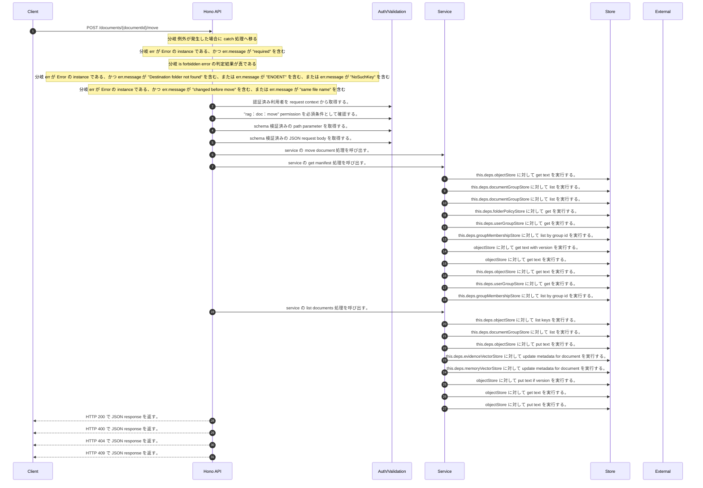

<!-- This file is generated by npm run docs:api-code. Do not edit manually. -->

# POST /documents/{documentId}/move シーケンス

## シーケンス図

## 処理順とコード対応

| # | Caller | 境界 | 処理 | コード | 実装位置 |
| ---: | --- | --- | --- | --- | --- |
| 1 | `POST /documents/{documentId}/move handler` | Auth | 認証済み利用者を request context から取得する。 | `c.get("user")` | `apps/api/src/routes/document-routes.ts:409 (POST /documents/{documentId}/move handler)` |
| 2 | `POST /documents/{documentId}/move handler` | Auth | "rag:doc:move" permission を必須条件として確認する。 | `requirePermission(user, "rag:doc:move")` | `apps/api/src/routes/document-routes.ts:410 (POST /documents/{documentId}/move handler)` |
| 3 | `POST /documents/{documentId}/move handler` | Validation | schema 検証済みの path parameter を取得する。 | `validParam<{ documentId: string }>(c)` | `apps/api/src/routes/document-routes.ts:411 (POST /documents/{documentId}/move handler)` |
| 4 | `POST /documents/{documentId}/move handler` | Validation | schema 検証済みの JSON request body を取得する。 | `validJson<z.infer<typeof DocumentMoveRequestSchema>>(c)` | `apps/api/src/routes/document-routes.ts:412 (POST /documents/{documentId}/move handler)` |
| 5 | `POST /documents/{documentId}/move handler` | Service | service の move document 処理を呼び出す。 | `service.moveDocument(user, documentId, body)` | `apps/api/src/routes/document-routes.ts:414 (POST /documents/{documentId}/move handler)` |
| 6 | `MemoRagService.moveDocument` | Service | service の get manifest 処理を呼び出す。 | `this.getManifest(documentId)` | `apps/api/src/rag/memorag-service.ts:597 (MemoRagService.moveDocument)` |
| 7 | `MemoRagService.getManifestByKey` | Store | `this.deps.objectStore` に対して get text を実行する。 | `this.deps.objectStore.getText(key)` | `apps/api/src/rag/memorag-service.ts:1638 (MemoRagService.getManifestByKey)` |
| 8 | `MemoRagService.moveDocument` | Store | `this.deps.documentGroupStore` に対して list を実行する。 | `this.deps.documentGroupStore.list()` | `apps/api/src/rag/memorag-service.ts:603 (MemoRagService.moveDocument)` |
| 9 | `FolderPermissionService.resolveEffectiveFolderPermissionDetail` | Store | `this.deps.documentGroupStore` に対して list を実行する。 | `this.deps.documentGroupStore.list()` | `apps/api/src/folders/folder-permission-service.ts:47 (FolderPermissionService.resolveEffectiveFolderPermissionDetail)` |
| 10 | `FolderPermissionService.resolvePolicyContext` | Store | `this.deps.folderPolicyStore` に対して get を実行する。 | `this.deps.folderPolicyStore.get(current.policyId)` | `apps/api/src/folders/folder-permission-service.ts:128 (FolderPermissionService.resolvePolicyContext)` |
| 11 | `FolderPermissionService.resolveUserMembershipPermission` | Store | `this.deps.userGroupStore` に対して get を実行する。 | `this.deps.userGroupStore.get(groupId)` | `apps/api/src/folders/folder-permission-service.ts:166 (FolderPermissionService.resolveUserMembershipPermission)` |
| 12 | `FolderPermissionService.resolveUserMembershipPermission` | Store | `this.deps.groupMembershipStore` に対して list by group id を実行する。 | `this.deps.groupMembershipStore.listByGroupId(groupId)` | `apps/api/src/folders/folder-permission-service.ts:171 (FolderPermissionService.resolveUserMembershipPermission)` |
| 13 | `getTextWithVersion` | Store | `objectStore` に対して get text with version を実行する。 | `objectStore.getTextWithVersion(key)` | `apps/api/src/documents/document-permission-service.ts:418 (getTextWithVersion)` |
| 14 | `getTextWithVersion` | Store | `objectStore` に対して get text を実行する。 | `objectStore.getText(key)` | `apps/api/src/documents/document-permission-service.ts:419 (getTextWithVersion)` |
| 15 | `DocumentPermissionService.loadLegacyDocumentGrants` | Store | `this.deps.objectStore` に対して get text を実行する。 | `this.deps.objectStore.getText(documentShareLegacyLedgerKey)` | `apps/api/src/documents/document-permission-service.ts:193 (DocumentPermissionService.loadLegacyDocumentGrants)` |
| 16 | `DocumentPermissionService.resolveUserMembershipPermission` | Store | `this.deps.userGroupStore` に対して get を実行する。 | `this.deps.userGroupStore.get(groupId)` | `apps/api/src/documents/document-permission-service.ts:287 (DocumentPermissionService.resolveUserMembershipPermission)` |
| 17 | `DocumentPermissionService.resolveUserMembershipPermission` | Store | `this.deps.groupMembershipStore` に対して list by group id を実行する。 | `this.deps.groupMembershipStore.listByGroupId(groupId)` | `apps/api/src/documents/document-permission-service.ts:291 (DocumentPermissionService.resolveUserMembershipPermission)` |
| 18 | `MemoRagService.moveDocument` | Service | service の list documents 処理を呼び出す。 | `this.listDocuments(actor)` | `apps/api/src/rag/memorag-service.ts:613 (MemoRagService.moveDocument)` |
| 19 | `MemoRagService.listDocuments` | Store | `this.deps.objectStore` に対して list keys を実行する。 | `this.deps.objectStore.listKeys("manifests/")` | `apps/api/src/rag/memorag-service.ts:359 (MemoRagService.listDocuments)` |
| 20 | `MemoRagService.listDocuments` | Store | `this.deps.documentGroupStore` に対して list を実行する。 | `this.deps.documentGroupStore.list()` | `apps/api/src/rag/memorag-service.ts:371 (MemoRagService.listDocuments)` |
| 21 | `MemoRagService.moveDocument` | Store | `this.deps.objectStore` に対して put text を実行する。 | `this.deps.objectStore.putText(next.manifestObjectKey, JSON.stringify(next, null, 2), "application/json")` | `apps/api/src/rag/memorag-service.ts:635 (MemoRagService.moveDocument)` |
| 22 | `MemoRagService.moveDocument` | Store | `this.deps.evidenceVectorStore` に対して update metadata for document を実行する。 | `this.deps.evidenceVectorStore.updateMetadataForDocument?.(documentId, { fileName: nextFileName, groupId: destination.groupId, folderId: destination.groupId, groupIds: [destination.groupId], folderIds: [destination.group…` | `apps/api/src/rag/memorag-service.ts:637 (MemoRagService.moveDocument)` |
| 23 | `MemoRagService.moveDocument` | Store | `this.deps.memoryVectorStore` に対して update metadata for document を実行する。 | `this.deps.memoryVectorStore.updateMetadataForDocument?.(documentId, { fileName: nextFileName, groupId: destination.groupId, folderId: destination.groupId, groupIds: [destination.groupId], folderIds: [destination.groupId…` | `apps/api/src/rag/memorag-service.ts:638 (MemoRagService.moveDocument)` |
| 24 | `putTextIfVersion` | Store | `objectStore` に対して put text if version を実行する。 | `objectStore.putTextIfVersion(key, text, expectedVersion, contentType)` | `apps/api/src/documents/document-permission-service.ts:431 (putTextIfVersion)` |
| 25 | `putTextIfVersion` | Store | `objectStore` に対して get text を実行する。 | `objectStore.getText(key)` | `apps/api/src/documents/document-permission-service.ts:439 (putTextIfVersion)` |
| 26 | `putTextIfVersion` | Store | `objectStore` に対して put text を実行する。 | `objectStore.putText(key, text, contentType)` | `apps/api/src/documents/document-permission-service.ts:445 (putTextIfVersion)` |
| 27 | `POST /documents/{documentId}/move handler` | HTTP/SSE | HTTP 200 で JSON response を返す。 | `c.json(await service.moveDocument(user, documentId, body), 200)` | `apps/api/src/routes/document-routes.ts:414 (POST /documents/{documentId}/move handler)` |
| 28 | `POST /documents/{documentId}/move handler` | HTTP/SSE | HTTP 400 で JSON response を返す。 | `c.json({ error: err.message }, 400)` | `apps/api/src/routes/document-routes.ts:416 (POST /documents/{documentId}/move handler)` |
| 29 | `POST /documents/{documentId}/move handler` | HTTP/SSE | HTTP 404 で JSON response を返す。 | `c.json({ error: "Document or folder not found" }, 404)` | `apps/api/src/routes/document-routes.ts:418 (POST /documents/{documentId}/move handler)` |
| 30 | `POST /documents/{documentId}/move handler` | HTTP/SSE | HTTP 409 で JSON response を返す。 | `c.json({ error: err.message }, 409)` | `apps/api/src/routes/document-routes.ts:419 (POST /documents/{documentId}/move handler)` |

## 分岐

| ID | Function | 条件 | 実装位置 |
| --- | --- | --- | --- |
| B001 | `POST /documents/{documentId}/move handler` | 例外が発生した場合に catch 処理へ移る | `apps/api/src/routes/document-routes.ts:415 (POST /documents/{documentId}/move handler)` |
| B002 | `POST /documents/{documentId}/move handler` | `err` が `Error` の instance である、かつ `err.message` が "required" を含む | `apps/api/src/routes/document-routes.ts:416 (POST /documents/{documentId}/move handler)` |
| B003 | `POST /documents/{documentId}/move handler` | is forbidden error の判定結果が真である | `apps/api/src/routes/document-routes.ts:417 (POST /documents/{documentId}/move handler)` |
| B004 | `POST /documents/{documentId}/move handler` | `err` が `Error` の instance である、かつ `err.message` が "Destination folder not found" を含む、または `err.message` が "ENOENT" を含む、または `err.message` が "NoSuchKey" を含む | `apps/api/src/routes/document-routes.ts:418 (POST /documents/{documentId}/move handler)` |
| B005 | `POST /documents/{documentId}/move handler` | `err` が `Error` の instance である、かつ `err.message` が "changed before move" を含む、または `err.message` が "same file name" を含む | `apps/api/src/routes/document-routes.ts:419 (POST /documents/{documentId}/move handler)` |
| B006 | `requirePermission` | 利用者が 指定された permission を持たない | `apps/api/src/authorization.ts:267 (requirePermission)` |
| B007 | `MemoRagService.moveDocument` | `input.expectedUpdatedAt` が存在し、真である、かつ `input.expectedUpdatedAt` が `currentUpdatedAt` と異なる | `apps/api/src/rag/memorag-service.ts:599 (MemoRagService.moveDocument)` |
| B008 | `MemoRagService.moveDocument` | `destination` が存在しない、または偽である、または `destination.status` が `"archived"` と等しい | `apps/api/src/rag/memorag-service.ts:605 (MemoRagService.moveDocument)` |
| B009 | `MemoRagService.moveDocument` | can move document の判定結果が真ではない | `apps/api/src/rag/memorag-service.ts:609 (MemoRagService.moveDocument)` |
| B010 | `MemoRagService.moveDocument` | `candidate.documentId` が `manifest.documentId` と等しい | `apps/api/src/rag/memorag-service.ts:614 (MemoRagService.moveDocument)` |
| B011 | `MemoRagService.moveDocument` | `candidate.fileName` が `nextFileName` と異なる | `apps/api/src/rag/memorag-service.ts:615 (MemoRagService.moveDocument)` |
| B012 | `MemoRagService.moveDocument` | `siblingConflict` が存在し、真である | `apps/api/src/rag/memorag-service.ts:618 (MemoRagService.moveDocument)` |
