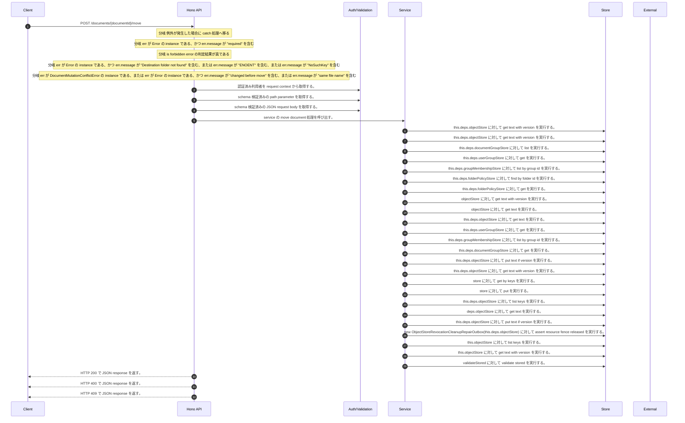

<!-- This file is generated by npm run docs:api-code. Do not edit manually. -->

# POST /documents/{documentId}/move シーケンス

## シーケンス図

## 処理順とコード対応

| # | Caller | 境界 | 処理 | コード | 実装位置 |
| ---: | --- | --- | --- | --- | --- |
| 1 | `POST /documents/{documentId}/move handler` | Auth | 認証済み利用者を request context から取得する。 | `c.get("user")` | `apps/api/src/routes/document-routes.ts:953 (POST /documents/{documentId}/move handler)` |
| 2 | `POST /documents/{documentId}/move handler` | Validation | schema 検証済みの path parameter を取得する。 | `validParam<{ documentId: string }>(c)` | `apps/api/src/routes/document-routes.ts:954 (POST /documents/{documentId}/move handler)` |
| 3 | `POST /documents/{documentId}/move handler` | Validation | schema 検証済みの JSON request body を取得する。 | `validJson<z.infer<typeof DocumentMoveRequestSchema>>(c)` | `apps/api/src/routes/document-routes.ts:955 (POST /documents/{documentId}/move handler)` |
| 4 | `POST /documents/{documentId}/move handler` | Service | service の move document 処理を呼び出す。 | `service.moveDocument(user, documentId, body)` | `apps/api/src/routes/document-routes.ts:957 (POST /documents/{documentId}/move handler)` |
| 5 | `DocumentLifecycleMutationCoordinator.readManifest` | Store | `this.deps.objectStore` に対して get text with version を実行する。 | `this.deps.objectStore.getTextWithVersion(key)` | `apps/api/src/documents/document-lifecycle-mutation-coordinator.ts:954 (DocumentLifecycleMutationCoordinator.readManifest)` |
| 6 | `DocumentLifecycleMutationCoordinator.readState` | Store | `this.deps.objectStore` に対して get text with version を実行する。 | `this.deps.objectStore.getTextWithVersion(key)` | `apps/api/src/documents/document-lifecycle-mutation-coordinator.ts:965 (DocumentLifecycleMutationCoordinator.readState)` |
| 7 | `FolderPermissionService.resolveEffectiveFolderPermissionDetail` | Store | `this.deps.documentGroupStore` に対して list を実行する。 | `this.deps.documentGroupStore.list(actorTenantId)` | `apps/api/src/folders/folder-permission-service.ts:145 (FolderPermissionService.resolveEffectiveFolderPermissionDetail)` |
| 8 | `FolderPermissionService.resolveUserMembershipPermission` | Store | `this.deps.userGroupStore` に対して get を実行する。 | `this.deps.userGroupStore.get(tenantId, groupId)` | `apps/api/src/folders/folder-permission-service.ts:780 (FolderPermissionService.resolveUserMembershipPermission)` |
| 9 | `FolderPermissionService.resolveUserMembershipPermission` | Store | `this.deps.groupMembershipStore` に対して list by group id を実行する。 | `this.deps.groupMembershipStore.listByGroupId(tenantId, groupId)` | `apps/api/src/folders/folder-permission-service.ts:781 (FolderPermissionService.resolveUserMembershipPermission)` |
| 10 | `FolderPermissionService.resolvePolicyContext` | Store | `this.deps.folderPolicyStore` に対して find by folder id を実行する。 | `this.deps.folderPolicyStore.findByFolderId(folder.tenantId, current.groupId)` | `apps/api/src/folders/folder-permission-service.ts:695 (FolderPermissionService.resolvePolicyContext)` |
| 11 | `FolderPermissionService.resolvePolicyContext` | Store | `this.deps.folderPolicyStore` に対して get を実行する。 | `this.deps.folderPolicyStore.get(folder.tenantId, current.policyId)` | `apps/api/src/folders/folder-permission-service.ts:711 (FolderPermissionService.resolvePolicyContext)` |
| 12 | `getTextWithVersion` | Store | `objectStore` に対して get text with version を実行する。 | `objectStore.getTextWithVersion(key)` | `apps/api/src/documents/document-permission-service.ts:962 (getTextWithVersion)` |
| 13 | `getTextWithVersion` | Store | `objectStore` に対して get text を実行する。 | `objectStore.getText(key)` | `apps/api/src/documents/document-permission-service.ts:963 (getTextWithVersion)` |
| 14 | `DocumentPermissionService.loadLegacyDocumentGrants` | Store | `this.deps.objectStore` に対して get text を実行する。 | `this.deps.objectStore.getText(documentShareLegacyLedgerKey)` | `apps/api/src/documents/document-permission-service.ts:528 (DocumentPermissionService.loadLegacyDocumentGrants)` |
| 15 | `DocumentPermissionService.resolveUserMembershipPermission` | Store | `this.deps.userGroupStore` に対して get を実行する。 | `this.deps.userGroupStore.get(tenantId, groupId)` | `apps/api/src/documents/document-permission-service.ts:674 (DocumentPermissionService.resolveUserMembershipPermission)` |
| 16 | `DocumentPermissionService.resolveUserMembershipPermission` | Store | `this.deps.groupMembershipStore` に対して list by group id を実行する。 | `this.deps.groupMembershipStore.listByGroupId(tenantId, groupId)` | `apps/api/src/documents/document-permission-service.ts:675 (DocumentPermissionService.resolveUserMembershipPermission)` |
| 17 | `DocumentLifecycleMutationCoordinator.authorizeMove` | Store | `this.deps.documentGroupStore` に対して get を実行する。 | `this.deps.documentGroupStore.get(tenantId, destinationFolderId)` | `apps/api/src/documents/document-lifecycle-mutation-coordinator.ts:682 (DocumentLifecycleMutationCoordinator.authorizeMove)` |
| 18 | `DocumentLifecycleMutationCoordinator.writeState` | Store | `this.deps.objectStore` に対して put text if version を実行する。 | `this.deps.objectStore.putTextIfVersion(key, JSON.stringify(value, null, 2), expectedVersion, "application/json")` | `apps/api/src/documents/document-lifecycle-mutation-coordinator.ts:974 (DocumentLifecycleMutationCoordinator.writeState)` |
| 19 | `DocumentLifecycleMutationCoordinator.writeState` | Store | `this.deps.objectStore` に対して get text with version を実行する。 | `this.deps.objectStore.getTextWithVersion(key)` | `apps/api/src/documents/document-lifecycle-mutation-coordinator.ts:975 (DocumentLifecycleMutationCoordinator.writeState)` |
| 20 | `DocumentLifecycleMutationCoordinator.rewriteProjection` | Store | `store` に対して get by keys を実行する。 | `store.getByKeys(keys)` | `apps/api/src/documents/document-lifecycle-mutation-coordinator.ts:868 (DocumentLifecycleMutationCoordinator.rewriteProjection)` |
| 21 | `DocumentLifecycleMutationCoordinator.rewriteProjection` | Store | `store` に対して put を実行する。 | `store.put(records.map((record) => ({ ...record, metadata: projectionMetadata(record.metadata, manifest, lifecycleStatus) })))` | `apps/api/src/documents/document-lifecycle-mutation-coordinator.ts:872 (DocumentLifecycleMutationCoordinator.rewriteProjection)` |
| 22 | `DocumentLifecycleMutationCoordinator.assertNoSiblingConflict` | Store | `this.deps.objectStore` に対して list keys を実行する。 | `this.deps.objectStore.listKeys(tenantManifestPrefix(this.deps, tenantId))` | `apps/api/src/documents/document-lifecycle-mutation-coordinator.ts:755 (DocumentLifecycleMutationCoordinator.assertNoSiblingConflict)` |
| 23 | `readTenantManifestByKey` | Store | `deps.objectStore` に対して get text を実行する。 | `deps.objectStore.getText(key)` | `apps/api/src/rag/_shared/storage/tenant-artifacts.ts:93 (readTenantManifestByKey)` |
| 24 | `DocumentLifecycleMutationCoordinator.runMoveStateMachine` | Store | `this.deps.objectStore` に対して put text if version を実行する。 | `this.deps.objectStore.putTextIfVersion( current.value.manifestObjectKey, JSON.stringify(intent.targetManifest, null, 2), intent.sourceManifestVersion, "application/json" )` | `apps/api/src/documents/document-lifecycle-mutation-coordinator.ts:505 (DocumentLifecycleMutationCoordinator.runMoveStateMachine)` |
| 25 | `DocumentLifecycleMutationCoordinator.moveDocument` | Store | `new ObjectStoreRevocationCleanupRepairOutbox(this.deps.objectStore)         ` に対して assert resource fence released を実行する。 | `new ObjectStoreRevocationCleanupRepairOutbox(this.deps.objectStore) .assertResourceFenceReleased(tenantId, "document", documentId)` | `apps/api/src/documents/document-lifecycle-mutation-coordinator.ts:235 (DocumentLifecycleMutationCoordinator.moveDocument)` |
| 26 | `ObjectStoreRevocationCleanupRepairOutbox.assertResourceFenceReleased` | Store | `this.objectStore` に対して list keys を実行する。 | `this.objectStore.listKeys(prefix)` | `apps/api/src/rag/_shared/security/revocation-cleanup-repair-outbox.ts:109 (ObjectStoreRevocationCleanupRepairOutbox.assertResourceFenceReleased)` |
| 27 | `ObjectStoreRevocationCleanupRepairOutbox.read` | Store | `this.objectStore` に対して get text with version を実行する。 | `this.objectStore.getTextWithVersion(key)` | `apps/api/src/rag/_shared/security/revocation-cleanup-repair-outbox.ts:163 (ObjectStoreRevocationCleanupRepairOutbox.read)` |
| 28 | `ObjectStoreRevocationCleanupRepairOutbox.read` | Store | `validateStored` に対して validate stored を実行する。 | `validateStored(value)` | `apps/api/src/rag/_shared/security/revocation-cleanup-repair-outbox.ts:165 (ObjectStoreRevocationCleanupRepairOutbox.read)` |
| 29 | `POST /documents/{documentId}/move handler` | HTTP/SSE | HTTP 200 で JSON response を返す。 | `c.json(await service.moveDocument(user, documentId, body), 200)` | `apps/api/src/routes/document-routes.ts:957 (POST /documents/{documentId}/move handler)` |
| 30 | `POST /documents/{documentId}/move handler` | HTTP/SSE | HTTP 400 で JSON response を返す。 | `c.json({ error: err.message }, 400)` | `apps/api/src/routes/document-routes.ts:959 (POST /documents/{documentId}/move handler)` |
| 31 | `POST /documents/{documentId}/move handler` | HTTP/SSE | HTTP 409 で JSON response を返す。 | `c.json({ error: err.message }, 409)` | `apps/api/src/routes/document-routes.ts:962 (POST /documents/{documentId}/move handler)` |

## 分岐

| ID | Function | 条件 | 実装位置 |
| --- | --- | --- | --- |
| B001 | `POST /documents/{documentId}/move handler` | 例外が発生した場合に catch 処理へ移る | `apps/api/src/routes/document-routes.ts:958 (POST /documents/{documentId}/move handler)` |
| B002 | `POST /documents/{documentId}/move handler` | `err` が `Error` の instance である、かつ `err.message` が "required" を含む | `apps/api/src/routes/document-routes.ts:959 (POST /documents/{documentId}/move handler)` |
| B003 | `POST /documents/{documentId}/move handler` | is forbidden error の判定結果が真である | `apps/api/src/routes/document-routes.ts:960 (POST /documents/{documentId}/move handler)` |
| B004 | `POST /documents/{documentId}/move handler` | `err` が `Error` の instance である、かつ `err.message` が "Destination folder not found" を含む、または `err.message` が "ENOENT" を含む、または `err.message` が "NoSuchKey" を含む | `apps/api/src/routes/document-routes.ts:961 (POST /documents/{documentId}/move handler)` |
| B005 | `POST /documents/{documentId}/move handler` | `err` が `DocumentMutationConflictError` の instance である、または `err` が `Error` の instance である、かつ `err.message` が "changed before move" を含む、または `err.message` が "same file name" を含む | `apps/api/src/routes/document-routes.ts:962 (POST /documents/{documentId}/move handler)` |
