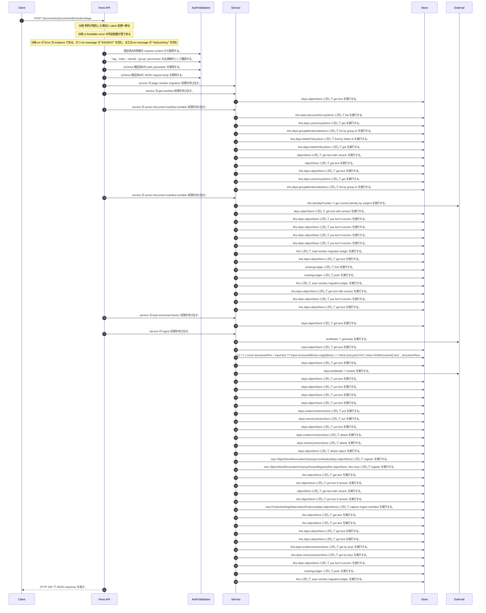

<!-- This file is generated by npm run docs:api-code. Do not edit manually. -->

# POST /documents/{documentId}/reindex/stage シーケンス

## シーケンス図

## 処理順とコード対応

| # | Caller | 境界 | 処理 | コード | 実装位置 |
| ---: | --- | --- | --- | --- | --- |
| 1 | `POST /documents/{documentId}/reindex/stage handler` | Auth | 認証済み利用者を request context から取得する。 | `c.get("user")` | `apps/api/src/routes/document-routes.ts:1429 (POST /documents/{documentId}/reindex/stage handler)` |
| 2 | `POST /documents/{documentId}/reindex/stage handler` | Auth | "rag:index:rebuild:group" permission を必須条件として確認する。 | `requirePermission(user, "rag:index:rebuild:group")` | `apps/api/src/routes/document-routes.ts:1430 (POST /documents/{documentId}/reindex/stage handler)` |
| 3 | `POST /documents/{documentId}/reindex/stage handler` | Validation | schema 検証済みの path parameter を取得する。 | `validParam<{ documentId: string }>(c)` | `apps/api/src/routes/document-routes.ts:1431 (POST /documents/{documentId}/reindex/stage handler)` |
| 4 | `POST /documents/{documentId}/reindex/stage handler` | Validation | schema 検証済みの JSON request body を取得する。 | `validJson<{ embeddingModelId?: string; memoryModelId?: string } \| undefined>(c)` | `apps/api/src/routes/document-routes.ts:1432 (POST /documents/{documentId}/reindex/stage handler)` |
| 5 | `POST /documents/{documentId}/reindex/stage handler` | Service | service の stage reindex migration 処理を呼び出す。 | `service.stageReindexMigration(user, documentId, body)` | `apps/api/src/routes/document-routes.ts:1434 (POST /documents/{documentId}/reindex/stage handler)` |
| 6 | `MemoRagService.stageReindexMigration` | Service | service の get manifest 処理を呼び出す。 | `this.getManifest(documentId, authoritativeActorTenantId(actor))` | `apps/api/src/rag/memorag-service.ts:633 (MemoRagService.stageReindexMigration)` |
| 7 | `readTenantManifest` | Store | `deps.objectStore` に対して get text を実行する。 | `deps.objectStore.getText(key)` | `apps/api/src/rag/_shared/storage/tenant-artifacts.ts:83 (readTenantManifest)` |
| 8 | `MemoRagService.stageReindexMigration` | Service | service の assert document manifest writable 処理を呼び出す。 | `this.assertDocumentManifestWritable(actor, manifest)` | `apps/api/src/rag/memorag-service.ts:634 (MemoRagService.stageReindexMigration)` |
| 9 | `FolderPermissionService.resolveEffectiveFolderPermissionDetail` | Store | `this.deps.documentGroupStore` に対して list を実行する。 | `this.deps.documentGroupStore.list(actorTenantId)` | `apps/api/src/folders/folder-permission-service.ts:145 (FolderPermissionService.resolveEffectiveFolderPermissionDetail)` |
| 10 | `FolderPermissionService.resolveUserMembershipPermission` | Store | `this.deps.userGroupStore` に対して get を実行する。 | `this.deps.userGroupStore.get(tenantId, groupId)` | `apps/api/src/folders/folder-permission-service.ts:780 (FolderPermissionService.resolveUserMembershipPermission)` |
| 11 | `FolderPermissionService.resolveUserMembershipPermission` | Store | `this.deps.groupMembershipStore` に対して list by group id を実行する。 | `this.deps.groupMembershipStore.listByGroupId(tenantId, groupId)` | `apps/api/src/folders/folder-permission-service.ts:781 (FolderPermissionService.resolveUserMembershipPermission)` |
| 12 | `FolderPermissionService.resolvePolicyContext` | Store | `this.deps.folderPolicyStore` に対して find by folder id を実行する。 | `this.deps.folderPolicyStore.findByFolderId(folder.tenantId, current.groupId)` | `apps/api/src/folders/folder-permission-service.ts:695 (FolderPermissionService.resolvePolicyContext)` |
| 13 | `FolderPermissionService.resolvePolicyContext` | Store | `this.deps.folderPolicyStore` に対して get を実行する。 | `this.deps.folderPolicyStore.get(folder.tenantId, current.policyId)` | `apps/api/src/folders/folder-permission-service.ts:711 (FolderPermissionService.resolvePolicyContext)` |
| 14 | `getTextWithVersion` | Store | `objectStore` に対して get text with version を実行する。 | `objectStore.getTextWithVersion(key)` | `apps/api/src/documents/document-permission-service.ts:946 (getTextWithVersion)` |
| 15 | `getTextWithVersion` | Store | `objectStore` に対して get text を実行する。 | `objectStore.getText(key)` | `apps/api/src/documents/document-permission-service.ts:947 (getTextWithVersion)` |
| 16 | `DocumentPermissionService.loadLegacyDocumentGrants` | Store | `this.deps.objectStore` に対して get text を実行する。 | `this.deps.objectStore.getText(documentShareLegacyLedgerKey)` | `apps/api/src/documents/document-permission-service.ts:537 (DocumentPermissionService.loadLegacyDocumentGrants)` |
| 17 | `DocumentPermissionService.resolveUserMembershipPermission` | Store | `this.deps.userGroupStore` に対して get を実行する。 | `this.deps.userGroupStore.get(tenantId, groupId)` | `apps/api/src/documents/document-permission-service.ts:683 (DocumentPermissionService.resolveUserMembershipPermission)` |
| 18 | `DocumentPermissionService.resolveUserMembershipPermission` | Store | `this.deps.groupMembershipStore` に対して list by group id を実行する。 | `this.deps.groupMembershipStore.listByGroupId(tenantId, groupId)` | `apps/api/src/documents/document-permission-service.ts:684 (DocumentPermissionService.resolveUserMembershipPermission)` |
| 19 | `MemoRagService.stageReindexMigration` | Service | service の assert document manifest writable 処理を呼び出す。 | `this.assertDocumentManifestWritable(currentActor, manifest)` | `apps/api/src/rag/memorag-service.ts:645 (MemoRagService.stageReindexMigration)` |
| 20 | `CurrentWorkerAuthorization.assertAuthorized` | External | `this.identityProvider` へ get current identity by subject を実行する。 | `this.identityProvider.getCurrentIdentityBySubject(request.subject)` | `apps/api/src/security/current-worker-authorization.ts:51 (CurrentWorkerAuthorization.assertAuthorized)` |
| 21 | `readVersionedJson` | Store | `deps.objectStore` に対して get text with version を実行する。 | `deps.objectStore.getTextWithVersion(key)` | `apps/api/src/rag/_shared/publication/staged-publication-coordinator.ts:1796 (readVersionedJson)` |
| 22 | `StagedPublicationCoordinator.ensureBootstrapPointer` | Store | `this.deps.objectStore` に対して put text if version を実行する。 | `this.deps.objectStore.putTextIfVersion(key, JSON.stringify(bootstrap, null, 2), undefined, "application/json")` | `apps/api/src/rag/_shared/publication/staged-publication-coordinator.ts:930 (StagedPublicationCoordinator.ensureBootstrapPointer)` |
| 23 | `StagedPublicationCoordinator.annotateManifestWithPublicationControl` | Store | `this.deps.objectStore` に対して put text if version を実行する。 | `this.deps.objectStore.putTextIfVersion(manifest.manifestObjectKey, JSON.stringify(next, null, 2), stored.version, "application/json")` | `apps/api/src/rag/_shared/publication/staged-publication-coordinator.ts:964 (StagedPublicationCoordinator.annotateManifestWithPublicationControl)` |
| 24 | `StagedPublicationCoordinator.begin` | Store | `this.deps.objectStore` に対して put text if version を実行する。 | `this.deps.objectStore.putTextIfVersion(runKey, JSON.stringify(initial, null, 2), undefined, "application/json")` | `apps/api/src/rag/_shared/publication/staged-publication-coordinator.ts:222 (StagedPublicationCoordinator.begin)` |
| 25 | `StagedPublicationCoordinator.acquireLease` | Store | `this.deps.objectStore` に対して put text if version を実行する。 | `this.deps.objectStore.putTextIfVersion(runKey, JSON.stringify(next, null, 2), stored.version, "application/json")` | `apps/api/src/rag/_shared/publication/staged-publication-coordinator.ts:617 (StagedPublicationCoordinator.acquireLease)` |
| 26 | `MemoRagService.stageReindexMigration` | Store | `this` に対して load reindex migration ledger を実行する。 | `this.loadReindexMigrationLedger()` | `apps/api/src/rag/memorag-service.ts:665 (MemoRagService.stageReindexMigration)` |
| 27 | `MemoRagService.loadReindexMigrationLedger` | Store | `this.deps.objectStore` に対して get text を実行する。 | `this.deps.objectStore.getText(reindexMigrationLedgerKey)` | `apps/api/src/rag/memorag-service.ts:3801 (MemoRagService.loadReindexMigrationLedger)` |
| 28 | `MemoRagService.stageReindexMigration` | Store | `existingLedger` に対して find を実行する。 | `existingLedger.find((candidate) => candidate.publicationRunId === begun.run.runId \|\| candidate.migrationId === begun.run.runId)` | `apps/api/src/rag/memorag-service.ts:666 (MemoRagService.stageReindexMigration)` |
| 29 | `MemoRagService.stageReindexMigration` | Store | `existingLedger` に対して push を実行する。 | `existingLedger.push(recovered)` | `apps/api/src/rag/memorag-service.ts:671 (MemoRagService.stageReindexMigration)` |
| 30 | `MemoRagService.stageReindexMigration` | Store | `this` に対して save reindex migration ledger を実行する。 | `this.saveReindexMigrationLedger([recovered])` | `apps/api/src/rag/memorag-service.ts:672 (MemoRagService.stageReindexMigration)` |
| 31 | `MemoRagService.saveReindexMigrationLedger` | Store | `this.deps.objectStore` に対して get text with version を実行する。 | `this.deps.objectStore.getTextWithVersion(reindexMigrationLedgerKey)` | `apps/api/src/rag/memorag-service.ts:3813 (MemoRagService.saveReindexMigrationLedger)` |
| 32 | `MemoRagService.saveReindexMigrationLedger` | Store | `this.deps.objectStore` に対して put text if version を実行する。 | `this.deps.objectStore.putTextIfVersion( reindexMigrationLedgerKey, JSON.stringify({ schemaVersion: 1, migrations }, null, 2), stored?.version, "application/json" )` | `apps/api/src/rag/memorag-service.ts:3824 (MemoRagService.saveReindexMigrationLedger)` |
| 33 | `MemoRagService.stageReindexMigration` | Store | `this.deps.objectStore` に対して get text を実行する。 | `this.deps.objectStore.getText(manifest.sourceObjectKey)` | `apps/api/src/rag/memorag-service.ts:685 (MemoRagService.stageReindexMigration)` |
| 34 | `MemoRagService.stageReindexMigration` | Service | service の load structured blocks 処理を呼び出す。 | `this.loadStructuredBlocks(manifest)` | `apps/api/src/rag/memorag-service.ts:686 (MemoRagService.stageReindexMigration)` |
| 35 | `loadStructuredBlocksForManifest` | Store | `deps.objectStore` に対して get text を実行する。 | `deps.objectStore.getText(manifest.structuredBlocksObjectKey)` | `apps/api/src/rag/_shared/storage/manifest-chunks.ts:35 (loadStructuredBlocksForManifest)` |
| 36 | `MemoRagService.stageReindexMigration` | Service | service の ingest 処理を呼び出す。 | `this.ingest({ fileName: manifest.fileName, text, structuredBlocks, sourceExtractorVersion: manifest.sourceExtractorVersion, mimeType: manifest.mimeType, metadata: { ...(manifest.metadata ?? {}), lifecycleStatus: "stagin…` | `apps/api/src/rag/memorag-service.ts:687 (MemoRagService.stageReindexMigration)` |
| 37 | `MemoRagService.createMemoryCards` | External | `textModel` へ generate を実行する。 | `textModel.generate( buildMemoryCardPrompt(input.fileName, input.text), llmOptions("memoryCard", input.modelId ?? config.defaultMemoryModelId) )` | `apps/api/src/rag/memorag-service.ts:5035 (MemoRagService.createMemoryCards)` |
| 38 | `assertRagSafetyInterlock` | Store | `input.objectStore` に対して get text を実行する。 | `input.objectStore.getText(RAG_SAFETY_STATE_KEY)` | `apps/api/src/rag/quality-control/production-rag-monitor.ts:311 (assertRagSafetyInterlock)` |
| 39 | `runIngestPipeline` | Store | `(() => {         const structuredText = input.text ?? input.structuredBlocks.map((block) => block.text).join("\n\n")         return limitDocument({           text: structuredText,           blocks: input.structuredBlocks,           sourceExtractorVersion: input` に対して source extractor version ?? "structured blocks ledger v1"         })       }) を実行する。 | `(() => { const structuredText = input.text ?? input.structuredBlocks.map((block) => block.text).join("\n\n") return limitDocument({ text: structuredText, blocks: input.structuredBlocks, sourceExtractorVersion: input.sou…` | `apps/api/src/rag/offline/pre-retrieval/ingestion/ingest-run.service.ts:93 (runIngestPipeline)` |
| 40 | `embedWithCache` | Store | `deps.objectStore` に対して get text を実行する。 | `deps.objectStore.getText(key)` | `apps/api/src/rag/offline/pre-retrieval/embedding/embedding-cache.ts:21 (embedWithCache)` |
| 41 | `embedWithCache` | External | `deps.textModel` へ embed を実行する。 | `deps.textModel.embed(input.text, { modelId: input.modelId, dimensions: input.dimensions })` | `apps/api/src/rag/offline/pre-retrieval/embedding/embedding-cache.ts:29 (embedWithCache)` |
| 42 | `embedWithCache` | Store | `deps.objectStore` に対して put text を実行する。 | `deps.objectStore.putText(key, JSON.stringify(record), "application/json")` | `apps/api/src/rag/offline/pre-retrieval/embedding/embedding-cache.ts:38 (embedWithCache)` |
| 43 | `runIngestPipeline` | Store | `deps.objectStore` に対して put text を実行する。 | `deps.objectStore.putText(sourceObjectKey, text, "text/plain; charset=utf-8")` | `apps/api/src/rag/offline/pre-retrieval/ingestion/ingest-run.service.ts:475 (runIngestPipeline)` |
| 44 | `runIngestPipeline` | Store | `deps.objectStore` に対して put text を実行する。 | `deps.objectStore.putText(structuredBlocksObjectKey, structuredBlocksLedger, "application/json")` | `apps/api/src/rag/offline/pre-retrieval/ingestion/ingest-run.service.ts:478 (runIngestPipeline)` |
| 45 | `runIngestPipeline` | Store | `deps.objectStore` に対して put text を実行する。 | `deps.objectStore.putText(memoryCardsObjectKey, memoryCardsLedger, "application/json")` | `apps/api/src/rag/offline/pre-retrieval/ingestion/ingest-run.service.ts:482 (runIngestPipeline)` |
| 46 | `runIngestPipeline` | Store | `deps.evidenceVectorStore` に対して put を実行する。 | `deps.evidenceVectorStore.put(evidenceRecords)` | `apps/api/src/rag/offline/pre-retrieval/ingestion/ingest-run.service.ts:487 (runIngestPipeline)` |
| 47 | `runIngestPipeline` | Store | `deps.memoryVectorStore` に対して put を実行する。 | `deps.memoryVectorStore.put(memoryRecords)` | `apps/api/src/rag/offline/pre-retrieval/ingestion/ingest-run.service.ts:488 (runIngestPipeline)` |
| 48 | `runIngestPipeline` | Store | `deps.objectStore` に対して put text を実行する。 | `deps.objectStore.putText(manifestObjectKey, JSON.stringify(manifest, null, 2), "application/json")` | `apps/api/src/rag/offline/pre-retrieval/ingestion/ingest-run.service.ts:491 (runIngestPipeline)` |
| 49 | `runIngestPipeline` | Store | `deps.evidenceVectorStore` に対して delete を実行する。 | `deps.evidenceVectorStore.delete(evidenceRecords.map((record) => record.key))` | `apps/api/src/rag/offline/pre-retrieval/ingestion/ingest-run.service.ts:498 (runIngestPipeline)` |
| 50 | `runIngestPipeline` | Store | `deps.memoryVectorStore` に対して delete を実行する。 | `deps.memoryVectorStore.delete(memoryRecords.map((record) => record.key))` | `apps/api/src/rag/offline/pre-retrieval/ingestion/ingest-run.service.ts:499 (runIngestPipeline)` |
| 51 | `runIngestPipeline` | Store | `deps.objectStore` に対して delete object を実行する。 | `deps.objectStore.deleteObject(key)` | `apps/api/src/rag/offline/pre-retrieval/ingestion/ingest-run.service.ts:500 (runIngestPipeline)` |
| 52 | `registerUncommittedIngestCleanupReconciliation` | Store | `new ObjectStoreRevocationCleanupCoordinator(deps.objectStore)` に対して register を実行する。 | `new ObjectStoreRevocationCleanupCoordinator(deps.objectStore).register({ operationId: \`ingest-compensation:${manifest.documentId}:${manifest.documentVersion ?? manifest.createdAt}\`, tenantId, resourceType: manifest.meta…` | `apps/api/src/rag/offline/pre-retrieval/ingestion/ingest-run.service.ts:549 (registerUncommittedIngestCleanupReconciliation)` |
| 53 | `ObjectStoreRevocationCleanupCoordinator.register` | Store | `new ObjectStoreRevocationCleanupTenantRegistry(this.objectStore, this.now)` に対して register を実行する。 | `new ObjectStoreRevocationCleanupTenantRegistry(this.objectStore, this.now).register(normalized.tenantId)` | `apps/api/src/rag/_shared/security/revocation-cleanup-coordinator.ts:137 (ObjectStoreRevocationCleanupCoordinator.register)` |
| 54 | `ObjectStoreRevocationCleanupTenantRegistry.read` | Store | `this.objectStore` に対して get text を実行する。 | `this.objectStore.getText(key)` | `apps/api/src/rag/_shared/security/revocation-cleanup-tenant-registry.ts:116 (ObjectStoreRevocationCleanupTenantRegistry.read)` |
| 55 | `ObjectStoreRevocationCleanupTenantRegistry.register` | Store | `this.objectStore` に対して put text if version を実行する。 | `this.objectStore.putTextIfVersion(key, JSON.stringify(record, null, 2), undefined, "application/json")` | `apps/api/src/rag/_shared/security/revocation-cleanup-tenant-registry.ts:41 (ObjectStoreRevocationCleanupTenantRegistry.register)` |
| 56 | `readManifest` | Store | `objectStore` に対して get text with version を実行する。 | `objectStore.getTextWithVersion(key)` | `apps/api/src/rag/_shared/security/revocation-cleanup-coordinator.ts:636 (readManifest)` |
| 57 | `ObjectStoreRevocationCleanupCoordinator.register` | Store | `this.objectStore` に対して put text if version を実行する。 | `this.objectStore.putTextIfVersion(key, JSON.stringify(manifest, null, 2), undefined, "application/json")` | `apps/api/src/rag/_shared/security/revocation-cleanup-coordinator.ts:169 (ObjectStoreRevocationCleanupCoordinator.register)` |
| 58 | `runIngestPipeline` | Store | `new ProductionRagObservationProducer(deps.objectStore)` に対して capture ingest manifest を実行する。 | `new ProductionRagObservationProducer(deps.objectStore).captureIngestManifest({ manifest, latencyMs: Math.max(0, Date.now() - pipelineStartedMs) })` | `apps/api/src/rag/offline/pre-retrieval/ingestion/ingest-run.service.ts:504 (runIngestPipeline)` |
| 59 | `ProductionRagObservationProducer.loadActivePolicy` | Store | `this.objectStore` に対して get text を実行する。 | `this.objectStore.getText(ACTIVE_RAG_QUALITY_POLICY_KEY)` | `apps/api/src/rag/quality-control/production-rag-observation-producer.ts:783 (ProductionRagObservationProducer.loadActivePolicy)` |
| 60 | `ProductionRagObservationProducer.persistSample` | Store | `this.objectStore` に対して put text を実行する。 | `this.objectStore.putText(key, \`${JSON.stringify(sample, null, 2)}\n\`, "application/json; charset=utf-8")` | `apps/api/src/rag/quality-control/production-rag-observation-producer.ts:762 (ProductionRagObservationProducer.persistSample)` |
| 61 | `StagedPublicationCoordinator.loadManifest` | Store | `this.deps.objectStore` に対して get text を実行する。 | `this.deps.objectStore.getText(key)` | `apps/api/src/rag/_shared/publication/staged-publication-coordinator.ts:1490 (StagedPublicationCoordinator.loadManifest)` |
| 62 | `StagedPublicationCoordinator.validateStagedManifest` | Store | `this.deps.objectStore` に対して get text を実行する。 | `this.deps.objectStore.getText(key)` | `apps/api/src/rag/_shared/publication/staged-publication-coordinator.ts:733 (StagedPublicationCoordinator.validateStagedManifest)` |
| 63 | `StagedPublicationCoordinator.loadVectorRecords` | Store | `this.deps.evidenceVectorStore` に対して get by keys を実行する。 | `this.deps.evidenceVectorStore.getByKeys(evidenceKeys)` | `apps/api/src/rag/_shared/publication/staged-publication-coordinator.ts:1475 (StagedPublicationCoordinator.loadVectorRecords)` |
| 64 | `StagedPublicationCoordinator.loadVectorRecords` | Store | `this.deps.memoryVectorStore` に対して get by keys を実行する。 | `this.deps.memoryVectorStore.getByKeys(memoryKeys)` | `apps/api/src/rag/_shared/publication/staged-publication-coordinator.ts:1476 (StagedPublicationCoordinator.loadVectorRecords)` |
| 65 | `StagedPublicationCoordinator.updateWithFence` | Store | `this.deps.objectStore` に対して put text if version を実行する。 | `this.deps.objectStore.putTextIfVersion(runKey, JSON.stringify(next, null, 2), stored.version, "application/json")` | `apps/api/src/rag/_shared/publication/staged-publication-coordinator.ts:690 (StagedPublicationCoordinator.updateWithFence)` |
| 66 | `MemoRagService.stageReindexMigration` | Store | `existingLedger` に対して push を実行する。 | `existingLedger.push(migration)` | `apps/api/src/rag/memorag-service.ts:728 (MemoRagService.stageReindexMigration)` |
| 67 | `MemoRagService.stageReindexMigration` | Store | `this` に対して save reindex migration ledger を実行する。 | `this.saveReindexMigrationLedger([migration])` | `apps/api/src/rag/memorag-service.ts:729 (MemoRagService.stageReindexMigration)` |
| 68 | `POST /documents/{documentId}/reindex/stage handler` | HTTP/SSE | HTTP 200 で JSON response を返す。 | `c.json(await service.stageReindexMigration(user, documentId, body), 200)` | `apps/api/src/routes/document-routes.ts:1434 (POST /documents/{documentId}/reindex/stage handler)` |

## 分岐

| ID | Function | 条件 | 実装位置 |
| --- | --- | --- | --- |
| B001 | `POST /documents/{documentId}/reindex/stage handler` | 例外が発生した場合に catch 処理へ移る | `apps/api/src/routes/document-routes.ts:1435 (POST /documents/{documentId}/reindex/stage handler)` |
| B002 | `POST /documents/{documentId}/reindex/stage handler` | is forbidden error の判定結果が真である | `apps/api/src/routes/document-routes.ts:1436 (POST /documents/{documentId}/reindex/stage handler)` |
| B003 | `POST /documents/{documentId}/reindex/stage handler` | `err` が `Error` の instance である、かつ `err.message` が "ENOENT" を含む、または `err.message` が "NoSuchKey" を含む | `apps/api/src/routes/document-routes.ts:1437 (POST /documents/{documentId}/reindex/stage handler)` |
| B004 | `requirePermission` | 利用者が 指定された permission を持たない | `apps/api/src/authorization.ts:184 (requirePermission)` |
| B005 | `MemoRagService.stageReindexMigration` | `(manifest.lifecycleStatus ?? stringValue(manifest.metadata?.lifecycleStatus) ?? "active")` が `"active"` と異なる | `apps/api/src/rag/memorag-service.ts:650 (MemoRagService.stageReindexMigration)` |
| B006 | `MemoRagService.stageReindexMigration` | `manifest.publicationEligible` が `false` と等しい、または `manifest.derivedIntegrity?.verified` が `false` と等しい | `apps/api/src/rag/memorag-service.ts:653 (MemoRagService.stageReindexMigration)` |
| B007 | `MemoRagService.stageReindexMigration` | `begun.alreadyStaged` が存在し、真である | `apps/api/src/rag/memorag-service.ts:667 (MemoRagService.stageReindexMigration)` |
| B008 | `MemoRagService.stageReindexMigration` | `existingMigration` が存在し、真である | `apps/api/src/rag/memorag-service.ts:668 (MemoRagService.stageReindexMigration)` |
| B009 | `MemoRagService.stageReindexMigration` | `begun.run.stagedArtifact` が存在しない、または偽である | `apps/api/src/rag/memorag-service.ts:669 (MemoRagService.stageReindexMigration)` |
| B010 | `MemoRagService.stageReindexMigration` | `begun.lease` が存在しない、または偽である | `apps/api/src/rag/memorag-service.ts:675 (MemoRagService.stageReindexMigration)` |
| B011 | `MemoRagService.stageReindexMigration` | `this.deps.localTestIngestAdmissionContext` が存在し、真である | `apps/api/src/rag/memorag-service.ts:677 (MemoRagService.stageReindexMigration)` |
