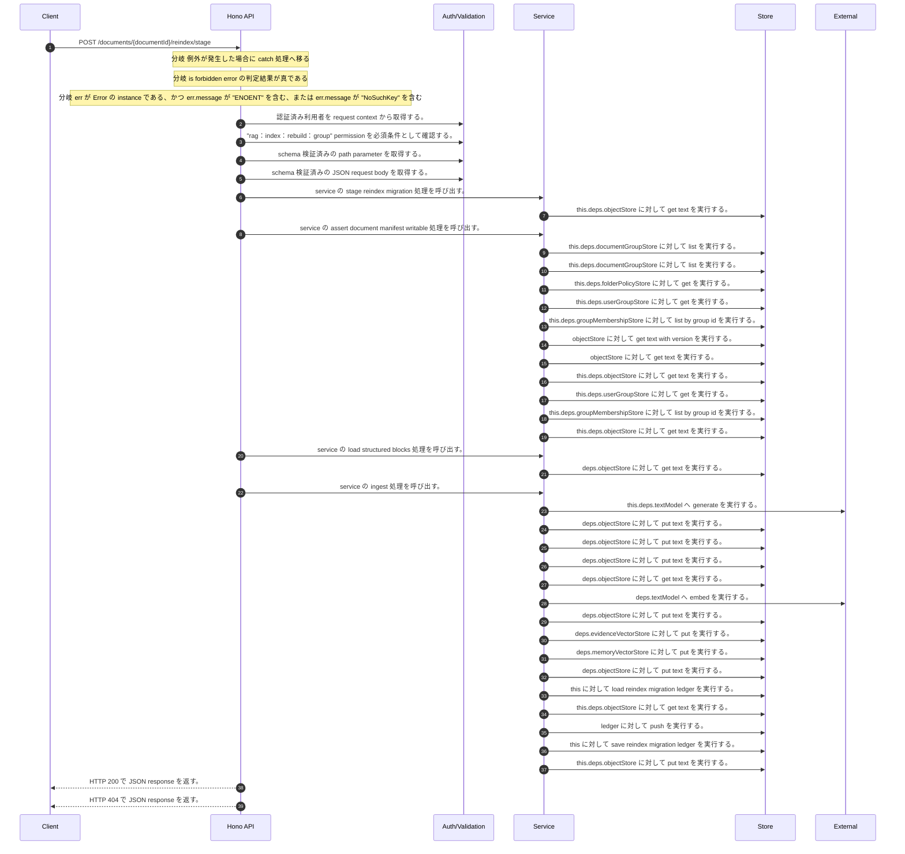

<!-- This file is generated by npm run docs:api-code. Do not edit manually. -->

# POST /documents/{documentId}/reindex/stage シーケンス

## シーケンス図

## 処理順とコード対応

| # | Caller | 境界 | 処理 | コード | 実装位置 |
| ---: | --- | --- | --- | --- | --- |
| 1 | `POST /documents/{documentId}/reindex/stage handler` | Auth | 認証済み利用者を request context から取得する。 | `c.get("user")` | `apps/api/src/routes/document-routes.ts:750 (POST /documents/{documentId}/reindex/stage handler)` |
| 2 | `POST /documents/{documentId}/reindex/stage handler` | Auth | "rag:index:rebuild:group" permission を必須条件として確認する。 | `requirePermission(user, "rag:index:rebuild:group")` | `apps/api/src/routes/document-routes.ts:751 (POST /documents/{documentId}/reindex/stage handler)` |
| 3 | `POST /documents/{documentId}/reindex/stage handler` | Validation | schema 検証済みの path parameter を取得する。 | `validParam<{ documentId: string }>(c)` | `apps/api/src/routes/document-routes.ts:752 (POST /documents/{documentId}/reindex/stage handler)` |
| 4 | `POST /documents/{documentId}/reindex/stage handler` | Validation | schema 検証済みの JSON request body を取得する。 | `validJson<{ embeddingModelId?: string; memoryModelId?: string } \| undefined>(c)` | `apps/api/src/routes/document-routes.ts:753 (POST /documents/{documentId}/reindex/stage handler)` |
| 5 | `POST /documents/{documentId}/reindex/stage handler` | Service | service の stage reindex migration 処理を呼び出す。 | `service.stageReindexMigration(user, documentId, body)` | `apps/api/src/routes/document-routes.ts:755 (POST /documents/{documentId}/reindex/stage handler)` |
| 6 | `MemoRagService.stageReindexMigration` | Store | `this.deps.objectStore` に対して get text を実行する。 | `this.deps.objectStore.getText(manifestKey)` | `apps/api/src/rag/memorag-service.ts:250 (MemoRagService.stageReindexMigration)` |
| 7 | `MemoRagService.stageReindexMigration` | Service | service の assert document manifest writable 処理を呼び出す。 | `this.assertDocumentManifestWritable(actor, manifest)` | `apps/api/src/rag/memorag-service.ts:251 (MemoRagService.stageReindexMigration)` |
| 8 | `MemoRagService.assertDocumentManifestWritable` | Store | `this.deps.documentGroupStore` に対して list を実行する。 | `this.deps.documentGroupStore.list()` | `apps/api/src/rag/memorag-service.ts:563 (MemoRagService.assertDocumentManifestWritable)` |
| 9 | `FolderPermissionService.resolveEffectiveFolderPermissionDetail` | Store | `this.deps.documentGroupStore` に対して list を実行する。 | `this.deps.documentGroupStore.list()` | `apps/api/src/folders/folder-permission-service.ts:47 (FolderPermissionService.resolveEffectiveFolderPermissionDetail)` |
| 10 | `FolderPermissionService.resolvePolicyContext` | Store | `this.deps.folderPolicyStore` に対して get を実行する。 | `this.deps.folderPolicyStore.get(current.policyId)` | `apps/api/src/folders/folder-permission-service.ts:128 (FolderPermissionService.resolvePolicyContext)` |
| 11 | `FolderPermissionService.resolveUserMembershipPermission` | Store | `this.deps.userGroupStore` に対して get を実行する。 | `this.deps.userGroupStore.get(groupId)` | `apps/api/src/folders/folder-permission-service.ts:166 (FolderPermissionService.resolveUserMembershipPermission)` |
| 12 | `FolderPermissionService.resolveUserMembershipPermission` | Store | `this.deps.groupMembershipStore` に対して list by group id を実行する。 | `this.deps.groupMembershipStore.listByGroupId(groupId)` | `apps/api/src/folders/folder-permission-service.ts:171 (FolderPermissionService.resolveUserMembershipPermission)` |
| 13 | `getTextWithVersion` | Store | `objectStore` に対して get text with version を実行する。 | `objectStore.getTextWithVersion(key)` | `apps/api/src/documents/document-permission-service.ts:418 (getTextWithVersion)` |
| 14 | `getTextWithVersion` | Store | `objectStore` に対して get text を実行する。 | `objectStore.getText(key)` | `apps/api/src/documents/document-permission-service.ts:419 (getTextWithVersion)` |
| 15 | `DocumentPermissionService.loadLegacyDocumentGrants` | Store | `this.deps.objectStore` に対して get text を実行する。 | `this.deps.objectStore.getText(documentShareLegacyLedgerKey)` | `apps/api/src/documents/document-permission-service.ts:193 (DocumentPermissionService.loadLegacyDocumentGrants)` |
| 16 | `DocumentPermissionService.resolveUserMembershipPermission` | Store | `this.deps.userGroupStore` に対して get を実行する。 | `this.deps.userGroupStore.get(groupId)` | `apps/api/src/documents/document-permission-service.ts:287 (DocumentPermissionService.resolveUserMembershipPermission)` |
| 17 | `DocumentPermissionService.resolveUserMembershipPermission` | Store | `this.deps.groupMembershipStore` に対して list by group id を実行する。 | `this.deps.groupMembershipStore.listByGroupId(groupId)` | `apps/api/src/documents/document-permission-service.ts:291 (DocumentPermissionService.resolveUserMembershipPermission)` |
| 18 | `MemoRagService.stageReindexMigration` | Store | `this.deps.objectStore` に対して get text を実行する。 | `this.deps.objectStore.getText(manifest.sourceObjectKey)` | `apps/api/src/rag/memorag-service.ts:255 (MemoRagService.stageReindexMigration)` |
| 19 | `MemoRagService.stageReindexMigration` | Service | service の load structured blocks 処理を呼び出す。 | `this.loadStructuredBlocks(manifest)` | `apps/api/src/rag/memorag-service.ts:256 (MemoRagService.stageReindexMigration)` |
| 20 | `loadStructuredBlocksForManifest` | Store | `deps.objectStore` に対して get text を実行する。 | `deps.objectStore.getText(manifest.structuredBlocksObjectKey)` | `apps/api/src/rag/_shared/storage/manifest-chunks.ts:21 (loadStructuredBlocksForManifest)` |
| 21 | `MemoRagService.stageReindexMigration` | Service | service の ingest 処理を呼び出す。 | `this.ingest({ fileName: manifest.fileName, text, structuredBlocks, sourceExtractorVersion: manifest.sourceExtractorVersion, mimeType: manifest.mimeType, metadata: { ...(manifest.metadata ?? {}), lifecycleStatus: "stagin…` | `apps/api/src/rag/memorag-service.ts:259 (MemoRagService.stageReindexMigration)` |
| 22 | `MemoRagService.createMemoryCards` | External | `this.deps.textModel` へ generate を実行する。 | `this.deps.textModel.generate( buildMemoryCardPrompt(input.fileName, input.text), llmOptions("memoryCard", input.modelId ?? config.defaultMemoryModelId) )` | `apps/api/src/rag/memorag-service.ts:2467 (MemoRagService.createMemoryCards)` |
| 23 | `runIngestPipeline` | Store | `deps.objectStore` に対して put text を実行する。 | `deps.objectStore.putText(sourceObjectKey, text, "text/plain; charset=utf-8")` | `apps/api/src/rag/offline/pre-retrieval/ingestion/ingest-run.service.ts:80 (runIngestPipeline)` |
| 24 | `runIngestPipeline` | Store | `deps.objectStore` に対して put text を実行する。 | `deps.objectStore.putText( structuredBlocksObjectKey, JSON.stringify({ schemaVersion: 2, blocks: extracted.blocks, parsedDocument: extracted.parsedDocument }, null, 2), "application/json" )` | `apps/api/src/rag/offline/pre-retrieval/ingestion/ingest-run.service.ts:82 (runIngestPipeline)` |
| 25 | `runIngestPipeline` | Store | `deps.objectStore` に対して put text を実行する。 | `deps.objectStore.putText(memoryCardsObjectKey, JSON.stringify({ schemaVersion: 1, memoryCards }, null, 2), "application/json")` | `apps/api/src/rag/offline/pre-retrieval/ingestion/ingest-run.service.ts:100 (runIngestPipeline)` |
| 26 | `embedWithCache` | Store | `deps.objectStore` に対して get text を実行する。 | `deps.objectStore.getText(key)` | `apps/api/src/rag/offline/pre-retrieval/embedding/embedding-cache.ts:20 (embedWithCache)` |
| 27 | `embedWithCache` | External | `deps.textModel` へ embed を実行する。 | `deps.textModel.embed(input.text, { modelId: input.modelId, dimensions: input.dimensions })` | `apps/api/src/rag/offline/pre-retrieval/embedding/embedding-cache.ts:28 (embedWithCache)` |
| 28 | `embedWithCache` | Store | `deps.objectStore` に対して put text を実行する。 | `deps.objectStore.putText(key, JSON.stringify(record), "application/json")` | `apps/api/src/rag/offline/pre-retrieval/embedding/embedding-cache.ts:37 (embedWithCache)` |
| 29 | `runIngestPipeline` | Store | `deps.evidenceVectorStore` に対して put を実行する。 | `deps.evidenceVectorStore.put(evidenceRecords)` | `apps/api/src/rag/offline/pre-retrieval/ingestion/ingest-run.service.ts:189 (runIngestPipeline)` |
| 30 | `runIngestPipeline` | Store | `deps.memoryVectorStore` に対して put を実行する。 | `deps.memoryVectorStore.put(memoryRecords)` | `apps/api/src/rag/offline/pre-retrieval/ingestion/ingest-run.service.ts:190 (runIngestPipeline)` |
| 31 | `runIngestPipeline` | Store | `deps.objectStore` に対して put text を実行する。 | `deps.objectStore.putText(manifestObjectKey, JSON.stringify(manifest, null, 2), "application/json")` | `apps/api/src/rag/offline/pre-retrieval/ingestion/ingest-run.service.ts:228 (runIngestPipeline)` |
| 32 | `MemoRagService.stageReindexMigration` | Store | `this` に対して load reindex migration ledger を実行する。 | `this.loadReindexMigrationLedger()` | `apps/api/src/rag/memorag-service.ts:286 (MemoRagService.stageReindexMigration)` |
| 33 | `MemoRagService.loadReindexMigrationLedger` | Store | `this.deps.objectStore` に対して get text を実行する。 | `this.deps.objectStore.getText(reindexMigrationLedgerKey)` | `apps/api/src/rag/memorag-service.ts:1621 (MemoRagService.loadReindexMigrationLedger)` |
| 34 | `MemoRagService.stageReindexMigration` | Store | `ledger` に対して push を実行する。 | `ledger.push(migration)` | `apps/api/src/rag/memorag-service.ts:287 (MemoRagService.stageReindexMigration)` |
| 35 | `MemoRagService.stageReindexMigration` | Store | `this` に対して save reindex migration ledger を実行する。 | `this.saveReindexMigrationLedger(ledger)` | `apps/api/src/rag/memorag-service.ts:288 (MemoRagService.stageReindexMigration)` |
| 36 | `MemoRagService.saveReindexMigrationLedger` | Store | `this.deps.objectStore` に対して put text を実行する。 | `this.deps.objectStore.putText(reindexMigrationLedgerKey, JSON.stringify({ schemaVersion: 1, migrations }, null, 2), "application/json")` | `apps/api/src/rag/memorag-service.ts:1630 (MemoRagService.saveReindexMigrationLedger)` |
| 37 | `POST /documents/{documentId}/reindex/stage handler` | HTTP/SSE | HTTP 200 で JSON response を返す。 | `c.json(await service.stageReindexMigration(user, documentId, body), 200)` | `apps/api/src/routes/document-routes.ts:755 (POST /documents/{documentId}/reindex/stage handler)` |
| 38 | `POST /documents/{documentId}/reindex/stage handler` | HTTP/SSE | HTTP 404 で JSON response を返す。 | `c.json({ error: "Document not found" }, 404)` | `apps/api/src/routes/document-routes.ts:758 (POST /documents/{documentId}/reindex/stage handler)` |

## 分岐

| ID | Function | 条件 | 実装位置 |
| --- | --- | --- | --- |
| B001 | `POST /documents/{documentId}/reindex/stage handler` | 例外が発生した場合に catch 処理へ移る | `apps/api/src/routes/document-routes.ts:756 (POST /documents/{documentId}/reindex/stage handler)` |
| B002 | `POST /documents/{documentId}/reindex/stage handler` | is forbidden error の判定結果が真である | `apps/api/src/routes/document-routes.ts:757 (POST /documents/{documentId}/reindex/stage handler)` |
| B003 | `POST /documents/{documentId}/reindex/stage handler` | `err` が `Error` の instance である、かつ `err.message` が "ENOENT" を含む、または `err.message` が "NoSuchKey" を含む | `apps/api/src/routes/document-routes.ts:758 (POST /documents/{documentId}/reindex/stage handler)` |
| B004 | `requirePermission` | 利用者が 指定された permission を持たない | `apps/api/src/authorization.ts:267 (requirePermission)` |
| B005 | `MemoRagService.stageReindexMigration` | `(manifest.lifecycleStatus ?? stringValue(manifest.metadata?.lifecycleStatus) ?? "active")` が `"active"` と異なる | `apps/api/src/rag/memorag-service.ts:252 (MemoRagService.stageReindexMigration)` |
