<!-- This file is generated by npm run docs:api-code. Do not edit manually. -->

# POST /documents/{documentId}/reindex シーケンス

## シーケンス図

```mermaid
sequenceDiagram
  autonumber
  participant Client as Client
  participant API as Hono API
  participant Auth as Auth/Validation
  participant Service as Service
  participant Store as Store
  participant External as External
  Client->>API: POST /documents/{documentId}/reindex
  Note over API: 分岐 例外が発生した場合に catch 処理へ移る
  Note over API: 分岐 is forbidden error の判定結果が真である
  Note over API: 分岐 err が Error の instance である、かつ err.message が "ENOENT" を含む、または err.message が "NoSuchKey" を含む
  API->>Auth: 認証済み利用者を request context から取得する。
  API->>Auth: "rag：index：rebuild：group" permission を必須条件として確認する。
  API->>Auth: schema 検証済みの path parameter を取得する。
  API->>Auth: schema 検証済みの JSON request body を取得する。
  API->>Service: service の reindex document 処理を呼び出す。
  API->>Service: service の stage reindex migration 処理を呼び出す。
  Service->>Store: deps.objectStore に対して get text を実行する。
  Service->>Store: this.deps.documentGroupStore に対して list を実行する。
  Service->>Store: this.deps.userGroupStore に対して get を実行する。
  Service->>Store: this.deps.groupMembershipStore に対して list by group id を実行する。
  Service->>Store: this.deps.folderPolicyStore に対して find by folder id を実行する。
  Service->>Store: this.deps.folderPolicyStore に対して get を実行する。
  Service->>Store: objectStore に対して get text with version を実行する。
  Service->>Store: objectStore に対して get text を実行する。
  Service->>Store: this.deps.objectStore に対して get text を実行する。
  Service->>Store: this.deps.userGroupStore に対して get を実行する。
  Service->>Store: this.deps.groupMembershipStore に対して list by group id を実行する。
  Service->>External: this.identityProvider へ get current identity by subject を実行する。
  Service->>Store: deps.objectStore に対して get text with version を実行する。
  Service->>Store: this.deps.objectStore に対して put text if version を実行する。
  Service->>Store: this.deps.objectStore に対して put text if version を実行する。
  Service->>Store: this.deps.objectStore に対して put text if version を実行する。
  Service->>Store: this.deps.objectStore に対して put text if version を実行する。
  Service->>Store: this に対して load reindex migration ledger を実行する。
  Service->>Store: this.deps.objectStore に対して get text を実行する。
  Service->>Store: existingLedger に対して find を実行する。
  Service->>Store: existingLedger に対して push を実行する。
  Service->>Store: this に対して save reindex migration ledger を実行する。
  Service->>Store: this.deps.objectStore に対して get text with version を実行する。
  Service->>Store: this.deps.objectStore に対して put text if version を実行する。
  Service->>Store: this.deps.objectStore に対して get text を実行する。
  Service->>Store: deps.objectStore に対して get text を実行する。
  Service->>External: textModel へ generate を実行する。
  Service->>Store: input.objectStore に対して get text を実行する。
  Service->>Store: (() =＞ {         const structuredText = input.text ?? input.structuredBlocks.map((block) =＞ block.text).join("\n\n")         return limitDocument({           text： structuredText,…
  Service->>Store: deps.objectStore に対して get text を実行する。
  Service->>External: deps.textModel へ embed を実行する。
  Service->>Store: deps.objectStore に対して put text を実行する。
  Service->>Store: deps.objectStore に対して put text を実行する。
  Service->>Store: deps.objectStore に対して put text を実行する。
  Service->>Store: deps.objectStore に対して put text を実行する。
  Service->>Store: deps.evidenceVectorStore に対して put を実行する。
  Service->>Store: deps.memoryVectorStore に対して put を実行する。
  Service->>Store: deps.objectStore に対して put text を実行する。
  Service->>Store: deps.evidenceVectorStore に対して delete を実行する。
  Service->>Store: deps.memoryVectorStore に対して delete を実行する。
  Service->>Store: deps.objectStore に対して delete object を実行する。
  Service->>Store: new ObjectStoreRevocationCleanupCoordinator(deps.objectStore) に対して register を実行する。
  Service->>Store: new ObjectStoreRevocationCleanupTenantRegistry(this.objectStore, this.now) に対して register を実行する。
  Service->>Store: this.objectStore に対して get text を実行する。
  Service->>Store: this.objectStore に対して put text if version を実行する。
  Service->>Store: objectStore に対して get text with version を実行する。
  Service->>Store: this.objectStore に対して put text if version を実行する。
  Service->>Store: new ProductionRagObservationProducer(deps.objectStore) に対して capture ingest manifest を実行する。
  Service->>Store: this.objectStore に対して get text を実行する。
  Service->>Store: this.objectStore に対して put text を実行する。
  Service->>Store: this.deps.objectStore に対して get text を実行する。
  Service->>Store: this.deps.objectStore に対して get text を実行する。
  Service->>Store: this.deps.evidenceVectorStore に対して get by keys を実行する。
  Service->>Store: this.deps.memoryVectorStore に対して get by keys を実行する。
  Service->>Store: this.deps.objectStore に対して put text if version を実行する。
  Service->>Store: existingLedger に対して push を実行する。
  Service->>Store: this に対して save reindex migration ledger を実行する。
  API->>Service: service の cutover reindex migration 処理を呼び出す。
  Service->>Store: this に対して load reindex migration ledger を実行する。
  Service->>Store: ledger に対して find を実行する。
  Service->>Store: compensationStore に対して get を実行する。
  Service->>Store: this.objectStore に対して get text with version を実行する。
  Service->>Store: validateStored に対して validate stored を実行する。
  Service->>Store: this.deps.objectStore に対して get text を実行する。
  Service->>Store: this.deps.objectStore に対して get text を実行する。
  Service->>Store: this.deps.objectStore に対して get text を実行する。
  Service->>Store: this.deps.objectStore に対して get text を実行する。
  Service->>Store: this.deps.objectStore に対して put text if version を実行する。
  Service->>Store: this.deps.evidenceVectorStore に対して put を実行する。
  Service->>Store: this.deps.memoryVectorStore に対して put を実行する。
  Service->>Store: this.deps.objectStore に対して put text を実行する。
  Service->>Store: this.loadManifest(stored.value.stagedArtifact.manifestObjectKey) に対して catch を実行する。
  Service->>Store: this.deps.evidenceVectorStore に対して delete を実行する。
  Service->>Store: this.deps.memoryVectorStore に対して delete を実行する。
  Service->>Store: this.deps.objectStore に対して delete object を実行する。
  Service->>Store: this.deps.objectStore に対して put text if version を実行する。
  Service->>Store: this.deps.evidenceVectorStore に対して delete を実行する。
  Service->>Store: this.deps.memoryVectorStore に対して delete を実行する。
  Service->>Store: this.deps.objectStore に対して delete object を実行する。
  Service->>Store: this.deps.objectStore に対して list keys を実行する。
  Service->>Store: this.deps.objectStore に対して delete object を実行する。
  Service->>Store: (await this.deps.objectStore.listKeys(${prepared.namespace}/)) に対して map を実行する。
  Service->>Store: this.deps.objectStore に対して put text if version を実行する。
  Service->>Store: this.deps.objectStore に対して list keys を実行する。
  Service->>Store: this.deps.objectStore.listKeys(${prepared.namespace}/) に対して catch を実行する。
  Service->>Store: this.deps.evidenceVectorStore に対して delete を実行する。
  Service->>Store: this.deps.memoryVectorStore に対して delete を実行する。
  Service->>Store: this.deps.objectStore に対して delete object を実行する。
  Service->>Store: this.deps.objectStore に対して delete object を実行する。
  Service->>Store: this.deps.objectStore に対して put text if version を実行する。
  Service->>Store: this.deps.objectStore に対して put text if version を実行する。
  Service->>Store: objectStore に対して get text with version を実行する。
  Service->>Store: this.deps.objectStore に対して get text を実行する。
  Service->>Store: this.deps.objectStore に対して get text を実行する。
  Service->>Store: this.deps.objectStore に対して get text を実行する。
  Service->>Store: this.deps.objectStore に対して put text if version を実行する。
  Service->>Store: this.deps.objectStore に対して put text if version を実行する。
  Service->>Store: this.deps.objectStore に対して put text if version を実行する。
  Service->>Store: this.deps.evidenceVectorStore に対して put を実行する。
  Service->>Store: this.deps.memoryVectorStore に対して put を実行する。
  Service->>Store: this.deps.objectStore に対して put text if version を実行する。
  Service->>Store: this.deps.objectStore に対して put text if version を実行する。
  Service->>Store: store に対して mark compensated を実行する。
  Service->>Store: validateStored に対して validate stored を実行する。
  Service->>Store: this.objectStore に対して put text if version を実行する。
  Service->>Store: store に対して mark failed を実行する。
  Service->>Store: this に対して complete reindex compensation ledger を実行する。
  Service->>Store: this に対して save reindex migration ledger を実行する。
  Service->>Store: store に対して mark completed を実行する。
  Service->>Store: this.deps.objectStore に対して get text を実行する。
  Service->>Store: this.deps.objectStore に対して put text を実行する。
  Service->>Store: this.deps.objectStore に対して get text を実行する。
  Service->>Store: this.deps.evidenceVectorStore に対して put を実行する。
  Service->>Store: this.deps.memoryVectorStore に対して put を実行する。
  Service->>Store: this.deps.objectStore に対して put text を実行する。
  Service->>Store: this.deps.objectStore に対して put text if version を実行する。
  Service->>Store: this.deps.evidenceVectorStore に対して delete を実行する。
  Service->>Store: this.deps.memoryVectorStore に対して delete を実行する。
  Service->>Store: this.deps.objectStore に対して delete object を実行する。
  Service->>Store: compensationStore に対して prepare を実行する。
  Service->>Store: this.objectStore に対して put text if version を実行する。
  Service->>Store: compensationStore に対して mark compensated を実行する。
  Service->>Store: compensationStore に対して mark failed を実行する。
  Service->>Store: this に対して save reindex migration ledger を実行する。
  Service->>Store: deps.objectStore に対して get text を実行する。
  Service->>Store: this.deps.objectStore に対して get text を実行する。
  Service->>Store: this.deps.objectStore に対して get text を実行する。
  Service->>Store: deps.evidenceVectorStore に対して put を実行する。
  Service->>Store: deps.memoryVectorStore に対して put を実行する。
  Service->>Store: this.deps.objectStore に対して put text を実行する。
  Service->>Store: this に対して restore failed cutover state を実行する。
  Service->>Store: this.deps.evidenceVectorStore に対して delete を実行する。
  Service->>Store: this.deps.memoryVectorStore に対して delete を実行する。
  Service->>Store: this に対して restore failed cutover state を実行する。
  Service->>Store: this に対して save reindex migration ledger を実行する。
  API->>Service: service の get manifest 処理を呼び出す。
  API-->>Client: HTTP 200 で JSON response を返す。
```

## 処理順とコード対応

| # | Caller | 境界 | 処理 | コード | 実装位置 |
| ---: | --- | --- | --- | --- | --- |
| 1 | `POST /documents/{documentId}/reindex handler` | Auth | 認証済み利用者を request context から取得する。 | `c.get("user")` | `apps/api/src/routes/document-routes.ts:1381 (POST /documents/{documentId}/reindex handler)` |
| 2 | `POST /documents/{documentId}/reindex handler` | Auth | "rag:index:rebuild:group" permission を必須条件として確認する。 | `requirePermission(user, "rag:index:rebuild:group")` | `apps/api/src/routes/document-routes.ts:1382 (POST /documents/{documentId}/reindex handler)` |
| 3 | `POST /documents/{documentId}/reindex handler` | Validation | schema 検証済みの path parameter を取得する。 | `validParam<{ documentId: string }>(c)` | `apps/api/src/routes/document-routes.ts:1383 (POST /documents/{documentId}/reindex handler)` |
| 4 | `POST /documents/{documentId}/reindex handler` | Validation | schema 検証済みの JSON request body を取得する。 | `validJson<{ embeddingModelId?: string; memoryModelId?: string } \| undefined>(c)` | `apps/api/src/routes/document-routes.ts:1384 (POST /documents/{documentId}/reindex handler)` |
| 5 | `POST /documents/{documentId}/reindex handler` | Service | service の reindex document 処理を呼び出す。 | `service.reindexDocument(user, documentId, body)` | `apps/api/src/routes/document-routes.ts:1386 (POST /documents/{documentId}/reindex handler)` |
| 6 | `MemoRagService.reindexDocument` | Service | service の stage reindex migration 処理を呼び出す。 | `this.stageReindexMigration(actor, documentId, input)` | `apps/api/src/rag/memorag-service.ts:568 (MemoRagService.reindexDocument)` |
| 7 | `readTenantManifest` | Store | `deps.objectStore` に対して get text を実行する。 | `deps.objectStore.getText(key)` | `apps/api/src/rag/_shared/storage/tenant-artifacts.ts:83 (readTenantManifest)` |
| 8 | `FolderPermissionService.resolveEffectiveFolderPermissionDetail` | Store | `this.deps.documentGroupStore` に対して list を実行する。 | `this.deps.documentGroupStore.list(actorTenantId)` | `apps/api/src/folders/folder-permission-service.ts:145 (FolderPermissionService.resolveEffectiveFolderPermissionDetail)` |
| 9 | `FolderPermissionService.resolveUserMembershipPermission` | Store | `this.deps.userGroupStore` に対して get を実行する。 | `this.deps.userGroupStore.get(tenantId, groupId)` | `apps/api/src/folders/folder-permission-service.ts:780 (FolderPermissionService.resolveUserMembershipPermission)` |
| 10 | `FolderPermissionService.resolveUserMembershipPermission` | Store | `this.deps.groupMembershipStore` に対して list by group id を実行する。 | `this.deps.groupMembershipStore.listByGroupId(tenantId, groupId)` | `apps/api/src/folders/folder-permission-service.ts:781 (FolderPermissionService.resolveUserMembershipPermission)` |
| 11 | `FolderPermissionService.resolvePolicyContext` | Store | `this.deps.folderPolicyStore` に対して find by folder id を実行する。 | `this.deps.folderPolicyStore.findByFolderId(folder.tenantId, current.groupId)` | `apps/api/src/folders/folder-permission-service.ts:695 (FolderPermissionService.resolvePolicyContext)` |
| 12 | `FolderPermissionService.resolvePolicyContext` | Store | `this.deps.folderPolicyStore` に対して get を実行する。 | `this.deps.folderPolicyStore.get(folder.tenantId, current.policyId)` | `apps/api/src/folders/folder-permission-service.ts:711 (FolderPermissionService.resolvePolicyContext)` |
| 13 | `getTextWithVersion` | Store | `objectStore` に対して get text with version を実行する。 | `objectStore.getTextWithVersion(key)` | `apps/api/src/documents/document-permission-service.ts:946 (getTextWithVersion)` |
| 14 | `getTextWithVersion` | Store | `objectStore` に対して get text を実行する。 | `objectStore.getText(key)` | `apps/api/src/documents/document-permission-service.ts:947 (getTextWithVersion)` |
| 15 | `DocumentPermissionService.loadLegacyDocumentGrants` | Store | `this.deps.objectStore` に対して get text を実行する。 | `this.deps.objectStore.getText(documentShareLegacyLedgerKey)` | `apps/api/src/documents/document-permission-service.ts:537 (DocumentPermissionService.loadLegacyDocumentGrants)` |
| 16 | `DocumentPermissionService.resolveUserMembershipPermission` | Store | `this.deps.userGroupStore` に対して get を実行する。 | `this.deps.userGroupStore.get(tenantId, groupId)` | `apps/api/src/documents/document-permission-service.ts:683 (DocumentPermissionService.resolveUserMembershipPermission)` |
| 17 | `DocumentPermissionService.resolveUserMembershipPermission` | Store | `this.deps.groupMembershipStore` に対して list by group id を実行する。 | `this.deps.groupMembershipStore.listByGroupId(tenantId, groupId)` | `apps/api/src/documents/document-permission-service.ts:684 (DocumentPermissionService.resolveUserMembershipPermission)` |
| 18 | `CurrentWorkerAuthorization.assertAuthorized` | External | `this.identityProvider` へ get current identity by subject を実行する。 | `this.identityProvider.getCurrentIdentityBySubject(request.subject)` | `apps/api/src/security/current-worker-authorization.ts:51 (CurrentWorkerAuthorization.assertAuthorized)` |
| 19 | `readVersionedJson` | Store | `deps.objectStore` に対して get text with version を実行する。 | `deps.objectStore.getTextWithVersion(key)` | `apps/api/src/rag/_shared/publication/staged-publication-coordinator.ts:1796 (readVersionedJson)` |
| 20 | `StagedPublicationCoordinator.ensureBootstrapPointer` | Store | `this.deps.objectStore` に対して put text if version を実行する。 | `this.deps.objectStore.putTextIfVersion(key, JSON.stringify(bootstrap, null, 2), undefined, "application/json")` | `apps/api/src/rag/_shared/publication/staged-publication-coordinator.ts:930 (StagedPublicationCoordinator.ensureBootstrapPointer)` |
| 21 | `StagedPublicationCoordinator.annotateManifestWithPublicationControl` | Store | `this.deps.objectStore` に対して put text if version を実行する。 | `this.deps.objectStore.putTextIfVersion(manifest.manifestObjectKey, JSON.stringify(next, null, 2), stored.version, "application/json")` | `apps/api/src/rag/_shared/publication/staged-publication-coordinator.ts:964 (StagedPublicationCoordinator.annotateManifestWithPublicationControl)` |
| 22 | `StagedPublicationCoordinator.begin` | Store | `this.deps.objectStore` に対して put text if version を実行する。 | `this.deps.objectStore.putTextIfVersion(runKey, JSON.stringify(initial, null, 2), undefined, "application/json")` | `apps/api/src/rag/_shared/publication/staged-publication-coordinator.ts:222 (StagedPublicationCoordinator.begin)` |
| 23 | `StagedPublicationCoordinator.acquireLease` | Store | `this.deps.objectStore` に対して put text if version を実行する。 | `this.deps.objectStore.putTextIfVersion(runKey, JSON.stringify(next, null, 2), stored.version, "application/json")` | `apps/api/src/rag/_shared/publication/staged-publication-coordinator.ts:617 (StagedPublicationCoordinator.acquireLease)` |
| 24 | `MemoRagService.stageReindexMigration` | Store | `this` に対して load reindex migration ledger を実行する。 | `this.loadReindexMigrationLedger()` | `apps/api/src/rag/memorag-service.ts:606 (MemoRagService.stageReindexMigration)` |
| 25 | `MemoRagService.loadReindexMigrationLedger` | Store | `this.deps.objectStore` に対して get text を実行する。 | `this.deps.objectStore.getText(reindexMigrationLedgerKey)` | `apps/api/src/rag/memorag-service.ts:3766 (MemoRagService.loadReindexMigrationLedger)` |
| 26 | `MemoRagService.stageReindexMigration` | Store | `existingLedger` に対して find を実行する。 | `existingLedger.find((candidate) => candidate.publicationRunId === begun.run.runId \|\| candidate.migrationId === begun.run.runId)` | `apps/api/src/rag/memorag-service.ts:607 (MemoRagService.stageReindexMigration)` |
| 27 | `MemoRagService.stageReindexMigration` | Store | `existingLedger` に対して push を実行する。 | `existingLedger.push(recovered)` | `apps/api/src/rag/memorag-service.ts:612 (MemoRagService.stageReindexMigration)` |
| 28 | `MemoRagService.stageReindexMigration` | Store | `this` に対して save reindex migration ledger を実行する。 | `this.saveReindexMigrationLedger([recovered])` | `apps/api/src/rag/memorag-service.ts:613 (MemoRagService.stageReindexMigration)` |
| 29 | `MemoRagService.saveReindexMigrationLedger` | Store | `this.deps.objectStore` に対して get text with version を実行する。 | `this.deps.objectStore.getTextWithVersion(reindexMigrationLedgerKey)` | `apps/api/src/rag/memorag-service.ts:3778 (MemoRagService.saveReindexMigrationLedger)` |
| 30 | `MemoRagService.saveReindexMigrationLedger` | Store | `this.deps.objectStore` に対して put text if version を実行する。 | `this.deps.objectStore.putTextIfVersion( reindexMigrationLedgerKey, JSON.stringify({ schemaVersion: 1, migrations }, null, 2), stored?.version, "application/json" )` | `apps/api/src/rag/memorag-service.ts:3789 (MemoRagService.saveReindexMigrationLedger)` |
| 31 | `MemoRagService.stageReindexMigration` | Store | `this.deps.objectStore` に対して get text を実行する。 | `this.deps.objectStore.getText(manifest.sourceObjectKey)` | `apps/api/src/rag/memorag-service.ts:626 (MemoRagService.stageReindexMigration)` |
| 32 | `loadStructuredBlocksForManifest` | Store | `deps.objectStore` に対して get text を実行する。 | `deps.objectStore.getText(manifest.structuredBlocksObjectKey)` | `apps/api/src/rag/_shared/storage/manifest-chunks.ts:35 (loadStructuredBlocksForManifest)` |
| 33 | `MemoRagService.createMemoryCards` | External | `textModel` へ generate を実行する。 | `textModel.generate( buildMemoryCardPrompt(input.fileName, input.text), llmOptions("memoryCard", input.modelId ?? config.defaultMemoryModelId) )` | `apps/api/src/rag/memorag-service.ts:5146 (MemoRagService.createMemoryCards)` |
| 34 | `assertRagSafetyInterlock` | Store | `input.objectStore` に対して get text を実行する。 | `input.objectStore.getText(RAG_SAFETY_STATE_KEY)` | `apps/api/src/rag/quality-control/production-rag-monitor.ts:311 (assertRagSafetyInterlock)` |
| 35 | `runIngestPipeline` | Store | `(() => {         const structuredText = input.text ?? input.structuredBlocks.map((block) => block.text).join("\n\n")         return limitDocument({           text: structuredText,           blocks: input.structuredBlocks,           sourceExtractorVersion: input` に対して source extractor version ?? "structured blocks ledger v1"         })       }) を実行する。 | `(() => { const structuredText = input.text ?? input.structuredBlocks.map((block) => block.text).join("\n\n") return limitDocument({ text: structuredText, blocks: input.structuredBlocks, sourceExtractorVersion: input.sou…` | `apps/api/src/rag/offline/pre-retrieval/ingestion/ingest-run.service.ts:93 (runIngestPipeline)` |
| 36 | `embedWithCache` | Store | `deps.objectStore` に対して get text を実行する。 | `deps.objectStore.getText(key)` | `apps/api/src/rag/offline/pre-retrieval/embedding/embedding-cache.ts:21 (embedWithCache)` |
| 37 | `embedWithCache` | External | `deps.textModel` へ embed を実行する。 | `deps.textModel.embed(input.text, { modelId: input.modelId, dimensions: input.dimensions })` | `apps/api/src/rag/offline/pre-retrieval/embedding/embedding-cache.ts:29 (embedWithCache)` |
| 38 | `embedWithCache` | Store | `deps.objectStore` に対して put text を実行する。 | `deps.objectStore.putText(key, JSON.stringify(record), "application/json")` | `apps/api/src/rag/offline/pre-retrieval/embedding/embedding-cache.ts:38 (embedWithCache)` |
| 39 | `runIngestPipeline` | Store | `deps.objectStore` に対して put text を実行する。 | `deps.objectStore.putText(sourceObjectKey, text, "text/plain; charset=utf-8")` | `apps/api/src/rag/offline/pre-retrieval/ingestion/ingest-run.service.ts:475 (runIngestPipeline)` |
| 40 | `runIngestPipeline` | Store | `deps.objectStore` に対して put text を実行する。 | `deps.objectStore.putText(structuredBlocksObjectKey, structuredBlocksLedger, "application/json")` | `apps/api/src/rag/offline/pre-retrieval/ingestion/ingest-run.service.ts:478 (runIngestPipeline)` |
| 41 | `runIngestPipeline` | Store | `deps.objectStore` に対して put text を実行する。 | `deps.objectStore.putText(memoryCardsObjectKey, memoryCardsLedger, "application/json")` | `apps/api/src/rag/offline/pre-retrieval/ingestion/ingest-run.service.ts:482 (runIngestPipeline)` |
| 42 | `runIngestPipeline` | Store | `deps.evidenceVectorStore` に対して put を実行する。 | `deps.evidenceVectorStore.put(evidenceRecords)` | `apps/api/src/rag/offline/pre-retrieval/ingestion/ingest-run.service.ts:487 (runIngestPipeline)` |
| 43 | `runIngestPipeline` | Store | `deps.memoryVectorStore` に対して put を実行する。 | `deps.memoryVectorStore.put(memoryRecords)` | `apps/api/src/rag/offline/pre-retrieval/ingestion/ingest-run.service.ts:488 (runIngestPipeline)` |
| 44 | `runIngestPipeline` | Store | `deps.objectStore` に対して put text を実行する。 | `deps.objectStore.putText(manifestObjectKey, JSON.stringify(manifest, null, 2), "application/json")` | `apps/api/src/rag/offline/pre-retrieval/ingestion/ingest-run.service.ts:491 (runIngestPipeline)` |
| 45 | `runIngestPipeline` | Store | `deps.evidenceVectorStore` に対して delete を実行する。 | `deps.evidenceVectorStore.delete(evidenceRecords.map((record) => record.key))` | `apps/api/src/rag/offline/pre-retrieval/ingestion/ingest-run.service.ts:498 (runIngestPipeline)` |
| 46 | `runIngestPipeline` | Store | `deps.memoryVectorStore` に対して delete を実行する。 | `deps.memoryVectorStore.delete(memoryRecords.map((record) => record.key))` | `apps/api/src/rag/offline/pre-retrieval/ingestion/ingest-run.service.ts:499 (runIngestPipeline)` |
| 47 | `runIngestPipeline` | Store | `deps.objectStore` に対して delete object を実行する。 | `deps.objectStore.deleteObject(key)` | `apps/api/src/rag/offline/pre-retrieval/ingestion/ingest-run.service.ts:500 (runIngestPipeline)` |
| 48 | `registerUncommittedIngestCleanupReconciliation` | Store | `new ObjectStoreRevocationCleanupCoordinator(deps.objectStore)` に対して register を実行する。 | `new ObjectStoreRevocationCleanupCoordinator(deps.objectStore).register({ operationId: \`ingest-compensation:${manifest.documentId}:${manifest.documentVersion ?? manifest.createdAt}\`, tenantId, resourceType: manifest.meta…` | `apps/api/src/rag/offline/pre-retrieval/ingestion/ingest-run.service.ts:549 (registerUncommittedIngestCleanupReconciliation)` |
| 49 | `ObjectStoreRevocationCleanupCoordinator.register` | Store | `new ObjectStoreRevocationCleanupTenantRegistry(this.objectStore, this.now)` に対して register を実行する。 | `new ObjectStoreRevocationCleanupTenantRegistry(this.objectStore, this.now).register(normalized.tenantId)` | `apps/api/src/rag/_shared/security/revocation-cleanup-coordinator.ts:137 (ObjectStoreRevocationCleanupCoordinator.register)` |
| 50 | `ObjectStoreRevocationCleanupTenantRegistry.read` | Store | `this.objectStore` に対して get text を実行する。 | `this.objectStore.getText(key)` | `apps/api/src/rag/_shared/security/revocation-cleanup-tenant-registry.ts:116 (ObjectStoreRevocationCleanupTenantRegistry.read)` |
| 51 | `ObjectStoreRevocationCleanupTenantRegistry.register` | Store | `this.objectStore` に対して put text if version を実行する。 | `this.objectStore.putTextIfVersion(key, JSON.stringify(record, null, 2), undefined, "application/json")` | `apps/api/src/rag/_shared/security/revocation-cleanup-tenant-registry.ts:41 (ObjectStoreRevocationCleanupTenantRegistry.register)` |
| 52 | `readManifest` | Store | `objectStore` に対して get text with version を実行する。 | `objectStore.getTextWithVersion(key)` | `apps/api/src/rag/_shared/security/revocation-cleanup-coordinator.ts:636 (readManifest)` |
| 53 | `ObjectStoreRevocationCleanupCoordinator.register` | Store | `this.objectStore` に対して put text if version を実行する。 | `this.objectStore.putTextIfVersion(key, JSON.stringify(manifest, null, 2), undefined, "application/json")` | `apps/api/src/rag/_shared/security/revocation-cleanup-coordinator.ts:169 (ObjectStoreRevocationCleanupCoordinator.register)` |
| 54 | `runIngestPipeline` | Store | `new ProductionRagObservationProducer(deps.objectStore)` に対して capture ingest manifest を実行する。 | `new ProductionRagObservationProducer(deps.objectStore).captureIngestManifest({ manifest, latencyMs: Math.max(0, Date.now() - pipelineStartedMs) })` | `apps/api/src/rag/offline/pre-retrieval/ingestion/ingest-run.service.ts:504 (runIngestPipeline)` |
| 55 | `ProductionRagObservationProducer.loadActivePolicy` | Store | `this.objectStore` に対して get text を実行する。 | `this.objectStore.getText(ACTIVE_RAG_QUALITY_POLICY_KEY)` | `apps/api/src/rag/quality-control/production-rag-observation-producer.ts:783 (ProductionRagObservationProducer.loadActivePolicy)` |
| 56 | `ProductionRagObservationProducer.persistSample` | Store | `this.objectStore` に対して put text を実行する。 | `this.objectStore.putText(key, \`${JSON.stringify(sample, null, 2)}\n\`, "application/json; charset=utf-8")` | `apps/api/src/rag/quality-control/production-rag-observation-producer.ts:762 (ProductionRagObservationProducer.persistSample)` |
| 57 | `StagedPublicationCoordinator.loadManifest` | Store | `this.deps.objectStore` に対して get text を実行する。 | `this.deps.objectStore.getText(key)` | `apps/api/src/rag/_shared/publication/staged-publication-coordinator.ts:1490 (StagedPublicationCoordinator.loadManifest)` |
| 58 | `StagedPublicationCoordinator.validateStagedManifest` | Store | `this.deps.objectStore` に対して get text を実行する。 | `this.deps.objectStore.getText(key)` | `apps/api/src/rag/_shared/publication/staged-publication-coordinator.ts:733 (StagedPublicationCoordinator.validateStagedManifest)` |
| 59 | `StagedPublicationCoordinator.loadVectorRecords` | Store | `this.deps.evidenceVectorStore` に対して get by keys を実行する。 | `this.deps.evidenceVectorStore.getByKeys(evidenceKeys)` | `apps/api/src/rag/_shared/publication/staged-publication-coordinator.ts:1475 (StagedPublicationCoordinator.loadVectorRecords)` |
| 60 | `StagedPublicationCoordinator.loadVectorRecords` | Store | `this.deps.memoryVectorStore` に対して get by keys を実行する。 | `this.deps.memoryVectorStore.getByKeys(memoryKeys)` | `apps/api/src/rag/_shared/publication/staged-publication-coordinator.ts:1476 (StagedPublicationCoordinator.loadVectorRecords)` |
| 61 | `StagedPublicationCoordinator.updateWithFence` | Store | `this.deps.objectStore` に対して put text if version を実行する。 | `this.deps.objectStore.putTextIfVersion(runKey, JSON.stringify(next, null, 2), stored.version, "application/json")` | `apps/api/src/rag/_shared/publication/staged-publication-coordinator.ts:690 (StagedPublicationCoordinator.updateWithFence)` |
| 62 | `MemoRagService.stageReindexMigration` | Store | `existingLedger` に対して push を実行する。 | `existingLedger.push(migration)` | `apps/api/src/rag/memorag-service.ts:669 (MemoRagService.stageReindexMigration)` |
| 63 | `MemoRagService.stageReindexMigration` | Store | `this` に対して save reindex migration ledger を実行する。 | `this.saveReindexMigrationLedger([migration])` | `apps/api/src/rag/memorag-service.ts:670 (MemoRagService.stageReindexMigration)` |
| 64 | `MemoRagService.reindexDocument` | Service | service の cutover reindex migration 処理を呼び出す。 | `this.cutoverReindexMigration(actor, migration.migrationId)` | `apps/api/src/rag/memorag-service.ts:569 (MemoRagService.reindexDocument)` |
| 65 | `MemoRagService.cutoverReindexMigration` | Store | `this` に対して load reindex migration ledger を実行する。 | `this.loadReindexMigrationLedger()` | `apps/api/src/rag/memorag-service.ts:675 (MemoRagService.cutoverReindexMigration)` |
| 66 | `MemoRagService.cutoverReindexMigration` | Store | `ledger` に対して find を実行する。 | `ledger.find((candidate) => candidate.migrationId === migrationId)` | `apps/api/src/rag/memorag-service.ts:676 (MemoRagService.cutoverReindexMigration)` |
| 67 | `MemoRagService.cutoverReindexMigration` | Store | `compensationStore` に対して get を実行する。 | `compensationStore.get(actorTenantId, migrationId, "cutover")` | `apps/api/src/rag/memorag-service.ts:681 (MemoRagService.cutoverReindexMigration)` |
| 68 | `ObjectStoreReindexPublicationCompensationRepair.read` | Store | `this.objectStore` に対して get text with version を実行する。 | `this.objectStore.getTextWithVersion(key)` | `apps/api/src/rag/_shared/publication/reindex-publication-compensation-repair.ts:162 (ObjectStoreReindexPublicationCompensationRepair.read)` |
| 69 | `ObjectStoreReindexPublicationCompensationRepair.read` | Store | `validateStored` に対して validate stored を実行する。 | `validateStored(value)` | `apps/api/src/rag/_shared/publication/reindex-publication-compensation-repair.ts:164 (ObjectStoreReindexPublicationCompensationRepair.read)` |
| 70 | `MemoRagService.currentReindexAuthorizationManifest` | Store | `this.deps.objectStore` に対して get text を実行する。 | `this.deps.objectStore.getText(migration.activePointerKey)` | `apps/api/src/rag/memorag-service.ts:3683 (MemoRagService.currentReindexAuthorizationManifest)` |
| 71 | `StagedPublicationCoordinator.validatePreparedRollbackArtifact` | Store | `this.deps.objectStore` に対して get text を実行する。 | `this.deps.objectStore.getText(prepared.sourceObjectKey)` | `apps/api/src/rag/_shared/publication/staged-publication-coordinator.ts:1322 (StagedPublicationCoordinator.validatePreparedRollbackArtifact)` |
| 72 | `StagedPublicationCoordinator.validatePreparedRollbackArtifact` | Store | `this.deps.objectStore` に対して get text を実行する。 | `this.deps.objectStore.getText(prepared.structuredBlocksObjectKey)` | `apps/api/src/rag/_shared/publication/staged-publication-coordinator.ts:1323 (StagedPublicationCoordinator.validatePreparedRollbackArtifact)` |
| 73 | `StagedPublicationCoordinator.validatePreparedRollbackArtifact` | Store | `this.deps.objectStore` に対して get text を実行する。 | `this.deps.objectStore.getText(prepared.memoryCardsObjectKey)` | `apps/api/src/rag/_shared/publication/staged-publication-coordinator.ts:1324 (StagedPublicationCoordinator.validatePreparedRollbackArtifact)` |
| 74 | `StagedPublicationCoordinator.reconcile` | Store | `this.deps.objectStore` に対して put text if version を実行する。 | `this.deps.objectStore.putTextIfVersion(publicationRunKey(runId), JSON.stringify(rolledBack, null, 2), stored.version, "application/json")` | `apps/api/src/rag/_shared/publication/staged-publication-coordinator.ts:394 (StagedPublicationCoordinator.reconcile)` |
| 75 | `StagedPublicationCoordinator.rewriteVectorLifecycle` | Store | `this.deps.evidenceVectorStore` に対して put を実行する。 | `this.deps.evidenceVectorStore.put(evidence)` | `apps/api/src/rag/_shared/publication/staged-publication-coordinator.ts:1423 (StagedPublicationCoordinator.rewriteVectorLifecycle)` |
| 76 | `StagedPublicationCoordinator.rewriteVectorLifecycle` | Store | `this.deps.memoryVectorStore` に対して put を実行する。 | `this.deps.memoryVectorStore.put(memory)` | `apps/api/src/rag/_shared/publication/staged-publication-coordinator.ts:1424 (StagedPublicationCoordinator.rewriteVectorLifecycle)` |
| 77 | `StagedPublicationCoordinator.supersedePreviousArtifact` | Store | `this.deps.objectStore` に対して put text を実行する。 | `this.deps.objectStore.putText(previous.manifestObjectKey, JSON.stringify({ ...previous, lifecycleStatus: "superseded", metadata: { ...(previous.metadata ?? {}), lifecycleStatus: "superseded" }, updatedAt: this.clock().t…` | `apps/api/src/rag/_shared/publication/staged-publication-coordinator.ts:977 (StagedPublicationCoordinator.supersedePreviousArtifact)` |
| 78 | `StagedPublicationCoordinator.reconcile` | Store | `this.loadManifest(stored.value.stagedArtifact.manifestObjectKey)` に対して catch を実行する。 | `this.loadManifest(stored.value.stagedArtifact.manifestObjectKey).catch(() => undefined)` | `apps/api/src/rag/_shared/publication/staged-publication-coordinator.ts:408 (StagedPublicationCoordinator.reconcile)` |
| 79 | `StagedPublicationCoordinator.cleanupStagedArtifact` | Store | `this.deps.evidenceVectorStore` に対して delete を実行する。 | `this.deps.evidenceVectorStore.delete(manifest.evidenceVectorKeys ?? [])` | `apps/api/src/rag/_shared/publication/staged-publication-coordinator.ts:1429 (StagedPublicationCoordinator.cleanupStagedArtifact)` |
| 80 | `StagedPublicationCoordinator.cleanupStagedArtifact` | Store | `this.deps.memoryVectorStore` に対して delete を実行する。 | `this.deps.memoryVectorStore.delete(manifest.memoryVectorKeys ?? [])` | `apps/api/src/rag/_shared/publication/staged-publication-coordinator.ts:1430 (StagedPublicationCoordinator.cleanupStagedArtifact)` |
| 81 | `StagedPublicationCoordinator.cleanupStagedArtifact` | Store | `this.deps.objectStore` に対して delete object を実行する。 | `this.deps.objectStore.deleteObject(key)` | `apps/api/src/rag/_shared/publication/staged-publication-coordinator.ts:1433 (StagedPublicationCoordinator.cleanupStagedArtifact)` |
| 82 | `StagedPublicationCoordinator.reconcile` | Store | `this.deps.objectStore` に対して put text if version を実行する。 | `this.deps.objectStore.putTextIfVersion(publicationRunKey(runId), JSON.stringify(committed, null, 2), stored.version, "application/json")` | `apps/api/src/rag/_shared/publication/staged-publication-coordinator.ts:421 (StagedPublicationCoordinator.reconcile)` |
| 83 | `StagedPublicationCoordinator.cleanupPreparedRecord` | Store | `this.deps.evidenceVectorStore` に対して delete を実行する。 | `this.deps.evidenceVectorStore.delete(prepared.evidenceVectorKeys)` | `apps/api/src/rag/_shared/publication/staged-publication-coordinator.ts:1449 (StagedPublicationCoordinator.cleanupPreparedRecord)` |
| 84 | `StagedPublicationCoordinator.cleanupPreparedRecord` | Store | `this.deps.memoryVectorStore` に対して delete を実行する。 | `this.deps.memoryVectorStore.delete(prepared.memoryVectorKeys)` | `apps/api/src/rag/_shared/publication/staged-publication-coordinator.ts:1450 (StagedPublicationCoordinator.cleanupPreparedRecord)` |
| 85 | `StagedPublicationCoordinator.cleanupPreparedRecord` | Store | `this.deps.objectStore` に対して delete object を実行する。 | `this.deps.objectStore.deleteObject(prepared.manifestObjectKey)` | `apps/api/src/rag/_shared/publication/staged-publication-coordinator.ts:1451 (StagedPublicationCoordinator.cleanupPreparedRecord)` |
| 86 | `StagedPublicationCoordinator.cleanupPreparedRecord` | Store | `this.deps.objectStore` に対して list keys を実行する。 | `this.deps.objectStore.listKeys(\`${prepared.namespace}/\`)` | `apps/api/src/rag/_shared/publication/staged-publication-coordinator.ts:1452 (StagedPublicationCoordinator.cleanupPreparedRecord)` |
| 87 | `StagedPublicationCoordinator.cleanupPreparedRecord` | Store | `this.deps.objectStore` に対して delete object を実行する。 | `this.deps.objectStore.deleteObject(key)` | `apps/api/src/rag/_shared/publication/staged-publication-coordinator.ts:1452 (StagedPublicationCoordinator.cleanupPreparedRecord)` |
| 88 | `StagedPublicationCoordinator.cleanupPreparedRecord` | Store | `(await this.deps.objectStore.listKeys(`${prepared.namespace}/`))` に対して map を実行する。 | `(await this.deps.objectStore.listKeys(\`${prepared.namespace}/\`)).map((key) => this.deps.objectStore.deleteObject(key))` | `apps/api/src/rag/_shared/publication/staged-publication-coordinator.ts:1452 (StagedPublicationCoordinator.cleanupPreparedRecord)` |
| 89 | `StagedPublicationCoordinator.reconcile` | Store | `this.deps.objectStore` に対して put text if version を実行する。 | `this.deps.objectStore.putTextIfVersion(publicationRunKey(runId), JSON.stringify(retryable, null, 2), stored.version, "application/json")` | `apps/api/src/rag/_shared/publication/staged-publication-coordinator.ts:441 (StagedPublicationCoordinator.reconcile)` |
| 90 | `StagedPublicationCoordinator.cleanupPreparedRollback` | Store | `this.deps.objectStore` に対して list keys を実行する。 | `this.deps.objectStore.listKeys(\`${prepared.namespace}/\`)` | `apps/api/src/rag/_shared/publication/staged-publication-coordinator.ts:1457 (StagedPublicationCoordinator.cleanupPreparedRollback)` |
| 91 | `StagedPublicationCoordinator.cleanupPreparedRollback` | Store | `this.deps.objectStore.listKeys(`${prepared.namespace}/`)` に対して catch を実行する。 | `this.deps.objectStore.listKeys(\`${prepared.namespace}/\`).catch(() => [])` | `apps/api/src/rag/_shared/publication/staged-publication-coordinator.ts:1457 (StagedPublicationCoordinator.cleanupPreparedRollback)` |
| 92 | `StagedPublicationCoordinator.cleanupPreparedRollback` | Store | `this.deps.evidenceVectorStore` に対して delete を実行する。 | `this.deps.evidenceVectorStore.delete(prepared.evidenceVectorKeys)` | `apps/api/src/rag/_shared/publication/staged-publication-coordinator.ts:1459 (StagedPublicationCoordinator.cleanupPreparedRollback)` |
| 93 | `StagedPublicationCoordinator.cleanupPreparedRollback` | Store | `this.deps.memoryVectorStore` に対して delete を実行する。 | `this.deps.memoryVectorStore.delete(prepared.memoryVectorKeys)` | `apps/api/src/rag/_shared/publication/staged-publication-coordinator.ts:1460 (StagedPublicationCoordinator.cleanupPreparedRollback)` |
| 94 | `StagedPublicationCoordinator.cleanupPreparedRollback` | Store | `this.deps.objectStore` に対して delete object を実行する。 | `this.deps.objectStore.deleteObject(prepared.manifestObjectKey)` | `apps/api/src/rag/_shared/publication/staged-publication-coordinator.ts:1461 (StagedPublicationCoordinator.cleanupPreparedRollback)` |
| 95 | `StagedPublicationCoordinator.cleanupPreparedRollback` | Store | `this.deps.objectStore` に対して delete object を実行する。 | `this.deps.objectStore.deleteObject(key)` | `apps/api/src/rag/_shared/publication/staged-publication-coordinator.ts:1462 (StagedPublicationCoordinator.cleanupPreparedRollback)` |
| 96 | `StagedPublicationCoordinator.reconcile` | Store | `this.deps.objectStore` に対して put text if version を実行する。 | `this.deps.objectStore.putTextIfVersion(publicationRunKey(runId), JSON.stringify(retryable, null, 2), stored.version, "application/json")` | `apps/api/src/rag/_shared/publication/staged-publication-coordinator.ts:465 (StagedPublicationCoordinator.reconcile)` |
| 97 | `StagedPublicationCoordinator.acquireRollbackLease` | Store | `this.deps.objectStore` に対して put text if version を実行する。 | `this.deps.objectStore.putTextIfVersion(runKey, JSON.stringify(next, null, 2), stored.version, "application/json")` | `apps/api/src/rag/_shared/publication/staged-publication-coordinator.ts:664 (StagedPublicationCoordinator.acquireRollbackLease)` |
| 98 | `readVersionedRecord` | Store | `objectStore` に対して get text with version を実行する。 | `objectStore.getTextWithVersion(key)` | `apps/api/src/rag/offline/pre-retrieval/admission/source-governance-approval-service.ts:1066 (readVersionedRecord)` |
| 99 | `StagedPublicationCoordinator.prepareRollbackArtifact` | Store | `this.deps.objectStore` に対して get text を実行する。 | `this.deps.objectStore.getText(previous.sourceObjectKey)` | `apps/api/src/rag/_shared/publication/staged-publication-coordinator.ts:1046 (StagedPublicationCoordinator.prepareRollbackArtifact)` |
| 100 | `StagedPublicationCoordinator.prepareRollbackArtifact` | Store | `this.deps.objectStore` に対して get text を実行する。 | `this.deps.objectStore.getText(previous.structuredBlocksObjectKey)` | `apps/api/src/rag/_shared/publication/staged-publication-coordinator.ts:1047 (StagedPublicationCoordinator.prepareRollbackArtifact)` |
| 101 | `StagedPublicationCoordinator.prepareRollbackArtifact` | Store | `this.deps.objectStore` に対して get text を実行する。 | `this.deps.objectStore.getText(previous.memoryCardsObjectKey)` | `apps/api/src/rag/_shared/publication/staged-publication-coordinator.ts:1048 (StagedPublicationCoordinator.prepareRollbackArtifact)` |
| 102 | `StagedPublicationCoordinator.prepareRollbackArtifact` | Store | `this.deps.objectStore` に対して put text if version を実行する。 | `this.deps.objectStore.putTextIfVersion(sourceObjectKey, sourceText, undefined, "text/plain; charset=utf-8")` | `apps/api/src/rag/_shared/publication/staged-publication-coordinator.ts:1216 (StagedPublicationCoordinator.prepareRollbackArtifact)` |
| 103 | `StagedPublicationCoordinator.prepareRollbackArtifact` | Store | `this.deps.objectStore` に対して put text if version を実行する。 | `this.deps.objectStore.putTextIfVersion(structuredBlocksObjectKey, structuredBlocksText, undefined, "application/json")` | `apps/api/src/rag/_shared/publication/staged-publication-coordinator.ts:1218 (StagedPublicationCoordinator.prepareRollbackArtifact)` |
| 104 | `StagedPublicationCoordinator.prepareRollbackArtifact` | Store | `this.deps.objectStore` に対して put text if version を実行する。 | `this.deps.objectStore.putTextIfVersion(memoryCardsObjectKey, memoryCardsText, undefined, "application/json")` | `apps/api/src/rag/_shared/publication/staged-publication-coordinator.ts:1221 (StagedPublicationCoordinator.prepareRollbackArtifact)` |
| 105 | `StagedPublicationCoordinator.prepareRollbackArtifact` | Store | `this.deps.evidenceVectorStore` に対して put を実行する。 | `this.deps.evidenceVectorStore.put(evidenceRecords)` | `apps/api/src/rag/_shared/publication/staged-publication-coordinator.ts:1223 (StagedPublicationCoordinator.prepareRollbackArtifact)` |
| 106 | `StagedPublicationCoordinator.prepareRollbackArtifact` | Store | `this.deps.memoryVectorStore` に対して put を実行する。 | `this.deps.memoryVectorStore.put(memoryRecords)` | `apps/api/src/rag/_shared/publication/staged-publication-coordinator.ts:1224 (StagedPublicationCoordinator.prepareRollbackArtifact)` |
| 107 | `StagedPublicationCoordinator.prepareRollbackArtifact` | Store | `this.deps.objectStore` に対して put text if version を実行する。 | `this.deps.objectStore.putTextIfVersion(manifestObjectKey, JSON.stringify(manifest, null, 2), undefined, "application/json")` | `apps/api/src/rag/_shared/publication/staged-publication-coordinator.ts:1229 (StagedPublicationCoordinator.prepareRollbackArtifact)` |
| 108 | `StagedPublicationCoordinator.rollback` | Store | `this.deps.objectStore` に対して put text if version を実行する。 | `this.deps.objectStore.putTextIfVersion( lease.run.activePointerKey, JSON.stringify(pointer, null, 2), currentPointer.version, "application/json" )` | `apps/api/src/rag/_shared/publication/staged-publication-coordinator.ts:545 (StagedPublicationCoordinator.rollback)` |
| 109 | `MemoRagService.reconcileRevokedCutover` | Store | `store` に対して mark compensated を実行する。 | `store.markCompensated( repair, reindexCompensationResult(rolledBack), new Date().toISOString() )` | `apps/api/src/rag/memorag-service.ts:3705 (MemoRagService.reconcileRevokedCutover)` |
| 110 | `ObjectStoreReindexPublicationCompensationRepair.transition` | Store | `validateStored` に対して validate stored を実行する。 | `validateStored(next)` | `apps/api/src/rag/_shared/publication/reindex-publication-compensation-repair.ts:149 (ObjectStoreReindexPublicationCompensationRepair.transition)` |
| 111 | `ObjectStoreReindexPublicationCompensationRepair.transition` | Store | `this.objectStore` に対して put text if version を実行する。 | `this.objectStore.putTextIfVersion(key, JSON.stringify(next, null, 2), stored.version, "application/json")` | `apps/api/src/rag/_shared/publication/reindex-publication-compensation-repair.ts:151 (ObjectStoreReindexPublicationCompensationRepair.transition)` |
| 112 | `MemoRagService.reconcileRevokedCutover` | Store | `store` に対して mark failed を実行する。 | `store.markFailed(repair, error, new Date().toISOString())` | `apps/api/src/rag/memorag-service.ts:3711 (MemoRagService.reconcileRevokedCutover)` |
| 113 | `MemoRagService.reconcileRevokedCutover` | Store | `this` に対して complete reindex compensation ledger を実行する。 | `this.completeReindexCompensationLedger(migration, repair)` | `apps/api/src/rag/memorag-service.ts:3715 (MemoRagService.reconcileRevokedCutover)` |
| 114 | `MemoRagService.completeReindexCompensationLedger` | Store | `this` に対して save reindex migration ledger を実行する。 | `this.saveReindexMigrationLedger([migration])` | `apps/api/src/rag/memorag-service.ts:3761 (MemoRagService.completeReindexCompensationLedger)` |
| 115 | `MemoRagService.reconcileRevokedCutover` | Store | `store` に対して mark completed を実行する。 | `store.markCompleted(repair, new Date().toISOString())` | `apps/api/src/rag/memorag-service.ts:3716 (MemoRagService.reconcileRevokedCutover)` |
| 116 | `StagedPublicationCoordinator.copyText` | Store | `this.deps.objectStore` に対して get text を実行する。 | `this.deps.objectStore.getText(sourceKey)` | `apps/api/src/rag/_shared/publication/staged-publication-coordinator.ts:1484 (StagedPublicationCoordinator.copyText)` |
| 117 | `StagedPublicationCoordinator.copyText` | Store | `this.deps.objectStore` に対して put text を実行する。 | `this.deps.objectStore.putText(targetKey, source, "application/octet-stream")` | `apps/api/src/rag/_shared/publication/staged-publication-coordinator.ts:1485 (StagedPublicationCoordinator.copyText)` |
| 118 | `StagedPublicationCoordinator.copyText` | Store | `this.deps.objectStore` に対して get text を実行する。 | `this.deps.objectStore.getText(targetKey)` | `apps/api/src/rag/_shared/publication/staged-publication-coordinator.ts:1486 (StagedPublicationCoordinator.copyText)` |
| 119 | `StagedPublicationCoordinator.prepareCommitArtifacts` | Store | `this.deps.evidenceVectorStore` に対して put を実行する。 | `this.deps.evidenceVectorStore.put(evidenceRecords)` | `apps/api/src/rag/_shared/publication/staged-publication-coordinator.ts:807 (StagedPublicationCoordinator.prepareCommitArtifacts)` |
| 120 | `StagedPublicationCoordinator.prepareCommitArtifacts` | Store | `this.deps.memoryVectorStore` に対して put を実行する。 | `this.deps.memoryVectorStore.put(memoryRecords)` | `apps/api/src/rag/_shared/publication/staged-publication-coordinator.ts:808 (StagedPublicationCoordinator.prepareCommitArtifacts)` |
| 121 | `StagedPublicationCoordinator.prepareCommitArtifacts` | Store | `this.deps.objectStore` に対して put text を実行する。 | `this.deps.objectStore.putText(manifestObjectKey, JSON.stringify(manifest, null, 2), "application/json")` | `apps/api/src/rag/_shared/publication/staged-publication-coordinator.ts:861 (StagedPublicationCoordinator.prepareCommitArtifacts)` |
| 122 | `StagedPublicationCoordinator.commit` | Store | `this.deps.objectStore` に対して put text if version を実行する。 | `this.deps.objectStore.putTextIfVersion( lease.run.activePointerKey, JSON.stringify(pointer, null, 2), pointerStored.version, "application/json" )` | `apps/api/src/rag/_shared/publication/staged-publication-coordinator.ts:346 (StagedPublicationCoordinator.commit)` |
| 123 | `StagedPublicationCoordinator.cleanupPreparedCommit` | Store | `this.deps.evidenceVectorStore` に対して delete を実行する。 | `this.deps.evidenceVectorStore.delete(manifest.evidenceVectorKeys ?? [])` | `apps/api/src/rag/_shared/publication/staged-publication-coordinator.ts:1439 (StagedPublicationCoordinator.cleanupPreparedCommit)` |
| 124 | `StagedPublicationCoordinator.cleanupPreparedCommit` | Store | `this.deps.memoryVectorStore` に対して delete を実行する。 | `this.deps.memoryVectorStore.delete(manifest.memoryVectorKeys ?? [])` | `apps/api/src/rag/_shared/publication/staged-publication-coordinator.ts:1440 (StagedPublicationCoordinator.cleanupPreparedCommit)` |
| 125 | `StagedPublicationCoordinator.cleanupPreparedCommit` | Store | `this.deps.objectStore` に対して delete object を実行する。 | `this.deps.objectStore.deleteObject(key)` | `apps/api/src/rag/_shared/publication/staged-publication-coordinator.ts:1443 (StagedPublicationCoordinator.cleanupPreparedCommit)` |
| 126 | `MemoRagService.cutoverReindexMigration` | Store | `compensationStore` に対して prepare を実行する。 | `compensationStore.prepare({ action: "cutover", tenantId: actorTenantId, migrationId, publicationRunId: migration.publicationRunId, expectedMigrationStatus: "staged", preparedAt: new Date().toISOString() })` | `apps/api/src/rag/memorag-service.ts:731 (MemoRagService.cutoverReindexMigration)` |
| 127 | `ObjectStoreReindexPublicationCompensationRepair.prepare` | Store | `this.objectStore` に対して put text if version を実行する。 | `this.objectStore.putTextIfVersion(key, JSON.stringify(intent, null, 2), undefined, "application/json")` | `apps/api/src/rag/_shared/publication/reindex-publication-compensation-repair.ts:76 (ObjectStoreReindexPublicationCompensationRepair.prepare)` |
| 128 | `MemoRagService.cutoverReindexMigration` | Store | `compensationStore` に対して mark compensated を実行する。 | `compensationStore.markCompensated( compensation, reindexCompensationResult(rolledBack), new Date().toISOString() )` | `apps/api/src/rag/memorag-service.ts:744 (MemoRagService.cutoverReindexMigration)` |
| 129 | `MemoRagService.cutoverReindexMigration` | Store | `compensationStore` に対して mark failed を実行する。 | `compensationStore.markFailed(compensation, compensationError, new Date().toISOString())` | `apps/api/src/rag/memorag-service.ts:750 (MemoRagService.cutoverReindexMigration)` |
| 130 | `MemoRagService.cutoverReindexMigration` | Store | `this` に対して save reindex migration ledger を実行する。 | `this.saveReindexMigrationLedger([migration])` | `apps/api/src/rag/memorag-service.ts:754 (MemoRagService.cutoverReindexMigration)` |
| 131 | `loadChunksForManifest` | Store | `deps.objectStore` に対して get text を実行する。 | `deps.objectStore.getText(manifest.sourceObjectKey)` | `apps/api/src/rag/_shared/storage/manifest-chunks.ts:10 (loadChunksForManifest)` |
| 132 | `MemoRagService.reputDocumentVectorsWithLifecycle` | Store | `this.deps.objectStore` に対して get text を実行する。 | `this.deps.objectStore.getText(manifest.sourceObjectKey)` | `apps/api/src/rag/memorag-service.ts:3987 (MemoRagService.reputDocumentVectorsWithLifecycle)` |
| 133 | `MemoRagService.loadMemoryCards` | Store | `this.deps.objectStore` に対して get text を実行する。 | `this.deps.objectStore.getText(manifest.memoryCardsObjectKey)` | `apps/api/src/rag/memorag-service.ts:3974 (MemoRagService.loadMemoryCards)` |
| 134 | `putDocumentVectorRecords` | Store | `deps.evidenceVectorStore` に対して put を実行する。 | `deps.evidenceVectorStore.put(input.evidenceRecords)` | `apps/api/src/rag/offline/pre-retrieval/ingestion/ingest-run.service.ts:563 (putDocumentVectorRecords)` |
| 135 | `putDocumentVectorRecords` | Store | `deps.memoryVectorStore` に対して put を実行する。 | `deps.memoryVectorStore.put(input.memoryRecords)` | `apps/api/src/rag/offline/pre-retrieval/ingestion/ingest-run.service.ts:564 (putDocumentVectorRecords)` |
| 136 | `MemoRagService.markManifestLifecycle` | Store | `this.deps.objectStore` に対して put text を実行する。 | `this.deps.objectStore.putText(next.manifestObjectKey, JSON.stringify(next, null, 2), "application/json")` | `apps/api/src/rag/memorag-service.ts:4113 (MemoRagService.markManifestLifecycle)` |
| 137 | `MemoRagService.cutoverReindexMigration` | Store | `this` に対して restore failed cutover state を実行する。 | `this.restoreFailedCutoverState(source, staged)` | `apps/api/src/rag/memorag-service.ts:764 (MemoRagService.cutoverReindexMigration)` |
| 138 | `MemoRagService.deleteDocumentVectors` | Store | `this.deps.evidenceVectorStore` に対して delete を実行する。 | `this.deps.evidenceVectorStore.delete(manifest.evidenceVectorKeys ?? manifest.vectorKeys)` | `apps/api/src/rag/memorag-service.ts:4096 (MemoRagService.deleteDocumentVectors)` |
| 139 | `MemoRagService.deleteDocumentVectors` | Store | `this.deps.memoryVectorStore` に対して delete を実行する。 | `this.deps.memoryVectorStore.delete(manifest.memoryVectorKeys ?? manifest.vectorKeys)` | `apps/api/src/rag/memorag-service.ts:4097 (MemoRagService.deleteDocumentVectors)` |
| 140 | `MemoRagService.cutoverReindexMigration` | Store | `this` に対して restore failed cutover state を実行する。 | `this.restoreFailedCutoverState(source, staged)` | `apps/api/src/rag/memorag-service.ts:776 (MemoRagService.cutoverReindexMigration)` |
| 141 | `MemoRagService.cutoverReindexMigration` | Store | `this` に対して save reindex migration ledger を実行する。 | `this.saveReindexMigrationLedger([migration])` | `apps/api/src/rag/memorag-service.ts:779 (MemoRagService.cutoverReindexMigration)` |
| 142 | `MemoRagService.reindexDocument` | Service | service の get manifest 処理を呼び出す。 | `this.getManifest(migration.stagedDocumentId, authoritativeActorTenantId(actor))` | `apps/api/src/rag/memorag-service.ts:570 (MemoRagService.reindexDocument)` |
| 143 | `POST /documents/{documentId}/reindex handler` | HTTP/SSE | HTTP 200 で JSON response を返す。 | `c.json(await service.reindexDocument(user, documentId, body), 200)` | `apps/api/src/routes/document-routes.ts:1386 (POST /documents/{documentId}/reindex handler)` |

## 分岐

| ID | Function | 条件 | 実装位置 |
| --- | --- | --- | --- |
| B001 | `POST /documents/{documentId}/reindex handler` | 例外が発生した場合に catch 処理へ移る | `apps/api/src/routes/document-routes.ts:1387 (POST /documents/{documentId}/reindex handler)` |
| B002 | `POST /documents/{documentId}/reindex handler` | is forbidden error の判定結果が真である | `apps/api/src/routes/document-routes.ts:1388 (POST /documents/{documentId}/reindex handler)` |
| B003 | `POST /documents/{documentId}/reindex handler` | `err` が `Error` の instance である、かつ `err.message` が "ENOENT" を含む、または `err.message` が "NoSuchKey" を含む | `apps/api/src/routes/document-routes.ts:1389 (POST /documents/{documentId}/reindex handler)` |
| B004 | `requirePermission` | 利用者が 指定された permission を持たない | `apps/api/src/authorization.ts:184 (requirePermission)` |
