<!-- This file is generated by npm run docs:api-code. Do not edit manually. -->

# POST /documents/reindex-migrations/{migrationId}/rollback シーケンス

## シーケンス図

```mermaid
sequenceDiagram
  autonumber
  participant Client as Client
  participant API as Hono API
  participant Auth as Auth/Validation
  participant Service as Service
  participant Store as Store
  participant External as External
  Client->>API: POST /documents/reindex-migrations/{migrationId}/rollback
  Note over API: 分岐 例外が発生した場合に catch 処理へ移る
  Note over API: 分岐 is forbidden error の判定結果が真である
  Note over API: 分岐 err が Error の instance である、かつ err.message が "not found" を含む
  API->>Auth: 認証済み利用者を request context から取得する。
  API->>Auth: "rag：index：rebuild：group" permission を必須条件として確認する。
  API->>Auth: schema 検証済みの path parameter を取得する。
  API->>Service: service の rollback reindex migration 処理を呼び出す。
  Service->>Store: this に対して load reindex migration ledger を実行する。
  Service->>Store: this.deps.objectStore に対して get text を実行する。
  Service->>Store: ledger に対して find を実行する。
  Service->>Store: compensationStore に対して get を実行する。
  Service->>Store: this.objectStore に対して get text with version を実行する。
  Service->>Store: validateStored に対して validate stored を実行する。
  Service->>Store: this.deps.objectStore に対して get text を実行する。
  API->>Service: service の get manifest 処理を呼び出す。
  Service->>Store: deps.objectStore に対して get text を実行する。
  API->>Service: service の assert document manifest writable 処理を呼び出す。
  Service->>Store: this.deps.documentGroupStore に対して list を実行する。
  Service->>Store: this.deps.userGroupStore に対して get を実行する。
  Service->>Store: this.deps.groupMembershipStore に対して list by group id を実行する。
  Service->>Store: this.deps.folderPolicyStore に対して find by folder id を実行する。
  Service->>Store: this.deps.folderPolicyStore に対して get を実行する。
  Service->>Store: objectStore に対して get text with version を実行する。
  Service->>Store: objectStore に対して get text を実行する。
  Service->>Store: this.deps.objectStore に対して get text を実行する。
  Service->>Store: this.deps.userGroupStore に対して get を実行する。
  Service->>Store: this.deps.groupMembershipStore に対して list by group id を実行する。
  API->>Service: service の assert document manifest writable 処理を呼び出す。
  Service->>External: this.identityProvider へ get current identity by subject を実行する。
  API->>Service: service の reconcile revoked rollback 処理を呼び出す。
  Service->>Store: deps.objectStore に対して get text with version を実行する。
  Service->>Store: this.deps.objectStore に対して get text を実行する。
  Service->>Store: this.deps.objectStore に対して get text を実行する。
  Service->>Store: this.deps.objectStore に対して get text を実行する。
  Service->>Store: this.deps.objectStore に対して get text を実行する。
  Service->>Store: this.deps.evidenceVectorStore に対して get by keys を実行する。
  Service->>Store: this.deps.memoryVectorStore に対して get by keys を実行する。
  Service->>Store: this.deps.objectStore に対して put text if version を実行する。
  Service->>Store: this.deps.evidenceVectorStore に対して put を実行する。
  Service->>Store: this.deps.memoryVectorStore に対して put を実行する。
  Service->>Store: this.deps.objectStore に対して put text を実行する。
  Service->>Store: this.loadManifest(stored.value.stagedArtifact.manifestObjectKey) に対して catch を実行する。
  Service->>Store: this.deps.evidenceVectorStore に対して delete を実行する。
  Service->>Store: this.deps.memoryVectorStore に対して delete を実行する。
  Service->>Store: this.deps.objectStore に対して delete object を実行する。
  Service->>Store: this.deps.objectStore に対して put text if version を実行する。
  Service->>Store: this.deps.evidenceVectorStore に対して delete を実行する。
  Service->>Store: this.deps.memoryVectorStore に対して delete を実行する。
  Service->>Store: this.deps.objectStore に対して delete object を実行する。
  Service->>Store: this.deps.objectStore に対して list keys を実行する。
  Service->>Store: this.deps.objectStore に対して delete object を実行する。
  Service->>Store: (await this.deps.objectStore.listKeys(${prepared.namespace}/)) に対して map を実行する。
  Service->>Store: this.deps.objectStore に対して put text if version を実行する。
  Service->>Store: this.deps.objectStore に対して list keys を実行する。
  Service->>Store: this.deps.objectStore.listKeys(${prepared.namespace}/) に対して catch を実行する。
  Service->>Store: this.deps.evidenceVectorStore に対して delete を実行する。
  Service->>Store: this.deps.memoryVectorStore に対して delete を実行する。
  Service->>Store: this.deps.objectStore に対して delete object を実行する。
  Service->>Store: this.deps.objectStore に対して delete object を実行する。
  Service->>Store: this.deps.objectStore に対して put text if version を実行する。
  Service->>Store: this.deps.objectStore に対して put text if version を実行する。
  Service->>Store: this.deps.objectStore に対して put text if version を実行する。
  Service->>Store: objectStore に対して get text with version を実行する。
  Service->>Store: this.deps.objectStore に対して get text を実行する。
  Service->>Store: this.deps.objectStore に対して get text を実行する。
  Service->>Store: this.deps.objectStore に対して get text を実行する。
  Service->>Store: this.deps.objectStore に対して put text if version を実行する。
  Service->>Store: this.deps.objectStore に対して put text if version を実行する。
  Service->>Store: this.deps.objectStore に対して put text if version を実行する。
  Service->>Store: this.deps.evidenceVectorStore に対して put を実行する。
  Service->>Store: this.deps.memoryVectorStore に対して put を実行する。
  Service->>Store: this.deps.objectStore に対して put text if version を実行する。
  Service->>Store: this.deps.objectStore に対して put text if version を実行する。
  Service->>Store: store に対して mark compensated を実行する。
  Service->>Store: validateStored に対して validate stored を実行する。
  Service->>Store: this.objectStore に対して put text if version を実行する。
  Service->>Store: store に対して mark failed を実行する。
  Service->>Store: this に対して complete reindex compensation ledger を実行する。
  Service->>Store: this に対して save reindex migration ledger を実行する。
  Service->>Store: this.deps.objectStore に対して get text with version を実行する。
  Service->>Store: this.deps.objectStore に対して put text if version を実行する。
  Service->>Store: store に対して mark completed を実行する。
  Service->>Store: compensationStore に対して prepare を実行する。
  Service->>Store: this.objectStore に対して put text if version を実行する。
  Service->>Store: compensationStore に対して mark compensated を実行する。
  Service->>Store: this に対して save reindex migration ledger を実行する。
  API->>Service: service の assert document manifest writable 処理を呼び出す。
  Service->>Store: this.deps.objectStore に対して get text を実行する。
  API->>Service: service の load structured blocks 処理を呼び出す。
  Service->>Store: deps.objectStore に対して get text を実行する。
  Service->>Store: this.deps.evidenceVectorStore に対して delete を実行する。
  Service->>Store: this.deps.memoryVectorStore に対して delete を実行する。
  API->>Service: service の mark manifest lifecycle 処理を呼び出す。
  Service->>Store: this.deps.objectStore に対して put text を実行する。
  Service->>Store: restoredAdmissionContext に対して restored admission context を実行する。
  API->>Service: service の ingest 処理を呼び出す。
  Service->>External: textModel へ generate を実行する。
  Service->>Store: input.objectStore に対して get text を実行する。
  Service->>Store: (() =＞ {         const structuredText = input.text ?? input.structuredBlocks.map((block) =＞ block.text).join("\n\n")         return limitDocument({           text： structuredText,…
  Service->>Store: deps.objectStore に対して get text を実行する。
  Service->>External: deps.textModel へ embed を実行する。
  Service->>Store: deps.objectStore に対して put text を実行する。
  Service->>Store: deps.objectStore に対して put text を実行する。
  Service->>Store: deps.objectStore に対して put text を実行する。
  Service->>Store: deps.objectStore に対して put text を実行する。
  Service->>Store: deps.evidenceVectorStore に対して put を実行する。
  Service->>Store: deps.memoryVectorStore に対して put を実行する。
  Service->>Store: deps.objectStore に対して put text を実行する。
  Service->>Store: deps.evidenceVectorStore に対して delete を実行する。
  Service->>Store: deps.memoryVectorStore に対して delete を実行する。
  Service->>Store: deps.objectStore に対して delete object を実行する。
  Service->>Store: new ObjectStoreRevocationCleanupCoordinator(deps.objectStore) に対して register を実行する。
  Service->>Store: new ObjectStoreRevocationCleanupTenantRegistry(this.objectStore, this.now) に対して register を実行する。
  Service->>Store: this.objectStore に対して get text を実行する。
  Service->>Store: this.objectStore に対して put text if version を実行する。
  Service->>Store: objectStore に対して get text with version を実行する。
  Service->>Store: this.objectStore に対して put text if version を実行する。
  Service->>Store: new ProductionRagObservationProducer(deps.objectStore) に対して capture ingest manifest を実行する。
  Service->>Store: this.objectStore に対して get text を実行する。
  Service->>Store: this.objectStore に対して put text を実行する。
  Service->>Store: this に対して save reindex migration ledger を実行する。
  API-->>Client: HTTP 200 で JSON response を返す。
```

## 処理順とコード対応

| # | Caller | 境界 | 処理 | コード | 実装位置 |
| ---: | --- | --- | --- | --- | --- |
| 1 | `POST /documents/reindex-migrations/{migrationId}/rollback handler` | Auth | 認証済み利用者を request context から取得する。 | `c.get("user")` | `apps/api/src/routes/document-routes.ts:1482 (POST /documents/reindex-migrations/{migrationId}/rollback handler)` |
| 2 | `POST /documents/reindex-migrations/{migrationId}/rollback handler` | Auth | "rag:index:rebuild:group" permission を必須条件として確認する。 | `requirePermission(user, "rag:index:rebuild:group")` | `apps/api/src/routes/document-routes.ts:1483 (POST /documents/reindex-migrations/{migrationId}/rollback handler)` |
| 3 | `POST /documents/reindex-migrations/{migrationId}/rollback handler` | Validation | schema 検証済みの path parameter を取得する。 | `validParam<{ migrationId: string }>(c)` | `apps/api/src/routes/document-routes.ts:1484 (POST /documents/reindex-migrations/{migrationId}/rollback handler)` |
| 4 | `POST /documents/reindex-migrations/{migrationId}/rollback handler` | Service | service の rollback reindex migration 処理を呼び出す。 | `service.rollbackReindexMigration(user, migrationId)` | `apps/api/src/routes/document-routes.ts:1486 (POST /documents/reindex-migrations/{migrationId}/rollback handler)` |
| 5 | `MemoRagService.rollbackReindexMigration` | Store | `this` に対して load reindex migration ledger を実行する。 | `this.loadReindexMigrationLedger()` | `apps/api/src/rag/memorag-service.ts:792 (MemoRagService.rollbackReindexMigration)` |
| 6 | `MemoRagService.loadReindexMigrationLedger` | Store | `this.deps.objectStore` に対して get text を実行する。 | `this.deps.objectStore.getText(reindexMigrationLedgerKey)` | `apps/api/src/rag/memorag-service.ts:3750 (MemoRagService.loadReindexMigrationLedger)` |
| 7 | `MemoRagService.rollbackReindexMigration` | Store | `ledger` に対して find を実行する。 | `ledger.find((candidate) => candidate.migrationId === migrationId)` | `apps/api/src/rag/memorag-service.ts:793 (MemoRagService.rollbackReindexMigration)` |
| 8 | `MemoRagService.rollbackReindexMigration` | Store | `compensationStore` に対して get を実行する。 | `compensationStore.get(actorTenantId, migrationId, "rollback")` | `apps/api/src/rag/memorag-service.ts:798 (MemoRagService.rollbackReindexMigration)` |
| 9 | `ObjectStoreReindexPublicationCompensationRepair.read` | Store | `this.objectStore` に対して get text with version を実行する。 | `this.objectStore.getTextWithVersion(key)` | `apps/api/src/rag/_shared/publication/reindex-publication-compensation-repair.ts:162 (ObjectStoreReindexPublicationCompensationRepair.read)` |
| 10 | `ObjectStoreReindexPublicationCompensationRepair.read` | Store | `validateStored` に対して validate stored を実行する。 | `validateStored(value)` | `apps/api/src/rag/_shared/publication/reindex-publication-compensation-repair.ts:164 (ObjectStoreReindexPublicationCompensationRepair.read)` |
| 11 | `MemoRagService.rollbackReindexMigration` | Store | `this.deps.objectStore` に対して get text を実行する。 | `this.deps.objectStore.getText(migration.previousManifestObjectKey)` | `apps/api/src/rag/memorag-service.ts:803 (MemoRagService.rollbackReindexMigration)` |
| 12 | `MemoRagService.rollbackReindexMigration` | Service | service の get manifest 処理を呼び出す。 | `this.getManifest(migration.stagedDocumentId, actorTenantId)` | `apps/api/src/rag/memorag-service.ts:807 (MemoRagService.rollbackReindexMigration)` |
| 13 | `readTenantManifest` | Store | `deps.objectStore` に対して get text を実行する。 | `deps.objectStore.getText(key)` | `apps/api/src/rag/_shared/storage/tenant-artifacts.ts:83 (readTenantManifest)` |
| 14 | `MemoRagService.rollbackReindexMigration` | Service | service の assert document manifest writable 処理を呼び出す。 | `this.assertDocumentManifestWritable(actor, staged)` | `apps/api/src/rag/memorag-service.ts:808 (MemoRagService.rollbackReindexMigration)` |
| 15 | `FolderPermissionService.resolveEffectiveFolderPermissionDetail` | Store | `this.deps.documentGroupStore` に対して list を実行する。 | `this.deps.documentGroupStore.list(actorTenantId)` | `apps/api/src/folders/folder-permission-service.ts:145 (FolderPermissionService.resolveEffectiveFolderPermissionDetail)` |
| 16 | `FolderPermissionService.resolveUserMembershipPermission` | Store | `this.deps.userGroupStore` に対して get を実行する。 | `this.deps.userGroupStore.get(tenantId, groupId)` | `apps/api/src/folders/folder-permission-service.ts:780 (FolderPermissionService.resolveUserMembershipPermission)` |
| 17 | `FolderPermissionService.resolveUserMembershipPermission` | Store | `this.deps.groupMembershipStore` に対して list by group id を実行する。 | `this.deps.groupMembershipStore.listByGroupId(tenantId, groupId)` | `apps/api/src/folders/folder-permission-service.ts:781 (FolderPermissionService.resolveUserMembershipPermission)` |
| 18 | `FolderPermissionService.resolvePolicyContext` | Store | `this.deps.folderPolicyStore` に対して find by folder id を実行する。 | `this.deps.folderPolicyStore.findByFolderId(folder.tenantId, current.groupId)` | `apps/api/src/folders/folder-permission-service.ts:695 (FolderPermissionService.resolvePolicyContext)` |
| 19 | `FolderPermissionService.resolvePolicyContext` | Store | `this.deps.folderPolicyStore` に対して get を実行する。 | `this.deps.folderPolicyStore.get(folder.tenantId, current.policyId)` | `apps/api/src/folders/folder-permission-service.ts:711 (FolderPermissionService.resolvePolicyContext)` |
| 20 | `getTextWithVersion` | Store | `objectStore` に対して get text with version を実行する。 | `objectStore.getTextWithVersion(key)` | `apps/api/src/documents/document-permission-service.ts:946 (getTextWithVersion)` |
| 21 | `getTextWithVersion` | Store | `objectStore` に対して get text を実行する。 | `objectStore.getText(key)` | `apps/api/src/documents/document-permission-service.ts:947 (getTextWithVersion)` |
| 22 | `DocumentPermissionService.loadLegacyDocumentGrants` | Store | `this.deps.objectStore` に対して get text を実行する。 | `this.deps.objectStore.getText(documentShareLegacyLedgerKey)` | `apps/api/src/documents/document-permission-service.ts:537 (DocumentPermissionService.loadLegacyDocumentGrants)` |
| 23 | `DocumentPermissionService.resolveUserMembershipPermission` | Store | `this.deps.userGroupStore` に対して get を実行する。 | `this.deps.userGroupStore.get(tenantId, groupId)` | `apps/api/src/documents/document-permission-service.ts:683 (DocumentPermissionService.resolveUserMembershipPermission)` |
| 24 | `DocumentPermissionService.resolveUserMembershipPermission` | Store | `this.deps.groupMembershipStore` に対して list by group id を実行する。 | `this.deps.groupMembershipStore.listByGroupId(tenantId, groupId)` | `apps/api/src/documents/document-permission-service.ts:684 (DocumentPermissionService.resolveUserMembershipPermission)` |
| 25 | `MemoRagService.rollbackReindexMigration` | Service | service の assert document manifest writable 処理を呼び出す。 | `this.assertDocumentManifestWritable(currentActor, staged)` | `apps/api/src/rag/memorag-service.ts:818 (MemoRagService.rollbackReindexMigration)` |
| 26 | `CurrentWorkerAuthorization.assertAuthorized` | External | `this.identityProvider` へ get current identity by subject を実行する。 | `this.identityProvider.getCurrentIdentityBySubject(request.subject)` | `apps/api/src/security/current-worker-authorization.ts:51 (CurrentWorkerAuthorization.assertAuthorized)` |
| 27 | `MemoRagService.rollbackReindexMigration` | Service | service の reconcile revoked rollback 処理を呼び出す。 | `this.reconcileRevokedRollback( migration, compensation, compensationStore )` | `apps/api/src/rag/memorag-service.ts:826 (MemoRagService.rollbackReindexMigration)` |
| 28 | `readVersionedJson` | Store | `deps.objectStore` に対して get text with version を実行する。 | `deps.objectStore.getTextWithVersion(key)` | `apps/api/src/rag/_shared/publication/staged-publication-coordinator.ts:1796 (readVersionedJson)` |
| 29 | `StagedPublicationCoordinator.loadManifest` | Store | `this.deps.objectStore` に対して get text を実行する。 | `this.deps.objectStore.getText(key)` | `apps/api/src/rag/_shared/publication/staged-publication-coordinator.ts:1490 (StagedPublicationCoordinator.loadManifest)` |
| 30 | `StagedPublicationCoordinator.validatePreparedRollbackArtifact` | Store | `this.deps.objectStore` に対して get text を実行する。 | `this.deps.objectStore.getText(prepared.sourceObjectKey)` | `apps/api/src/rag/_shared/publication/staged-publication-coordinator.ts:1322 (StagedPublicationCoordinator.validatePreparedRollbackArtifact)` |
| 31 | `StagedPublicationCoordinator.validatePreparedRollbackArtifact` | Store | `this.deps.objectStore` に対して get text を実行する。 | `this.deps.objectStore.getText(prepared.structuredBlocksObjectKey)` | `apps/api/src/rag/_shared/publication/staged-publication-coordinator.ts:1323 (StagedPublicationCoordinator.validatePreparedRollbackArtifact)` |
| 32 | `StagedPublicationCoordinator.validatePreparedRollbackArtifact` | Store | `this.deps.objectStore` に対して get text を実行する。 | `this.deps.objectStore.getText(prepared.memoryCardsObjectKey)` | `apps/api/src/rag/_shared/publication/staged-publication-coordinator.ts:1324 (StagedPublicationCoordinator.validatePreparedRollbackArtifact)` |
| 33 | `StagedPublicationCoordinator.loadVectorRecords` | Store | `this.deps.evidenceVectorStore` に対して get by keys を実行する。 | `this.deps.evidenceVectorStore.getByKeys(evidenceKeys)` | `apps/api/src/rag/_shared/publication/staged-publication-coordinator.ts:1475 (StagedPublicationCoordinator.loadVectorRecords)` |
| 34 | `StagedPublicationCoordinator.loadVectorRecords` | Store | `this.deps.memoryVectorStore` に対して get by keys を実行する。 | `this.deps.memoryVectorStore.getByKeys(memoryKeys)` | `apps/api/src/rag/_shared/publication/staged-publication-coordinator.ts:1476 (StagedPublicationCoordinator.loadVectorRecords)` |
| 35 | `StagedPublicationCoordinator.reconcile` | Store | `this.deps.objectStore` に対して put text if version を実行する。 | `this.deps.objectStore.putTextIfVersion(publicationRunKey(runId), JSON.stringify(rolledBack, null, 2), stored.version, "application/json")` | `apps/api/src/rag/_shared/publication/staged-publication-coordinator.ts:394 (StagedPublicationCoordinator.reconcile)` |
| 36 | `StagedPublicationCoordinator.rewriteVectorLifecycle` | Store | `this.deps.evidenceVectorStore` に対して put を実行する。 | `this.deps.evidenceVectorStore.put(evidence)` | `apps/api/src/rag/_shared/publication/staged-publication-coordinator.ts:1423 (StagedPublicationCoordinator.rewriteVectorLifecycle)` |
| 37 | `StagedPublicationCoordinator.rewriteVectorLifecycle` | Store | `this.deps.memoryVectorStore` に対して put を実行する。 | `this.deps.memoryVectorStore.put(memory)` | `apps/api/src/rag/_shared/publication/staged-publication-coordinator.ts:1424 (StagedPublicationCoordinator.rewriteVectorLifecycle)` |
| 38 | `StagedPublicationCoordinator.supersedePreviousArtifact` | Store | `this.deps.objectStore` に対して put text を実行する。 | `this.deps.objectStore.putText(previous.manifestObjectKey, JSON.stringify({ ...previous, lifecycleStatus: "superseded", metadata: { ...(previous.metadata ?? {}), lifecycleStatus: "superseded" }, updatedAt: this.clock().t…` | `apps/api/src/rag/_shared/publication/staged-publication-coordinator.ts:977 (StagedPublicationCoordinator.supersedePreviousArtifact)` |
| 39 | `StagedPublicationCoordinator.reconcile` | Store | `this.loadManifest(stored.value.stagedArtifact.manifestObjectKey)` に対して catch を実行する。 | `this.loadManifest(stored.value.stagedArtifact.manifestObjectKey).catch(() => undefined)` | `apps/api/src/rag/_shared/publication/staged-publication-coordinator.ts:408 (StagedPublicationCoordinator.reconcile)` |
| 40 | `StagedPublicationCoordinator.cleanupStagedArtifact` | Store | `this.deps.evidenceVectorStore` に対して delete を実行する。 | `this.deps.evidenceVectorStore.delete(manifest.evidenceVectorKeys ?? [])` | `apps/api/src/rag/_shared/publication/staged-publication-coordinator.ts:1429 (StagedPublicationCoordinator.cleanupStagedArtifact)` |
| 41 | `StagedPublicationCoordinator.cleanupStagedArtifact` | Store | `this.deps.memoryVectorStore` に対して delete を実行する。 | `this.deps.memoryVectorStore.delete(manifest.memoryVectorKeys ?? [])` | `apps/api/src/rag/_shared/publication/staged-publication-coordinator.ts:1430 (StagedPublicationCoordinator.cleanupStagedArtifact)` |
| 42 | `StagedPublicationCoordinator.cleanupStagedArtifact` | Store | `this.deps.objectStore` に対して delete object を実行する。 | `this.deps.objectStore.deleteObject(key)` | `apps/api/src/rag/_shared/publication/staged-publication-coordinator.ts:1433 (StagedPublicationCoordinator.cleanupStagedArtifact)` |
| 43 | `StagedPublicationCoordinator.reconcile` | Store | `this.deps.objectStore` に対して put text if version を実行する。 | `this.deps.objectStore.putTextIfVersion(publicationRunKey(runId), JSON.stringify(committed, null, 2), stored.version, "application/json")` | `apps/api/src/rag/_shared/publication/staged-publication-coordinator.ts:421 (StagedPublicationCoordinator.reconcile)` |
| 44 | `StagedPublicationCoordinator.cleanupPreparedRecord` | Store | `this.deps.evidenceVectorStore` に対して delete を実行する。 | `this.deps.evidenceVectorStore.delete(prepared.evidenceVectorKeys)` | `apps/api/src/rag/_shared/publication/staged-publication-coordinator.ts:1449 (StagedPublicationCoordinator.cleanupPreparedRecord)` |
| 45 | `StagedPublicationCoordinator.cleanupPreparedRecord` | Store | `this.deps.memoryVectorStore` に対して delete を実行する。 | `this.deps.memoryVectorStore.delete(prepared.memoryVectorKeys)` | `apps/api/src/rag/_shared/publication/staged-publication-coordinator.ts:1450 (StagedPublicationCoordinator.cleanupPreparedRecord)` |
| 46 | `StagedPublicationCoordinator.cleanupPreparedRecord` | Store | `this.deps.objectStore` に対して delete object を実行する。 | `this.deps.objectStore.deleteObject(prepared.manifestObjectKey)` | `apps/api/src/rag/_shared/publication/staged-publication-coordinator.ts:1451 (StagedPublicationCoordinator.cleanupPreparedRecord)` |
| 47 | `StagedPublicationCoordinator.cleanupPreparedRecord` | Store | `this.deps.objectStore` に対して list keys を実行する。 | `this.deps.objectStore.listKeys(\`${prepared.namespace}/\`)` | `apps/api/src/rag/_shared/publication/staged-publication-coordinator.ts:1452 (StagedPublicationCoordinator.cleanupPreparedRecord)` |
| 48 | `StagedPublicationCoordinator.cleanupPreparedRecord` | Store | `this.deps.objectStore` に対して delete object を実行する。 | `this.deps.objectStore.deleteObject(key)` | `apps/api/src/rag/_shared/publication/staged-publication-coordinator.ts:1452 (StagedPublicationCoordinator.cleanupPreparedRecord)` |
| 49 | `StagedPublicationCoordinator.cleanupPreparedRecord` | Store | `(await this.deps.objectStore.listKeys(`${prepared.namespace}/`))` に対して map を実行する。 | `(await this.deps.objectStore.listKeys(\`${prepared.namespace}/\`)).map((key) => this.deps.objectStore.deleteObject(key))` | `apps/api/src/rag/_shared/publication/staged-publication-coordinator.ts:1452 (StagedPublicationCoordinator.cleanupPreparedRecord)` |
| 50 | `StagedPublicationCoordinator.reconcile` | Store | `this.deps.objectStore` に対して put text if version を実行する。 | `this.deps.objectStore.putTextIfVersion(publicationRunKey(runId), JSON.stringify(retryable, null, 2), stored.version, "application/json")` | `apps/api/src/rag/_shared/publication/staged-publication-coordinator.ts:441 (StagedPublicationCoordinator.reconcile)` |
| 51 | `StagedPublicationCoordinator.cleanupPreparedRollback` | Store | `this.deps.objectStore` に対して list keys を実行する。 | `this.deps.objectStore.listKeys(\`${prepared.namespace}/\`)` | `apps/api/src/rag/_shared/publication/staged-publication-coordinator.ts:1457 (StagedPublicationCoordinator.cleanupPreparedRollback)` |
| 52 | `StagedPublicationCoordinator.cleanupPreparedRollback` | Store | `this.deps.objectStore.listKeys(`${prepared.namespace}/`)` に対して catch を実行する。 | `this.deps.objectStore.listKeys(\`${prepared.namespace}/\`).catch(() => [])` | `apps/api/src/rag/_shared/publication/staged-publication-coordinator.ts:1457 (StagedPublicationCoordinator.cleanupPreparedRollback)` |
| 53 | `StagedPublicationCoordinator.cleanupPreparedRollback` | Store | `this.deps.evidenceVectorStore` に対して delete を実行する。 | `this.deps.evidenceVectorStore.delete(prepared.evidenceVectorKeys)` | `apps/api/src/rag/_shared/publication/staged-publication-coordinator.ts:1459 (StagedPublicationCoordinator.cleanupPreparedRollback)` |
| 54 | `StagedPublicationCoordinator.cleanupPreparedRollback` | Store | `this.deps.memoryVectorStore` に対して delete を実行する。 | `this.deps.memoryVectorStore.delete(prepared.memoryVectorKeys)` | `apps/api/src/rag/_shared/publication/staged-publication-coordinator.ts:1460 (StagedPublicationCoordinator.cleanupPreparedRollback)` |
| 55 | `StagedPublicationCoordinator.cleanupPreparedRollback` | Store | `this.deps.objectStore` に対して delete object を実行する。 | `this.deps.objectStore.deleteObject(prepared.manifestObjectKey)` | `apps/api/src/rag/_shared/publication/staged-publication-coordinator.ts:1461 (StagedPublicationCoordinator.cleanupPreparedRollback)` |
| 56 | `StagedPublicationCoordinator.cleanupPreparedRollback` | Store | `this.deps.objectStore` に対して delete object を実行する。 | `this.deps.objectStore.deleteObject(key)` | `apps/api/src/rag/_shared/publication/staged-publication-coordinator.ts:1462 (StagedPublicationCoordinator.cleanupPreparedRollback)` |
| 57 | `StagedPublicationCoordinator.reconcile` | Store | `this.deps.objectStore` に対して put text if version を実行する。 | `this.deps.objectStore.putTextIfVersion(publicationRunKey(runId), JSON.stringify(retryable, null, 2), stored.version, "application/json")` | `apps/api/src/rag/_shared/publication/staged-publication-coordinator.ts:465 (StagedPublicationCoordinator.reconcile)` |
| 58 | `StagedPublicationCoordinator.acquireRollbackLease` | Store | `this.deps.objectStore` に対して put text if version を実行する。 | `this.deps.objectStore.putTextIfVersion(runKey, JSON.stringify(next, null, 2), stored.version, "application/json")` | `apps/api/src/rag/_shared/publication/staged-publication-coordinator.ts:664 (StagedPublicationCoordinator.acquireRollbackLease)` |
| 59 | `StagedPublicationCoordinator.updateWithFence` | Store | `this.deps.objectStore` に対して put text if version を実行する。 | `this.deps.objectStore.putTextIfVersion(runKey, JSON.stringify(next, null, 2), stored.version, "application/json")` | `apps/api/src/rag/_shared/publication/staged-publication-coordinator.ts:690 (StagedPublicationCoordinator.updateWithFence)` |
| 60 | `readVersionedRecord` | Store | `objectStore` に対して get text with version を実行する。 | `objectStore.getTextWithVersion(key)` | `apps/api/src/rag/offline/pre-retrieval/admission/source-governance-approval-service.ts:1066 (readVersionedRecord)` |
| 61 | `StagedPublicationCoordinator.prepareRollbackArtifact` | Store | `this.deps.objectStore` に対して get text を実行する。 | `this.deps.objectStore.getText(previous.sourceObjectKey)` | `apps/api/src/rag/_shared/publication/staged-publication-coordinator.ts:1046 (StagedPublicationCoordinator.prepareRollbackArtifact)` |
| 62 | `StagedPublicationCoordinator.prepareRollbackArtifact` | Store | `this.deps.objectStore` に対して get text を実行する。 | `this.deps.objectStore.getText(previous.structuredBlocksObjectKey)` | `apps/api/src/rag/_shared/publication/staged-publication-coordinator.ts:1047 (StagedPublicationCoordinator.prepareRollbackArtifact)` |
| 63 | `StagedPublicationCoordinator.prepareRollbackArtifact` | Store | `this.deps.objectStore` に対して get text を実行する。 | `this.deps.objectStore.getText(previous.memoryCardsObjectKey)` | `apps/api/src/rag/_shared/publication/staged-publication-coordinator.ts:1048 (StagedPublicationCoordinator.prepareRollbackArtifact)` |
| 64 | `StagedPublicationCoordinator.prepareRollbackArtifact` | Store | `this.deps.objectStore` に対して put text if version を実行する。 | `this.deps.objectStore.putTextIfVersion(sourceObjectKey, sourceText, undefined, "text/plain; charset=utf-8")` | `apps/api/src/rag/_shared/publication/staged-publication-coordinator.ts:1216 (StagedPublicationCoordinator.prepareRollbackArtifact)` |
| 65 | `StagedPublicationCoordinator.prepareRollbackArtifact` | Store | `this.deps.objectStore` に対して put text if version を実行する。 | `this.deps.objectStore.putTextIfVersion(structuredBlocksObjectKey, structuredBlocksText, undefined, "application/json")` | `apps/api/src/rag/_shared/publication/staged-publication-coordinator.ts:1218 (StagedPublicationCoordinator.prepareRollbackArtifact)` |
| 66 | `StagedPublicationCoordinator.prepareRollbackArtifact` | Store | `this.deps.objectStore` に対して put text if version を実行する。 | `this.deps.objectStore.putTextIfVersion(memoryCardsObjectKey, memoryCardsText, undefined, "application/json")` | `apps/api/src/rag/_shared/publication/staged-publication-coordinator.ts:1221 (StagedPublicationCoordinator.prepareRollbackArtifact)` |
| 67 | `StagedPublicationCoordinator.prepareRollbackArtifact` | Store | `this.deps.evidenceVectorStore` に対して put を実行する。 | `this.deps.evidenceVectorStore.put(evidenceRecords)` | `apps/api/src/rag/_shared/publication/staged-publication-coordinator.ts:1223 (StagedPublicationCoordinator.prepareRollbackArtifact)` |
| 68 | `StagedPublicationCoordinator.prepareRollbackArtifact` | Store | `this.deps.memoryVectorStore` に対して put を実行する。 | `this.deps.memoryVectorStore.put(memoryRecords)` | `apps/api/src/rag/_shared/publication/staged-publication-coordinator.ts:1224 (StagedPublicationCoordinator.prepareRollbackArtifact)` |
| 69 | `StagedPublicationCoordinator.prepareRollbackArtifact` | Store | `this.deps.objectStore` に対して put text if version を実行する。 | `this.deps.objectStore.putTextIfVersion(manifestObjectKey, JSON.stringify(manifest, null, 2), undefined, "application/json")` | `apps/api/src/rag/_shared/publication/staged-publication-coordinator.ts:1229 (StagedPublicationCoordinator.prepareRollbackArtifact)` |
| 70 | `StagedPublicationCoordinator.rollback` | Store | `this.deps.objectStore` に対して put text if version を実行する。 | `this.deps.objectStore.putTextIfVersion( lease.run.activePointerKey, JSON.stringify(pointer, null, 2), currentPointer.version, "application/json" )` | `apps/api/src/rag/_shared/publication/staged-publication-coordinator.ts:545 (StagedPublicationCoordinator.rollback)` |
| 71 | `MemoRagService.reconcileRevokedRollback` | Store | `store` に対して mark compensated を実行する。 | `store.markCompensated( repair, reindexCompensationResult(rolledBack), new Date().toISOString() )` | `apps/api/src/rag/memorag-service.ts:3716 (MemoRagService.reconcileRevokedRollback)` |
| 72 | `ObjectStoreReindexPublicationCompensationRepair.transition` | Store | `validateStored` に対して validate stored を実行する。 | `validateStored(next)` | `apps/api/src/rag/_shared/publication/reindex-publication-compensation-repair.ts:149 (ObjectStoreReindexPublicationCompensationRepair.transition)` |
| 73 | `ObjectStoreReindexPublicationCompensationRepair.transition` | Store | `this.objectStore` に対して put text if version を実行する。 | `this.objectStore.putTextIfVersion(key, JSON.stringify(next, null, 2), stored.version, "application/json")` | `apps/api/src/rag/_shared/publication/reindex-publication-compensation-repair.ts:151 (ObjectStoreReindexPublicationCompensationRepair.transition)` |
| 74 | `MemoRagService.reconcileRevokedRollback` | Store | `store` に対して mark failed を実行する。 | `store.markFailed(repair, error, new Date().toISOString())` | `apps/api/src/rag/memorag-service.ts:3722 (MemoRagService.reconcileRevokedRollback)` |
| 75 | `MemoRagService.reconcileRevokedRollback` | Store | `this` に対して complete reindex compensation ledger を実行する。 | `this.completeReindexCompensationLedger(migration, repair)` | `apps/api/src/rag/memorag-service.ts:3726 (MemoRagService.reconcileRevokedRollback)` |
| 76 | `MemoRagService.completeReindexCompensationLedger` | Store | `this` に対して save reindex migration ledger を実行する。 | `this.saveReindexMigrationLedger([migration])` | `apps/api/src/rag/memorag-service.ts:3745 (MemoRagService.completeReindexCompensationLedger)` |
| 77 | `MemoRagService.saveReindexMigrationLedger` | Store | `this.deps.objectStore` に対して get text with version を実行する。 | `this.deps.objectStore.getTextWithVersion(reindexMigrationLedgerKey)` | `apps/api/src/rag/memorag-service.ts:3762 (MemoRagService.saveReindexMigrationLedger)` |
| 78 | `MemoRagService.saveReindexMigrationLedger` | Store | `this.deps.objectStore` に対して put text if version を実行する。 | `this.deps.objectStore.putTextIfVersion( reindexMigrationLedgerKey, JSON.stringify({ schemaVersion: 1, migrations }, null, 2), stored?.version, "application/json" )` | `apps/api/src/rag/memorag-service.ts:3773 (MemoRagService.saveReindexMigrationLedger)` |
| 79 | `MemoRagService.reconcileRevokedRollback` | Store | `store` に対して mark completed を実行する。 | `store.markCompleted(repair, new Date().toISOString())` | `apps/api/src/rag/memorag-service.ts:3727 (MemoRagService.reconcileRevokedRollback)` |
| 80 | `MemoRagService.rollbackReindexMigration` | Store | `compensationStore` に対して prepare を実行する。 | `compensationStore.prepare({ action: "rollback", tenantId: actorTenantId, migrationId, publicationRunId: migration.publicationRunId, expectedMigrationStatus: "cutover", preparedAt: new Date().toISOString() })` | `apps/api/src/rag/memorag-service.ts:849 (MemoRagService.rollbackReindexMigration)` |
| 81 | `ObjectStoreReindexPublicationCompensationRepair.prepare` | Store | `this.objectStore` に対して put text if version を実行する。 | `this.objectStore.putTextIfVersion(key, JSON.stringify(intent, null, 2), undefined, "application/json")` | `apps/api/src/rag/_shared/publication/reindex-publication-compensation-repair.ts:76 (ObjectStoreReindexPublicationCompensationRepair.prepare)` |
| 82 | `MemoRagService.rollbackReindexMigration` | Store | `compensationStore` に対して mark compensated を実行する。 | `compensationStore.markCompensated( compensation, reindexCompensationResult(rolledBack), new Date().toISOString() )` | `apps/api/src/rag/memorag-service.ts:857 (MemoRagService.rollbackReindexMigration)` |
| 83 | `MemoRagService.rollbackReindexMigration` | Store | `this` に対して save reindex migration ledger を実行する。 | `this.saveReindexMigrationLedger([migration])` | `apps/api/src/rag/memorag-service.ts:864 (MemoRagService.rollbackReindexMigration)` |
| 84 | `MemoRagService.rollbackReindexMigration` | Service | service の assert document manifest writable 処理を呼び出す。 | `this.assertDocumentManifestWritable(currentActor, staged)` | `apps/api/src/rag/memorag-service.ts:877 (MemoRagService.rollbackReindexMigration)` |
| 85 | `MemoRagService.rollbackReindexMigration` | Store | `this.deps.objectStore` に対して get text を実行する。 | `this.deps.objectStore.getText(previous.sourceObjectKey)` | `apps/api/src/rag/memorag-service.ts:883 (MemoRagService.rollbackReindexMigration)` |
| 86 | `MemoRagService.rollbackReindexMigration` | Service | service の load structured blocks 処理を呼び出す。 | `this.loadStructuredBlocks(previous)` | `apps/api/src/rag/memorag-service.ts:884 (MemoRagService.rollbackReindexMigration)` |
| 87 | `loadStructuredBlocksForManifest` | Store | `deps.objectStore` に対して get text を実行する。 | `deps.objectStore.getText(manifest.structuredBlocksObjectKey)` | `apps/api/src/rag/_shared/storage/manifest-chunks.ts:35 (loadStructuredBlocksForManifest)` |
| 88 | `MemoRagService.rollbackReindexMigration` | Store | `this.deps.evidenceVectorStore` に対して delete を実行する。 | `this.deps.evidenceVectorStore.delete(staged.evidenceVectorKeys ?? staged.vectorKeys)` | `apps/api/src/rag/memorag-service.ts:886 (MemoRagService.rollbackReindexMigration)` |
| 89 | `MemoRagService.rollbackReindexMigration` | Store | `this.deps.memoryVectorStore` に対して delete を実行する。 | `this.deps.memoryVectorStore.delete(staged.memoryVectorKeys ?? staged.vectorKeys)` | `apps/api/src/rag/memorag-service.ts:887 (MemoRagService.rollbackReindexMigration)` |
| 90 | `MemoRagService.rollbackReindexMigration` | Service | service の mark manifest lifecycle 処理を呼び出す。 | `this.markManifestLifecycle(staged, "superseded")` | `apps/api/src/rag/memorag-service.ts:888 (MemoRagService.rollbackReindexMigration)` |
| 91 | `MemoRagService.markManifestLifecycle` | Store | `this.deps.objectStore` に対して put text を実行する。 | `this.deps.objectStore.putText(next.manifestObjectKey, JSON.stringify(next, null, 2), "application/json")` | `apps/api/src/rag/memorag-service.ts:4097 (MemoRagService.markManifestLifecycle)` |
| 92 | `MemoRagService.rollbackReindexMigration` | Store | `restoredAdmissionContext` に対して restored admission context を実行する。 | `restoredAdmissionContext(previous, migrationId)` | `apps/api/src/rag/memorag-service.ts:889 (MemoRagService.rollbackReindexMigration)` |
| 93 | `MemoRagService.rollbackReindexMigration` | Service | service の ingest 処理を呼び出す。 | `this.ingest({ fileName: previous.fileName, text, structuredBlocks, sourceExtractorVersion: previous.sourceExtractorVersion, mimeType: previous.mimeType, metadata: { ...(previous.metadata ?? {}), lifecycleStatus: "active…` | `apps/api/src/rag/memorag-service.ts:890 (MemoRagService.rollbackReindexMigration)` |
| 94 | `MemoRagService.createMemoryCards` | External | `textModel` へ generate を実行する。 | `textModel.generate( buildMemoryCardPrompt(input.fileName, input.text), llmOptions("memoryCard", input.modelId ?? config.defaultMemoryModelId) )` | `apps/api/src/rag/memorag-service.ts:5102 (MemoRagService.createMemoryCards)` |
| 95 | `assertRagSafetyInterlock` | Store | `input.objectStore` に対して get text を実行する。 | `input.objectStore.getText(RAG_SAFETY_STATE_KEY)` | `apps/api/src/rag/quality-control/production-rag-monitor.ts:311 (assertRagSafetyInterlock)` |
| 96 | `runIngestPipeline` | Store | `(() => {         const structuredText = input.text ?? input.structuredBlocks.map((block) => block.text).join("\n\n")         return limitDocument({           text: structuredText,           blocks: input.structuredBlocks,           sourceExtractorVersion: input` に対して source extractor version ?? "structured blocks ledger v1"         })       }) を実行する。 | `(() => { const structuredText = input.text ?? input.structuredBlocks.map((block) => block.text).join("\n\n") return limitDocument({ text: structuredText, blocks: input.structuredBlocks, sourceExtractorVersion: input.sou…` | `apps/api/src/rag/offline/pre-retrieval/ingestion/ingest-run.service.ts:93 (runIngestPipeline)` |
| 97 | `embedWithCache` | Store | `deps.objectStore` に対して get text を実行する。 | `deps.objectStore.getText(key)` | `apps/api/src/rag/offline/pre-retrieval/embedding/embedding-cache.ts:21 (embedWithCache)` |
| 98 | `embedWithCache` | External | `deps.textModel` へ embed を実行する。 | `deps.textModel.embed(input.text, { modelId: input.modelId, dimensions: input.dimensions })` | `apps/api/src/rag/offline/pre-retrieval/embedding/embedding-cache.ts:29 (embedWithCache)` |
| 99 | `embedWithCache` | Store | `deps.objectStore` に対して put text を実行する。 | `deps.objectStore.putText(key, JSON.stringify(record), "application/json")` | `apps/api/src/rag/offline/pre-retrieval/embedding/embedding-cache.ts:38 (embedWithCache)` |
| 100 | `runIngestPipeline` | Store | `deps.objectStore` に対して put text を実行する。 | `deps.objectStore.putText(sourceObjectKey, text, "text/plain; charset=utf-8")` | `apps/api/src/rag/offline/pre-retrieval/ingestion/ingest-run.service.ts:475 (runIngestPipeline)` |
| 101 | `runIngestPipeline` | Store | `deps.objectStore` に対して put text を実行する。 | `deps.objectStore.putText(structuredBlocksObjectKey, structuredBlocksLedger, "application/json")` | `apps/api/src/rag/offline/pre-retrieval/ingestion/ingest-run.service.ts:478 (runIngestPipeline)` |
| 102 | `runIngestPipeline` | Store | `deps.objectStore` に対して put text を実行する。 | `deps.objectStore.putText(memoryCardsObjectKey, memoryCardsLedger, "application/json")` | `apps/api/src/rag/offline/pre-retrieval/ingestion/ingest-run.service.ts:482 (runIngestPipeline)` |
| 103 | `runIngestPipeline` | Store | `deps.evidenceVectorStore` に対して put を実行する。 | `deps.evidenceVectorStore.put(evidenceRecords)` | `apps/api/src/rag/offline/pre-retrieval/ingestion/ingest-run.service.ts:487 (runIngestPipeline)` |
| 104 | `runIngestPipeline` | Store | `deps.memoryVectorStore` に対して put を実行する。 | `deps.memoryVectorStore.put(memoryRecords)` | `apps/api/src/rag/offline/pre-retrieval/ingestion/ingest-run.service.ts:488 (runIngestPipeline)` |
| 105 | `runIngestPipeline` | Store | `deps.objectStore` に対して put text を実行する。 | `deps.objectStore.putText(manifestObjectKey, JSON.stringify(manifest, null, 2), "application/json")` | `apps/api/src/rag/offline/pre-retrieval/ingestion/ingest-run.service.ts:491 (runIngestPipeline)` |
| 106 | `runIngestPipeline` | Store | `deps.evidenceVectorStore` に対して delete を実行する。 | `deps.evidenceVectorStore.delete(evidenceRecords.map((record) => record.key))` | `apps/api/src/rag/offline/pre-retrieval/ingestion/ingest-run.service.ts:498 (runIngestPipeline)` |
| 107 | `runIngestPipeline` | Store | `deps.memoryVectorStore` に対して delete を実行する。 | `deps.memoryVectorStore.delete(memoryRecords.map((record) => record.key))` | `apps/api/src/rag/offline/pre-retrieval/ingestion/ingest-run.service.ts:499 (runIngestPipeline)` |
| 108 | `runIngestPipeline` | Store | `deps.objectStore` に対して delete object を実行する。 | `deps.objectStore.deleteObject(key)` | `apps/api/src/rag/offline/pre-retrieval/ingestion/ingest-run.service.ts:500 (runIngestPipeline)` |
| 109 | `registerUncommittedIngestCleanupReconciliation` | Store | `new ObjectStoreRevocationCleanupCoordinator(deps.objectStore)` に対して register を実行する。 | `new ObjectStoreRevocationCleanupCoordinator(deps.objectStore).register({ operationId: \`ingest-compensation:${manifest.documentId}:${manifest.documentVersion ?? manifest.createdAt}\`, tenantId, resourceType: manifest.meta…` | `apps/api/src/rag/offline/pre-retrieval/ingestion/ingest-run.service.ts:549 (registerUncommittedIngestCleanupReconciliation)` |
| 110 | `ObjectStoreRevocationCleanupCoordinator.register` | Store | `new ObjectStoreRevocationCleanupTenantRegistry(this.objectStore, this.now)` に対して register を実行する。 | `new ObjectStoreRevocationCleanupTenantRegistry(this.objectStore, this.now).register(normalized.tenantId)` | `apps/api/src/rag/_shared/security/revocation-cleanup-coordinator.ts:137 (ObjectStoreRevocationCleanupCoordinator.register)` |
| 111 | `ObjectStoreRevocationCleanupTenantRegistry.read` | Store | `this.objectStore` に対して get text を実行する。 | `this.objectStore.getText(key)` | `apps/api/src/rag/_shared/security/revocation-cleanup-tenant-registry.ts:116 (ObjectStoreRevocationCleanupTenantRegistry.read)` |
| 112 | `ObjectStoreRevocationCleanupTenantRegistry.register` | Store | `this.objectStore` に対して put text if version を実行する。 | `this.objectStore.putTextIfVersion(key, JSON.stringify(record, null, 2), undefined, "application/json")` | `apps/api/src/rag/_shared/security/revocation-cleanup-tenant-registry.ts:41 (ObjectStoreRevocationCleanupTenantRegistry.register)` |
| 113 | `readManifest` | Store | `objectStore` に対して get text with version を実行する。 | `objectStore.getTextWithVersion(key)` | `apps/api/src/rag/_shared/security/revocation-cleanup-coordinator.ts:636 (readManifest)` |
| 114 | `ObjectStoreRevocationCleanupCoordinator.register` | Store | `this.objectStore` に対して put text if version を実行する。 | `this.objectStore.putTextIfVersion(key, JSON.stringify(manifest, null, 2), undefined, "application/json")` | `apps/api/src/rag/_shared/security/revocation-cleanup-coordinator.ts:169 (ObjectStoreRevocationCleanupCoordinator.register)` |
| 115 | `runIngestPipeline` | Store | `new ProductionRagObservationProducer(deps.objectStore)` に対して capture ingest manifest を実行する。 | `new ProductionRagObservationProducer(deps.objectStore).captureIngestManifest({ manifest, latencyMs: Math.max(0, Date.now() - pipelineStartedMs) })` | `apps/api/src/rag/offline/pre-retrieval/ingestion/ingest-run.service.ts:504 (runIngestPipeline)` |
| 116 | `ProductionRagObservationProducer.loadActivePolicy` | Store | `this.objectStore` に対して get text を実行する。 | `this.objectStore.getText(ACTIVE_RAG_QUALITY_POLICY_KEY)` | `apps/api/src/rag/quality-control/production-rag-observation-producer.ts:783 (ProductionRagObservationProducer.loadActivePolicy)` |
| 117 | `ProductionRagObservationProducer.persistSample` | Store | `this.objectStore` に対して put text を実行する。 | `this.objectStore.putText(key, \`${JSON.stringify(sample, null, 2)}\n\`, "application/json; charset=utf-8")` | `apps/api/src/rag/quality-control/production-rag-observation-producer.ts:762 (ProductionRagObservationProducer.persistSample)` |
| 118 | `MemoRagService.rollbackReindexMigration` | Store | `this` に対して save reindex migration ledger を実行する。 | `this.saveReindexMigrationLedger([migration])` | `apps/api/src/rag/memorag-service.ts:914 (MemoRagService.rollbackReindexMigration)` |
| 119 | `POST /documents/reindex-migrations/{migrationId}/rollback handler` | HTTP/SSE | HTTP 200 で JSON response を返す。 | `c.json(await service.rollbackReindexMigration(user, migrationId), 200)` | `apps/api/src/routes/document-routes.ts:1486 (POST /documents/reindex-migrations/{migrationId}/rollback handler)` |

## 分岐

| ID | Function | 条件 | 実装位置 |
| --- | --- | --- | --- |
| B001 | `POST /documents/reindex-migrations/{migrationId}/rollback handler` | 例外が発生した場合に catch 処理へ移る | `apps/api/src/routes/document-routes.ts:1487 (POST /documents/reindex-migrations/{migrationId}/rollback handler)` |
| B002 | `POST /documents/reindex-migrations/{migrationId}/rollback handler` | is forbidden error の判定結果が真である | `apps/api/src/routes/document-routes.ts:1488 (POST /documents/reindex-migrations/{migrationId}/rollback handler)` |
| B003 | `POST /documents/reindex-migrations/{migrationId}/rollback handler` | `err` が `Error` の instance である、かつ `err.message` が "not found" を含む | `apps/api/src/routes/document-routes.ts:1489 (POST /documents/reindex-migrations/{migrationId}/rollback handler)` |
| B004 | `requirePermission` | 利用者が 指定された permission を持たない | `apps/api/src/authorization.ts:184 (requirePermission)` |
| B005 | `MemoRagService.rollbackReindexMigration` | `migration` が存在しない、または偽である | `apps/api/src/rag/memorag-service.ts:794 (MemoRagService.rollbackReindexMigration)` |
| B006 | `MemoRagService.rollbackReindexMigration` | `migration.publicationRunId` が存在し、真である | `apps/api/src/rag/memorag-service.ts:797 (MemoRagService.rollbackReindexMigration)` |
| B007 | `MemoRagService.rollbackReindexMigration` | `migration.status` が `"cutover"` と異なる、かつ 「`compensation` が存在し、真である、かつ `migration.status` が `"rolled_back"` と等しい」ではない | `apps/api/src/rag/memorag-service.ts:800 (MemoRagService.rollbackReindexMigration)` |
| B008 | `MemoRagService.rollbackReindexMigration` | `migration.publicationRunId` が存在し、真である | `apps/api/src/rag/memorag-service.ts:824 (MemoRagService.rollbackReindexMigration)` |
| B009 | `MemoRagService.rollbackReindexMigration` | `compensation` が存在し、真である | `apps/api/src/rag/memorag-service.ts:825 (MemoRagService.rollbackReindexMigration)` |
| B010 | `MemoRagService.rollbackReindexMigration` | 例外が発生した場合に catch 処理へ移る | `apps/api/src/rag/memorag-service.ts:848 (MemoRagService.rollbackReindexMigration)` |
