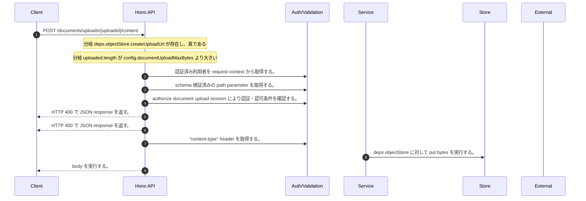

<!-- This file is generated by npm run docs:api-code. Do not edit manually. -->

# POST /documents/uploads/{uploadId}/content シーケンス

## シーケンス図

## 処理順とコード対応

| # | Caller | 境界 | 処理 | コード | 実装位置 |
| ---: | --- | --- | --- | --- | --- |
| 1 | `POST /documents/uploads/{uploadId}/content handler` | Auth | 認証済み利用者を request context から取得する。 | `c.get("user")` | `apps/api/src/routes/document-routes.ts:1073 (POST /documents/uploads/{uploadId}/content handler)` |
| 2 | `POST /documents/uploads/{uploadId}/content handler` | Validation | schema 検証済みの path parameter を取得する。 | `validParam<{ uploadId: string }>(c)` | `apps/api/src/routes/document-routes.ts:1074 (POST /documents/uploads/{uploadId}/content handler)` |
| 3 | `POST /documents/uploads/{uploadId}/content handler` | Auth | authorize document upload session により認証・認可条件を確認する。 | `authorizeDocumentUploadSession(user, purpose)` | `apps/api/src/routes/document-routes.ts:1077 (POST /documents/uploads/{uploadId}/content handler)` |
| 4 | `POST /documents/uploads/{uploadId}/content handler` | HTTP/SSE | HTTP 400 で JSON response を返す。 | `c.json({ error: "Local upload content endpoint is disabled when S3 upload URLs are available" }, 400)` | `apps/api/src/routes/document-routes.ts:1079 (POST /documents/uploads/{uploadId}/content handler)` |
| 5 | `POST /documents/uploads/{uploadId}/content handler` | HTTP/SSE | HTTP 400 で JSON response を返す。 | `c.json({ error: \`Uploaded object exceeds ${config.documentUploadMaxBytes} bytes\` }, 400)` | `apps/api/src/routes/document-routes.ts:1083 (POST /documents/uploads/{uploadId}/content handler)` |
| 6 | `POST /documents/uploads/{uploadId}/content handler` | Validation | "content-type" header を取得する。 | `c.req.header("content-type")` | `apps/api/src/routes/document-routes.ts:1084 (POST /documents/uploads/{uploadId}/content handler)` |
| 7 | `POST /documents/uploads/{uploadId}/content handler` | Store | `deps.objectStore` に対して put bytes を実行する。 | `deps.objectStore.putBytes(objectKey, uploaded, c.req.header("content-type") ?? undefined)` | `apps/api/src/routes/document-routes.ts:1084 (POST /documents/uploads/{uploadId}/content handler)` |
| 8 | `POST /documents/uploads/{uploadId}/content handler` | HTTP/SSE | body を実行する。 | `c.body(null, 204)` | `apps/api/src/routes/document-routes.ts:1085 (POST /documents/uploads/{uploadId}/content handler)` |

## 分岐

| ID | Function | 条件 | 実装位置 |
| --- | --- | --- | --- |
| B001 | `POST /documents/uploads/{uploadId}/content handler` | `deps.objectStore.createUploadUrl` が存在し、真である | `apps/api/src/routes/document-routes.ts:1078 (POST /documents/uploads/{uploadId}/content handler)` |
| B002 | `POST /documents/uploads/{uploadId}/content handler` | `uploaded.length` が `config.documentUploadMaxBytes` より大きい | `apps/api/src/routes/document-routes.ts:1083 (POST /documents/uploads/{uploadId}/content handler)` |
| B003 | `decodeUploadId` | starts with の判定結果が真ではない、または `objectKey` が ".." を含む | `apps/api/src/routes/document-routes.ts:174 (decodeUploadId)` |
| B004 | `decodeUploadId` | 例外が発生した場合に catch 処理へ移る | `apps/api/src/routes/document-routes.ts:176 (decodeUploadId)` |
| B005 | `uploadPurposeForKey` | starts with の判定結果が真である | `apps/api/src/routes/document-routes.ts:149 (uploadPurposeForKey)` |
| B006 | `uploadPurposeForKey` | starts with の判定結果が真である | `apps/api/src/routes/document-routes.ts:150 (uploadPurposeForKey)` |
| B007 | `uploadPurposeForKey` | starts with の判定結果が真である | `apps/api/src/routes/document-routes.ts:151 (uploadPurposeForKey)` |
| B008 | `authorizeDocumentUploadSession` | `purpose` が `"chatAttachment"` と等しい | `apps/api/src/routes/document-routes.ts:123 (authorizeDocumentUploadSession)` |
| B009 | `authorizeDocumentUploadSession` | 利用者が "chat:create" permission を持つ | `apps/api/src/routes/document-routes.ts:124 (authorizeDocumentUploadSession)` |
| B010 | `authorizeDocumentUploadSession` | `purpose` が `"benchmarkSeed"` と等しい | `apps/api/src/routes/document-routes.ts:127 (authorizeDocumentUploadSession)` |
| B011 | `authorizeDocumentUploadSession` | 利用者が "benchmark:seed_corpus" permission を持つ | `apps/api/src/routes/document-routes.ts:128 (authorizeDocumentUploadSession)` |
| B012 | `authorizeDocumentUploadSession` | 利用者が "rag:doc:write:group" permission を持つ | `apps/api/src/routes/document-routes.ts:131 (authorizeDocumentUploadSession)` |
