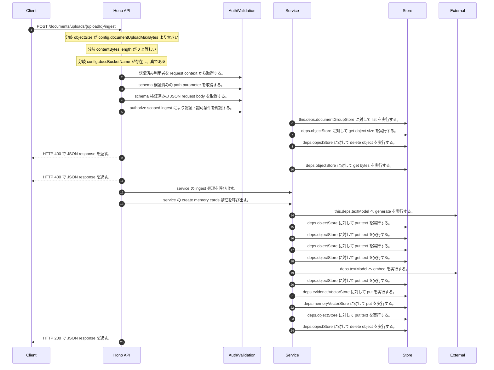

<!-- This file is generated by npm run docs:api-code. Do not edit manually. -->

# POST /documents/uploads/{uploadId}/ingest シーケンス

## シーケンス図

## 処理順とコード対応

| # | Caller | 境界 | 処理 | コード | 実装位置 |
| ---: | --- | --- | --- | --- | --- |
| 1 | `POST /documents/uploads/{uploadId}/ingest handler` | Auth | 認証済み利用者を request context から取得する。 | `c.get("user")` | `apps/api/src/routes/document-routes.ts:547 (POST /documents/uploads/{uploadId}/ingest handler)` |
| 2 | `POST /documents/uploads/{uploadId}/ingest handler` | Validation | schema 検証済みの path parameter を取得する。 | `validParam<{ uploadId: string }>(c)` | `apps/api/src/routes/document-routes.ts:548 (POST /documents/uploads/{uploadId}/ingest handler)` |
| 3 | `POST /documents/uploads/{uploadId}/ingest handler` | Validation | schema 検証済みの JSON request body を取得する。 | `validJson<z.infer<typeof IngestUploadedDocumentRequestSchema>>(c)` | `apps/api/src/routes/document-routes.ts:549 (POST /documents/uploads/{uploadId}/ingest handler)` |
| 4 | `POST /documents/uploads/{uploadId}/ingest handler` | Auth | authorize scoped ingest により認証・認可条件を確認する。 | `authorizeScopedIngest(service, user, purpose, body)` | `apps/api/src/routes/document-routes.ts:552 (POST /documents/uploads/{uploadId}/ingest handler)` |
| 5 | `MemoRagService.assertDocumentGroupsWritable` | Store | `this.deps.documentGroupStore` に対して list を実行する。 | `this.deps.documentGroupStore.list()` | `apps/api/src/rag/memorag-service.ts:555 (MemoRagService.assertDocumentGroupsWritable)` |
| 6 | `POST /documents/uploads/{uploadId}/ingest handler` | Store | `deps.objectStore` に対して get object size を実行する。 | `deps.objectStore.getObjectSize(objectKey)` | `apps/api/src/routes/document-routes.ts:553 (POST /documents/uploads/{uploadId}/ingest handler)` |
| 7 | `POST /documents/uploads/{uploadId}/ingest handler` | Store | `deps.objectStore` に対して delete object を実行する。 | `deps.objectStore.deleteObject(objectKey)` | `apps/api/src/routes/document-routes.ts:555 (POST /documents/uploads/{uploadId}/ingest handler)` |
| 8 | `POST /documents/uploads/{uploadId}/ingest handler` | HTTP/SSE | HTTP 400 で JSON response を返す。 | `c.json({ error: \`Uploaded object exceeds ${config.documentUploadMaxBytes} bytes\` }, 400)` | `apps/api/src/routes/document-routes.ts:556 (POST /documents/uploads/{uploadId}/ingest handler)` |
| 9 | `POST /documents/uploads/{uploadId}/ingest handler` | Store | `deps.objectStore` に対して get bytes を実行する。 | `deps.objectStore.getBytes(objectKey)` | `apps/api/src/routes/document-routes.ts:558 (POST /documents/uploads/{uploadId}/ingest handler)` |
| 10 | `POST /documents/uploads/{uploadId}/ingest handler` | HTTP/SSE | HTTP 400 で JSON response を返す。 | `c.json({ error: "Uploaded object is empty" }, 400)` | `apps/api/src/routes/document-routes.ts:559 (POST /documents/uploads/{uploadId}/ingest handler)` |
| 11 | `POST /documents/uploads/{uploadId}/ingest handler` | Service | service の ingest 処理を呼び出す。 | `service.ingest({ ...body, metadata, contentBytes, sourceS3Object })` | `apps/api/src/routes/document-routes.ts:565 (POST /documents/uploads/{uploadId}/ingest handler)` |
| 12 | `MemoRagService.ingest` | Service | service の create memory cards 処理を呼び出す。 | `this.createMemoryCards(memoryInput)` | `apps/api/src/rag/memorag-service.ts:239 (MemoRagService.ingest)` |
| 13 | `MemoRagService.createMemoryCards` | External | `this.deps.textModel` へ generate を実行する。 | `this.deps.textModel.generate( buildMemoryCardPrompt(input.fileName, input.text), llmOptions("memoryCard", input.modelId ?? config.defaultMemoryModelId) )` | `apps/api/src/rag/memorag-service.ts:2467 (MemoRagService.createMemoryCards)` |
| 14 | `runIngestPipeline` | Store | `deps.objectStore` に対して put text を実行する。 | `deps.objectStore.putText(sourceObjectKey, text, "text/plain; charset=utf-8")` | `apps/api/src/rag/offline/pre-retrieval/ingestion/ingest-run.service.ts:80 (runIngestPipeline)` |
| 15 | `runIngestPipeline` | Store | `deps.objectStore` に対して put text を実行する。 | `deps.objectStore.putText( structuredBlocksObjectKey, JSON.stringify({ schemaVersion: 2, blocks: extracted.blocks, parsedDocument: extracted.parsedDocument }, null, 2), "application/json" )` | `apps/api/src/rag/offline/pre-retrieval/ingestion/ingest-run.service.ts:82 (runIngestPipeline)` |
| 16 | `runIngestPipeline` | Store | `deps.objectStore` に対して put text を実行する。 | `deps.objectStore.putText(memoryCardsObjectKey, JSON.stringify({ schemaVersion: 1, memoryCards }, null, 2), "application/json")` | `apps/api/src/rag/offline/pre-retrieval/ingestion/ingest-run.service.ts:100 (runIngestPipeline)` |
| 17 | `embedWithCache` | Store | `deps.objectStore` に対して get text を実行する。 | `deps.objectStore.getText(key)` | `apps/api/src/rag/offline/pre-retrieval/embedding/embedding-cache.ts:20 (embedWithCache)` |
| 18 | `embedWithCache` | External | `deps.textModel` へ embed を実行する。 | `deps.textModel.embed(input.text, { modelId: input.modelId, dimensions: input.dimensions })` | `apps/api/src/rag/offline/pre-retrieval/embedding/embedding-cache.ts:28 (embedWithCache)` |
| 19 | `embedWithCache` | Store | `deps.objectStore` に対して put text を実行する。 | `deps.objectStore.putText(key, JSON.stringify(record), "application/json")` | `apps/api/src/rag/offline/pre-retrieval/embedding/embedding-cache.ts:37 (embedWithCache)` |
| 20 | `runIngestPipeline` | Store | `deps.evidenceVectorStore` に対して put を実行する。 | `deps.evidenceVectorStore.put(evidenceRecords)` | `apps/api/src/rag/offline/pre-retrieval/ingestion/ingest-run.service.ts:189 (runIngestPipeline)` |
| 21 | `runIngestPipeline` | Store | `deps.memoryVectorStore` に対して put を実行する。 | `deps.memoryVectorStore.put(memoryRecords)` | `apps/api/src/rag/offline/pre-retrieval/ingestion/ingest-run.service.ts:190 (runIngestPipeline)` |
| 22 | `runIngestPipeline` | Store | `deps.objectStore` に対して put text を実行する。 | `deps.objectStore.putText(manifestObjectKey, JSON.stringify(manifest, null, 2), "application/json")` | `apps/api/src/rag/offline/pre-retrieval/ingestion/ingest-run.service.ts:228 (runIngestPipeline)` |
| 23 | `POST /documents/uploads/{uploadId}/ingest handler` | Store | `deps.objectStore` に対して delete object を実行する。 | `deps.objectStore.deleteObject(objectKey)` | `apps/api/src/routes/document-routes.ts:566 (POST /documents/uploads/{uploadId}/ingest handler)` |
| 24 | `POST /documents/uploads/{uploadId}/ingest handler` | HTTP/SSE | HTTP 200 で JSON response を返す。 | `c.json(documentManifestSummary(manifest), 200)` | `apps/api/src/routes/document-routes.ts:567 (POST /documents/uploads/{uploadId}/ingest handler)` |

## 分岐

| ID | Function | 条件 | 実装位置 |
| --- | --- | --- | --- |
| B001 | `POST /documents/uploads/{uploadId}/ingest handler` | `objectSize` が `config.documentUploadMaxBytes` より大きい | `apps/api/src/routes/document-routes.ts:554 (POST /documents/uploads/{uploadId}/ingest handler)` |
| B002 | `POST /documents/uploads/{uploadId}/ingest handler` | `contentBytes.length` が `0` と等しい | `apps/api/src/routes/document-routes.ts:559 (POST /documents/uploads/{uploadId}/ingest handler)` |
| B003 | `POST /documents/uploads/{uploadId}/ingest handler` | `config.docsBucketName` が存在し、真である | `apps/api/src/routes/document-routes.ts:561 (POST /documents/uploads/{uploadId}/ingest handler)` |
| B004 | `decodeUploadId` | starts with の判定結果が真ではない、または `objectKey` が ".." を含む | `apps/api/src/routes/document-routes.ts:102 (decodeUploadId)` |
| B005 | `decodeUploadId` | 例外が発生した場合に catch 処理へ移る | `apps/api/src/routes/document-routes.ts:104 (decodeUploadId)` |
| B006 | `uploadPurposeForKey` | starts with の判定結果が真である | `apps/api/src/routes/document-routes.ts:89 (uploadPurposeForKey)` |
| B007 | `uploadPurposeForKey` | starts with の判定結果が真である | `apps/api/src/routes/document-routes.ts:90 (uploadPurposeForKey)` |
| B008 | `uploadPurposeForKey` | starts with の判定結果が真である | `apps/api/src/routes/document-routes.ts:91 (uploadPurposeForKey)` |
| B009 | `authorizeScopedIngest` | `purpose` が `"chatAttachment"` と等しい | `apps/api/src/routes/document-routes.ts:205 (authorizeScopedIngest)` |
| B010 | `authorizeScopedIngest` | 利用者が "chat:create" permission を持たない | `apps/api/src/routes/document-routes.ts:206 (authorizeScopedIngest)` |
| B011 | `authorizeScopedIngest` | `body.scope?.scopeType` が存在し、真である、かつ `body.scope.scopeType` が `"chat"` と異なる | `apps/api/src/routes/document-routes.ts:207 (authorizeScopedIngest)` |
| B012 | `authorizeScopedIngest` | `body.scope?.temporaryScopeId` が存在しない、または偽である | `apps/api/src/routes/document-routes.ts:208 (authorizeScopedIngest)` |
