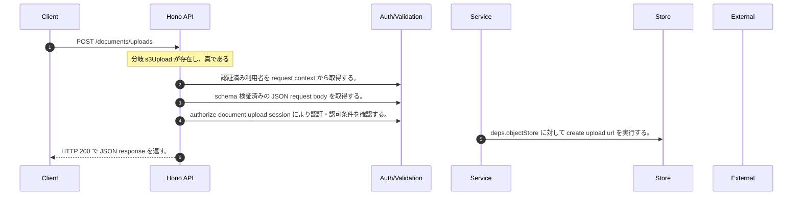

<!-- This file is generated by npm run docs:api-code. Do not edit manually. -->

# POST /documents/uploads シーケンス

## シーケンス図

## 処理順とコード対応

| # | Caller | 境界 | 処理 | コード | 実装位置 |
| ---: | --- | --- | --- | --- | --- |
| 1 | `POST /documents/uploads handler` | Auth | 認証済み利用者を request context から取得する。 | `c.get("user")` | `apps/api/src/routes/document-routes.ts:1036 (POST /documents/uploads handler)` |
| 2 | `POST /documents/uploads handler` | Validation | schema 検証済みの JSON request body を取得する。 | `validJson<z.infer<typeof CreateDocumentUploadRequestSchema>>(c)` | `apps/api/src/routes/document-routes.ts:1037 (POST /documents/uploads handler)` |
| 3 | `POST /documents/uploads handler` | Auth | authorize document upload session により認証・認可条件を確認する。 | `authorizeDocumentUploadSession(user, body.purpose)` | `apps/api/src/routes/document-routes.ts:1038 (POST /documents/uploads handler)` |
| 4 | `POST /documents/uploads handler` | Store | `deps.objectStore` に対して create upload url を実行する。 | `deps.objectStore.createUploadUrl?.(objectKey, { contentType, expiresInSeconds, maxBytes: maxUploadBytes })` | `apps/api/src/routes/document-routes.ts:1044 (POST /documents/uploads handler)` |
| 5 | `POST /documents/uploads handler` | HTTP/SSE | HTTP 200 で JSON response を返す。 | `c.json({ uploadId, objectKey, uploadUrl: s3Upload?.url ?? localUploadUrl(c.req.url, uploadId), method: s3Upload ? "PUT" as const : "POST" as const, headers: s3Upload?.headers ?? { "Content-Type": contentType }, expiresI…` | `apps/api/src/routes/document-routes.ts:1046 (POST /documents/uploads handler)` |

## 分岐

| ID | Function | 条件 | 実装位置 |
| --- | --- | --- | --- |
| B001 | `POST /documents/uploads handler` | `s3Upload` が存在し、真である | `apps/api/src/routes/document-routes.ts:1050 (POST /documents/uploads handler)` |
| B002 | `authorizeDocumentUploadSession` | `purpose` が `"chatAttachment"` と等しい | `apps/api/src/routes/document-routes.ts:123 (authorizeDocumentUploadSession)` |
| B003 | `authorizeDocumentUploadSession` | 利用者が "chat:create" permission を持つ | `apps/api/src/routes/document-routes.ts:124 (authorizeDocumentUploadSession)` |
| B004 | `authorizeDocumentUploadSession` | `purpose` が `"benchmarkSeed"` と等しい | `apps/api/src/routes/document-routes.ts:127 (authorizeDocumentUploadSession)` |
| B005 | `authorizeDocumentUploadSession` | 利用者が "benchmark:seed_corpus" permission を持つ | `apps/api/src/routes/document-routes.ts:128 (authorizeDocumentUploadSession)` |
| B006 | `authorizeDocumentUploadSession` | 利用者が "rag:doc:write:group" permission を持つ | `apps/api/src/routes/document-routes.ts:131 (authorizeDocumentUploadSession)` |
| B007 | `buildUploadObjectKey` | `purpose` が `"benchmarkSeed"` と等しい | `apps/api/src/routes/document-routes.ts:138 (buildUploadObjectKey)` |
| B008 | `buildUploadObjectKey` | `purpose` が `"chatAttachment"` と等しい | `apps/api/src/routes/document-routes.ts:138 (buildUploadObjectKey)` |
