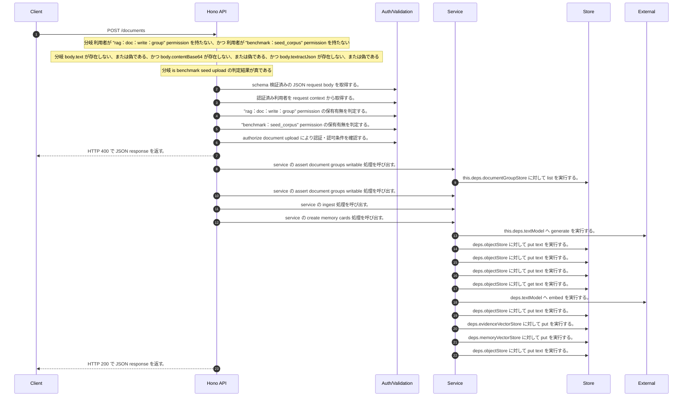

<!-- This file is generated by npm run docs:api-code. Do not edit manually. -->

# POST /documents シーケンス

## シーケンス図

## 処理順とコード対応

| # | Caller | 境界 | 処理 | コード | 実装位置 |
| ---: | --- | --- | --- | --- | --- |
| 1 | `POST /documents handler` | Validation | schema 検証済みの JSON request body を取得する。 | `validJson<z.infer<typeof DocumentUploadRequestSchema>>(c)` | `apps/api/src/routes/document-routes.ts:443 (POST /documents handler)` |
| 2 | `POST /documents handler` | Auth | 認証済み利用者を request context から取得する。 | `c.get("user")` | `apps/api/src/routes/document-routes.ts:444 (POST /documents handler)` |
| 3 | `POST /documents handler` | Auth | "rag:doc:write:group" permission の保有有無を判定する。 | `hasPermission(user, "rag:doc:write:group")` | `apps/api/src/routes/document-routes.ts:445 (POST /documents handler)` |
| 4 | `POST /documents handler` | Auth | "benchmark:seed_corpus" permission の保有有無を判定する。 | `hasPermission(user, "benchmark:seed_corpus")` | `apps/api/src/routes/document-routes.ts:445 (POST /documents handler)` |
| 5 | `POST /documents handler` | Auth | authorize document upload により認証・認可条件を確認する。 | `authorizeDocumentUpload(user, body)` | `apps/api/src/routes/document-routes.ts:448 (POST /documents handler)` |
| 6 | `POST /documents handler` | HTTP/SSE | HTTP 400 で JSON response を返す。 | `c.json({ error: "Either text, contentBase64, or textractJson is required" }, 400)` | `apps/api/src/routes/document-routes.ts:449 (POST /documents handler)` |
| 7 | `scopedMetadata` | Service | service の assert document groups writable 処理を呼び出す。 | `service.assertDocumentGroupsWritable(user, scope.groupIds)` | `apps/api/src/routes/document-routes.ts:182 (scopedMetadata)` |
| 8 | `MemoRagService.assertDocumentGroupsWritable` | Store | `this.deps.documentGroupStore` に対して list を実行する。 | `this.deps.documentGroupStore.list()` | `apps/api/src/rag/memorag-service.ts:555 (MemoRagService.assertDocumentGroupsWritable)` |
| 9 | `scopedMetadata` | Service | service の assert document groups writable 処理を呼び出す。 | `service.assertDocumentGroupsWritable(user, groupIds)` | `apps/api/src/routes/document-routes.ts:189 (scopedMetadata)` |
| 10 | `POST /documents handler` | Service | service の ingest 処理を呼び出す。 | `service.ingest({ ...body, metadata })` | `apps/api/src/routes/document-routes.ts:452 (POST /documents handler)` |
| 11 | `MemoRagService.ingest` | Service | service の create memory cards 処理を呼び出す。 | `this.createMemoryCards(memoryInput)` | `apps/api/src/rag/memorag-service.ts:239 (MemoRagService.ingest)` |
| 12 | `MemoRagService.createMemoryCards` | External | `this.deps.textModel` へ generate を実行する。 | `this.deps.textModel.generate( buildMemoryCardPrompt(input.fileName, input.text), llmOptions("memoryCard", input.modelId ?? config.defaultMemoryModelId) )` | `apps/api/src/rag/memorag-service.ts:2467 (MemoRagService.createMemoryCards)` |
| 13 | `runIngestPipeline` | Store | `deps.objectStore` に対して put text を実行する。 | `deps.objectStore.putText(sourceObjectKey, text, "text/plain; charset=utf-8")` | `apps/api/src/rag/offline/pre-retrieval/ingestion/ingest-run.service.ts:80 (runIngestPipeline)` |
| 14 | `runIngestPipeline` | Store | `deps.objectStore` に対して put text を実行する。 | `deps.objectStore.putText( structuredBlocksObjectKey, JSON.stringify({ schemaVersion: 2, blocks: extracted.blocks, parsedDocument: extracted.parsedDocument }, null, 2), "application/json" )` | `apps/api/src/rag/offline/pre-retrieval/ingestion/ingest-run.service.ts:82 (runIngestPipeline)` |
| 15 | `runIngestPipeline` | Store | `deps.objectStore` に対して put text を実行する。 | `deps.objectStore.putText(memoryCardsObjectKey, JSON.stringify({ schemaVersion: 1, memoryCards }, null, 2), "application/json")` | `apps/api/src/rag/offline/pre-retrieval/ingestion/ingest-run.service.ts:100 (runIngestPipeline)` |
| 16 | `embedWithCache` | Store | `deps.objectStore` に対して get text を実行する。 | `deps.objectStore.getText(key)` | `apps/api/src/rag/offline/pre-retrieval/embedding/embedding-cache.ts:20 (embedWithCache)` |
| 17 | `embedWithCache` | External | `deps.textModel` へ embed を実行する。 | `deps.textModel.embed(input.text, { modelId: input.modelId, dimensions: input.dimensions })` | `apps/api/src/rag/offline/pre-retrieval/embedding/embedding-cache.ts:28 (embedWithCache)` |
| 18 | `embedWithCache` | Store | `deps.objectStore` に対して put text を実行する。 | `deps.objectStore.putText(key, JSON.stringify(record), "application/json")` | `apps/api/src/rag/offline/pre-retrieval/embedding/embedding-cache.ts:37 (embedWithCache)` |
| 19 | `runIngestPipeline` | Store | `deps.evidenceVectorStore` に対して put を実行する。 | `deps.evidenceVectorStore.put(evidenceRecords)` | `apps/api/src/rag/offline/pre-retrieval/ingestion/ingest-run.service.ts:189 (runIngestPipeline)` |
| 20 | `runIngestPipeline` | Store | `deps.memoryVectorStore` に対して put を実行する。 | `deps.memoryVectorStore.put(memoryRecords)` | `apps/api/src/rag/offline/pre-retrieval/ingestion/ingest-run.service.ts:190 (runIngestPipeline)` |
| 21 | `runIngestPipeline` | Store | `deps.objectStore` に対して put text を実行する。 | `deps.objectStore.putText(manifestObjectKey, JSON.stringify(manifest, null, 2), "application/json")` | `apps/api/src/rag/offline/pre-retrieval/ingestion/ingest-run.service.ts:228 (runIngestPipeline)` |
| 22 | `POST /documents handler` | HTTP/SSE | HTTP 200 で JSON response を返す。 | `c.json(documentManifestSummary(manifest), 200)` | `apps/api/src/routes/document-routes.ts:453 (POST /documents handler)` |

## 分岐

| ID | Function | 条件 | 実装位置 |
| --- | --- | --- | --- |
| B001 | `POST /documents handler` | 利用者が "rag:doc:write:group" permission を持たない、かつ 利用者が "benchmark:seed_corpus" permission を持たない | `apps/api/src/routes/document-routes.ts:445 (POST /documents handler)` |
| B002 | `POST /documents handler` | `body.text` が存在しない、または偽である、かつ `body.contentBase64` が存在しない、または偽である、かつ `body.textractJson` が存在しない、または偽である | `apps/api/src/routes/document-routes.ts:449 (POST /documents handler)` |
| B003 | `POST /documents handler` | is benchmark seed upload の判定結果が真である | `apps/api/src/routes/document-routes.ts:450 (POST /documents handler)` |
| B004 | `authorizeDocumentUpload` | is benchmark seed upload の判定結果が真である | `apps/api/src/routes/benchmark-seed.ts:54 (authorizeDocumentUpload)` |
| B005 | `authorizeDocumentUpload` | 利用者が "benchmark:seed_corpus" permission を持つ | `apps/api/src/routes/benchmark-seed.ts:55 (authorizeDocumentUpload)` |
| B006 | `authorizeDocumentUpload` | has benchmark seed reserved document metadata の判定結果が真である | `apps/api/src/routes/benchmark-seed.ts:58 (authorizeDocumentUpload)` |
| B007 | `authorizeDocumentUpload` | 利用者が "rag:doc:write:group" permission を持つ | `apps/api/src/routes/benchmark-seed.ts:59 (authorizeDocumentUpload)` |
| B008 | `scopedMetadata` | `purpose` が `"chatAttachment"` と等しい | `apps/api/src/routes/document-routes.ts:165 (scopedMetadata)` |
| B009 | `scopedMetadata` | `temporaryScopeId` が存在しない、または偽である | `apps/api/src/routes/document-routes.ts:167 (scopedMetadata)` |
| B010 | `scopedMetadata` | `user.email` が存在し、真である | `apps/api/src/routes/document-routes.ts:172 (scopedMetadata)` |
| B011 | `scopedMetadata` | `purpose` が `"document"` と等しい | `apps/api/src/routes/document-routes.ts:178 (scopedMetadata)` |
| B012 | `scopedMetadata` | `scope` が存在しない、または偽である、または `scope.scopeType` が `"group"` と異なる、または `scope.groupIds?.length` が存在しない、または偽である | `apps/api/src/routes/document-routes.ts:179 (scopedMetadata)` |
| B013 | `scopedMetadata` | `scope` が存在しない、または偽である | `apps/api/src/routes/document-routes.ts:186 (scopedMetadata)` |
| B014 | `scopedMetadata` | `scope.scopeType` が `"group"` と等しい、かつ `groupIds.length` が `0` と等しい | `apps/api/src/routes/document-routes.ts:188 (scopedMetadata)` |
| B015 | `scopedMetadata` | `groupIds.length` が `0` より大きい | `apps/api/src/routes/document-routes.ts:189 (scopedMetadata)` |
| B016 | `scopedMetadata` | `groupIds.length` が `0` より大きい、または `scope.scopeType` が `"group"` と等しい | `apps/api/src/routes/document-routes.ts:190 (scopedMetadata)` |
| B017 | `scopedMetadata` | `scope.scopeType` が `"personal"` と等しい | `apps/api/src/routes/document-routes.ts:193 (scopedMetadata)` |
| B018 | `scopedMetadata` | `user.email` が存在し、真である | `apps/api/src/routes/document-routes.ts:194 (scopedMetadata)` |
| B019 | `scopedMetadata` | `Object.keys(base).length` が `0` より大きい | `apps/api/src/routes/document-routes.ts:196 (scopedMetadata)` |
