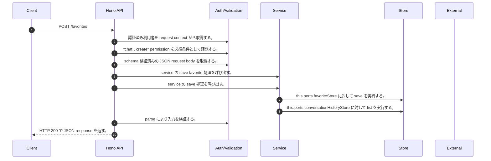

<!-- This file is generated by npm run docs:api-code. Do not edit manually. -->

# POST /favorites シーケンス

## シーケンス図

## 処理順とコード対応

| # | Caller | 境界 | 処理 | コード | 実装位置 |
| ---: | --- | --- | --- | --- | --- |
| 1 | `POST /favorites handler` | Auth | 認証済み利用者を request context から取得する。 | `c.get("user")` | `apps/api/src/routes/favorite-routes.ts:42 (POST /favorites handler)` |
| 2 | `POST /favorites handler` | Auth | "chat:create" permission を必須条件として確認する。 | `requirePermission(user, "chat:create")` | `apps/api/src/routes/favorite-routes.ts:43 (POST /favorites handler)` |
| 3 | `POST /favorites handler` | Validation | schema 検証済みの JSON request body を取得する。 | `validJson<z.infer<typeof CreateFavoriteRequestSchema>>(c)` | `apps/api/src/routes/favorite-routes.ts:44 (POST /favorites handler)` |
| 4 | `POST /favorites handler` | Service | service の save favorite 処理を呼び出す。 | `service.saveFavorite(user, body)` | `apps/api/src/routes/favorite-routes.ts:45 (POST /favorites handler)` |
| 5 | `MemoRagService.saveFavorite` | Service | service の save 処理を呼び出す。 | `this.favoriteService.save(user, input)` | `apps/api/src/rag/memorag-service.ts:4223 (MemoRagService.saveFavorite)` |
| 6 | `FavoriteService.save` | Store | `this.ports.favoriteStore` に対して save を実行する。 | `this.ports.favoriteStore.save(this.ports.ownerKey(user), input)` | `apps/api/src/favorites/favorite-service.ts:32 (FavoriteService.save)` |
| 7 | `FavoriteService.resolveVisibility` | Store | `this.ports.conversationHistoryStore` に対して list を実行する。 | `this.ports.conversationHistoryStore.list(this.ports.ownerKey(user))` | `apps/api/src/favorites/favorite-service.ts:69 (FavoriteService.resolveVisibility)` |
| 8 | `POST /favorites handler` | Validation | parse により入力を検証する。 | `FavoriteSchema.parse(await service.saveFavorite(user, body))` | `apps/api/src/routes/favorite-routes.ts:45 (POST /favorites handler)` |
| 9 | `POST /favorites handler` | HTTP/SSE | HTTP 200 で JSON response を返す。 | `c.json(FavoriteSchema.parse(await service.saveFavorite(user, body)), 200)` | `apps/api/src/routes/favorite-routes.ts:45 (POST /favorites handler)` |

## 分岐

| ID | Function | 条件 | 実装位置 |
| --- | --- | --- | --- |
| B001 | `requirePermission` | 利用者が 指定された permission を持たない | `apps/api/src/authorization.ts:184 (requirePermission)` |
