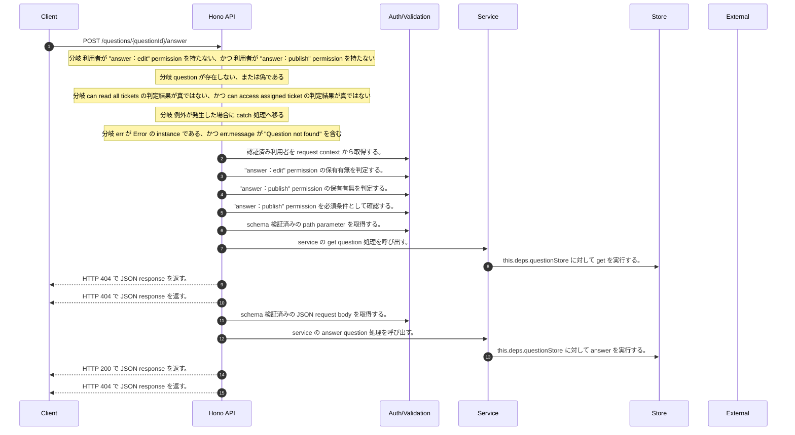

<!-- This file is generated by npm run docs:api-code. Do not edit manually. -->

# POST /questions/{questionId}/answer シーケンス

## シーケンス図

## 処理順とコード対応

| # | Caller | 境界 | 処理 | コード | 実装位置 |
| ---: | --- | --- | --- | --- | --- |
| 1 | `POST /questions/{questionId}/answer handler` | Auth | 認証済み利用者を request context から取得する。 | `c.get("user")` | `apps/api/src/routes/question-routes.ts:112 (POST /questions/{questionId}/answer handler)` |
| 2 | `POST /questions/{questionId}/answer handler` | Auth | "answer:edit" permission の保有有無を判定する。 | `hasPermission(user, "answer:edit")` | `apps/api/src/routes/question-routes.ts:113 (POST /questions/{questionId}/answer handler)` |
| 3 | `POST /questions/{questionId}/answer handler` | Auth | "answer:publish" permission の保有有無を判定する。 | `hasPermission(user, "answer:publish")` | `apps/api/src/routes/question-routes.ts:113 (POST /questions/{questionId}/answer handler)` |
| 4 | `POST /questions/{questionId}/answer handler` | Auth | "answer:publish" permission を必須条件として確認する。 | `requirePermission(user, "answer:publish")` | `apps/api/src/routes/question-routes.ts:113 (POST /questions/{questionId}/answer handler)` |
| 5 | `POST /questions/{questionId}/answer handler` | Validation | schema 検証済みの path parameter を取得する。 | `validParam<{ questionId: string }>(c)` | `apps/api/src/routes/question-routes.ts:115 (POST /questions/{questionId}/answer handler)` |
| 6 | `POST /questions/{questionId}/answer handler` | Service | service の get question 処理を呼び出す。 | `service.getQuestion(questionId)` | `apps/api/src/routes/question-routes.ts:116 (POST /questions/{questionId}/answer handler)` |
| 7 | `MemoRagService.getQuestion` | Store | `this.deps.questionStore` に対して get を実行する。 | `this.deps.questionStore.get(questionId)` | `apps/api/src/rag/memorag-service.ts:1484 (MemoRagService.getQuestion)` |
| 8 | `POST /questions/{questionId}/answer handler` | HTTP/SSE | HTTP 404 で JSON response を返す。 | `c.json({ error: "Question not found" }, 404)` | `apps/api/src/routes/question-routes.ts:117 (POST /questions/{questionId}/answer handler)` |
| 9 | `POST /questions/{questionId}/answer handler` | HTTP/SSE | HTTP 404 で JSON response を返す。 | `c.json({ error: "Question not found" }, 404)` | `apps/api/src/routes/question-routes.ts:119 (POST /questions/{questionId}/answer handler)` |
| 10 | `POST /questions/{questionId}/answer handler` | Validation | schema 検証済みの JSON request body を取得する。 | `validJson<z.infer<typeof AnswerQuestionRequestSchema>>(c)` | `apps/api/src/routes/question-routes.ts:121 (POST /questions/{questionId}/answer handler)` |
| 11 | `POST /questions/{questionId}/answer handler` | Service | service の answer question 処理を呼び出す。 | `service.answerQuestion(questionId, body, user)` | `apps/api/src/routes/question-routes.ts:122 (POST /questions/{questionId}/answer handler)` |
| 12 | `MemoRagService.answerQuestion` | Store | `this.deps.questionStore` に対して answer を実行する。 | `this.deps.questionStore.answer(questionId, { ...input, responderName: input.responderName?.trim() \|\| userDisplayName(user) })` | `apps/api/src/rag/memorag-service.ts:1488 (MemoRagService.answerQuestion)` |
| 13 | `POST /questions/{questionId}/answer handler` | HTTP/SSE | HTTP 200 で JSON response を返す。 | `c.json(await service.answerQuestion(questionId, body, user), 200)` | `apps/api/src/routes/question-routes.ts:122 (POST /questions/{questionId}/answer handler)` |
| 14 | `POST /questions/{questionId}/answer handler` | HTTP/SSE | HTTP 404 で JSON response を返す。 | `c.json({ error: "Question not found" }, 404)` | `apps/api/src/routes/question-routes.ts:124 (POST /questions/{questionId}/answer handler)` |

## 分岐

| ID | Function | 条件 | 実装位置 |
| --- | --- | --- | --- |
| B001 | `POST /questions/{questionId}/answer handler` | 利用者が "answer:edit" permission を持たない、かつ 利用者が "answer:publish" permission を持たない | `apps/api/src/routes/question-routes.ts:113 (POST /questions/{questionId}/answer handler)` |
| B002 | `POST /questions/{questionId}/answer handler` | `question` が存在しない、または偽である | `apps/api/src/routes/question-routes.ts:117 (POST /questions/{questionId}/answer handler)` |
| B003 | `POST /questions/{questionId}/answer handler` | can read all tickets の判定結果が真ではない、かつ can access assigned ticket の判定結果が真ではない | `apps/api/src/routes/question-routes.ts:118 (POST /questions/{questionId}/answer handler)` |
| B004 | `POST /questions/{questionId}/answer handler` | 例外が発生した場合に catch 処理へ移る | `apps/api/src/routes/question-routes.ts:123 (POST /questions/{questionId}/answer handler)` |
| B005 | `POST /questions/{questionId}/answer handler` | `err` が `Error` の instance である、かつ `err.message` が "Question not found" を含む | `apps/api/src/routes/question-routes.ts:124 (POST /questions/{questionId}/answer handler)` |
| B006 | `requirePermission` | 利用者が 指定された permission を持たない | `apps/api/src/authorization.ts:267 (requirePermission)` |
| B007 | `canAccessAssignedTicket` | 利用者が "answer:edit" permission を持たない | `apps/api/src/routes/question-routes.ts:198 (canAccessAssignedTicket)` |
| B008 | `canAccessAssignedTicket` | `question.assigneeUserId` が `user.userId` と等しい | `apps/api/src/routes/question-routes.ts:199 (canAccessAssignedTicket)` |
