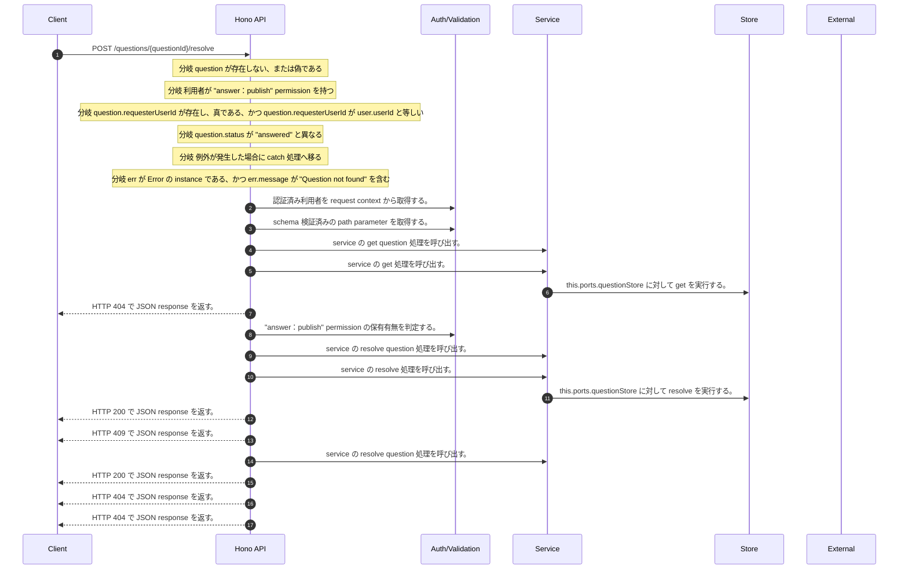

<!-- This file is generated by npm run docs:api-code. Do not edit manually. -->

# POST /questions/{questionId}/resolve シーケンス

## シーケンス図

## 処理順とコード対応

| # | Caller | 境界 | 処理 | コード | 実装位置 |
| ---: | --- | --- | --- | --- | --- |
| 1 | `POST /questions/{questionId}/resolve handler` | Auth | 認証済み利用者を request context から取得する。 | `c.get("user")` | `apps/api/src/routes/question-routes.ts:175 (POST /questions/{questionId}/resolve handler)` |
| 2 | `POST /questions/{questionId}/resolve handler` | Validation | schema 検証済みの path parameter を取得する。 | `validParam<{ questionId: string }>(c)` | `apps/api/src/routes/question-routes.ts:176 (POST /questions/{questionId}/resolve handler)` |
| 3 | `POST /questions/{questionId}/resolve handler` | Service | service の get question 処理を呼び出す。 | `service.getQuestion(questionId)` | `apps/api/src/routes/question-routes.ts:177 (POST /questions/{questionId}/resolve handler)` |
| 4 | `MemoRagService.getQuestion` | Service | service の get 処理を呼び出す。 | `this.questionService.get(questionId)` | `apps/api/src/rag/memorag-service.ts:3193 (MemoRagService.getQuestion)` |
| 5 | `QuestionService.get` | Store | `this.ports.questionStore` に対して get を実行する。 | `this.ports.questionStore.get(questionId)` | `apps/api/src/questions/question-service.ts:58 (QuestionService.get)` |
| 6 | `POST /questions/{questionId}/resolve handler` | HTTP/SSE | HTTP 404 で JSON response を返す。 | `c.json({ error: "Question not found" }, 404)` | `apps/api/src/routes/question-routes.ts:178 (POST /questions/{questionId}/resolve handler)` |
| 7 | `POST /questions/{questionId}/resolve handler` | Auth | "answer:publish" permission の保有有無を判定する。 | `hasPermission(user, "answer:publish")` | `apps/api/src/routes/question-routes.ts:179 (POST /questions/{questionId}/resolve handler)` |
| 8 | `POST /questions/{questionId}/resolve handler` | Service | service の resolve question 処理を呼び出す。 | `service.resolveQuestion(questionId)` | `apps/api/src/routes/question-routes.ts:179 (POST /questions/{questionId}/resolve handler)` |
| 9 | `MemoRagService.resolveQuestion` | Service | service の resolve 処理を呼び出す。 | `this.questionService.resolve(questionId)` | `apps/api/src/rag/memorag-service.ts:3201 (MemoRagService.resolveQuestion)` |
| 10 | `QuestionService.resolve` | Store | `this.ports.questionStore` に対して resolve を実行する。 | `this.ports.questionStore.resolve(questionId)` | `apps/api/src/questions/question-service.ts:69 (QuestionService.resolve)` |
| 11 | `POST /questions/{questionId}/resolve handler` | HTTP/SSE | HTTP 200 で JSON response を返す。 | `c.json(await service.resolveQuestion(questionId), 200)` | `apps/api/src/routes/question-routes.ts:179 (POST /questions/{questionId}/resolve handler)` |
| 12 | `POST /questions/{questionId}/resolve handler` | HTTP/SSE | HTTP 409 で JSON response を返す。 | `c.json({ error: "Question is not answered yet" }, 409)` | `apps/api/src/routes/question-routes.ts:181 (POST /questions/{questionId}/resolve handler)` |
| 13 | `POST /questions/{questionId}/resolve handler` | Service | service の resolve question 処理を呼び出す。 | `service.resolveQuestion(questionId)` | `apps/api/src/routes/question-routes.ts:182 (POST /questions/{questionId}/resolve handler)` |
| 14 | `POST /questions/{questionId}/resolve handler` | HTTP/SSE | HTTP 200 で JSON response を返す。 | `c.json(requesterVisibleQuestion(await service.resolveQuestion(questionId)), 200)` | `apps/api/src/routes/question-routes.ts:182 (POST /questions/{questionId}/resolve handler)` |
| 15 | `POST /questions/{questionId}/resolve handler` | HTTP/SSE | HTTP 404 で JSON response を返す。 | `c.json({ error: "Question not found" }, 404)` | `apps/api/src/routes/question-routes.ts:184 (POST /questions/{questionId}/resolve handler)` |
| 16 | `POST /questions/{questionId}/resolve handler` | HTTP/SSE | HTTP 404 で JSON response を返す。 | `c.json({ error: "Question not found" }, 404)` | `apps/api/src/routes/question-routes.ts:186 (POST /questions/{questionId}/resolve handler)` |

## 分岐

| ID | Function | 条件 | 実装位置 |
| --- | --- | --- | --- |
| B001 | `POST /questions/{questionId}/resolve handler` | `question` が存在しない、または偽である | `apps/api/src/routes/question-routes.ts:178 (POST /questions/{questionId}/resolve handler)` |
| B002 | `POST /questions/{questionId}/resolve handler` | 利用者が "answer:publish" permission を持つ | `apps/api/src/routes/question-routes.ts:179 (POST /questions/{questionId}/resolve handler)` |
| B003 | `POST /questions/{questionId}/resolve handler` | `question.requesterUserId` が存在し、真である、かつ `question.requesterUserId` が `user.userId` と等しい | `apps/api/src/routes/question-routes.ts:180 (POST /questions/{questionId}/resolve handler)` |
| B004 | `POST /questions/{questionId}/resolve handler` | `question.status` が `"answered"` と異なる | `apps/api/src/routes/question-routes.ts:181 (POST /questions/{questionId}/resolve handler)` |
| B005 | `POST /questions/{questionId}/resolve handler` | 例外が発生した場合に catch 処理へ移る | `apps/api/src/routes/question-routes.ts:185 (POST /questions/{questionId}/resolve handler)` |
| B006 | `POST /questions/{questionId}/resolve handler` | `err` が `Error` の instance である、かつ `err.message` が "Question not found" を含む | `apps/api/src/routes/question-routes.ts:186 (POST /questions/{questionId}/resolve handler)` |
