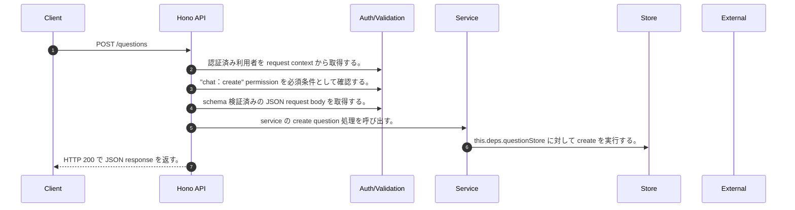

<!-- This file is generated by npm run docs:api-code. Do not edit manually. -->

# POST /questions シーケンス

## シーケンス図

## 処理順とコード対応

| # | Caller | 境界 | 処理 | コード | 実装位置 |
| ---: | --- | --- | --- | --- | --- |
| 1 | `POST /questions handler` | Auth | 認証済み利用者を request context から取得する。 | `c.get("user")` | `apps/api/src/routes/question-routes.ts:44 (POST /questions handler)` |
| 2 | `POST /questions handler` | Auth | "chat:create" permission を必須条件として確認する。 | `requirePermission(user, "chat:create")` | `apps/api/src/routes/question-routes.ts:45 (POST /questions handler)` |
| 3 | `POST /questions handler` | Validation | schema 検証済みの JSON request body を取得する。 | `validJson<z.infer<typeof CreateQuestionRequestSchema>>(c)` | `apps/api/src/routes/question-routes.ts:46 (POST /questions handler)` |
| 4 | `POST /questions handler` | Service | service の create question 処理を呼び出す。 | `service.createQuestion(body, user)` | `apps/api/src/routes/question-routes.ts:47 (POST /questions handler)` |
| 5 | `MemoRagService.createQuestion` | Store | `this.deps.questionStore` に対して create を実行する。 | `this.deps.questionStore.create({ ...input, requesterUserId: user?.userId, requesterName: input.requesterName?.trim() \|\| userDisplayName(user), requesterDepartment: input.requesterDepartment?.trim() \|\| "未設定", assigneeGro…` | `apps/api/src/rag/memorag-service.ts:2859 (MemoRagService.createQuestion)` |
| 6 | `POST /questions handler` | HTTP/SSE | HTTP 200 で JSON response を返す。 | `c.json(await service.createQuestion(body, user), 200)` | `apps/api/src/routes/question-routes.ts:47 (POST /questions handler)` |

## 分岐

| ID | Function | 条件 | 実装位置 |
| --- | --- | --- | --- |
| B001 | `requirePermission` | 利用者が 指定された permission を持たない | `apps/api/src/authorization.ts:184 (requirePermission)` |
| B002 | `MemoRagService.createQuestion` | `input.assigneeUserId` が存在し、真である、または `input.assigneeGroupId` が存在し、真である | `apps/api/src/rag/memorag-service.ts:2856 (MemoRagService.createQuestion)` |
