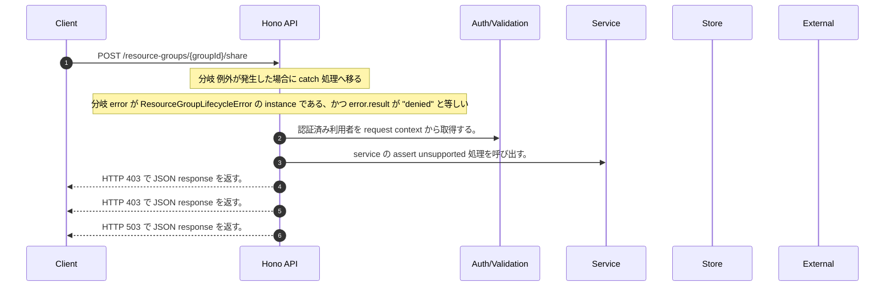

<!-- This file is generated by npm run docs:api-code. Do not edit manually. -->

# POST /resource-groups/{groupId}/share シーケンス

## シーケンス図

## 処理順とコード対応

| # | Caller | 境界 | 処理 | コード | 実装位置 |
| ---: | --- | --- | --- | --- | --- |
| 1 | `POST /resource-groups/{groupId}/share handler` | Auth | 認証済み利用者を request context から取得する。 | `c.get("user")` | `apps/api/src/routes/resource-group-routes.ts:266 (POST /resource-groups/{groupId}/share handler)` |
| 2 | `ResourceGroupLifecycleService.assertShareUnsupported` | Service | service の assert unsupported 処理を呼び出す。 | `this.assertUnsupported(actor, "share")` | `apps/api/src/security/resource-group-lifecycle-service.ts:431 (ResourceGroupLifecycleService.assertShareUnsupported)` |
| 3 | `POST /resource-groups/{groupId}/share handler` | HTTP/SSE | HTTP 403 で JSON response を返す。 | `c.json({ error: "Forbidden" }, 403)` | `apps/api/src/routes/resource-group-routes.ts:269 (POST /resource-groups/{groupId}/share handler)` |
| 4 | `POST /resource-groups/{groupId}/share handler` | HTTP/SSE | HTTP 403 で JSON response を返す。 | `c.json({ error: "Forbidden" }, 403)` | `apps/api/src/routes/resource-group-routes.ts:272 (POST /resource-groups/{groupId}/share handler)` |
| 5 | `POST /resource-groups/{groupId}/share handler` | HTTP/SSE | HTTP 503 で JSON response を返す。 | `c.json({ error: "Resource group lifecycle unavailable" }, 503)` | `apps/api/src/routes/resource-group-routes.ts:274 (POST /resource-groups/{groupId}/share handler)` |

## 分岐

| ID | Function | 条件 | 実装位置 |
| --- | --- | --- | --- |
| B001 | `POST /resource-groups/{groupId}/share handler` | 例外が発生した場合に catch 処理へ移る | `apps/api/src/routes/resource-group-routes.ts:270 (POST /resource-groups/{groupId}/share handler)` |
| B002 | `POST /resource-groups/{groupId}/share handler` | `error` が `ResourceGroupLifecycleError` の instance である、かつ `error.result` が `"denied"` と等しい | `apps/api/src/routes/resource-group-routes.ts:271 (POST /resource-groups/{groupId}/share handler)` |
| B003 | `lifecycleService` | `deps.securityAuditOutbox` が存在しない、または偽である | `apps/api/src/routes/resource-group-routes.ts:364 (lifecycleService)` |
