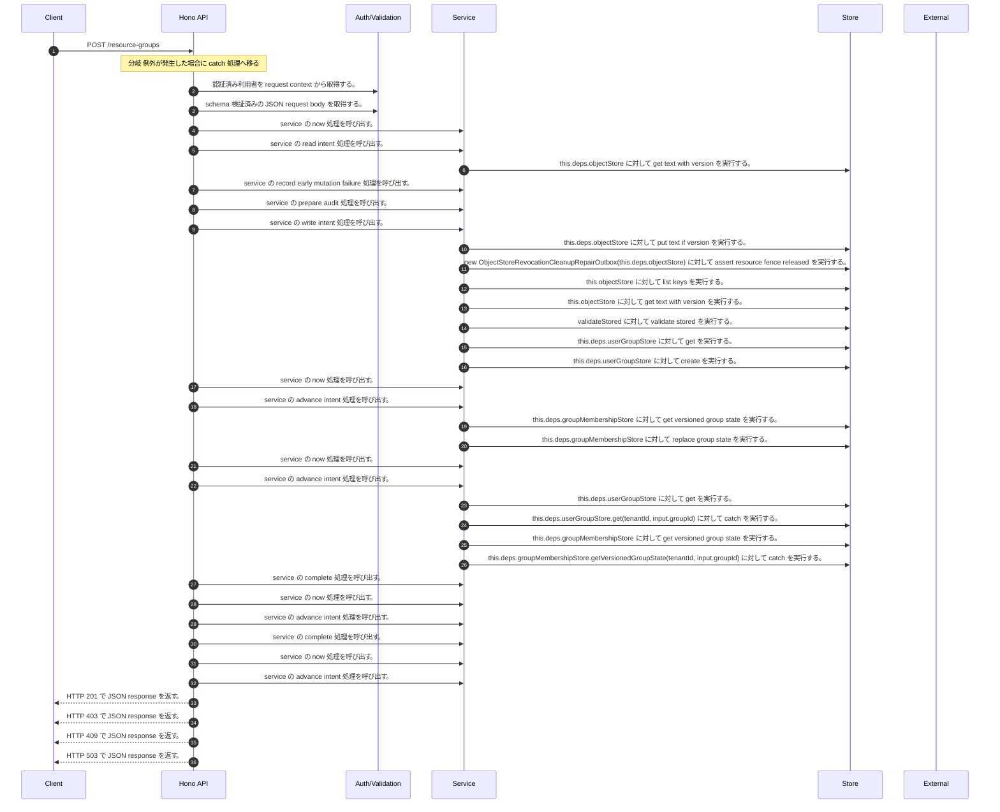

<!-- This file is generated by npm run docs:api-code. Do not edit manually. -->

# POST /resource-groups シーケンス

## シーケンス図

## 処理順とコード対応

| # | Caller | 境界 | 処理 | コード | 実装位置 |
| ---: | --- | --- | --- | --- | --- |
| 1 | `POST /resource-groups handler` | Auth | 認証済み利用者を request context から取得する。 | `c.get("user")` | `apps/api/src/routes/resource-group-routes.ts:94 (POST /resource-groups handler)` |
| 2 | `POST /resource-groups handler` | Validation | schema 検証済みの JSON request body を取得する。 | `validJson<CreateResourceGroupInput>(c)` | `apps/api/src/routes/resource-group-routes.ts:95 (POST /resource-groups handler)` |
| 3 | `ResourceGroupLifecycleService.create` | Service | service の now 処理を呼び出す。 | `this.now()` | `apps/api/src/security/resource-group-lifecycle-service.ts:143 (ResourceGroupLifecycleService.create)` |
| 4 | `ResourceGroupLifecycleService.create` | Service | service の read intent 処理を呼び出す。 | `this.readIntent<CreateLifecycleIntent>(key)` | `apps/api/src/security/resource-group-lifecycle-service.ts:168 (ResourceGroupLifecycleService.create)` |
| 5 | `ResourceGroupLifecycleService.readIntent` | Store | `this.deps.objectStore` に対して get text with version を実行する。 | `this.deps.objectStore.getTextWithVersion(key)` | `apps/api/src/security/resource-group-lifecycle-service.ts:649 (ResourceGroupLifecycleService.readIntent)` |
| 6 | `ResourceGroupLifecycleService.create` | Service | service の record early mutation failure 処理を呼び出す。 | `this.recordEarlyMutationFailure(actor, input.groupId, "create", input.reason, "denied")` | `apps/api/src/security/resource-group-lifecycle-service.ts:171 (ResourceGroupLifecycleService.create)` |
| 7 | `ResourceGroupLifecycleService.create` | Service | service の prepare audit 処理を呼び出す。 | `this.prepareAudit(actor, tenantId, input.groupId, "create", null, proposed, input.reason)` | `apps/api/src/security/resource-group-lifecycle-service.ts:180 (ResourceGroupLifecycleService.create)` |
| 8 | `ResourceGroupLifecycleService.create` | Service | service の write intent 処理を呼び出す。 | `this.writeIntent(key, intent)` | `apps/api/src/security/resource-group-lifecycle-service.ts:194 (ResourceGroupLifecycleService.create)` |
| 9 | `ResourceGroupLifecycleService.writeIntent` | Store | `this.deps.objectStore` に対して put text if version を実行する。 | `this.deps.objectStore.putTextIfVersion( key, JSON.stringify(value, null, 2), expectedVersion, "application/json" )` | `apps/api/src/security/resource-group-lifecycle-service.ts:666 (ResourceGroupLifecycleService.writeIntent)` |
| 10 | `ResourceGroupLifecycleService.create` | Store | `new ObjectStoreRevocationCleanupRepairOutbox(this.deps.objectStore)         ` に対して assert resource fence released を実行する。 | `new ObjectStoreRevocationCleanupRepairOutbox(this.deps.objectStore) .assertResourceFenceReleased(tenantId, "resource_group", input.groupId)` | `apps/api/src/security/resource-group-lifecycle-service.ts:211 (ResourceGroupLifecycleService.create)` |
| 11 | `ObjectStoreRevocationCleanupRepairOutbox.assertResourceFenceReleased` | Store | `this.objectStore` に対して list keys を実行する。 | `this.objectStore.listKeys(prefix)` | `apps/api/src/rag/_shared/security/revocation-cleanup-repair-outbox.ts:109 (ObjectStoreRevocationCleanupRepairOutbox.assertResourceFenceReleased)` |
| 12 | `ObjectStoreRevocationCleanupRepairOutbox.read` | Store | `this.objectStore` に対して get text with version を実行する。 | `this.objectStore.getTextWithVersion(key)` | `apps/api/src/rag/_shared/security/revocation-cleanup-repair-outbox.ts:163 (ObjectStoreRevocationCleanupRepairOutbox.read)` |
| 13 | `ObjectStoreRevocationCleanupRepairOutbox.read` | Store | `validateStored` に対して validate stored を実行する。 | `validateStored(value)` | `apps/api/src/rag/_shared/security/revocation-cleanup-repair-outbox.ts:165 (ObjectStoreRevocationCleanupRepairOutbox.read)` |
| 14 | `ResourceGroupLifecycleService.create` | Store | `this.deps.userGroupStore` に対して get を実行する。 | `this.deps.userGroupStore.get(tenantId, input.groupId)` | `apps/api/src/security/resource-group-lifecycle-service.ts:214 (ResourceGroupLifecycleService.create)` |
| 15 | `ResourceGroupLifecycleService.create` | Store | `this.deps.userGroupStore` に対して create を実行する。 | `this.deps.userGroupStore.create(stored.value.group)` | `apps/api/src/security/resource-group-lifecycle-service.ts:216 (ResourceGroupLifecycleService.create)` |
| 16 | `ResourceGroupLifecycleService.create` | Service | service の now 処理を呼び出す。 | `this.now()` | `apps/api/src/security/resource-group-lifecycle-service.ts:221 (ResourceGroupLifecycleService.create)` |
| 17 | `ResourceGroupLifecycleService.create` | Service | service の advance intent 処理を呼び出す。 | `this.advanceIntent(key, stored, { status: "group_created", updatedAt: this.now() })` | `apps/api/src/security/resource-group-lifecycle-service.ts:221 (ResourceGroupLifecycleService.create)` |
| 18 | `ResourceGroupLifecycleService.create` | Store | `this.deps.groupMembershipStore` に対して get versioned group state を実行する。 | `this.deps.groupMembershipStore.getVersionedGroupState(tenantId, input.groupId)` | `apps/api/src/security/resource-group-lifecycle-service.ts:224 (ResourceGroupLifecycleService.create)` |
| 19 | `ResourceGroupLifecycleService.create` | Store | `this.deps.groupMembershipStore` に対して replace group state を実行する。 | `this.deps.groupMembershipStore.replaceGroupState( tenantId, input.groupId, [stored.value.membership], membershipState.version )` | `apps/api/src/security/resource-group-lifecycle-service.ts:229 (ResourceGroupLifecycleService.create)` |
| 20 | `ResourceGroupLifecycleService.create` | Service | service の now 処理を呼び出す。 | `this.now()` | `apps/api/src/security/resource-group-lifecycle-service.ts:237 (ResourceGroupLifecycleService.create)` |
| 21 | `ResourceGroupLifecycleService.create` | Service | service の advance intent 処理を呼び出す。 | `this.advanceIntent(key, stored, { status: "membership_created", updatedAt: this.now() })` | `apps/api/src/security/resource-group-lifecycle-service.ts:237 (ResourceGroupLifecycleService.create)` |
| 22 | `ResourceGroupLifecycleService.create` | Store | `this.deps.userGroupStore` に対して get を実行する。 | `this.deps.userGroupStore.get(tenantId, input.groupId)` | `apps/api/src/security/resource-group-lifecycle-service.ts:241 (ResourceGroupLifecycleService.create)` |
| 23 | `ResourceGroupLifecycleService.create` | Store | `this.deps.userGroupStore.get(tenantId, input.groupId)` に対して catch を実行する。 | `this.deps.userGroupStore.get(tenantId, input.groupId).catch(() => undefined)` | `apps/api/src/security/resource-group-lifecycle-service.ts:241 (ResourceGroupLifecycleService.create)` |
| 24 | `ResourceGroupLifecycleService.create` | Store | `this.deps.groupMembershipStore` に対して get versioned group state を実行する。 | `this.deps.groupMembershipStore.getVersionedGroupState(tenantId, input.groupId)` | `apps/api/src/security/resource-group-lifecycle-service.ts:242 (ResourceGroupLifecycleService.create)` |
| 25 | `ResourceGroupLifecycleService.create` | Store | `this.deps.groupMembershipStore.getVersionedGroupState(tenantId, input.groupId)` に対して catch を実行する。 | `this.deps.groupMembershipStore.getVersionedGroupState(tenantId, input.groupId).catch(() => undefined)` | `apps/api/src/security/resource-group-lifecycle-service.ts:242 (ResourceGroupLifecycleService.create)` |
| 26 | `ResourceGroupLifecycleService.create` | Service | service の complete 処理を呼び出す。 | `this.deps.auditOutbox.complete(stored.value.auditIntentId, tenantId, normalized.result, null)` | `apps/api/src/security/resource-group-lifecycle-service.ts:245 (ResourceGroupLifecycleService.create)` |
| 27 | `ResourceGroupLifecycleService.create` | Service | service の now 処理を呼び出す。 | `this.now()` | `apps/api/src/security/resource-group-lifecycle-service.ts:246 (ResourceGroupLifecycleService.create)` |
| 28 | `ResourceGroupLifecycleService.create` | Service | service の advance intent 処理を呼び出す。 | `this.advanceIntent(key, stored, { status: "failed", updatedAt: this.now() })` | `apps/api/src/security/resource-group-lifecycle-service.ts:246 (ResourceGroupLifecycleService.create)` |
| 29 | `ResourceGroupLifecycleService.create` | Service | service の complete 処理を呼び出す。 | `this.deps.auditOutbox.complete(stored.value.auditIntentId, tenantId, "success", auditGroup(stored.value.group))` | `apps/api/src/security/resource-group-lifecycle-service.ts:251 (ResourceGroupLifecycleService.create)` |
| 30 | `ResourceGroupLifecycleService.create` | Service | service の now 処理を呼び出す。 | `this.now()` | `apps/api/src/security/resource-group-lifecycle-service.ts:252 (ResourceGroupLifecycleService.create)` |
| 31 | `ResourceGroupLifecycleService.create` | Service | service の advance intent 処理を呼び出す。 | `this.advanceIntent(key, stored, { status: "completed", updatedAt: this.now() })` | `apps/api/src/security/resource-group-lifecycle-service.ts:252 (ResourceGroupLifecycleService.create)` |
| 32 | `POST /resource-groups handler` | HTTP/SSE | HTTP 201 で JSON response を返す。 | `c.json(await lifecycleService(deps).create(actor, body), 201)` | `apps/api/src/routes/resource-group-routes.ts:97 (POST /resource-groups handler)` |
| 33 | `resourceGroupMutationError` | HTTP/SSE | HTTP 403 で JSON response を返す。 | `c.json({ error: "Forbidden" }, 403)` | `apps/api/src/routes/resource-group-routes.ts:385 (resourceGroupMutationError)` |
| 34 | `resourceGroupMutationError` | HTTP/SSE | HTTP 409 で JSON response を返す。 | `c.json({ error: "Resource group conflict" }, 409)` | `apps/api/src/routes/resource-group-routes.ts:387 (resourceGroupMutationError)` |
| 35 | `resourceGroupMutationError` | HTTP/SSE | HTTP 503 で JSON response を返す。 | `c.json({ error: "Resource group lifecycle unavailable" }, 503)` | `apps/api/src/routes/resource-group-routes.ts:389 (resourceGroupMutationError)` |

## 分岐

| ID | Function | 条件 | 実装位置 |
| --- | --- | --- | --- |
| B001 | `POST /resource-groups handler` | 例外が発生した場合に catch 処理へ移る | `apps/api/src/routes/resource-group-routes.ts:98 (POST /resource-groups handler)` |
| B002 | `lifecycleService` | `deps.securityAuditOutbox` が存在しない、または偽である | `apps/api/src/routes/resource-group-routes.ts:364 (lifecycleService)` |
| B003 | `ResourceGroupLifecycleService.create` | `stored` が存在し、真である | `apps/api/src/security/resource-group-lifecycle-service.ts:169 (ResourceGroupLifecycleService.create)` |
| B004 | `ResourceGroupLifecycleService.create` | `stored.value.fingerprint` が `fingerprint` と異なる、または `stored.value.actorId` が `actor.userId` と異なる | `apps/api/src/security/resource-group-lifecycle-service.ts:170 (ResourceGroupLifecycleService.create)` |
| B005 | `ResourceGroupLifecycleService.create` | `stored.value.status` が `"failed"` と等しい | `apps/api/src/security/resource-group-lifecycle-service.ts:174 (ResourceGroupLifecycleService.create)` |
| B006 | `ResourceGroupLifecycleService.create` | `input.expectedVersion` が `RESOURCE_GROUP_ABSENT_VERSION` と異なる | `apps/api/src/security/resource-group-lifecycle-service.ts:208 (ResourceGroupLifecycleService.create)` |
| B007 | `ResourceGroupLifecycleService.create` | `current` が存在しない、または偽である | `apps/api/src/security/resource-group-lifecycle-service.ts:215 (ResourceGroupLifecycleService.create)` |
| B008 | `ResourceGroupLifecycleService.create` | same group identity の判定結果が真ではない、または `current.status` が `"active"` と異なる | `apps/api/src/security/resource-group-lifecycle-service.ts:217 (ResourceGroupLifecycleService.create)` |
| B009 | `ResourceGroupLifecycleService.create` | `stored.value.status` が `"prepared"` と等しい | `apps/api/src/security/resource-group-lifecycle-service.ts:220 (ResourceGroupLifecycleService.create)` |
| B010 | `ResourceGroupLifecycleService.create` | same membership state の判定結果が真ではない | `apps/api/src/security/resource-group-lifecycle-service.ts:225 (ResourceGroupLifecycleService.create)` |
| B011 | `ResourceGroupLifecycleService.create` | `membershipState.memberships.length` が `0` と異なる | `apps/api/src/security/resource-group-lifecycle-service.ts:226 (ResourceGroupLifecycleService.create)` |
| B012 | `ResourceGroupLifecycleService.create` | `stored.value.status` が `"group_created"` と等しい、または `stored.value.status` が `"prepared"` と等しい | `apps/api/src/security/resource-group-lifecycle-service.ts:236 (ResourceGroupLifecycleService.create)` |
| B013 | `ResourceGroupLifecycleService.create` | 例外が発生した場合に catch 処理へ移る | `apps/api/src/security/resource-group-lifecycle-service.ts:239 (ResourceGroupLifecycleService.create)` |
| B014 | `ResourceGroupLifecycleService.create` | `partial` が存在しない、または偽である | `apps/api/src/security/resource-group-lifecycle-service.ts:244 (ResourceGroupLifecycleService.create)` |
| B015 | `ResourceGroupLifecycleService.create` | `stored.value.status` が `"completed"` と異なる | `apps/api/src/security/resource-group-lifecycle-service.ts:250 (ResourceGroupLifecycleService.create)` |
| B016 | `resourceGroupMutationError` | `error` が `ResourceGroupLifecycleError` の instance である | `apps/api/src/routes/resource-group-routes.ts:381 (resourceGroupMutationError)` |
| B017 | `resourceGroupMutationError` | `error.result` が `"denied"` と等しい | `apps/api/src/routes/resource-group-routes.ts:382 (resourceGroupMutationError)` |
| B018 | `resourceGroupMutationError` | `hideDenied` が存在し、真である | `apps/api/src/routes/resource-group-routes.ts:383 (resourceGroupMutationError)` |
| B019 | `resourceGroupMutationError` | `error.result` が `"conflict"` と等しい | `apps/api/src/routes/resource-group-routes.ts:387 (resourceGroupMutationError)` |
