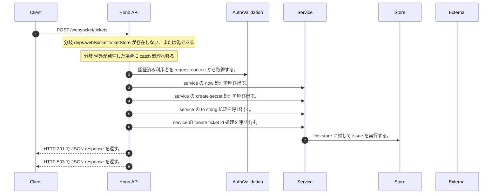

<!-- This file is generated by npm run docs:api-code. Do not edit manually. -->

# POST /websocket/tickets シーケンス

## シーケンス図

## 処理順とコード対応

| # | Caller | 境界 | 処理 | コード | 実装位置 |
| ---: | --- | --- | --- | --- | --- |
| 1 | `POST /websocket/tickets handler` | Auth | 認証済み利用者を request context から取得する。 | `c.get("user")` | `apps/api/src/routes/websocket-ticket-routes.ts:31 (POST /websocket/tickets handler)` |
| 2 | `WebSocketTicketService.issue` | Service | service の now 処理を呼び出す。 | `this.now()` | `apps/api/src/websocket-ticket-service.ts:33 (WebSocketTicketService.issue)` |
| 3 | `WebSocketTicketService.issue` | Service | service の create secret 処理を呼び出す。 | `this.createSecret()` | `apps/api/src/websocket-ticket-service.ts:39 (WebSocketTicketService.issue)` |
| 4 | `WebSocketTicketService.issue` | Service | service の to string 処理を呼び出す。 | `this.createSecret().toString("base64url")` | `apps/api/src/websocket-ticket-service.ts:39 (WebSocketTicketService.issue)` |
| 5 | `WebSocketTicketService.issue` | Service | service の create ticket id 処理を呼び出す。 | `this.createTicketId()` | `apps/api/src/websocket-ticket-service.ts:44 (WebSocketTicketService.issue)` |
| 6 | `WebSocketTicketService.issue` | Store | `this.store` に対して issue を実行する。 | `this.store.issue(record)` | `apps/api/src/websocket-ticket-service.ts:57 (WebSocketTicketService.issue)` |
| 7 | `POST /websocket/tickets handler` | HTTP/SSE | HTTP 201 で JSON response を返す。 | `c.json(ticket, 201)` | `apps/api/src/routes/websocket-ticket-routes.ts:33 (POST /websocket/tickets handler)` |
| 8 | `POST /websocket/tickets handler` | HTTP/SSE | HTTP 503 で JSON response を返す。 | `c.json({ error: "WebSocket ticket unavailable" }, 503)` | `apps/api/src/routes/websocket-ticket-routes.ts:35 (POST /websocket/tickets handler)` |

## 分岐

| ID | Function | 条件 | 実装位置 |
| --- | --- | --- | --- |
| B001 | `POST /websocket/tickets handler` | `deps.webSocketTicketStore` が存在しない、または偽である | `apps/api/src/routes/websocket-ticket-routes.ts:29 (POST /websocket/tickets handler)` |
| B002 | `POST /websocket/tickets handler` | 例外が発生した場合に catch 処理へ移る | `apps/api/src/routes/websocket-ticket-routes.ts:34 (POST /websocket/tickets handler)` |
| B003 | `WebSocketTicketService.issue` | is safe integer の判定結果が真ではない、または `issuedAtEpochMs` が `0` より小さい | `apps/api/src/websocket-ticket-service.ts:34 (WebSocketTicketService.issue)` |
| B004 | `WebSocketTicketService.issue` | `session.expiresAtEpochMs` が `issuedAtEpochMs` 以下である | `apps/api/src/websocket-ticket-service.ts:35 (WebSocketTicketService.issue)` |
| B005 | `WebSocketTicketService.issue` | `expiresAtEpochMs` が `issuedAtEpochMs` 以下である | `apps/api/src/websocket-ticket-service.ts:37 (WebSocketTicketService.issue)` |
| B006 | `WebSocketTicketService.issue` | is web socket ticket protocol の判定結果が真ではない | `apps/api/src/websocket-ticket-service.ts:40 (WebSocketTicketService.issue)` |
