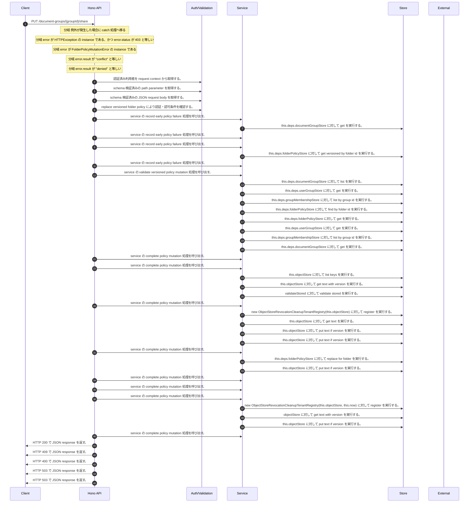

<!-- This file is generated by npm run docs:api-code. Do not edit manually. -->

# PUT /document-groups/{groupId}/share シーケンス

## シーケンス図

## 処理順とコード対応

| # | Caller | 境界 | 処理 | コード | 実装位置 |
| ---: | --- | --- | --- | --- | --- |
| 1 | `PUT /document-groups/{groupId}/share handler` | Auth | 認証済み利用者を request context から取得する。 | `c.get("user")` | `apps/api/src/routes/document-routes.ts:674 (PUT /document-groups/{groupId}/share handler)` |
| 2 | `PUT /document-groups/{groupId}/share handler` | Validation | schema 検証済みの path parameter を取得する。 | `validParam<{ groupId: string }>(c)` | `apps/api/src/routes/document-routes.ts:675 (PUT /document-groups/{groupId}/share handler)` |
| 3 | `PUT /document-groups/{groupId}/share handler` | Validation | schema 検証済みの JSON request body を取得する。 | `validJson<z.infer<typeof ReplaceVersionedFolderPolicyRequestSchema>>(c)` | `apps/api/src/routes/document-routes.ts:676 (PUT /document-groups/{groupId}/share handler)` |
| 4 | `PUT /document-groups/{groupId}/share handler` | Auth | replace versioned folder policy により認証・認可条件を確認する。 | `permissions.replaceVersionedFolderPolicy(user, groupId, body)` | `apps/api/src/routes/document-routes.ts:679 (PUT /document-groups/{groupId}/share handler)` |
| 5 | `FolderPermissionService.replaceVersionedFolderPolicy` | Service | service の record early policy failure 処理を呼び出す。 | `this.recordEarlyPolicyFailure(actor, folderId, input, "denied", auditOutbox)` | `apps/api/src/folders/folder-permission-service.ts:313 (FolderPermissionService.replaceVersionedFolderPolicy)` |
| 6 | `FolderPermissionService.replaceVersionedFolderPolicy` | Store | `this.deps.documentGroupStore` に対して get を実行する。 | `this.deps.documentGroupStore.get(actorTenantId, folderId)` | `apps/api/src/folders/folder-permission-service.ts:318 (FolderPermissionService.replaceVersionedFolderPolicy)` |
| 7 | `FolderPermissionService.replaceVersionedFolderPolicy` | Service | service の record early policy failure 処理を呼び出す。 | `this.recordEarlyPolicyFailure(actor, folderId, input, "failed", auditOutbox)` | `apps/api/src/folders/folder-permission-service.ts:320 (FolderPermissionService.replaceVersionedFolderPolicy)` |
| 8 | `FolderPermissionService.replaceVersionedFolderPolicy` | Service | service の record early policy failure 処理を呼び出す。 | `this.recordEarlyPolicyFailure(actor, folderId, input, "denied", auditOutbox)` | `apps/api/src/folders/folder-permission-service.ts:324 (FolderPermissionService.replaceVersionedFolderPolicy)` |
| 9 | `FolderPermissionService.replaceVersionedFolderPolicy` | Store | `this.deps.folderPolicyStore` に対して get versioned by folder id を実行する。 | `this.deps.folderPolicyStore.getVersionedByFolderId(folder.tenantId, folderId)` | `apps/api/src/folders/folder-permission-service.ts:329 (FolderPermissionService.replaceVersionedFolderPolicy)` |
| 10 | `FolderPermissionService.replaceVersionedFolderPolicy` | Service | service の record early policy failure 処理を呼び出す。 | `this.recordEarlyPolicyFailure(actor, folderId, input, "failed", auditOutbox)` | `apps/api/src/folders/folder-permission-service.ts:331 (FolderPermissionService.replaceVersionedFolderPolicy)` |
| 11 | `FolderPermissionService.replaceVersionedFolderPolicy` | Service | service の validate versioned policy mutation 処理を呼び出す。 | `this.validateVersionedPolicyMutation(actor, folder, current.policy, nextPolicy, current.version, input, principalDirectory)` | `apps/api/src/folders/folder-permission-service.ts:359 (FolderPermissionService.replaceVersionedFolderPolicy)` |
| 12 | `FolderPermissionService.resolveEffectiveFolderPermissionDetail` | Store | `this.deps.documentGroupStore` に対して list を実行する。 | `this.deps.documentGroupStore.list(actorTenantId)` | `apps/api/src/folders/folder-permission-service.ts:145 (FolderPermissionService.resolveEffectiveFolderPermissionDetail)` |
| 13 | `FolderPermissionService.resolveUserMembershipPermission` | Store | `this.deps.userGroupStore` に対して get を実行する。 | `this.deps.userGroupStore.get(tenantId, groupId)` | `apps/api/src/folders/folder-permission-service.ts:780 (FolderPermissionService.resolveUserMembershipPermission)` |
| 14 | `FolderPermissionService.resolveUserMembershipPermission` | Store | `this.deps.groupMembershipStore` に対して list by group id を実行する。 | `this.deps.groupMembershipStore.listByGroupId(tenantId, groupId)` | `apps/api/src/folders/folder-permission-service.ts:781 (FolderPermissionService.resolveUserMembershipPermission)` |
| 15 | `FolderPermissionService.resolvePolicyContext` | Store | `this.deps.folderPolicyStore` に対して find by folder id を実行する。 | `this.deps.folderPolicyStore.findByFolderId(folder.tenantId, current.groupId)` | `apps/api/src/folders/folder-permission-service.ts:695 (FolderPermissionService.resolvePolicyContext)` |
| 16 | `FolderPermissionService.resolvePolicyContext` | Store | `this.deps.folderPolicyStore` に対して get を実行する。 | `this.deps.folderPolicyStore.get(folder.tenantId, current.policyId)` | `apps/api/src/folders/folder-permission-service.ts:711 (FolderPermissionService.resolvePolicyContext)` |
| 17 | `FolderPermissionService.validateResourceGroupPrincipalGraph` | Store | `this.deps.userGroupStore` に対して get を実行する。 | `this.deps.userGroupStore.get(tenantId, groupId)` | `apps/api/src/folders/folder-permission-service.ts:612 (FolderPermissionService.validateResourceGroupPrincipalGraph)` |
| 18 | `FolderPermissionService.validateResourceGroupPrincipalGraph` | Store | `this.deps.groupMembershipStore` に対して list by group id を実行する。 | `this.deps.groupMembershipStore.listByGroupId(tenantId, groupId)` | `apps/api/src/folders/folder-permission-service.ts:616 (FolderPermissionService.validateResourceGroupPrincipalGraph)` |
| 19 | `FolderPermissionService.assertFolderOperation` | Store | `this.deps.documentGroupStore` に対して get を実行する。 | `this.deps.documentGroupStore.get(actorTenantId, folderId)` | `apps/api/src/folders/folder-permission-service.ts:110 (FolderPermissionService.assertFolderOperation)` |
| 20 | `FolderPermissionService.replaceVersionedFolderPolicy` | Service | service の complete policy mutation 処理を呼び出す。 | `this.completePolicyMutation(auditIntent, mutationError.result, current.policy)` | `apps/api/src/folders/folder-permission-service.ts:362 (FolderPermissionService.replaceVersionedFolderPolicy)` |
| 21 | `FolderPermissionService.replaceVersionedFolderPolicy` | Service | service の complete policy mutation 処理を呼び出す。 | `this.completePolicyMutation(auditIntent, mutationError.result, current.policy)` | `apps/api/src/folders/folder-permission-service.ts:372 (FolderPermissionService.replaceVersionedFolderPolicy)` |
| 22 | `ObjectStoreRevocationCleanupRepairOutbox.assertResourceFenceReleased` | Store | `this.objectStore` に対して list keys を実行する。 | `this.objectStore.listKeys(prefix)` | `apps/api/src/rag/_shared/security/revocation-cleanup-repair-outbox.ts:109 (ObjectStoreRevocationCleanupRepairOutbox.assertResourceFenceReleased)` |
| 23 | `ObjectStoreRevocationCleanupRepairOutbox.read` | Store | `this.objectStore` に対して get text with version を実行する。 | `this.objectStore.getTextWithVersion(key)` | `apps/api/src/rag/_shared/security/revocation-cleanup-repair-outbox.ts:163 (ObjectStoreRevocationCleanupRepairOutbox.read)` |
| 24 | `ObjectStoreRevocationCleanupRepairOutbox.read` | Store | `validateStored` に対して validate stored を実行する。 | `validateStored(value)` | `apps/api/src/rag/_shared/security/revocation-cleanup-repair-outbox.ts:165 (ObjectStoreRevocationCleanupRepairOutbox.read)` |
| 25 | `FolderPermissionService.replaceVersionedFolderPolicy` | Service | service の complete policy mutation 処理を呼び出す。 | `this.completePolicyMutation(auditIntent, mutationError.result, current.policy)` | `apps/api/src/folders/folder-permission-service.ts:380 (FolderPermissionService.replaceVersionedFolderPolicy)` |
| 26 | `ObjectStoreRevocationCleanupRepairOutbox.prepare` | Store | `new ObjectStoreRevocationCleanupTenantRegistry(this.objectStore)` に対して register を実行する。 | `new ObjectStoreRevocationCleanupTenantRegistry(this.objectStore).register(registration.tenantId)` | `apps/api/src/rag/_shared/security/revocation-cleanup-repair-outbox.ts:54 (ObjectStoreRevocationCleanupRepairOutbox.prepare)` |
| 27 | `ObjectStoreRevocationCleanupTenantRegistry.read` | Store | `this.objectStore` に対して get text を実行する。 | `this.objectStore.getText(key)` | `apps/api/src/rag/_shared/security/revocation-cleanup-tenant-registry.ts:116 (ObjectStoreRevocationCleanupTenantRegistry.read)` |
| 28 | `ObjectStoreRevocationCleanupTenantRegistry.register` | Store | `this.objectStore` に対して put text if version を実行する。 | `this.objectStore.putTextIfVersion(key, JSON.stringify(record, null, 2), undefined, "application/json")` | `apps/api/src/rag/_shared/security/revocation-cleanup-tenant-registry.ts:41 (ObjectStoreRevocationCleanupTenantRegistry.register)` |
| 29 | `ObjectStoreRevocationCleanupRepairOutbox.prepare` | Store | `this.objectStore` に対して put text if version を実行する。 | `this.objectStore.putTextIfVersion(key, JSON.stringify(intent, null, 2), undefined, "application/json")` | `apps/api/src/rag/_shared/security/revocation-cleanup-repair-outbox.ts:74 (ObjectStoreRevocationCleanupRepairOutbox.prepare)` |
| 30 | `FolderPermissionService.replaceVersionedFolderPolicy` | Service | service の complete policy mutation 処理を呼び出す。 | `this.completePolicyMutation(auditIntent, mutationError.result, current.policy)` | `apps/api/src/folders/folder-permission-service.ts:413 (FolderPermissionService.replaceVersionedFolderPolicy)` |
| 31 | `FolderPermissionService.replaceVersionedFolderPolicy` | Store | `this.deps.folderPolicyStore` に対して replace for folder を実行する。 | `this.deps.folderPolicyStore.replaceForFolder(nextPolicy, input.expectedVersion)` | `apps/api/src/folders/folder-permission-service.ts:420 (FolderPermissionService.replaceVersionedFolderPolicy)` |
| 32 | `ObjectStoreRevocationCleanupRepairOutbox.transition` | Store | `this.objectStore` に対して put text if version を実行する。 | `this.objectStore.putTextIfVersion(key, JSON.stringify(next, null, 2), stored.version, "application/json")` | `apps/api/src/rag/_shared/security/revocation-cleanup-repair-outbox.ts:152 (ObjectStoreRevocationCleanupRepairOutbox.transition)` |
| 33 | `FolderPermissionService.replaceVersionedFolderPolicy` | Service | service の complete policy mutation 処理を呼び出す。 | `this.completePolicyMutation(auditIntent, mutationError.result, current.policy)` | `apps/api/src/folders/folder-permission-service.ts:431 (FolderPermissionService.replaceVersionedFolderPolicy)` |
| 34 | `FolderPermissionService.replaceVersionedFolderPolicy` | Service | service の complete policy mutation 処理を呼び出す。 | `this.completePolicyMutation(auditIntent, mutationError.result, current.policy)` | `apps/api/src/folders/folder-permission-service.ts:436 (FolderPermissionService.replaceVersionedFolderPolicy)` |
| 35 | `FolderPermissionService.replaceVersionedFolderPolicy` | Service | service の complete policy mutation 処理を呼び出す。 | `this.completePolicyMutation(auditIntent, "failed", replaced.policy)` | `apps/api/src/folders/folder-permission-service.ts:444 (FolderPermissionService.replaceVersionedFolderPolicy)` |
| 36 | `ObjectStoreRevocationCleanupCoordinator.register` | Store | `new ObjectStoreRevocationCleanupTenantRegistry(this.objectStore, this.now)` に対して register を実行する。 | `new ObjectStoreRevocationCleanupTenantRegistry(this.objectStore, this.now).register(normalized.tenantId)` | `apps/api/src/rag/_shared/security/revocation-cleanup-coordinator.ts:137 (ObjectStoreRevocationCleanupCoordinator.register)` |
| 37 | `readManifest` | Store | `objectStore` に対して get text with version を実行する。 | `objectStore.getTextWithVersion(key)` | `apps/api/src/rag/_shared/security/revocation-cleanup-coordinator.ts:636 (readManifest)` |
| 38 | `ObjectStoreRevocationCleanupCoordinator.register` | Store | `this.objectStore` に対して put text if version を実行する。 | `this.objectStore.putTextIfVersion(key, JSON.stringify(manifest, null, 2), undefined, "application/json")` | `apps/api/src/rag/_shared/security/revocation-cleanup-coordinator.ts:169 (ObjectStoreRevocationCleanupCoordinator.register)` |
| 39 | `FolderPermissionService.replaceVersionedFolderPolicy` | Service | service の complete policy mutation 処理を呼び出す。 | `this.completePolicyMutation(auditIntent, "failed", replaced.policy)` | `apps/api/src/folders/folder-permission-service.ts:460 (FolderPermissionService.replaceVersionedFolderPolicy)` |
| 40 | `PUT /document-groups/{groupId}/share handler` | HTTP/SSE | HTTP 200 で JSON response を返す。 | `c.json(await permissions.replaceVersionedFolderPolicy(user, groupId, body), 200)` | `apps/api/src/routes/document-routes.ts:679 (PUT /document-groups/{groupId}/share handler)` |
| 41 | `PUT /document-groups/{groupId}/share handler` | HTTP/SSE | HTTP 409 で JSON response を返す。 | `c.json({ error: "Folder share policy version conflict" }, 409)` | `apps/api/src/routes/document-routes.ts:683 (PUT /document-groups/{groupId}/share handler)` |
| 42 | `PUT /document-groups/{groupId}/share handler` | HTTP/SSE | HTTP 400 で JSON response を返す。 | `c.json({ error: error.message }, 400)` | `apps/api/src/routes/document-routes.ts:684 (PUT /document-groups/{groupId}/share handler)` |
| 43 | `PUT /document-groups/{groupId}/share handler` | HTTP/SSE | HTTP 503 で JSON response を返す。 | `c.json({ error: "Folder sharing is unavailable" }, 503)` | `apps/api/src/routes/document-routes.ts:685 (PUT /document-groups/{groupId}/share handler)` |
| 44 | `PUT /document-groups/{groupId}/share handler` | HTTP/SSE | HTTP 503 で JSON response を返す。 | `c.json({ error: "Folder sharing is unavailable" }, 503)` | `apps/api/src/routes/document-routes.ts:687 (PUT /document-groups/{groupId}/share handler)` |

## 分岐

| ID | Function | 条件 | 実装位置 |
| --- | --- | --- | --- |
| B001 | `PUT /document-groups/{groupId}/share handler` | 例外が発生した場合に catch 処理へ移る | `apps/api/src/routes/document-routes.ts:680 (PUT /document-groups/{groupId}/share handler)` |
| B002 | `PUT /document-groups/{groupId}/share handler` | `error` が `HTTPException` の instance である、かつ `error.status` が `403` と等しい | `apps/api/src/routes/document-routes.ts:681 (PUT /document-groups/{groupId}/share handler)` |
| B003 | `PUT /document-groups/{groupId}/share handler` | `error` が `FolderPolicyMutationError` の instance である | `apps/api/src/routes/document-routes.ts:682 (PUT /document-groups/{groupId}/share handler)` |
| B004 | `PUT /document-groups/{groupId}/share handler` | `error.result` が `"conflict"` と等しい | `apps/api/src/routes/document-routes.ts:683 (PUT /document-groups/{groupId}/share handler)` |
| B005 | `PUT /document-groups/{groupId}/share handler` | `error.result` が `"denied"` と等しい | `apps/api/src/routes/document-routes.ts:684 (PUT /document-groups/{groupId}/share handler)` |
| B006 | `FolderPermissionService.replaceVersionedFolderPolicy` | `auditOutbox` が存在しない、または偽である、または `principalDirectory` が存在しない、または偽である | `apps/api/src/folders/folder-permission-service.ts:308 (FolderPermissionService.replaceVersionedFolderPolicy)` |
| B007 | `FolderPermissionService.replaceVersionedFolderPolicy` | is canonical identifier の判定結果が真ではない | `apps/api/src/folders/folder-permission-service.ts:312 (FolderPermissionService.replaceVersionedFolderPolicy)` |
| B008 | `FolderPermissionService.replaceVersionedFolderPolicy` | 例外が発生した場合に catch 処理へ移る | `apps/api/src/folders/folder-permission-service.ts:319 (FolderPermissionService.replaceVersionedFolderPolicy)` |
| B009 | `FolderPermissionService.replaceVersionedFolderPolicy` | `folder` が存在しない、または偽である、または is canonical identifier の判定結果が真ではない | `apps/api/src/folders/folder-permission-service.ts:323 (FolderPermissionService.replaceVersionedFolderPolicy)` |
| B010 | `FolderPermissionService.replaceVersionedFolderPolicy` | 例外が発生した場合に catch 処理へ移る | `apps/api/src/folders/folder-permission-service.ts:330 (FolderPermissionService.replaceVersionedFolderPolicy)` |
| B011 | `FolderPermissionService.replaceVersionedFolderPolicy` | 例外が発生した場合に catch 処理へ移る | `apps/api/src/folders/folder-permission-service.ts:360 (FolderPermissionService.replaceVersionedFolderPolicy)` |
| B012 | `FolderPermissionService.replaceVersionedFolderPolicy` | `this.deps.objectStore` が存在し、真である | `apps/api/src/folders/folder-permission-service.ts:367 (FolderPermissionService.replaceVersionedFolderPolicy)` |
| B013 | `FolderPermissionService.replaceVersionedFolderPolicy` | `revokedEntries.length` が `0` より大きい、または folder policy increases の判定結果が真である、かつ `cleanupRepairOutbox` が存在しない、または偽である | `apps/api/src/folders/folder-permission-service.ts:370 (FolderPermissionService.replaceVersionedFolderPolicy)` |
| B014 | `FolderPermissionService.replaceVersionedFolderPolicy` | folder policy increases の判定結果が真である | `apps/api/src/folders/folder-permission-service.ts:375 (FolderPermissionService.replaceVersionedFolderPolicy)` |
| B015 | `FolderPermissionService.replaceVersionedFolderPolicy` | 例外が発生した場合に catch 処理へ移る | `apps/api/src/folders/folder-permission-service.ts:378 (FolderPermissionService.replaceVersionedFolderPolicy)` |
| B016 | `FolderPermissionService.replaceVersionedFolderPolicy` | `revokedEntries.length` が `0` より大きい | `apps/api/src/folders/folder-permission-service.ts:384 (FolderPermissionService.replaceVersionedFolderPolicy)` |
| B017 | `FolderPermissionService.replaceVersionedFolderPolicy` | `cleanupRegistration` が存在し、真である | `apps/api/src/folders/folder-permission-service.ts:404 (FolderPermissionService.replaceVersionedFolderPolicy)` |
| B018 | `FolderPermissionService.replaceVersionedFolderPolicy` | 例外が発生した場合に catch 処理へ移る | `apps/api/src/folders/folder-permission-service.ts:411 (FolderPermissionService.replaceVersionedFolderPolicy)` |
| B019 | `FolderPermissionService.replaceVersionedFolderPolicy` | 例外が発生した場合に catch 処理へ移る | `apps/api/src/folders/folder-permission-service.ts:421 (FolderPermissionService.replaceVersionedFolderPolicy)` |
| B020 | `FolderPermissionService.replaceVersionedFolderPolicy` | `cleanupRegistration` が存在し、真である | `apps/api/src/folders/folder-permission-service.ts:422 (FolderPermissionService.replaceVersionedFolderPolicy)` |
| B021 | `FolderPermissionService.replaceVersionedFolderPolicy` | is conflict error の判定結果が真である | `apps/api/src/folders/folder-permission-service.ts:428 (FolderPermissionService.replaceVersionedFolderPolicy)` |
| B022 | `FolderPermissionService.replaceVersionedFolderPolicy` | `replaced.policy` が存在しない、または偽である | `apps/api/src/folders/folder-permission-service.ts:434 (FolderPermissionService.replaceVersionedFolderPolicy)` |
| B023 | `FolderPermissionService.replaceVersionedFolderPolicy` | `cleanupRegistration` が存在し、真である | `apps/api/src/folders/folder-permission-service.ts:440 (FolderPermissionService.replaceVersionedFolderPolicy)` |
| B024 | `FolderPermissionService.replaceVersionedFolderPolicy` | `this.deps.objectStore` が存在し、真である | `apps/api/src/folders/folder-permission-service.ts:442 (FolderPermissionService.replaceVersionedFolderPolicy)` |
| B025 | `FolderPermissionService.replaceVersionedFolderPolicy` | `cleanupCoordinator` が存在しない、または偽である | `apps/api/src/folders/folder-permission-service.ts:443 (FolderPermissionService.replaceVersionedFolderPolicy)` |
| B026 | `FolderPermissionService.replaceVersionedFolderPolicy` | `replaced.version` が `cleanupRegistration.authoritativeDenyVersion` と異なる | `apps/api/src/folders/folder-permission-service.ts:448 (FolderPermissionService.replaceVersionedFolderPolicy)` |
| B027 | `FolderPermissionService.replaceVersionedFolderPolicy` | 例外が発生した場合に catch 処理へ移る | `apps/api/src/folders/folder-permission-service.ts:459 (FolderPermissionService.replaceVersionedFolderPolicy)` |
