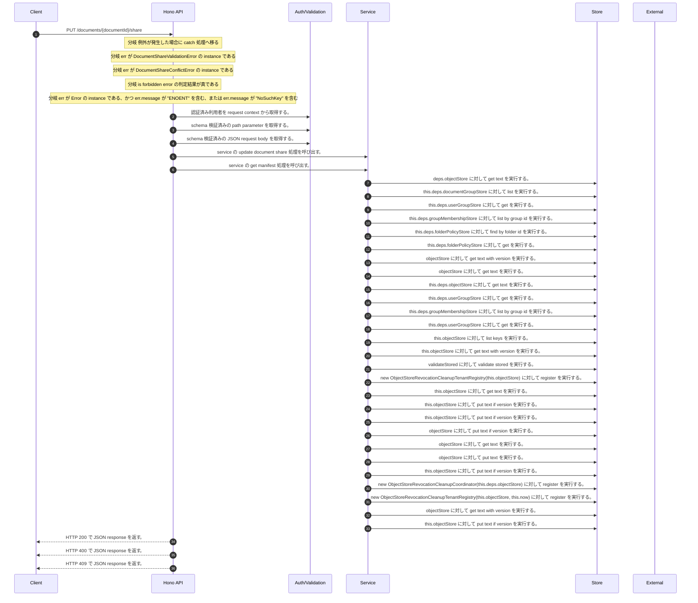

<!-- This file is generated by npm run docs:api-code. Do not edit manually. -->

# PUT /documents/{documentId}/share シーケンス

## シーケンス図

## 処理順とコード対応

| # | Caller | 境界 | 処理 | コード | 実装位置 |
| ---: | --- | --- | --- | --- | --- |
| 1 | `PUT /documents/{documentId}/share handler` | Auth | 認証済み利用者を request context から取得する。 | `c.get("user")` | `apps/api/src/routes/document-routes.ts:916 (PUT /documents/{documentId}/share handler)` |
| 2 | `PUT /documents/{documentId}/share handler` | Validation | schema 検証済みの path parameter を取得する。 | `validParam<{ documentId: string }>(c)` | `apps/api/src/routes/document-routes.ts:917 (PUT /documents/{documentId}/share handler)` |
| 3 | `PUT /documents/{documentId}/share handler` | Validation | schema 検証済みの JSON request body を取得する。 | `validJson<z.infer<typeof DocumentShareRequestSchema>>(c)` | `apps/api/src/routes/document-routes.ts:918 (PUT /documents/{documentId}/share handler)` |
| 4 | `PUT /documents/{documentId}/share handler` | Service | service の update document share 処理を呼び出す。 | `service.updateDocumentShare(user, documentId, body)` | `apps/api/src/routes/document-routes.ts:920 (PUT /documents/{documentId}/share handler)` |
| 5 | `MemoRagService.updateDocumentShare` | Service | service の get manifest 処理を呼び出す。 | `this.getManifest(documentId, authoritativeActorTenantId(actor))` | `apps/api/src/rag/memorag-service.ts:1197 (MemoRagService.updateDocumentShare)` |
| 6 | `readTenantManifest` | Store | `deps.objectStore` に対して get text を実行する。 | `deps.objectStore.getText(key)` | `apps/api/src/rag/_shared/storage/tenant-artifacts.ts:83 (readTenantManifest)` |
| 7 | `FolderPermissionService.resolveEffectiveFolderPermissionDetail` | Store | `this.deps.documentGroupStore` に対して list を実行する。 | `this.deps.documentGroupStore.list(actorTenantId)` | `apps/api/src/folders/folder-permission-service.ts:145 (FolderPermissionService.resolveEffectiveFolderPermissionDetail)` |
| 8 | `FolderPermissionService.resolveUserMembershipPermission` | Store | `this.deps.userGroupStore` に対して get を実行する。 | `this.deps.userGroupStore.get(tenantId, groupId)` | `apps/api/src/folders/folder-permission-service.ts:780 (FolderPermissionService.resolveUserMembershipPermission)` |
| 9 | `FolderPermissionService.resolveUserMembershipPermission` | Store | `this.deps.groupMembershipStore` に対して list by group id を実行する。 | `this.deps.groupMembershipStore.listByGroupId(tenantId, groupId)` | `apps/api/src/folders/folder-permission-service.ts:781 (FolderPermissionService.resolveUserMembershipPermission)` |
| 10 | `FolderPermissionService.resolvePolicyContext` | Store | `this.deps.folderPolicyStore` に対して find by folder id を実行する。 | `this.deps.folderPolicyStore.findByFolderId(folder.tenantId, current.groupId)` | `apps/api/src/folders/folder-permission-service.ts:695 (FolderPermissionService.resolvePolicyContext)` |
| 11 | `FolderPermissionService.resolvePolicyContext` | Store | `this.deps.folderPolicyStore` に対して get を実行する。 | `this.deps.folderPolicyStore.get(folder.tenantId, current.policyId)` | `apps/api/src/folders/folder-permission-service.ts:711 (FolderPermissionService.resolvePolicyContext)` |
| 12 | `getTextWithVersion` | Store | `objectStore` に対して get text with version を実行する。 | `objectStore.getTextWithVersion(key)` | `apps/api/src/documents/document-permission-service.ts:955 (getTextWithVersion)` |
| 13 | `getTextWithVersion` | Store | `objectStore` に対して get text を実行する。 | `objectStore.getText(key)` | `apps/api/src/documents/document-permission-service.ts:956 (getTextWithVersion)` |
| 14 | `DocumentPermissionService.loadLegacyDocumentGrants` | Store | `this.deps.objectStore` に対して get text を実行する。 | `this.deps.objectStore.getText(documentShareLegacyLedgerKey)` | `apps/api/src/documents/document-permission-service.ts:533 (DocumentPermissionService.loadLegacyDocumentGrants)` |
| 15 | `DocumentPermissionService.resolveUserMembershipPermission` | Store | `this.deps.userGroupStore` に対して get を実行する。 | `this.deps.userGroupStore.get(tenantId, groupId)` | `apps/api/src/documents/document-permission-service.ts:679 (DocumentPermissionService.resolveUserMembershipPermission)` |
| 16 | `DocumentPermissionService.resolveUserMembershipPermission` | Store | `this.deps.groupMembershipStore` に対して list by group id を実行する。 | `this.deps.groupMembershipStore.listByGroupId(tenantId, groupId)` | `apps/api/src/documents/document-permission-service.ts:680 (DocumentPermissionService.resolveUserMembershipPermission)` |
| 17 | `DocumentPermissionService.validateSharePrincipals` | Store | `this.deps.userGroupStore` に対して get を実行する。 | `this.deps.userGroupStore.get(tenantId, grant.principalId)` | `apps/api/src/documents/document-permission-service.ts:481 (DocumentPermissionService.validateSharePrincipals)` |
| 18 | `ObjectStoreRevocationCleanupRepairOutbox.assertResourceFenceReleased` | Store | `this.objectStore` に対して list keys を実行する。 | `this.objectStore.listKeys(prefix)` | `apps/api/src/rag/_shared/security/revocation-cleanup-repair-outbox.ts:109 (ObjectStoreRevocationCleanupRepairOutbox.assertResourceFenceReleased)` |
| 19 | `ObjectStoreRevocationCleanupRepairOutbox.read` | Store | `this.objectStore` に対して get text with version を実行する。 | `this.objectStore.getTextWithVersion(key)` | `apps/api/src/rag/_shared/security/revocation-cleanup-repair-outbox.ts:163 (ObjectStoreRevocationCleanupRepairOutbox.read)` |
| 20 | `ObjectStoreRevocationCleanupRepairOutbox.read` | Store | `validateStored` に対して validate stored を実行する。 | `validateStored(value)` | `apps/api/src/rag/_shared/security/revocation-cleanup-repair-outbox.ts:165 (ObjectStoreRevocationCleanupRepairOutbox.read)` |
| 21 | `ObjectStoreRevocationCleanupRepairOutbox.prepare` | Store | `new ObjectStoreRevocationCleanupTenantRegistry(this.objectStore)` に対して register を実行する。 | `new ObjectStoreRevocationCleanupTenantRegistry(this.objectStore).register(registration.tenantId)` | `apps/api/src/rag/_shared/security/revocation-cleanup-repair-outbox.ts:54 (ObjectStoreRevocationCleanupRepairOutbox.prepare)` |
| 22 | `ObjectStoreRevocationCleanupTenantRegistry.read` | Store | `this.objectStore` に対して get text を実行する。 | `this.objectStore.getText(key)` | `apps/api/src/rag/_shared/security/revocation-cleanup-tenant-registry.ts:116 (ObjectStoreRevocationCleanupTenantRegistry.read)` |
| 23 | `ObjectStoreRevocationCleanupTenantRegistry.register` | Store | `this.objectStore` に対して put text if version を実行する。 | `this.objectStore.putTextIfVersion(key, JSON.stringify(record, null, 2), undefined, "application/json")` | `apps/api/src/rag/_shared/security/revocation-cleanup-tenant-registry.ts:41 (ObjectStoreRevocationCleanupTenantRegistry.register)` |
| 24 | `ObjectStoreRevocationCleanupRepairOutbox.prepare` | Store | `this.objectStore` に対して put text if version を実行する。 | `this.objectStore.putTextIfVersion(key, JSON.stringify(intent, null, 2), undefined, "application/json")` | `apps/api/src/rag/_shared/security/revocation-cleanup-repair-outbox.ts:74 (ObjectStoreRevocationCleanupRepairOutbox.prepare)` |
| 25 | `putTextIfVersion` | Store | `objectStore` に対して put text if version を実行する。 | `objectStore.putTextIfVersion(key, text, expectedVersion, contentType)` | `apps/api/src/documents/document-permission-service.ts:968 (putTextIfVersion)` |
| 26 | `putTextIfVersion` | Store | `objectStore` に対して get text を実行する。 | `objectStore.getText(key)` | `apps/api/src/documents/document-permission-service.ts:976 (putTextIfVersion)` |
| 27 | `putTextIfVersion` | Store | `objectStore` に対して put text を実行する。 | `objectStore.putText(key, text, contentType)` | `apps/api/src/documents/document-permission-service.ts:982 (putTextIfVersion)` |
| 28 | `ObjectStoreRevocationCleanupRepairOutbox.transition` | Store | `this.objectStore` に対して put text if version を実行する。 | `this.objectStore.putTextIfVersion(key, JSON.stringify(next, null, 2), stored.version, "application/json")` | `apps/api/src/rag/_shared/security/revocation-cleanup-repair-outbox.ts:152 (ObjectStoreRevocationCleanupRepairOutbox.transition)` |
| 29 | `DocumentPermissionService.replaceVersionedDocumentSharePolicy` | Store | `new ObjectStoreRevocationCleanupCoordinator(this.deps.objectStore)` に対して register を実行する。 | `new ObjectStoreRevocationCleanupCoordinator(this.deps.objectStore).register(committed.cleanupRegistration)` | `apps/api/src/documents/document-permission-service.ts:388 (DocumentPermissionService.replaceVersionedDocumentSharePolicy)` |
| 30 | `ObjectStoreRevocationCleanupCoordinator.register` | Store | `new ObjectStoreRevocationCleanupTenantRegistry(this.objectStore, this.now)` に対して register を実行する。 | `new ObjectStoreRevocationCleanupTenantRegistry(this.objectStore, this.now).register(normalized.tenantId)` | `apps/api/src/rag/_shared/security/revocation-cleanup-coordinator.ts:137 (ObjectStoreRevocationCleanupCoordinator.register)` |
| 31 | `readManifest` | Store | `objectStore` に対して get text with version を実行する。 | `objectStore.getTextWithVersion(key)` | `apps/api/src/rag/_shared/security/revocation-cleanup-coordinator.ts:636 (readManifest)` |
| 32 | `ObjectStoreRevocationCleanupCoordinator.register` | Store | `this.objectStore` に対して put text if version を実行する。 | `this.objectStore.putTextIfVersion(key, JSON.stringify(manifest, null, 2), undefined, "application/json")` | `apps/api/src/rag/_shared/security/revocation-cleanup-coordinator.ts:169 (ObjectStoreRevocationCleanupCoordinator.register)` |
| 33 | `PUT /documents/{documentId}/share handler` | HTTP/SSE | HTTP 200 で JSON response を返す。 | `c.json(await service.updateDocumentShare(user, documentId, body), 200)` | `apps/api/src/routes/document-routes.ts:920 (PUT /documents/{documentId}/share handler)` |
| 34 | `PUT /documents/{documentId}/share handler` | HTTP/SSE | HTTP 400 で JSON response を返す。 | `c.json({ error: err.message }, 400)` | `apps/api/src/routes/document-routes.ts:922 (PUT /documents/{documentId}/share handler)` |
| 35 | `PUT /documents/{documentId}/share handler` | HTTP/SSE | HTTP 409 で JSON response を返す。 | `c.json({ error: err.message }, 409)` | `apps/api/src/routes/document-routes.ts:923 (PUT /documents/{documentId}/share handler)` |

## 分岐

| ID | Function | 条件 | 実装位置 |
| --- | --- | --- | --- |
| B001 | `PUT /documents/{documentId}/share handler` | 例外が発生した場合に catch 処理へ移る | `apps/api/src/routes/document-routes.ts:921 (PUT /documents/{documentId}/share handler)` |
| B002 | `PUT /documents/{documentId}/share handler` | `err` が `DocumentShareValidationError` の instance である | `apps/api/src/routes/document-routes.ts:922 (PUT /documents/{documentId}/share handler)` |
| B003 | `PUT /documents/{documentId}/share handler` | `err` が `DocumentShareConflictError` の instance である | `apps/api/src/routes/document-routes.ts:923 (PUT /documents/{documentId}/share handler)` |
| B004 | `PUT /documents/{documentId}/share handler` | is forbidden error の判定結果が真である | `apps/api/src/routes/document-routes.ts:924 (PUT /documents/{documentId}/share handler)` |
| B005 | `PUT /documents/{documentId}/share handler` | `err` が `Error` の instance である、かつ `err.message` が "ENOENT" を含む、または `err.message` が "NoSuchKey" を含む | `apps/api/src/routes/document-routes.ts:925 (PUT /documents/{documentId}/share handler)` |
| B006 | `MemoRagService.updateDocumentShare` | can share document の判定結果が真ではない | `apps/api/src/rag/memorag-service.ts:1200 (MemoRagService.updateDocumentShare)` |
