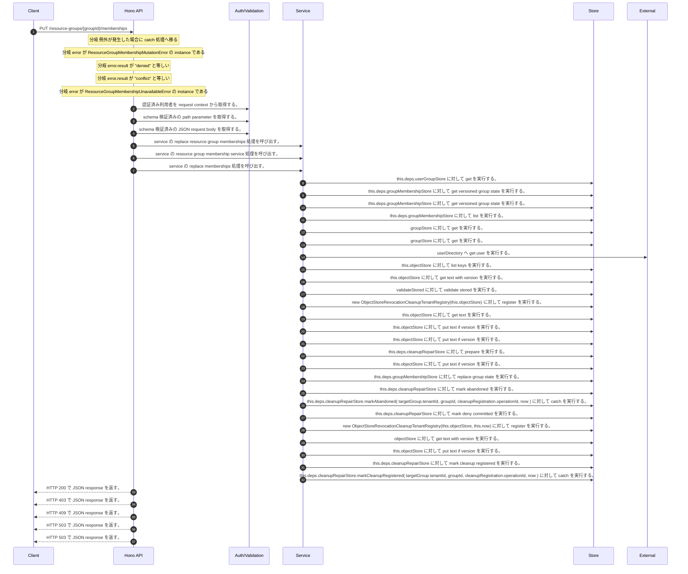

<!-- This file is generated by npm run docs:api-code. Do not edit manually. -->

# PUT /resource-groups/{groupId}/memberships シーケンス

## シーケンス図

## 処理順とコード対応

| # | Caller | 境界 | 処理 | コード | 実装位置 |
| ---: | --- | --- | --- | --- | --- |
| 1 | `PUT /resource-groups/{groupId}/memberships handler` | Auth | 認証済み利用者を request context から取得する。 | `c.get("user")` | `apps/api/src/routes/resource-group-routes.ts:343 (PUT /resource-groups/{groupId}/memberships handler)` |
| 2 | `PUT /resource-groups/{groupId}/memberships handler` | Validation | schema 検証済みの path parameter を取得する。 | `validParam<{ groupId: string }>(c)` | `apps/api/src/routes/resource-group-routes.ts:344 (PUT /resource-groups/{groupId}/memberships handler)` |
| 3 | `PUT /resource-groups/{groupId}/memberships handler` | Validation | schema 検証済みの JSON request body を取得する。 | `validJson<ReplaceResourceGroupMembershipsInput>(c)` | `apps/api/src/routes/resource-group-routes.ts:345 (PUT /resource-groups/{groupId}/memberships handler)` |
| 4 | `PUT /resource-groups/{groupId}/memberships handler` | Service | service の replace resource group memberships 処理を呼び出す。 | `service.replaceResourceGroupMemberships(actor, groupId, body)` | `apps/api/src/routes/resource-group-routes.ts:347 (PUT /resource-groups/{groupId}/memberships handler)` |
| 5 | `MemoRagService.replaceResourceGroupMemberships` | Service | service の resource group membership service 処理を呼び出す。 | `this.resourceGroupMembershipService()` | `apps/api/src/rag/memorag-service.ts:561 (MemoRagService.replaceResourceGroupMemberships)` |
| 6 | `MemoRagService.replaceResourceGroupMemberships` | Service | service の replace memberships 処理を呼び出す。 | `this.resourceGroupMembershipService().replaceMemberships(actor, groupId, input)` | `apps/api/src/rag/memorag-service.ts:561 (MemoRagService.replaceResourceGroupMemberships)` |
| 7 | `ResourceGroupMembershipService.replaceMemberships` | Store | `this.deps.userGroupStore` に対して get を実行する。 | `this.deps.userGroupStore.get(actorTenantId, groupId)` | `apps/api/src/security/resource-group-membership-service.ts:121 (ResourceGroupMembershipService.replaceMemberships)` |
| 8 | `ResourceGroupMembershipService.replaceMemberships` | Store | `this.deps.groupMembershipStore` に対して get versioned group state を実行する。 | `this.deps.groupMembershipStore.getVersionedGroupState(targetGroup.tenantId, groupId)` | `apps/api/src/security/resource-group-membership-service.ts:132 (ResourceGroupMembershipService.replaceMemberships)` |
| 9 | `ResourceGroupMembershipService.validateMutation` | Store | `this.deps.groupMembershipStore` に対して get versioned group state を実行する。 | `this.deps.groupMembershipStore.getVersionedGroupState(targetTenantId, targetGroup.groupId)` | `apps/api/src/security/resource-group-membership-service.ts:387 (ResourceGroupMembershipService.validateMutation)` |
| 10 | `ResourceGroupMembershipService.authorizeTargetManagement` | Store | `this.deps.groupMembershipStore` に対して list を実行する。 | `this.deps.groupMembershipStore.list(targetGroup.tenantId)` | `apps/api/src/security/resource-group-membership-service.ts:436 (ResourceGroupMembershipService.authorizeTargetManagement)` |
| 11 | `resolveActorGroupPermission` | Store | `groupStore` に対して get を実行する。 | `groupStore.get(actorTenantId, groupId)` | `apps/api/src/security/resource-group-membership-service.ts:557 (resolveActorGroupPermission)` |
| 12 | `validateReachableGraph` | Store | `groupStore` に対して get を実行する。 | `groupStore.get(tenantId, groupId)` | `apps/api/src/security/resource-group-membership-service.ts:519 (validateReachableGraph)` |
| 13 | `validateReachableGraph` | External | `userDirectory` へ get user を実行する。 | `userDirectory.getUser(membership.memberId)` | `apps/api/src/security/resource-group-membership-service.ts:538 (validateReachableGraph)` |
| 14 | `ObjectStoreRevocationCleanupRepairOutbox.assertResourceFenceReleased` | Store | `this.objectStore` に対して list keys を実行する。 | `this.objectStore.listKeys(prefix)` | `apps/api/src/rag/_shared/security/revocation-cleanup-repair-outbox.ts:109 (ObjectStoreRevocationCleanupRepairOutbox.assertResourceFenceReleased)` |
| 15 | `ObjectStoreRevocationCleanupRepairOutbox.read` | Store | `this.objectStore` に対して get text with version を実行する。 | `this.objectStore.getTextWithVersion(key)` | `apps/api/src/rag/_shared/security/revocation-cleanup-repair-outbox.ts:163 (ObjectStoreRevocationCleanupRepairOutbox.read)` |
| 16 | `ObjectStoreRevocationCleanupRepairOutbox.read` | Store | `validateStored` に対して validate stored を実行する。 | `validateStored(value)` | `apps/api/src/rag/_shared/security/revocation-cleanup-repair-outbox.ts:165 (ObjectStoreRevocationCleanupRepairOutbox.read)` |
| 17 | `ObjectStoreRevocationCleanupRepairOutbox.prepare` | Store | `new ObjectStoreRevocationCleanupTenantRegistry(this.objectStore)` に対して register を実行する。 | `new ObjectStoreRevocationCleanupTenantRegistry(this.objectStore).register(registration.tenantId)` | `apps/api/src/rag/_shared/security/revocation-cleanup-repair-outbox.ts:54 (ObjectStoreRevocationCleanupRepairOutbox.prepare)` |
| 18 | `ObjectStoreRevocationCleanupTenantRegistry.read` | Store | `this.objectStore` に対して get text を実行する。 | `this.objectStore.getText(key)` | `apps/api/src/rag/_shared/security/revocation-cleanup-tenant-registry.ts:116 (ObjectStoreRevocationCleanupTenantRegistry.read)` |
| 19 | `ObjectStoreRevocationCleanupTenantRegistry.register` | Store | `this.objectStore` に対して put text if version を実行する。 | `this.objectStore.putTextIfVersion(key, JSON.stringify(record, null, 2), undefined, "application/json")` | `apps/api/src/rag/_shared/security/revocation-cleanup-tenant-registry.ts:41 (ObjectStoreRevocationCleanupTenantRegistry.register)` |
| 20 | `ObjectStoreRevocationCleanupRepairOutbox.prepare` | Store | `this.objectStore` に対して put text if version を実行する。 | `this.objectStore.putTextIfVersion(key, JSON.stringify(intent, null, 2), undefined, "application/json")` | `apps/api/src/rag/_shared/security/revocation-cleanup-repair-outbox.ts:74 (ObjectStoreRevocationCleanupRepairOutbox.prepare)` |
| 21 | `ResourceGroupMembershipService.replaceMemberships` | Store | `this.deps.cleanupRepairStore` に対して prepare を実行する。 | `this.deps.cleanupRepairStore.prepare({ auditIntentId: auditIntent.intentId, tenantId: targetGroup.tenantId, groupId, expectedBeforeVersion: current.version, cleanupRegistration, preparedAt: now })` | `apps/api/src/security/resource-group-membership-service.ts:209 (ResourceGroupMembershipService.replaceMemberships)` |
| 22 | `ObjectStoreRevocationCleanupRepairOutbox.transition` | Store | `this.objectStore` に対して put text if version を実行する。 | `this.objectStore.putTextIfVersion(key, JSON.stringify(next, null, 2), stored.version, "application/json")` | `apps/api/src/rag/_shared/security/revocation-cleanup-repair-outbox.ts:152 (ObjectStoreRevocationCleanupRepairOutbox.transition)` |
| 23 | `ResourceGroupMembershipService.replaceMemberships` | Store | `this.deps.groupMembershipStore` に対して replace group state を実行する。 | `this.deps.groupMembershipStore.replaceGroupState(targetGroup.tenantId, groupId, nextMemberships, input.expectedVersion)` | `apps/api/src/security/resource-group-membership-service.ts:232 (ResourceGroupMembershipService.replaceMemberships)` |
| 24 | `ResourceGroupMembershipService.replaceMemberships` | Store | `this.deps.cleanupRepairStore` に対して mark abandoned を実行する。 | `this.deps.cleanupRepairStore.markAbandoned( targetGroup.tenantId, groupId, cleanupRegistration.operationId, now )` | `apps/api/src/security/resource-group-membership-service.ts:238 (ResourceGroupMembershipService.replaceMemberships)` |
| 25 | `ResourceGroupMembershipService.replaceMemberships` | Store | `this.deps.cleanupRepairStore.markAbandoned(           targetGroup.tenantId,           groupId,           cleanupRegistration.operationId,           now         )` に対して catch を実行する。 | `this.deps.cleanupRepairStore.markAbandoned( targetGroup.tenantId, groupId, cleanupRegistration.operationId, now ).catch(() => undefined)` | `apps/api/src/security/resource-group-membership-service.ts:238 (ResourceGroupMembershipService.replaceMemberships)` |
| 26 | `ResourceGroupMembershipService.replaceMemberships` | Store | `this.deps.cleanupRepairStore` に対して mark deny committed を実行する。 | `this.deps.cleanupRepairStore.markDenyCommitted( targetGroup.tenantId, groupId, cleanupRegistration.operationId, (this.deps.now ?? (() => new Date()))().toISOString() )` | `apps/api/src/security/resource-group-membership-service.ts:262 (ResourceGroupMembershipService.replaceMemberships)` |
| 27 | `ObjectStoreRevocationCleanupCoordinator.register` | Store | `new ObjectStoreRevocationCleanupTenantRegistry(this.objectStore, this.now)` に対して register を実行する。 | `new ObjectStoreRevocationCleanupTenantRegistry(this.objectStore, this.now).register(normalized.tenantId)` | `apps/api/src/rag/_shared/security/revocation-cleanup-coordinator.ts:137 (ObjectStoreRevocationCleanupCoordinator.register)` |
| 28 | `readManifest` | Store | `objectStore` に対して get text with version を実行する。 | `objectStore.getTextWithVersion(key)` | `apps/api/src/rag/_shared/security/revocation-cleanup-coordinator.ts:636 (readManifest)` |
| 29 | `ObjectStoreRevocationCleanupCoordinator.register` | Store | `this.objectStore` に対して put text if version を実行する。 | `this.objectStore.putTextIfVersion(key, JSON.stringify(manifest, null, 2), undefined, "application/json")` | `apps/api/src/rag/_shared/security/revocation-cleanup-coordinator.ts:169 (ObjectStoreRevocationCleanupCoordinator.register)` |
| 30 | `ResourceGroupMembershipService.replaceMemberships` | Store | `this.deps.cleanupRepairStore` に対して mark cleanup registered を実行する。 | `this.deps.cleanupRepairStore.markCleanupRegistered( targetGroup.tenantId, groupId, cleanupRegistration.operationId, now )` | `apps/api/src/security/resource-group-membership-service.ts:293 (ResourceGroupMembershipService.replaceMemberships)` |
| 31 | `ResourceGroupMembershipService.replaceMemberships` | Store | `this.deps.cleanupRepairStore.markCleanupRegistered(         targetGroup.tenantId,         groupId,         cleanupRegistration.operationId,         now       )` に対して catch を実行する。 | `this.deps.cleanupRepairStore.markCleanupRegistered( targetGroup.tenantId, groupId, cleanupRegistration.operationId, now ).catch(() => undefined)` | `apps/api/src/security/resource-group-membership-service.ts:293 (ResourceGroupMembershipService.replaceMemberships)` |
| 32 | `PUT /resource-groups/{groupId}/memberships handler` | HTTP/SSE | HTTP 200 で JSON response を返す。 | `c.json(publicMembershipState(groupId, state), 200)` | `apps/api/src/routes/resource-group-routes.ts:348 (PUT /resource-groups/{groupId}/memberships handler)` |
| 33 | `PUT /resource-groups/{groupId}/memberships handler` | HTTP/SSE | HTTP 403 で JSON response を返す。 | `c.json({ error: "Forbidden" }, 403)` | `apps/api/src/routes/resource-group-routes.ts:351 (PUT /resource-groups/{groupId}/memberships handler)` |
| 34 | `PUT /resource-groups/{groupId}/memberships handler` | HTTP/SSE | HTTP 409 で JSON response を返す。 | `c.json({ error: "Resource group membership conflict" }, 409)` | `apps/api/src/routes/resource-group-routes.ts:352 (PUT /resource-groups/{groupId}/memberships handler)` |
| 35 | `PUT /resource-groups/{groupId}/memberships handler` | HTTP/SSE | HTTP 503 で JSON response を返す。 | `c.json({ error: "Resource group membership unavailable" }, 503)` | `apps/api/src/routes/resource-group-routes.ts:355 (PUT /resource-groups/{groupId}/memberships handler)` |
| 36 | `PUT /resource-groups/{groupId}/memberships handler` | HTTP/SSE | HTTP 503 で JSON response を返す。 | `c.json({ error: "Resource group membership unavailable" }, 503)` | `apps/api/src/routes/resource-group-routes.ts:357 (PUT /resource-groups/{groupId}/memberships handler)` |

## 分岐

| ID | Function | 条件 | 実装位置 |
| --- | --- | --- | --- |
| B001 | `PUT /resource-groups/{groupId}/memberships handler` | 例外が発生した場合に catch 処理へ移る | `apps/api/src/routes/resource-group-routes.ts:349 (PUT /resource-groups/{groupId}/memberships handler)` |
| B002 | `PUT /resource-groups/{groupId}/memberships handler` | `error` が `ResourceGroupMembershipMutationError` の instance である | `apps/api/src/routes/resource-group-routes.ts:350 (PUT /resource-groups/{groupId}/memberships handler)` |
| B003 | `PUT /resource-groups/{groupId}/memberships handler` | `error.result` が `"denied"` と等しい | `apps/api/src/routes/resource-group-routes.ts:351 (PUT /resource-groups/{groupId}/memberships handler)` |
| B004 | `PUT /resource-groups/{groupId}/memberships handler` | `error.result` が `"conflict"` と等しい | `apps/api/src/routes/resource-group-routes.ts:352 (PUT /resource-groups/{groupId}/memberships handler)` |
| B005 | `PUT /resource-groups/{groupId}/memberships handler` | `error` が `ResourceGroupMembershipUnavailableError` の instance である | `apps/api/src/routes/resource-group-routes.ts:354 (PUT /resource-groups/{groupId}/memberships handler)` |
