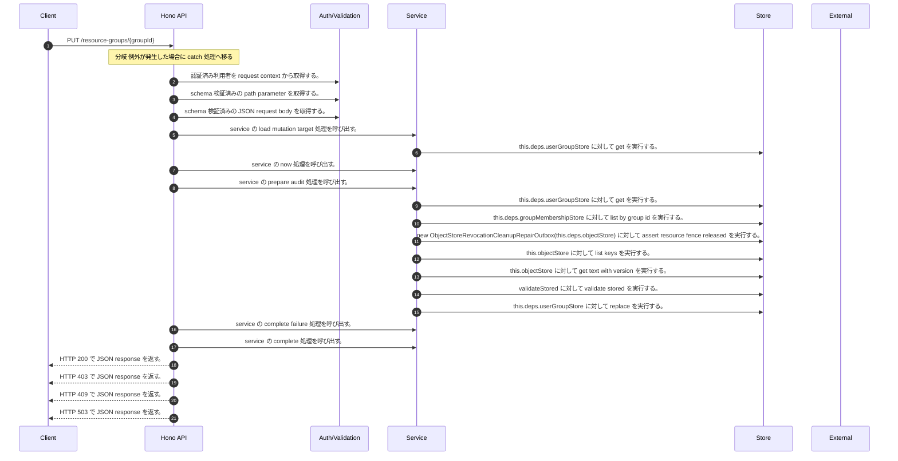

<!-- This file is generated by npm run docs:api-code. Do not edit manually. -->

# PUT /resource-groups/{groupId} シーケンス

## シーケンス図

## 処理順とコード対応

| # | Caller | 境界 | 処理 | コード | 実装位置 |
| ---: | --- | --- | --- | --- | --- |
| 1 | `PUT /resource-groups/{groupId} handler` | Auth | 認証済み利用者を request context から取得する。 | `c.get("user")` | `apps/api/src/routes/resource-group-routes.ts:164 (PUT /resource-groups/{groupId} handler)` |
| 2 | `PUT /resource-groups/{groupId} handler` | Validation | schema 検証済みの path parameter を取得する。 | `validParam<{ groupId: string }>(c)` | `apps/api/src/routes/resource-group-routes.ts:165 (PUT /resource-groups/{groupId} handler)` |
| 3 | `PUT /resource-groups/{groupId} handler` | Validation | schema 検証済みの JSON request body を取得する。 | `validJson<UpdateResourceGroupInput>(c)` | `apps/api/src/routes/resource-group-routes.ts:166 (PUT /resource-groups/{groupId} handler)` |
| 4 | `ResourceGroupLifecycleService.update` | Service | service の load mutation target 処理を呼び出す。 | `this.loadMutationTarget(actor, groupId, "update", input.reason)` | `apps/api/src/security/resource-group-lifecycle-service.ts:259 (ResourceGroupLifecycleService.update)` |
| 5 | `ResourceGroupLifecycleService.loadMutationTarget` | Store | `this.deps.userGroupStore` に対して get を実行する。 | `this.deps.userGroupStore.get(tenantId, groupId)` | `apps/api/src/security/resource-group-lifecycle-service.ts:576 (ResourceGroupLifecycleService.loadMutationTarget)` |
| 6 | `ResourceGroupLifecycleService.update` | Service | service の now 処理を呼び出す。 | `this.now()` | `apps/api/src/security/resource-group-lifecycle-service.ts:261 (ResourceGroupLifecycleService.update)` |
| 7 | `ResourceGroupLifecycleService.update` | Service | service の prepare audit 処理を呼び出す。 | `this.prepareAudit(actor, tenantId, groupId, "update", group, proposed, input.reason)` | `apps/api/src/security/resource-group-lifecycle-service.ts:262 (ResourceGroupLifecycleService.update)` |
| 8 | `ResourceGroupLifecycleService.resolveNestedMembershipPermission` | Store | `this.deps.userGroupStore` に対して get を実行する。 | `this.deps.userGroupStore.get(tenantId, groupId)` | `apps/api/src/security/resource-group-lifecycle-service.ts:502 (ResourceGroupLifecycleService.resolveNestedMembershipPermission)` |
| 9 | `ResourceGroupLifecycleService.resolveNestedMembershipPermission` | Store | `this.deps.groupMembershipStore` に対して list by group id を実行する。 | `this.deps.groupMembershipStore.listByGroupId(tenantId, groupId)` | `apps/api/src/security/resource-group-lifecycle-service.ts:507 (ResourceGroupLifecycleService.resolveNestedMembershipPermission)` |
| 10 | `ResourceGroupLifecycleService.update` | Store | `new ObjectStoreRevocationCleanupRepairOutbox(this.deps.objectStore)         ` に対して assert resource fence released を実行する。 | `new ObjectStoreRevocationCleanupRepairOutbox(this.deps.objectStore) .assertResourceFenceReleased(tenantId, "resource_group", groupId)` | `apps/api/src/security/resource-group-lifecycle-service.ts:269 (ResourceGroupLifecycleService.update)` |
| 11 | `ObjectStoreRevocationCleanupRepairOutbox.assertResourceFenceReleased` | Store | `this.objectStore` に対して list keys を実行する。 | `this.objectStore.listKeys(prefix)` | `apps/api/src/rag/_shared/security/revocation-cleanup-repair-outbox.ts:109 (ObjectStoreRevocationCleanupRepairOutbox.assertResourceFenceReleased)` |
| 12 | `ObjectStoreRevocationCleanupRepairOutbox.read` | Store | `this.objectStore` に対して get text with version を実行する。 | `this.objectStore.getTextWithVersion(key)` | `apps/api/src/rag/_shared/security/revocation-cleanup-repair-outbox.ts:163 (ObjectStoreRevocationCleanupRepairOutbox.read)` |
| 13 | `ObjectStoreRevocationCleanupRepairOutbox.read` | Store | `validateStored` に対して validate stored を実行する。 | `validateStored(value)` | `apps/api/src/rag/_shared/security/revocation-cleanup-repair-outbox.ts:165 (ObjectStoreRevocationCleanupRepairOutbox.read)` |
| 14 | `ResourceGroupLifecycleService.update` | Store | `this.deps.userGroupStore` に対して replace を実行する。 | `this.deps.userGroupStore.replace(proposed, input.expectedVersion)` | `apps/api/src/security/resource-group-lifecycle-service.ts:271 (ResourceGroupLifecycleService.update)` |
| 15 | `ResourceGroupLifecycleService.update` | Service | service の complete failure 処理を呼び出す。 | `this.completeFailure(audit, normalized.result, group)` | `apps/api/src/security/resource-group-lifecycle-service.ts:274 (ResourceGroupLifecycleService.update)` |
| 16 | `ResourceGroupLifecycleService.update` | Service | service の complete 処理を呼び出す。 | `this.deps.auditOutbox.complete(audit.intentId, tenantId, "success", auditGroup(updated))` | `apps/api/src/security/resource-group-lifecycle-service.ts:277 (ResourceGroupLifecycleService.update)` |
| 17 | `PUT /resource-groups/{groupId} handler` | HTTP/SSE | HTTP 200 で JSON response を返す。 | `c.json(await lifecycleService(deps).update(actor, groupId, body), 200)` | `apps/api/src/routes/resource-group-routes.ts:168 (PUT /resource-groups/{groupId} handler)` |
| 18 | `resourceGroupMutationError` | HTTP/SSE | HTTP 403 で JSON response を返す。 | `c.json({ error: "Forbidden" }, 403)` | `apps/api/src/routes/resource-group-routes.ts:385 (resourceGroupMutationError)` |
| 19 | `resourceGroupMutationError` | HTTP/SSE | HTTP 409 で JSON response を返す。 | `c.json({ error: "Resource group conflict" }, 409)` | `apps/api/src/routes/resource-group-routes.ts:387 (resourceGroupMutationError)` |
| 20 | `resourceGroupMutationError` | HTTP/SSE | HTTP 503 で JSON response を返す。 | `c.json({ error: "Resource group lifecycle unavailable" }, 503)` | `apps/api/src/routes/resource-group-routes.ts:389 (resourceGroupMutationError)` |

## 分岐

| ID | Function | 条件 | 実装位置 |
| --- | --- | --- | --- |
| B001 | `PUT /resource-groups/{groupId} handler` | 例外が発生した場合に catch 処理へ移る | `apps/api/src/routes/resource-group-routes.ts:169 (PUT /resource-groups/{groupId} handler)` |
| B002 | `lifecycleService` | `deps.securityAuditOutbox` が存在しない、または偽である | `apps/api/src/routes/resource-group-routes.ts:364 (lifecycleService)` |
| B003 | `ResourceGroupLifecycleService.update` | `input.expectedVersion` が `group.updatedAt` と異なる | `apps/api/src/security/resource-group-lifecycle-service.ts:265 (ResourceGroupLifecycleService.update)` |
| B004 | `ResourceGroupLifecycleService.update` | 例外が発生した場合に catch 処理へ移る | `apps/api/src/security/resource-group-lifecycle-service.ts:272 (ResourceGroupLifecycleService.update)` |
| B005 | `resourceGroupMutationError` | `error` が `ResourceGroupLifecycleError` の instance である | `apps/api/src/routes/resource-group-routes.ts:381 (resourceGroupMutationError)` |
| B006 | `resourceGroupMutationError` | `error.result` が `"denied"` と等しい | `apps/api/src/routes/resource-group-routes.ts:382 (resourceGroupMutationError)` |
| B007 | `resourceGroupMutationError` | `hideDenied` が存在し、真である | `apps/api/src/routes/resource-group-routes.ts:383 (resourceGroupMutationError)` |
| B008 | `resourceGroupMutationError` | `error.result` が `"conflict"` と等しい | `apps/api/src/routes/resource-group-routes.ts:387 (resourceGroupMutationError)` |
